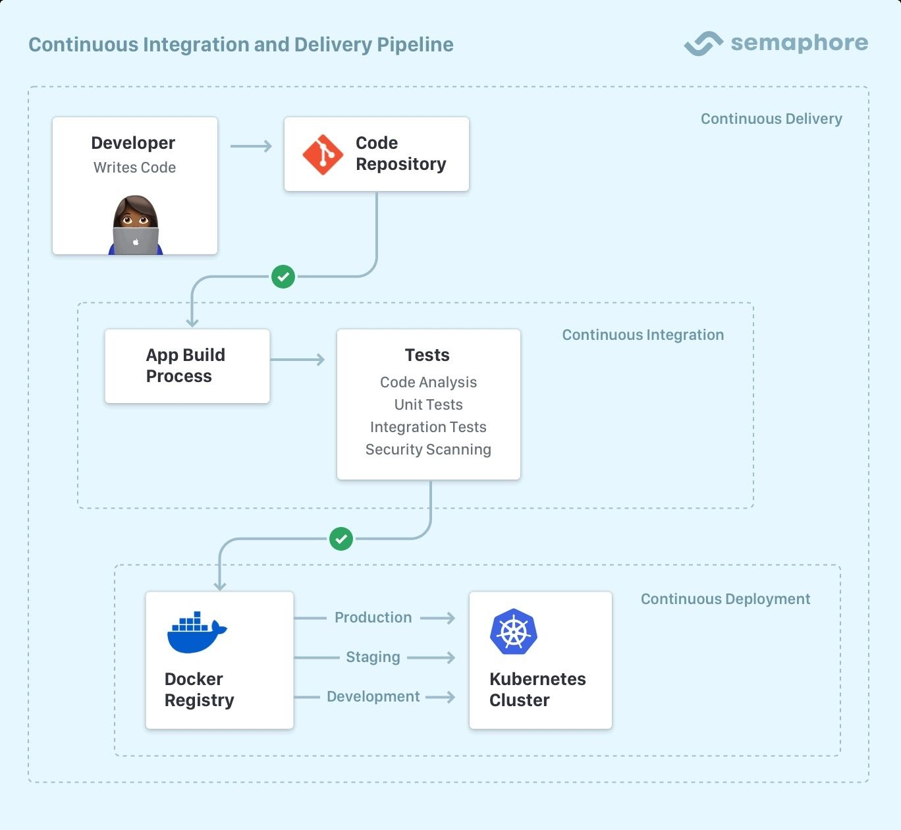

# About Semaphore

Semaphore is a cloud-based [Continuous Integration and Delivery](https://semaphoreci.com/continuous-integration) (CI) platform that's fast, easy to use, and incredibly scalable.

## What is CI/CD?

Continuous Integration (CI) is an automated process of regularly merging code changes, running tests, and providing rapid feedback to developers.

CI enables developers to frequently merge code changes, automatically test them, and detect integration issues early, leading to faster development cycles and higher-quality software.

Continuous Delivery and Continuous Deployment extend this process by providing a package you can release and deploy to the world. The whole thing is automated and can be set up to not need human intervention. No more stressing over deployment or releases!

## Ways to run Semaphore

- **Semaphore Cloud**: fully managed CI/CD solution that runs fully on the cloud. Just sign up and begin using it. No infrastructure to maintain.
- **Semaphore Hybrid**: run workflows fully or partly on your own hardware, allowing you to leverage your infrastructure while letting Semaphore orchestrate the workload
- **On-Premise**: run Semaphore fully behind a firewall using your infrastructure

## Features

- Manage your projects using the visual builder, the command line, or via the API
- Unlimited scale and parallelization
- A wide variety of cloud machines to run your workflows
- SSH into any job to debug problems interactively
- x86_64 and ARM architectures out of the box
- Self-hosted agents to run workflows on your infrastructure
- Built-in artifact and cache storage
- Project metrics to track your productivity
- Test insights and flaky test detector
- Parameterized deployments
- Role-based access control
- User groups
- Granular deployment permissions
- Audit logs
- SCIM/SAML support for enterprise user management
- Pre-build Docker images for various tasks
- SLA and premium support

## Where to go next?

If you want to give Semaphore a go, head to the [Guided Tour](./guided-tour). You can try Semaphore for free, with no strings attached.

You can find the complete Semaphore handbook in the [Using Semaphore](../using-semaphore/jobs) section.

And if you want to dive deep into Semaphore's inner workings check out the [Reference pages](../reference/semaphore-cli) and the [Semaphore API reference](../reference/api).

<!-- new api: [API documentation](../openapi-spec/semaphore-public-api.info.mdx) --->

