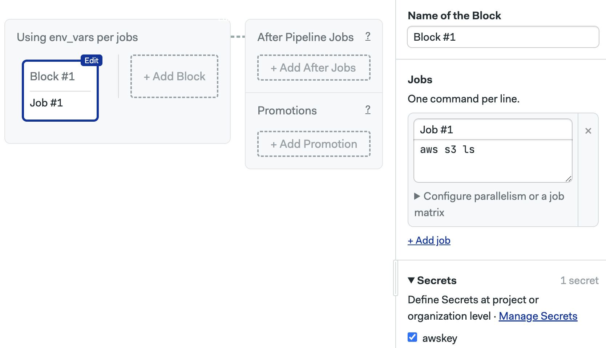

# BitBucket Pipelines

import Tabs from '@theme/Tabs';
import TabItem from '@theme/TabItem';
import Available from '@site/src/components/Available';
import VideoTutorial from '@site/src/components/VideoTutorial';
import Steps from '@site/src/components/Steps';

## Overview

BitBucket Pipelines use a YAML-based syntax to define pipelines and actions. In Semaphore, you can use the [visual workflow editor](../../using-semaphore/workflows#workflow-editor) to more easily configure and preview pipelines.

Semaphore is great at modeling complex delivery workflows for fast feedback with chainable pipelines, parallel execution, and dependency management.BitBucket Pipelines require some rather creative juggling to accomplish relatively trivial tasks.

## BitBucket Pipelines vs Semaphore

This section describes how to implement common BitBucket Pipelines functionalities in Semaphore.

### Checkout

Checkout clones the repository in the CI environment.

<Tabs groupId="migration">
<TabItem value="old" label="BitBucket Pipelines">

Checkout is implicit in all Travis CI workflows by default.

</TabItem>
<TabItem value="new" label="Semaphore">


Semaphore does not clone the repository by default. This is because there are certain scenarios in which you don't need the code or you want to customizet the cloning process.


To clone the repository in Semaphore we only need to execute [`checkout`](../../reference/toolbox#checkout).

```shell
# highlight-next-line
checkout
# now the code is the current working directory
cat README.md
```


</TabItem>
</Tabs>

### Artifacts

Artifacts are used to store deliverables and persist files between runs.

<Tabs groupId="migration">
<TabItem value="old" label="BitBucket Pipelines">

BitBucket defines artifacts using the `artifacts` keyword. Artifacts are automatically available in the other steps without the need to import them manually.

```yaml
pipelines:
  default:
    - step:
        name: Build and test
        image: node:10.15.0
        script:
          - npm install
          - npm test
          - npm run build
          # highlight-start
        artifacts:
          - dist/**
          - reports/*.txt
          # highlight-end
    - step:
        name: Integration test
        image: node:10.15.0
        caches:
          - node
        services:
          - postgres
        script:
          # highlight-start
          # using one of the artifacts from the previous step
          - cat reports/tests.txt
          - npm run integration-test
          # highlight-end
```

</TabItem>
<TabItem value="new" label="Semaphore">


In Semaphore, we use the [artifact](../../reference/toolbox#artifact) command to download and upload files to the artifact store.

The following command stores `test.log` from any job:

```shell
artifact push workflow test.log
```

To retrieve the file from any other job, we use:

```shell
artifact pull workflow test.log
```

See [artifacts](../../using-semaphore/artifacts) for more details.


</TabItem>
</Tabs>

### Caching

Caching speeds up the workflows by storing downladed files in a hot cache.

<Tabs groupId="migration">
<TabItem value="old" label="BitBucket Pipelines">

BitBucket Pipelines provide predefined caches to multiple build systems and dependency managers. You can also define custom cache stores to store arbitrary data.

In this example we cache Node dependencies:

```yaml
pipelines:
  default:
    - step:
    # highlight-start
        caches:
          - node
    # highlight-end
        script:
          - npm install
          - npm test
```

</TabItem>
<TabItem value="new" label="Semaphore">

In Semaphore, we use the [cache](../../reference/toolbox#cache) command to cache dependencies and files. Like BitBucket Pipelines, the `cache` command integrates with popular languages and dependency managers automatically. It can also store arbitrary data using key-value pairs.

The following commands, when added to a job downloads, caches, and installs Gems in a Ruby project:

```shell
checkout
# highlight-next-line
cache restore
bundle install
# highlight-next-line
cache store
```

See [caching](../../using-semaphore/optimization/cache) for more details.
</TabItem>
</Tabs>

### Language versions

We often need to activate specific language or tool versions to ensure consistent builds.


<Tabs groupId="migration">
<TabItem value="old" label="BitBucket Pipelines">

BitBucket Pipelines uses pre-built Docker versions to run commands in specific language and runtime versions.

```yaml
# highlight-next-line
image: node:20.17.0
pipelines:
  default:
    - step:
        script:
          - node -v
```

</TabItem>
<TabItem value="new" label="Semaphore">

Semaphore provides the [sem-version](../../reference/toolbox#sem-version) tool to install and activate languages and tools. It doesn't depend on Docker so you can use it several times in the same job to activate different languages at once.

```shell
# highlight-next-line
sem-version go 1.21
checkout
go version
go build
```

</TabItem>
</Tabs>

### Database and services

Testing sometimes require disposable databases and services in the CI environment.

<Tabs groupId="migration">
<TabItem value="old" label="BitBucket Pipelines">

BitBucket Pipelines uses Docker images to run databases and services.

```yaml
definitions:
# highlight-start
  services:
    redis:
      image: redis:3.2
    mysql:
      image: mysql:5.7
      variables:
        MYSQL_DATABASE: my-db
        MYSQL_ROOT_PASSWORD: $password
# highlight-end

```

</TabItem>
<TabItem value="new" label="Semaphore">

Semaphore also uses Docker images to start databases and services. You can start multiple services in the same job environment.

Semaphore provides the [sem-service](../../reference/toolbox#sem-service) tool which uses Docker containers to automatically start and manage popular databases and other services.

```shell
# highlight-start
sem-service start mysql --db=my-db --password=superSekret1
sem-service start redis
# highlight-end
checkout
npm test
```

</TabItem>
</Tabs>

### Secrets

Secrets inject sensitive data and credentials into the workflow securely.

<Tabs groupId="migration">
<TabItem value="old" label="BitBucket Pipelines">

In BitBucket Pipelines you create hidden variables that are interpolated as environment variables at runtime.

```yaml
pipelines:
  default:
    - step:
        script:
    # highlight-start
          - expr 10 / $MY_HIDDEN_NUMBER
          - echo $MY_HIDDEN_NUMBER
    # highlight-end
```

</TabItem>
<TabItem value="new" label="Semaphore">


In Semaphore, we create the [secret](../../using-semaphore/secrets) at the organization or project level and activate it on a block. 

The secret contents are automatically injected as environment variables in all jobs contained on that block.




</TabItem>
</Tabs>

### Complete example

The following comparison shows how to build and test a Ruby on Rails project on BitBucket Pipelines and on Semaphore.

<Tabs groupId="migration">
<TabItem value="old" label="BitBucket Pipelines">

```yaml
pipelines:
  pull-requests:
    '**':
      - parallel:
          - step:
              name: Scan Ruby
              script:
                - apt-get update && apt-get install -y ruby-full
                - ruby --version
                - gem install bundler
                - bundle install
                - bin/brakeman --no-pager
          - step:
              name: Scan JavaScript
              script:
                - apt-get update && apt-get install -y ruby-full
                - ruby --version
                - gem install bundler
                - bundle install
                - bin/importmap audit
          - step:
              name: Lint
              script:
                - apt-get update && apt-get install -y ruby-full
                - ruby --version
                - gem install bundler
                - bundle install
                - bin/rubocop -f github
          - step:
              name: Test
              script:
                - apt-get update && apt-get install -y ruby-full curl libjemalloc2 libvips sqlite3
                - ruby --version
                - gem install bundler
                - bundle install
                - cp .sample.env .env
                - bundle exec rake db:setup
                - bundle exec rake
                - bin/rails db:test:prepare test test:system
              services:
                - docker
              env:
                RAILS_ENV: test

  branches:
    main:
      - parallel:
          - step:
              name: Scan Ruby
              script:
                - apt-get update && apt-get install -y ruby-full
                - ruby --version
                - gem install bundler
                - bundle install
                - bin/brakeman --no-pager
          - step:
              name: Scan JavaScript
              script:
                - apt-get update && apt-get install -y ruby-full
                - ruby --version
                - gem install bundler
                - bundle install
                - bin/importmap audit
          - step:
              name: Lint
              script:
                - apt-get update && apt-get install -y ruby-full
                - ruby --version
                - gem install bundler
                - bundle install
                - bin/rubocop -f github
          - step:
              name: Test
              script:
                - apt-get update && apt-get install -y ruby-full curl libjemalloc2 libvips sqlite3
                - ruby --version
                - gem install bundler
                - bundle install
                - cp .sample.env .env
                - bundle exec rake db:setup
                - bundle exec rake
                - bin/rails db:test:prepare test test:system
              env:
                RAILS_ENV: test
```

</TabItem>
<TabItem value="new" label="Semaphore">

The following commands in a job run the same CI procedure. You can optimize for speed by splitting the tests in different jobs.

```shell
sudo apt-get update
sudo apt-get install --no-install-recommends -y curl libjemalloc2 libvips sqlite3
sem-version ruby 3.3.4
checkout
cache restore
bundle install --path vendor/bundle
cache store
cp .sample.env .env
bundle exec rake db:setup
bundle exec rake
bin/brakeman --no-pager
bin/importmap audit
bin/rubocop -f github
bin/rails db:test:prepare test test:system
```

</TabItem>
</Tabs>

## See also

- [Migration guide for Jenkins](./jenkins)
- [Migration guide for GitHub Actions](./github-actions)
- [Migration guide for Travis CI](./travis)
