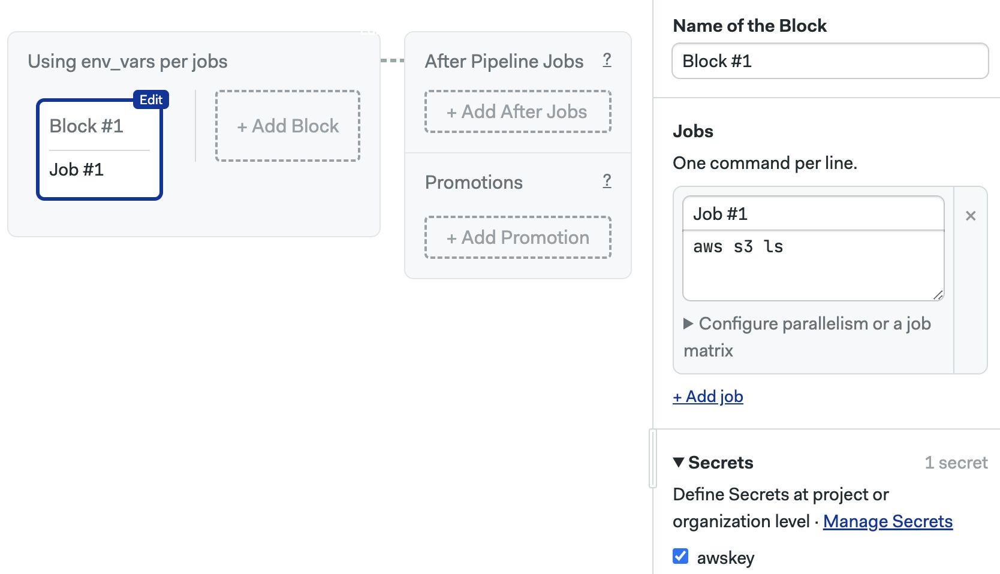

# GitHub Actions

import Tabs from '@theme/Tabs';
import TabItem from '@theme/TabItem';
import Available from '@site/src/components/Available';
import VideoTutorial from '@site/src/components/VideoTutorial';
import Steps from '@site/src/components/Steps';

This page explains the core concepts and feature mapping you need to migrate from GitHub Actions to Semaphore.

## Overview

GitHub Actions use a YAML-based syntax to define pipelines and actions. In Semaphore, you can use the [visual workflow editor](../../using-semaphore/workflows#workflow-editor) to more easily configure and preview pipelines.

Semaphore provides [top-of-market machines](../../reference/machine-types) for faster build times. Semaphore in addition, provides extra features like full customizable [Role Based Access Control](../../using-semaphore/rbac), and features like [parameterized promotions](../../using-semaphore/promotions#parameters) and [SSH debugging](../../using-semaphore/jobs#ssh-into-agent).

## GitHub Actions vs Semaphore

This section describes how to implement common GitHub Actions functionalities in Semaphore.

### Checkout

Checkout clones the repository in the CI environment.

<Tabs groupId="migration">
<TabItem value="old" label="GitHub Actions">

In GitHub Actions you must use the Checkout action in every step and job that require a copy of the repository.

```yaml
jobs:
  my_job:
    steps:
    # highlight-start
      - name: Checkout code
        uses: actions/checkout@v4
    # highlight-end
      
    # rest of the steps
```

</TabItem>
<TabItem value="new" label="Semaphore">

To clone the repository in Semaphore we only need to execute [`checkout`](../../reference/toolbox#checkout).

```shell
# highlight-next-line
checkout
# now the code is the current working directory
cat README.md
```

</TabItem>
</Tabs>

### Artifacts

Both Github Actions and Semaphore support a method to persist data between jobs called Artifacts.

<Tabs groupId="editor-yaml">
<TabItem value="ga" label="GitHub Actions">

In GitHub Actions we use the actions `upload-artifact` and `download-artifact` to manage artifacts.

The following example uploads and downloads `test.log`

```yaml
- name: Upload test.log
# highlight-next-line
  uses: actions/upload-artifact@v2
  with:
    name: Make
    path: test.log
- name: Download test.log
# highlight-next-line
  uses: actions/download-artifact@v2
  with:
    name: Unit tests
```

</TabItem>
<TabItem value="semaphore" label="Semaphore">

In Semaphore, we use the [artifact](../../reference/toolbox#artifact) command to download and upload files to the artifact store.

The following command stores `test.log` from any job:

```shell
artifact push workflow test.log
```

To retrieve the file from any other job, we use:

```shell
artifact pull workflow test.log
```

See [artifacts](../../using-semaphore/artifacts) for more details.

</TabItem>
</Tabs>


### Caching

Both Github Actions and Semaphore support manually caching files. See comparison in the tabs below.

<Tabs groupId="editor-yaml">
<TabItem value="ga" label="GitHub Actions">

GitHub Actions has a cache action to cache files. 

The following example caches Gems in a Ruby project:

```yaml
- name: Cache gems
# highlight-next-line
  uses: actions/cache@v2
  with:
    path: vendor/bundle
    key: bundle-gems-${{ hashFiles('**/Gemfile.lock') }}
    restore-keys: bundle-gems-${{ hashFiles('**/Gemfile.lock') }}
```

</TabItem>
<TabItem value="semaphore" label="Semaphore">

In Semaphore, we use the [cache](../../reference/toolbox#cache) command to cache dependencies and files.

The following commands, when added to a job downloads, caches, and installs Gems in a Ruby project:

```shell
checkout
cache restore
bundle install
cache store
```

See [caching](../../using-semaphore/optimization/cache) for more details.

</TabItem>
</Tabs>

### Language versions

Both Github Actions and Semaphore allow you to use specific language versions. 

<Tabs groupId="editor-yaml">
<TabItem value="ga" label="GitHub Actions">

Github Actions uses the a language-specific setup action. 

The following example sets the Ruby version to `3.3.4`

```yaml
steps:
# highlight-next-line
- uses: ruby/setup-ruby@v1
  with:
    ruby-version: '3.3.4'
```
</TabItem>
<TabItem value="semaphore" label="Semaphore">

Semaphore uses [sem-version](../../reference/toolbox#sem-version) to activate or switch language versions in the CI environment. 

The following example activates Ruby v3.3.4, any commands after the example run on this Ruby version.

```shell
sem-version ruby 3.3.4
```

</TabItem>
</Tabs>

### Database and services

Both Github Actions and Semaphore support starting a databases and services via Docker containers.

<Tabs groupId="editor-yaml">
<TabItem value="ga" label="GitHub Actions">

Github Actions uses service containers. The following example starts Redis on port 6379

```yaml
jobs:
  runner-job:
    runs-on: ubuntu-latest
    # highlight-start
    services:
      redis:
        image: redis
        ports:
          - 6379:6379
    # highlight-end
```

</TabItem>
<TabItem value="semaphore" label="Semaphore">

On Semaphore, we use [sem-service](../../reference/toolbox#sem-service) to start and stop services in the CI environment.

The following example starts Redis on the default port (6379)

```shell
sem-service start redis
```
    
</TabItem>
</Tabs>

### Secrets

Secrets inject sensitive data and credentials into the workflow securely.

<Tabs groupId="migration">
<TabItem value="old" label="GitHub Actions">

To use secrets in GitHub Actions, you must create the secret with its value in the repository or organization. Then, you can use it on your jobs using the `${{ secret.SECRET_NAME }}` syntax.

```yaml
steps:
  - name: Hello world action
  # highlight-start
    env:
      super_secret: ${{ secrets.SuperSecret }}
  # highlight-end
```

</TabItem>
<TabItem value="new" label="Semaphore">

In Semaphore, we create the [secret](../../using-semaphore/secrets) at the organization or project level and activate it on a block. 

The secret contents are automatically injected as environment variables in all jobs contained on that block.




</TabItem>
</Tabs>

### Complete example

The following comparison shows how to build and test a Ruby on Rails project on GitHub Actions and on Semaphore.

<Tabs groupId="editor-yaml">
<TabItem value="ga" label="GitHub Actions">

On GitHub Actions, we need several actions to start services, manage Gems, and run the build and test commands.

```yaml
name: CI

on:
  pull_request:
  push:
    branches: [ main ]

jobs:
  scan_ruby:
    runs-on: ubuntu-latest

    steps:
      - name: Checkout code
        uses: actions/checkout@v4

      - name: Set up Ruby
        uses: ruby/setup-ruby@v1
        with:
          ruby-version: .ruby-version
          bundler-cache: true

      - name: Scan for common Rails security vulnerabilities using static analysis
        run: bin/brakeman --no-pager

  scan_js:
    runs-on: ubuntu-latest

    steps:
      - name: Checkout code
        uses: actions/checkout@v4

      - name: Set up Ruby
        uses: ruby/setup-ruby@v1
        with:
          ruby-version: .ruby-version
          bundler-cache: true

      - name: Scan for security vulnerabilities in JavaScript dependencies
        run: bin/importmap audit

  lint:
    runs-on: ubuntu-latest
    steps:
      - name: Checkout code
        uses: actions/checkout@v4

      - name: Set up Ruby
        uses: ruby/setup-ruby@v1
        with:
          ruby-version: .ruby-version
          bundler-cache: true

      - name: Lint code for consistent style
        run: bin/rubocop -f github

  test:
    runs-on: ubuntu-latest

    steps:
      - name: Install packages
        run: sudo apt-get update && sudo apt-get install --no-install-recommends -y curl libjemalloc2 libvips sqlite3

      - name: Checkout code
        uses: actions/checkout@v4

      - name: Set up Ruby
        uses: ruby/setup-ruby@v1
        with:
          ruby-version: .ruby-version
          bundler-cache: true

      - name: Run Rake
        env:
          RAILS_ENV: test 
        run: | 
          cp .sample.env .env
          bundle exec rake db:setup
          bundle exec rake

      - name: Run tests
        env:
          RAILS_ENV: test
        run: bin/rails db:test:prepare test test:system
```

</TabItem>
<TabItem value="semaphore" label="Semaphore">

The following commands in a job run the same CI procedure. You can optimize for speed by splitting the tests in different jobs.

```shell
sudo apt-get update
sudo apt-get install --no-install-recommends -y curl libjemalloc2 libvips sqlite3
sem-version ruby 3.3.4
checkout
cache restore
bundle install --path vendor/bundle
cache store
cp .sample.env .env
bundle exec rake db:setup
bundle exec rake
bin/brakeman --no-pager
bin/importmap audit
bin/rubocop -f github
bin/rails db:test:prepare test test:system
```

</TabItem>
</Tabs>


## See also

- [Migration guide for Jenkins](./jenkins)
- [Migration guide for Travis CI](./travis)
- [Migration guide for BitBucket Pipelines](./bitbucket)
