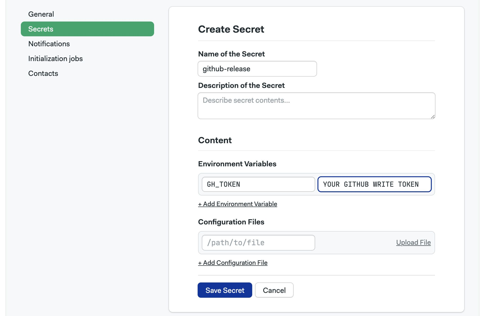
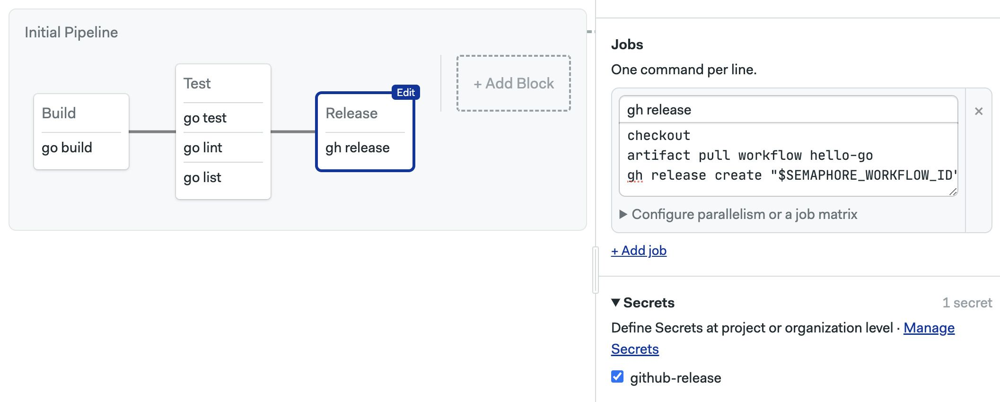
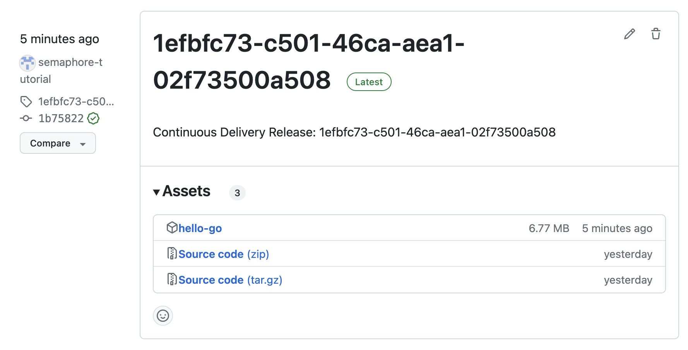
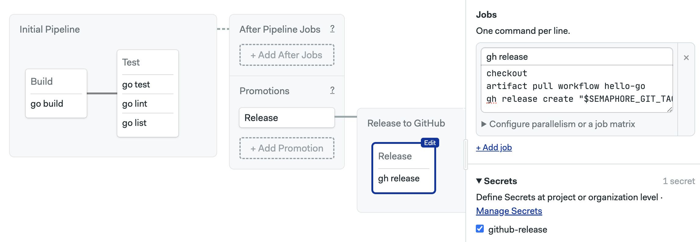
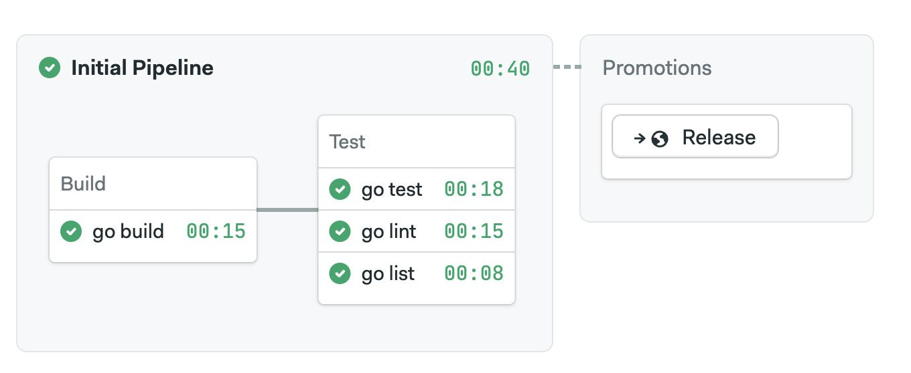
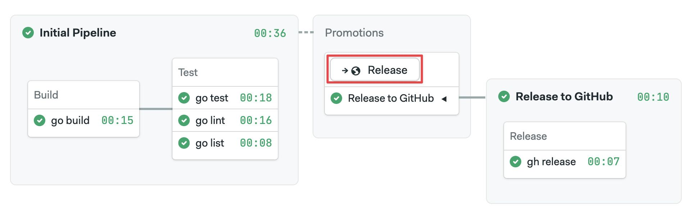

# Continuous Delivery

import Tabs from '@theme/Tabs';
import TabItem from '@theme/TabItem';
import Available from '@site/src/components/Available';
import VideoTutorial from '@site/src/components/VideoTutorial';
import Steps from '@site/src/components/Steps';

We suceeded into having a program built and tested using Continuous Integration. It's time to release it automatically using Continuous Delivery.

In this section you will learn about:

- Protective sensitive data with Secrets
- Creating multiple pipelines
- Using automated promotions

## Prerequisites

For this part of the tutorial you will need:

- A [GitHub Access Token](https://github.com/settings/tokens) with read+write content permissions
- The `git` command line tool

## Releasing to the world

The goal is to automatically deploy the built binary to the GitHub repository so people can download and enjoy our program. So, we're going to add a job that automatically uploads the binary to the repository every time we tag a release with `git tag`

## Creating a Secret

In order to upload the release from a Semaphore job we need to authenticate with the GitHub account. For that, we'll need an access token. Now, the problem with such tokens is that they should remain secret. This rules out using environment variables in our jobs to store the token, as these are visible to anyone with read access to the repository.

The answer to this problems is using Secrets. Secrets provide a secure way to store key-value pairs and files in a way that's not visible to anyone outside our Semaphore organization. So even if our repository is public, anonymouns people won't be able to see our precious tokens.

To create a Secret, follow these steps:

<Steps>

1. Open the Organization menu and select **Settings**
2. Go to **Secrets**
3. Press **New Secret**
4. Type a name for the secret, e.g. `github-release`
5. Type the key-value pair required to authenticate with GitHub

    The variable name is `GH_TOKEN` and the value is your unique token generated in your GitHub account

    

6. Press **Save Secret**

</Steps>

## Release job

Now we're ready to add a release job. We can use the [gh command line tool](https://cli.github.com/) to automate the release from a Semaphore job.

<Steps>

1. Add a block
2. Type the following commands

    ```shell title="Release job"
    checkout
    artifact pull workflow hello-go
    gh release create "$SEMAPHORE_WORKFLOW_ID" hello-go --latest -t  "$SEMAPHORE_WORKFLOW_ID" -n "Continuous Delivery Release: $SEMAPHORE_WORKFLOW_ID"
    ```

    The job pulls the binary from the artifact repository and publishes it using a unique UUID generated by Semaphore

3. Open the **Secrets** section on the block and enable `github-release`
   
    
    
4. Start the workflow

</Steps>

After the workflow finishes your should see a new release on the releases section of your GitHub repository.



This works, however, there are quite a few problems with this workflow:

- Releases are randomly named instead of using sensible version numbers
- Every update on every branch generates a release. This is too much, we usually only want to release on certain milestones
- Logically, the Continuous Integration and Continuous Delivery should be logically separated tasks. Here, it's all smashed together

What we need is to split the pipeline in two: Continuous Integration and Continuous Delivery. For that, we need to learn about promotions. 

## What are promotions?

A project can have multiple pipelines. Ideally, each pipeline fulfills one task, test, release, deploy, and so forth. To connect pipelines, Semaphore uses promotions. Using promotions you can connect pipelines to make branching workflows.

So, let's take the release block and put it on a separate pipeline.

<Steps>

1. Delete the "Release"
2. Press **Add Promotion**. This creates and links a new pipeline. 
3. Give descriptive names to the Promotion and the new pipeline
4. Select the first block on the new pipeline
5. Just like before, type the job commands ...commands

    ```shell title="Release job"
    checkout
    artifact pull workflow hello-go
    gh release create "$SEMAPHORE_GIT_TAG_NAME" hello-go --latest -t "$SEMAPHORE_GIT_TAG_NAME" -n "Continuous Delivery Release: $SEMAPHORE_GIT_TAG_NAME"
    ```

    We've changed the release command to use the Git tag. This allows us to tag releases using sensible version numbers

6. Open the **Secrets** section on the block and enable `github-release`

    

7. Start the workflow

</Steps>

Now the execution of the workflow will stop on the Continuous Integration pipeline. Release won't happen unless we press the "Release" button.



But before we can release we should create a tag for our build.

```shell title="Creating a tag"
git pull origin setup-semaphore
echo "This is release v1.0.0" > release-notes.txt
git add release-notes.txt
git commit -m "release v1.0.0"
git tag -a v1.0.0 -m "Releasing version v1.0.0"
git push origin v1.0.0
```

The push will initiate a new workflow. This time related to the tag we just pushed to the repository. Check the progress of the workflow and once done, press the release button.



If you check your GitHub repository, you should now find a release correctly tagged as "v1.0.0"

## Automating releases

Releasing packages by pressing a button is great. But you know what's even better? Doing it automatically. Specially if you have a very robust test suite that gives you confidence.

To automate the release we need to configure an automatic promotion condition.

<Steps>

1. Go back to the main project and open the workflow editor
2. Now that you have multiple branches and tags, Semaphore will ask you what branch to edit. Select `setup-semaphore`
3. Select the "Release" promotion button
4. Activate the checkbox **Enable automatic promotion**
5. Now we need to specify conditions to automatically start the promotion

    Let's use this condition: `result = 'passed' AND tag =~ '^v.*'`

    This will start the promotion when all tests have passed and the commit includes any tag starting with "v" (the syntax supports regular expressions)

6. Start the workflow

</Steps>

Let's make another release:

```shell title="Creating a tag"
git pull origin setup-semaphore
echo "This is release v1.0.1" > release-notes.txt
git add release-notes.txt
git commit -m "release v1.0.1"
git tag -a v1.0.1 -m "Releasing version v1.0.1"
git push origin v1.0.1
```

This time the Release pipeline should automatically start as soon as all jobs in the CI pipeline have passed. We should also find a new release on the GitHub repository.

## What have we learned?

- How to create and use Secrets
- How to release packages to GitHub
- How to use promotions to connect pipelines
- How to automate triggering promotions

## What's next?

That's all for the guided tour. What you've learned here will serve you well to build complex workflows for a lot of scenarios.

There is, of course, a lot more to learn. Semahore is packed with features do more with less work and optimizations to greatly speed up your workflows.

We recommend going next to the [Using Semaphore](../../using-semaphore/jobs) category where you will find the complete handbook for Semaphore operations.

Thank you for trying out Semaphore and happy building!
