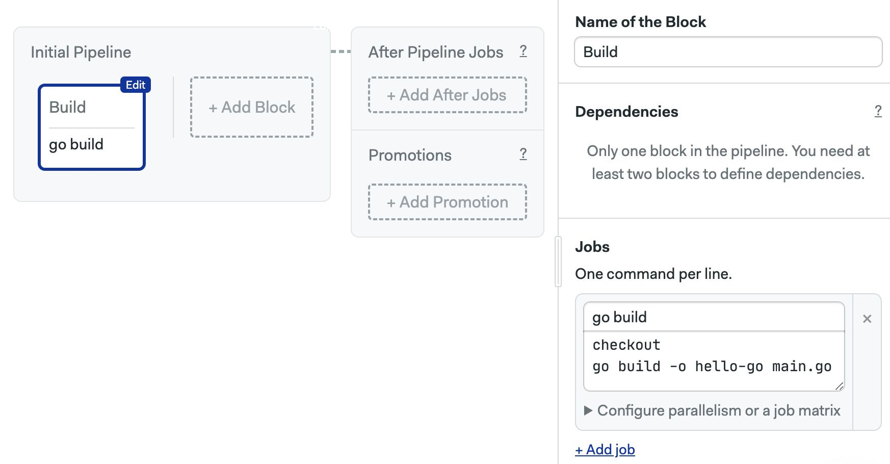
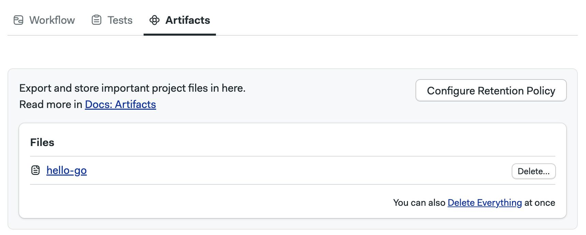
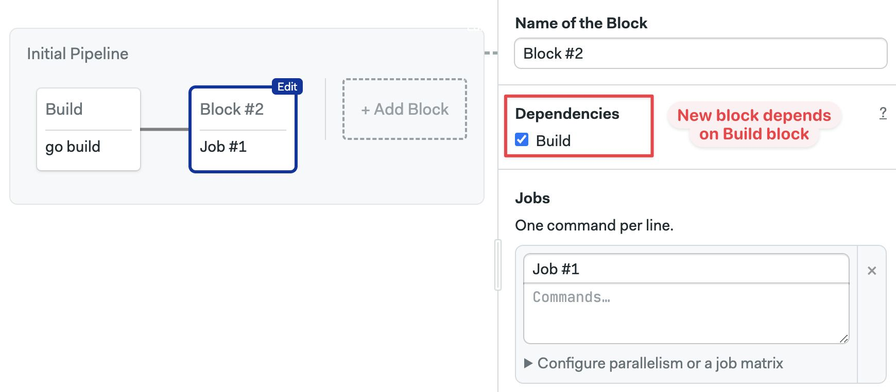
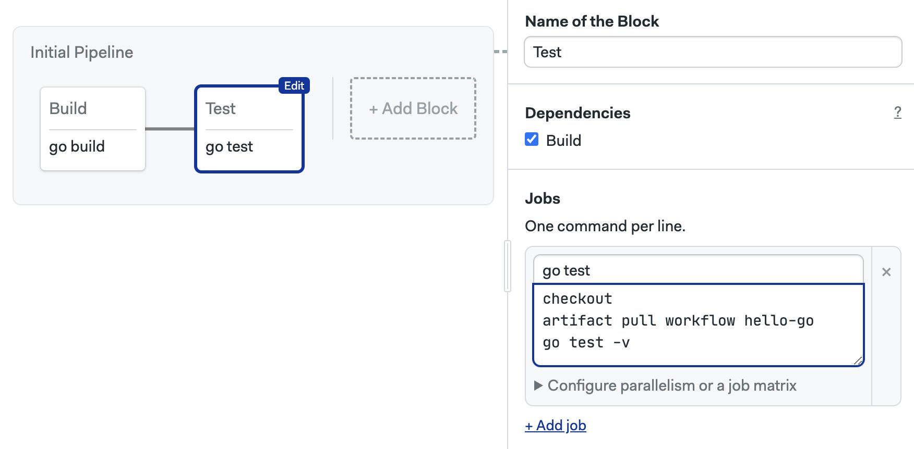
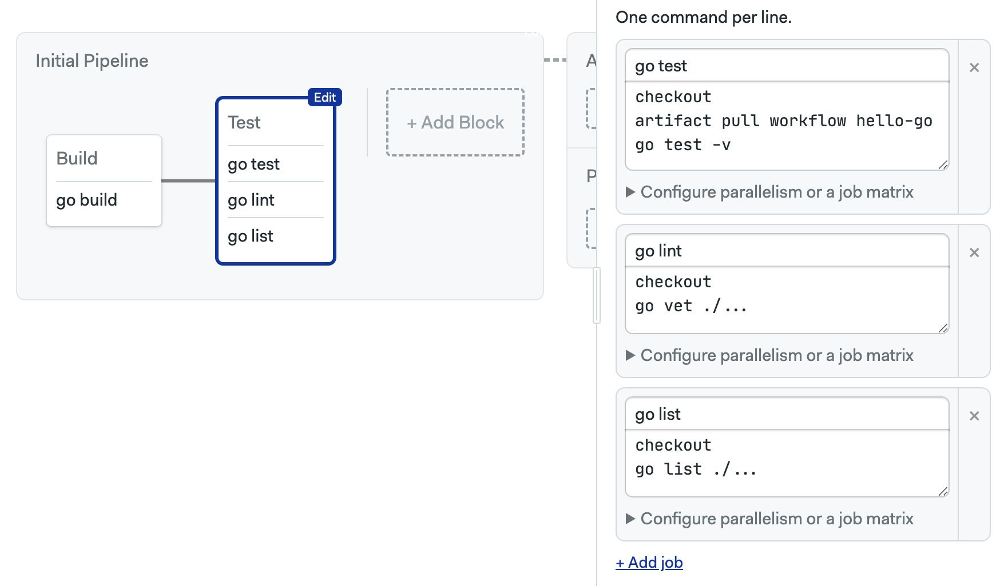
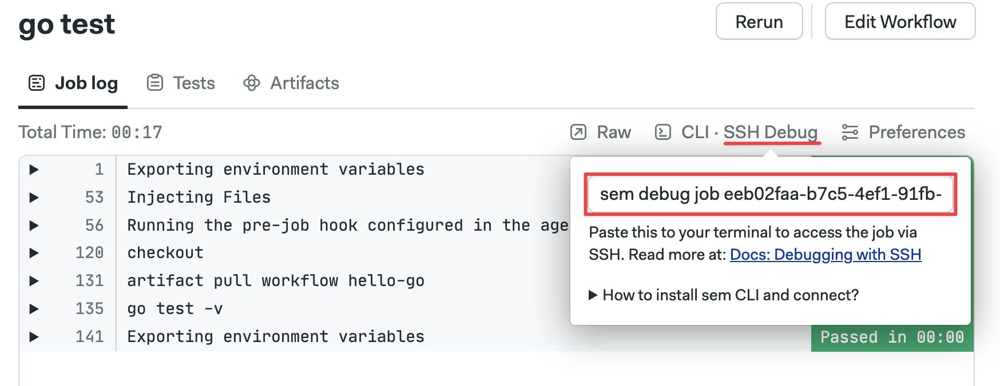
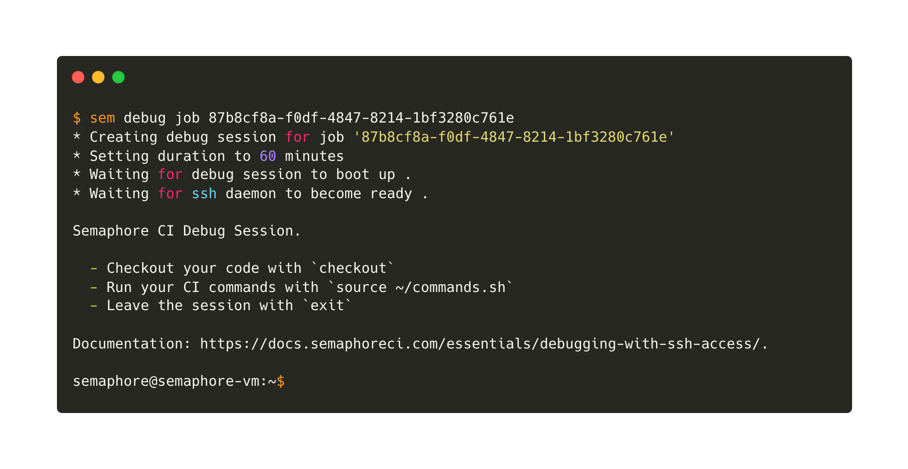

# Continuous Integration

import Tabs from '@theme/Tabs';
import TabItem from '@theme/TabItem';
import Available from '@site/src/components/Available';
import VideoTutorial from '@site/src/components/VideoTutorial';
import Steps from '@site/src/components/Steps';

With the basics covered, we're ready to tackle a more Continuous Integration (CI) on a more complex project.

In this section you will learn about:

- Blocks dependencies
- Using artifacts
- Debugging with SSH

## Prerequisites

For this part of the tutorial you will need:

- A Git repository
- The `git` command line tool
- The [Golang toolchain](https://go.dev)

## Something to build

On most cases, the first step in CI is building the application. This proves that the branch is not broken and gives us something to test. 

So, our first task is to have something to actually build. Let's do a "Hello, World!" HTTP server with Go.

<Steps>

1. If you haven't yet done it, clone the repository to your machine
2. Fetch the `setup-semaphore` branch

    ```shell
    git fetch origin setup-semaphore
    git checkout setup-semaphore
    ```
3. Execute `go mod init hello-go` to initialize the Go application
4. Create `main.go` with the following contents

    ```go title="main.go"
    package main

    import (
        "fmt"
        "net/http"
    )

    func helloHandler(w http.ResponseWriter, r *http.Request) {
        fmt.Fprintln(w, "Hello Go!")
    }

    func main() {
        http.HandleFunc("/", helloHandler)
        fmt.Println("Starting server on :8080")
        if err := http.ListenAndServe(":8080", nil); err != nil {
            fmt.Println("Failed to start server:", err)
        }
    }
    ```

5. Create `main_test.go` with the following contents

    ```go title="main_test.go"
    package main

    import (
        "io/ioutil"
        "net/http/httptest"
        "testing"
    )

    func TestHelloHandler(t *testing.T) {
        req := httptest.NewRequest("GET", "/", nil)
        w := httptest.NewRecorder()
        helloHandler(w, req)

        resp := w.Result()
        body, _ := ioutil.ReadAll(resp.Body)

        expected := "Hello Go!\n"
        if string(body) != expected {
            t.Errorf("expected %q, got %q", expected, string(body))
        }
    }
    ```

6. Push all files into your repository

    ```shell
    git add -A
    git commit -m "Initial commit"
    git push origin setup-semaphore
    ```

</Steps>


## The build job

Now that we have something to build, let's create a build job in Semaphore.

<Steps>

1. Open the Workflow Editor
2. Type descriptive names for the block and job
3. Add these commands to the job

    ```shell title="Build job"
    checkout
    go build -o hello-go main.go
    ```

    First, the `checkout` command clones the repository into the CI environment and changes directory so you're ready to work.

    Second, we use `go build` to build a Linux binary.

    

4. Press **Run the workflow** > **Start**

</Steps>

The build should complete successfully. If you experience problems, check out [debugging with SSH](#debug).

## Keeping the build artifact

A very important fact about Semaphore jobs is that the CI environment is scrapped once the job ends. This means that the compiled binary we built is completely lost once the job ends.

We must use Artifacts to keep files and directories after a job ends. So, if you want to keep the compiled file `hello-go`, you should modify the build job like this:

```shell title="Build job with artifacts"
checkout
go build -o hello-go main.go
artifact push workflow hello-go
```

The artifact tool lets you push and pull files from the artifact store. After running the updated, you can see and download the binary from the **Artifacts** tab.



Artifacts can be used to share files between jobs. You could download the binary in any other jobs using:

```shell
artifact pull workflow hello-go
```

See [Artifacts](../../using-semaphore/artifacts) to learn what options and scopes are available in the artifact store.

## The test job

CI wouldn't be CI if we did not perform any testing. So, let's add a test job.

<Steps>

1. Open the Workflow Editor
2. Press **Add Block** a new block appears

    Notice that the new block is connected to the Build block. This is because there is a dependency between the two blocks. Dependencies force the workflow to flow sequentially.

    You can change dependencies using the checkboxes in the block settings.

    

3. Type the following commands

    ```shell title="Test block"
    checkout
    artifact pull workflow hello-go
    go test -v
    ```

    

4. Press **Run the workflow** > **Start**

</Steps>

We're only scratching the surface of what you can test. So, here's an idea, try adding more tests jobs in the test block. You could run the Go linter, do syntax checking, or check formatting, all in parallel.



## Debugging with SSH {#ssh}

Sooner or later you'll find that a command that runs fine in your machine fails miserably in the CI environment. The cause for this is often a difference between your machine and the CI environment. Semaphore creates a brand new and clean CI environment for each job.

Fortunately, Semaphore provides a great way to debug jobs. You can actually SSH into the CI environment to run the commands, examine the environment and try solutions. Once you find what's wrong, you can update the jobs to fix the error.

Before you can perform SSH debugging, you need to setup the Semaphore Command Line:

<Steps>

1. Go to your account menu and select **Profile Settings**
2. Press the **Regerenate API Token** button regenerate-token.jpg
3. Copy the token displayed and keep it safe
4. Installt the Semaphore Command Line

    ```shell title="Installing the Semaphore CLI"
    curl https://storage.googleapis.com/sem-cli-releases/get.sh | bash
    ```

5. Connect the tool to your organization, use the API key shown in step 3

    ```shell title="Connecting to your organization"
    sem connect <your-organization-name>.semaphoreci.com <YOUR_API_TOKEN>
    ```
6. You're ready to do SSH debugging

</Steps>

The next time you encounter a failing job, follow these steps:

<Steps>

1. Open the failing job
2. Click on **SSH Debug**
3. Copy the shown command and run it in your terminal

    

4. Wait for the SSH session to begin

    

5. If you want to run the job commands interactively execute `source ~/commands.sh`

</Steps>

## What have we learned?

- We build and tested a real program
- We learned how to use dependencies to run jobs sequentially
- We used artifacts
- We explored how to debug jobs using SSH

## What's next?

In the next and last section we'll move to the Continuous Delivery territory by automating the release of our little Go program.
