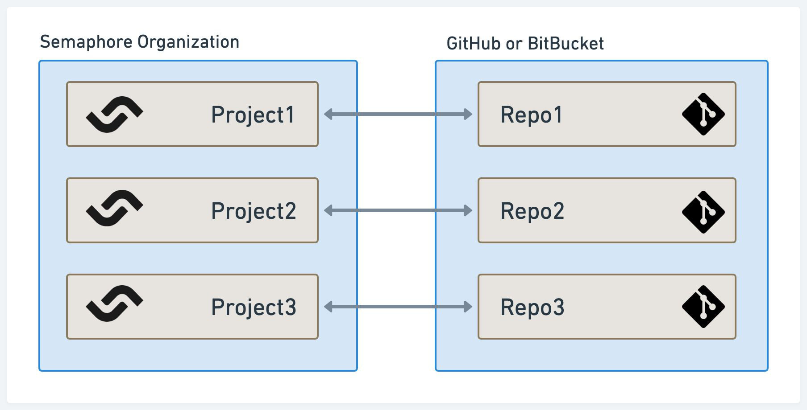
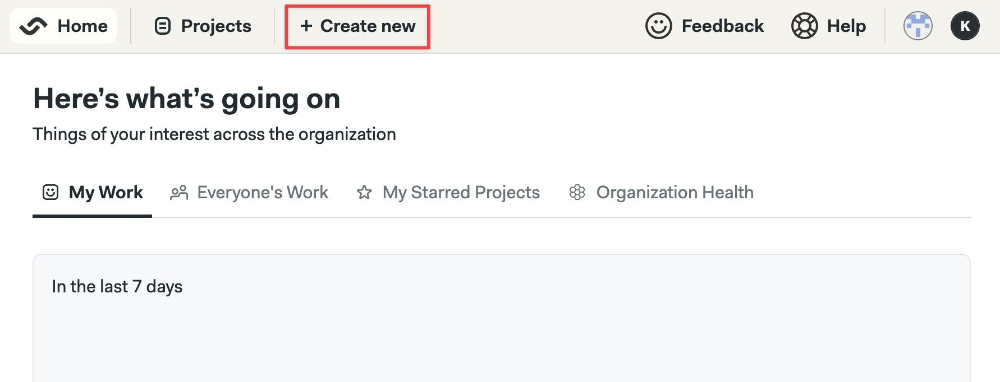
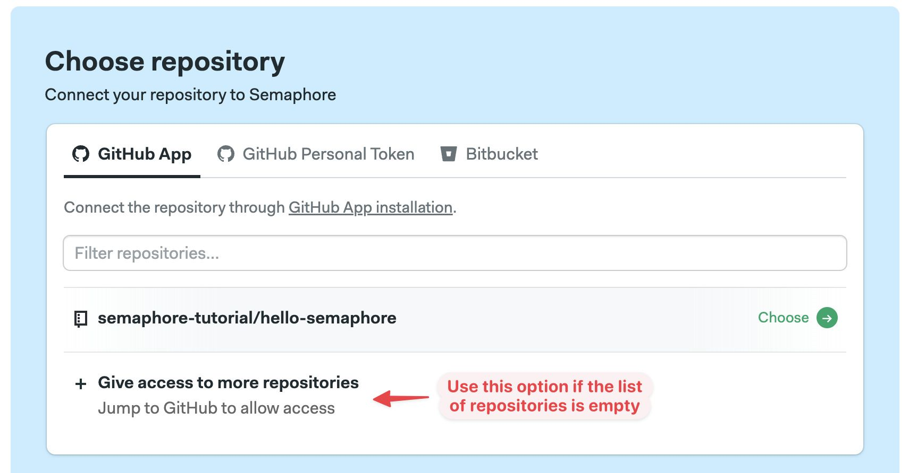
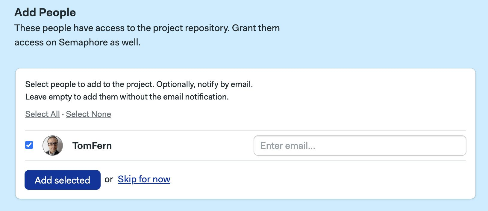
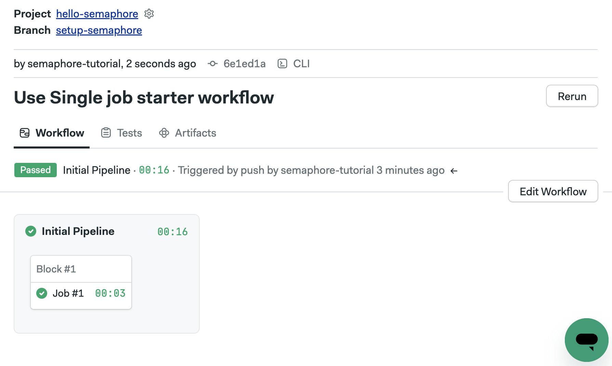

# Hello, World!

import Tabs from '@theme/Tabs';
import TabItem from '@theme/TabItem';
import Available from '@site/src/components/Available';
import VideoTutorial from '@site/src/components/VideoTutorial';
import Steps from '@site/src/components/Steps';

Projects allow Semaphore to perform actions every time there is a change in your Git repository.

In this section you will:

- Create your first project
- Invite contributors 
- Learn about workflows and pipelines
- Set up jobs and use environment variables

## Prerequisites

- A repository with at least one commit
- Familiarity with Git
- Git installed on your machine

## What is a project?

A project connects Semaphore to your Git repository. Every project on Semaphore is connected to one and only one repository on GitHub or BitBucket.

Every time *something* changes in the repository, Semaphore initiates a workflow. The workflow runs all the pipelines you have configured. These pipelines can virtually do anything, including building your application, testing it, and deploying it to your servers.

By default, a workflow can be initiated by any of these events:

- Pushing commits into any branch
- Pushing Git tags
- Creating pull requests
- Changing any pipelines
- Manually re-running workflows or pipelines
- Running pipelines using Scheduled Tasks

## Hello, world!

These are the steps to create your first project:

<Steps>

1. Press the **Create new** button 

    

2. Press **Choose repository**
3. Select the tab corresponding to your provider: GitHub or BitBucket
4. Select a repository from the list.

     If the list is empty, press **Give access** or **Connect** to give Semaphore access to your repositories

     

5. Next, you'll see a list with all the repository contributors. 

    Select the individuals you wish to invite to the project and press **Add selected** 

    You can also [add people later](#people)

    

6. Press **Looks good, Start**

</Steps>

Once you're done these following thins will happen:

- The project is created and linked to your repository
- The selected individuals are invited into your organization and granted access to the project
- A new branch called `setup-semaphore` is created in your repository
- A new pipeline file called `.semaphore/semaphore.yml` is created in your repository
- The first workflow immediately starts

## Editing your pipelines

Step-by-step Edit workflow

You may also edit the pipeline file located in the `.semaphore` folder.

## Viewing the logs

Step-by-step view job logs

## Adding more jobs

Step-by-step adding a second job in the block. Be sure to have Introduced the concept of block

## Using environment variables

Step-by-step to add environment variables and use them in the jobs

## Add people to the organization {#people}

Step-by-step add people tab, invite github by handle

## What's next?

In the next section we'll do our first steps with Continuous Integration.