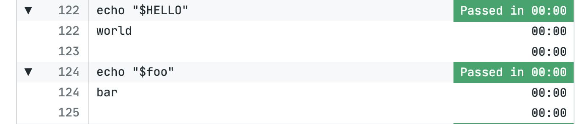

# Hello, World!

import Tabs from '@theme/Tabs';
import TabItem from '@theme/TabItem';
import Available from '@site/src/components/Available';
import VideoTutorial from '@site/src/components/VideoTutorial';
import Steps from '@site/src/components/Steps';

Projects allow Semaphore to perform actions every time there is a change in your Git repository.

In this section you will:

- Create your first project
- Invite contributors 
- Learn about workflows and pipelines
- Set up jobs and use environment variables

## Prerequisites

- A repository with at least one commit

## What is a project? {#project}

A project connects Semaphore to your Git repository. Every project on Semaphore is connected to one and only one repository on GitHub or BitBucket.

Every time *something* changes in the repository, Semaphore initiates a workflow. The workflow runs all the pipelines you have configured. These pipelines can virtually do anything, including building your application, testing it, and deploying it to your servers.

By default, a workflow can be initiated by any of these events:

- Pushing commits into any branch
- Pushing Git tags
- Creating pull requests
- Changing any pipelines
- Manually re-running workflows or pipelines
- Running pipelines using Scheduled Tasks

## Hello, world! {#hello}

These are the steps to create your first project:

<Steps>

1. Press the **Create new** button 

    

2. Press **Choose repository**
3. Select the tab corresponding to your provider: GitHub or BitBucket
4. Select a repository from the list.

     If the list is empty, press **Give access** or **Connect** to give Semaphore access to your repositories

     

5. Next, you'll see a list with all the repository contributors. 

    Select the individuals you wish to invite to the project and press **Add selected** 

    You can also [add people later](#people)

    

6. Press **Looks good, Start**

</Steps>

Once you're done these following thins will happen:

- The project is created and linked to your repository
- The selected individuals are invited into your organization and granted access to the project
- A new branch called `setup-semaphore` is created in your repository
- A new pipeline file called `.semaphore/semaphore.yml` is created in your repository
- The first workflow immediately starts

## Editing your pipelines {#workflow-editor}

Press the **Edit Workflow** on the right. This will open the visual Workflow Editor.

Let's get our bearings. The element highlighed is a block. A block is a container for job. Currently, there is only one job. 

On the right-side menu, you can see the block settings and the job. The job currently has one command. Every line here represents one command to run on the Bash shell.

Try adding the command `echo "Hello, World!"` and pressing **Run the workflow** > **Start**.

The new workflow starts immediately. Clicking on the job reveals the job log where we can see the output of our command.

## Adding more jobs {#jobs}

A block can have many jobs. Let's add a second job by pressing **Edit Workflow** and then clicking on **Add Job**

Add a few commands in the second job and press  **Run the workflow** > **Start**.

The first thing you'll notice is that both job run in parallel. This happens every time jobs share a block.

## Using environment variables {#variables}

A block not only runs jobs in parallel; a block also contains settings that apply to all its child jobs.

Open the workflow editor again and scroll down the right menu until you reach the section called **Environment variables**.

Click **Add env_vars** and set a few variables. You can define the variable name and value. Variables defined on the block are available to all its jobs.

The following above runs two job both printing the same message:

## Inviting people to the organization {#people}

We've seen that during [project creation](#project) you can invite people to the project. In reality, you're also inviting them to your organization, since only organization members log in to Semaphore.

But creating a project is not the only way to invite people to your organization. You can review your members and invite people by selecting **People** in the organization menu.

The People screen shows people that are part of your organization. Here you can remove them or change their roles.

Press **Add people** to get to the invitation page. This page shows you individuals that have access to your repositories but have not yet been added to your organization.

You can also add people without repository access by typing their GitHub usernames and pressing **Invite**

## What have we learned?

- How to create a project
- How to invite people to the organization and the project
- What blocks are and how they related to jobs
- That jobs in the same block run in parallel
- That block settings apply to all jobs in the block

## What's next?

In the next section we'll do our first steps with [Continuous Integration](./continuous-integration)
