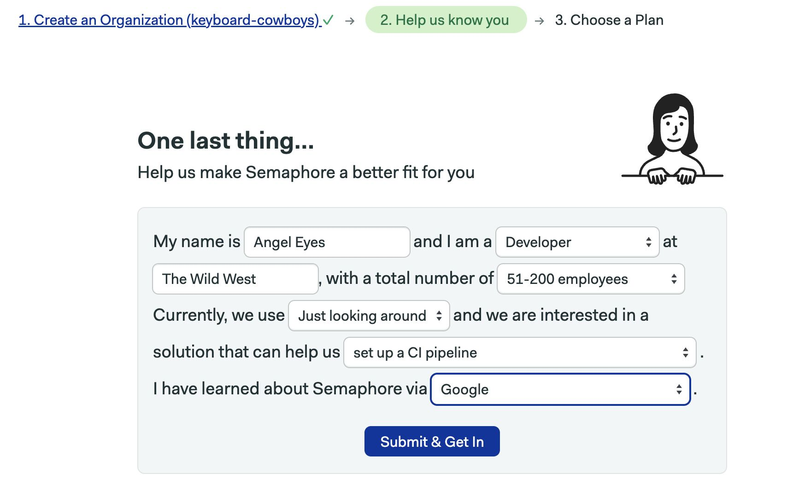
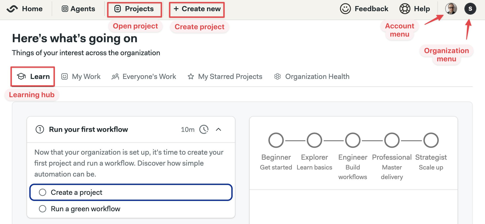

# Sign Up 

import Tabs from '@theme/Tabs';
import TabItem from '@theme/TabItem';
import Available from '@site/src/components/Available';
import VideoTutorial from '@site/src/components/VideoTutorial';
import Steps from '@site/src/components/Steps';

You will need a Semaphore account to follow this guided tour. Don't worry, the only thing you need to sign up is a GitHub or BitBucket account.

In this section we'll learn about:

- Creating an account
- Creating an organization
- Overview of the Semaphore hompage

:::note

If you already have or have been invited to an organization, you can skip directly to the [next step](./hello-world).

:::

## Why do I need CI/CD?

Continuous Integration (CI) is an automated process of regularly merging code changes, running tests, and providing rapid feedback to developers.

CI enables developers to frequently merge code changes, automatically test them, and detect integration issues early, leading to faster development cycles and higher-quality software.

Continuous Delivery and Continuous Deployment extend this process by providing a package you can release and deploy to the world. The whole process is automated and can be configured in way that does not require human intervention.

## Prerequisites

To create your Semaphore account you need a [GitHub](https://github) or [BitBucket](https://bitbucket.org) account.

## Sign up to Semaphore

Before you can start using Semaphore, you need to create an account:

<Steps>

1. Go to [semaphoreci.com](https://semaphoreci.com)
2. Press **Start Building for Free**
3. Select one of the options: **Signup with GitHub** or **Signup with BitBucket**

    

4. If prompted, authorize Semaphore to continue

    

5. Type a name for your organization
    
    Your organization is the HQ for all your projects and teammates. 
    
    The organization's name determines the URL for your Semaphore homepage. So, if your organization name is "keyboard-cowboys", your organization URL will be: `keyboard-cowboys.semaphoreci.com`

    You can always change the organization name later.

    

6. Fill in the short survey. This helps us to know you and your needs better

    

7. Finally, select your plan

    You can test one of the paid plans (no credit card required) or sign up with a free plan. You can change this later.

    

8. Congratulations and welcome to your new account

</Steps>

## Semaphore homepage

At this point you should be seeing your organization homepage. Let's get our bearings.

On the top left side you'll find:
- Project search box
- Project creation button

On the top right side there is:
- The account menu: here you logout and change account settings
- The organization menu: let's you manage your organization

On the middle you'll see the recent activity in your organization. Since we're just starting, there no activity yet.

## What is an organization?

An organization the place where all your project and teammembers live. You can create more organization as needed, each one can be tied to a different plan.

Since you created the organzation, you have the Owner role for it. That means you can do pretty much anything. Including invite teammembers, create groups, grant permissions, and even delete the whole organization.

## What's next?

In the next section we'll create our first project.
