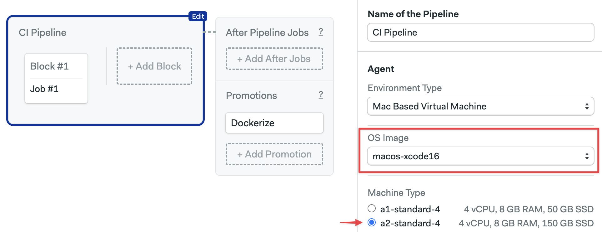
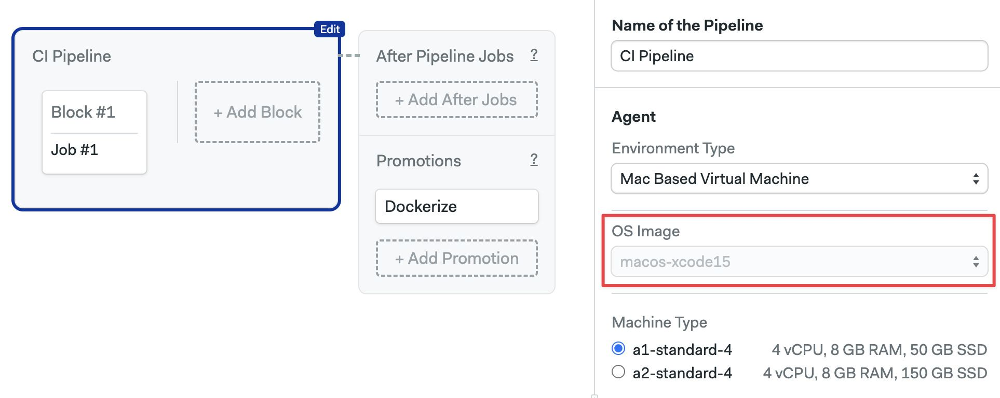

# Apple macOS Images

import Tabs from '@theme/Tabs';
import TabItem from '@theme/TabItem';
import Available from '@site/src/components/Available';
import VideoTutorial from '@site/src/components/VideoTutorial';

This page describes the Apple macOS images supported on Semaphore Cloud.

## Overview

The Operating System image defines what OS and software are pre-installed in your [agents](../using-semaphore/pipelines#agents). 

This page describes OS images to run on Apple-based Semaphore Cloud [machines](./machine-types). You can add more OS options using [self-hosted agents](../using-semaphore/self-hosted).

## macOS Xcode 16 {#mac-16}

<Tabs groupId="editor-yaml">
<TabItem value="editor" label="Editor">

To use this operating system, choose `macos-xcode16` in the **OS Image** selector. This OS can be paired with [A2s Apple machine](./machine-types#macos).



</TabItem>
<TabItem value="yaml" label="YAML">

To use this operating system, use `macos-xcode16` as the `os_image`. This OS can be paired with [A2s Apple machine](./machine-types#macos).

```yaml
version: v1.0
name: Initial Pipeline
agent:
  machine:
  # highlight-start
    type: a2-standard-4
    os_image: macos-xcode16
  # highlight-end
```

</TabItem>
</Tabs>

System version:

- ProductVersion: 14.5
- BuildVersion: 23F79
- Kernel Version: Darwin 23.5.0

### Version control

The following version control tools are pre-installed:

- Git (2.x)
- Git LFS (Git Large File Storage)
- Svn


### Utilities

The following utilities are pre-installed:

- homebrew
- bundler
- rbenv
- nvm
- curl
- wget
- jq
- carthage

### Browsers

The following browsers are pre-installed:

- Safari
- google-chrome
- firefox
- microsoft-edge

### Languages

<details>
<summary>Xcode</summary>
<div>

Installed versions:

- 16 (default)

The default installed Xcode version is `16.2`.

Xcode 16.2 has the following SDKs preinstalled:

- iOS 18.2
- macOS 15.0
- tvOS 18.2
- watchOS 11.2
- visionOS 2.2

</div>

</details>
<details>
<summary>JavaScript and Node.js</summary>
<div>

Installed version:

- Node.js: v18.20.1
- Yarn: 1.22.22

</div>
</details>

<details>
<summary>Python</summary>
<div>

Installed version:

- 3.12.44

Supporting libraries:

- pip3: 24

</div>
</details>

<details>
<summary>Ruby</summary>
<div>

Installed versions:

- 3.3.2 (system)
- 3.3.5

Following gems are pre-installed:

- fastlane (2.221.1)
- cocoapods (1.15.2)

</div>
</details>

<details>
<summary>Java and JVM</summary>
<div>

- openjdk 17

</div>
</details>

<details>
<summary>Flutter</summary>
<div>

- 3.24.3

</div>
</details>

## macOS Xcode 15 {#mac-15}

<Tabs groupId="editor-yaml">
<TabItem value="editor" label="Editor">

To use this operating system, choose `macos-xcode15` in the **OS Image** selector. This OS can be paired with all [Apple machines](./machine-types#macos).



</TabItem>
<TabItem value="yaml" label="YAML">

To use this operating system, use `macos-xcode15` as the `os_image`. This OS can be paired with all [Apple machines](./machine-types#macos).

```yaml
version: v1.0
name: Initial Pipeline
agent:
  machine:
  # highlight-start
    type: a1-standard-4
    os_image: macos-xcode15
  # highlight-end
```

</TabItem>
</Tabs>


System version:

- ProductVersion: 14.1
- BuildVersion: 23B74
- Kernel Version: Darwin 23.1.0

### Version control

The following version control tools are pre-installed:

- Git (2.x)
- Git LFS (Git Large File Storage)
- Svn

### Utilities

The following utilities are pre-installed:

- homebrew
- bundler
- rbenv
- nvm
- curl
- wget
- jq
- carthage

### Browsers

The following browsers are pre-installed:

- Safari
- google-chrome
- firefox
- microsoft-edge

### Languages

<details>
<summary>Xcode</summary>
<div>

Installed versions:

- 15.0.1
- 15.2
- 15.3 (default)

The default installed Xcode version is `15.3`.


Xcode 15.3 has the following SDKs preinstalled:

- iphoneos 17.4
- iphonesimulator 17.4
- driverkit.macos 23.0
- macos 14.2
- appletvos 17.4
- appletvsimulator 17.4
- watchos 10.4
- watchsimulator 10.4
- visionos 1.0

</div>

</details>
<details>
<summary>JavaScript and Node.js</summary>
<div>

Installed version:

- Node.js: v20.9.0
- Yarn: 1.22.19

</div>
</details>

<details>
<summary>Python</summary>
<div>

Installed version:

- 3.9.11

Supporting libraries:

- pip3: 23.3.1

</div>
</details>

<details>
<summary>Ruby</summary>
<div>

Installed versions:

- 2.6.10 (system)
- 3.1.4
- 3.1.5
- 3.1.6
- 3.2.0
- 3.2.1
- 3.2.2
- 3.2.3
- 3.2.4
- 3.2.5
- 3.3.0
- 3.3.1
- 3.3.2
- 3.3.3
- 3.3.4
- 3.3.5
 

Following gems are pre-installed:

- fastlane (2.222.0)
- cocoapods (1.15.2)

</div>
</details>

<details>
<summary>Java and JVM</summary>
<div>

- openjdk 17

</div>
</details>

<details>
<summary>Flutter</summary>
<div>

- 3.16.7

</div>
</details>

## (DEPRECATED) Monterey Xcode 14 {#mac-14}

The macOS Monterey (Xcode 14) was deprecated on September 2024.

<details>
<summary>Show me the deprecated information</summary>
<div>

System version:

- ProductVersion: 12.7
- BuildVersion: 21G651
- Kernel Version: Darwin 21.6.0

The following version control tools are pre-installed:

- Git (2.x)
- Git LFS (Git Large File Storage)

The following utilities are pre-installed:

- homebrew
- bundler
- rbenv
- nvm
- curl
- wget
- jq
- carthage


The following browsers are pre-installed:

- Safari
- google-chrome
- firefox
- microsoft-edge

<details>
<summary>Xcode</summary>
<div>

Installed versions:

- 14.1
- 14.2
- 14.3.1

The default installed Xcode version is `14.3.1`.


Xcode 14 has the following SDKs preinstalled:

- iphoneos 16.0
- iphonesimulator 16.0
- driverkit.macos 21.4
- macos 12.3
- appletvos 16.0
- appletvsimulator 16.0
- watchos 9.0
- watchsimulator 9.0

</div>

</details>
<details>
<summary>JavaScript and Node.js</summary>
<div>

Installed versions:

- nvm: 0.39.1
- Yarn: 1.22.19

</div>
</details>

<details>
<summary>Python</summary>
<div>

Installed version:

- 3.9.11

Supporting libraries:

- pip3: 22.0.4

</div>
</details>

<details>
<summary>Ruby</summary>
<div>

Installed versions:

- 2.7.8 (system)

The following gems are pre-installed:

- fastlane (2.213.0)
- cocoapods (1.11.3)

</div>
</details>

<details>
<summary>Java and JVM</summary>
<div>

- openjdk 17

</div>
</details>

<details>
<summary>Flutter</summary>
<div>

- 3.10.5

</div>
</details>

</div>
</details>


## See also

- [How to configure agents](../using-semaphore/pipelines#agents)
- [Self-hosted agents](../using-semaphore/self-hosted)
- [Machine type references](./machine-types)
- [Linux Ubuntu images reference](./os-ubuntu)
