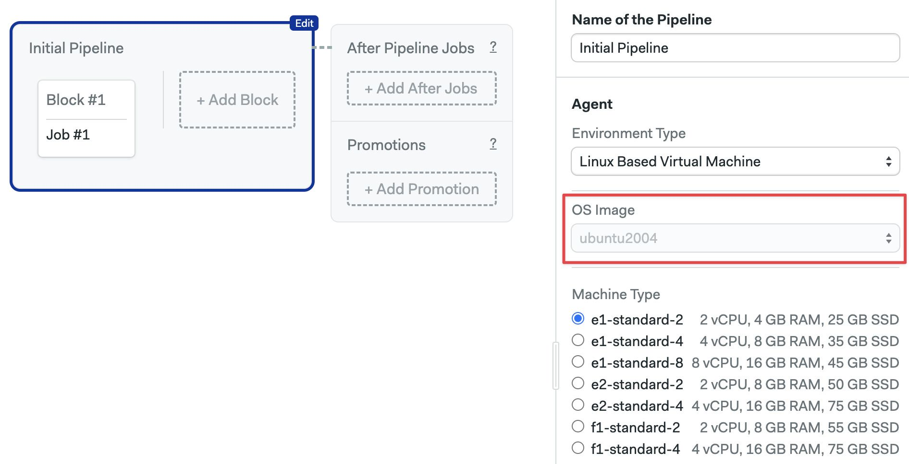

# Ubuntu 20.04 (x86_64)

import Tabs from '@theme/Tabs';
import TabItem from '@theme/TabItem';
import Available from '@site/src/components/Available';
import VideoTutorial from '@site/src/components/VideoTutorial';
import Steps from '@site/src/components/Steps';

<Available/>

This is a customized x86_64 image based on [Ubuntu 20.04](https://wiki.ubuntu.com/FocalFossa/ReleaseNotes) (Focal Fossa LTS).

<Tabs groupId="editor-yaml">
<TabItem value="editor" label="Editor">

To use this operating system, choose `ubuntu2004` in the **OS Image** selector. This OS can be paired with any [Linux Machine](../machine-types#linux).



</TabItem>
<TabItem value="yaml" label="YAML">

To use this operating system, use `ubuntu2004` as the `os_image`. This OS can be paired with any [Linux Machine](../machine-types#linux).

```yaml
version: v1.0
name: Initial Pipeline
agent:
  machine:
  # highlight-start
    type: e1-standard-1
    os_image: ubuntu2004
  # highlight-end
```

</TabItem>
</Tabs>

The following section describes the software pre-installed on the image.

## Version control

The following version control tools are pre-installed:

- Git 2.46.0
- Git LFS (Git Large File Storage) 3.5.1
- GitHub CLI 2.55.0
- Mercurial 5.3.1
- Svn 1.13.0

## Browsers

The following browsers and headless browsers are pre-installed. Chrome and Firefox support headless mode.

- Firefox 68.9 (`68`, `esr-old`), 78.1 (`78`, `default`, `esr`), 102.11.0 (`102`, `esr-new`, `esr-latest`)
- Geckodriver 0.33.0
- Google Chrome 128
- ChromeDriver 128
- Xvfb (X Virtual Framebuffer)
- Phantomjs 2.1.1

## Docker

Docker toolset is installed and the following versions are available:

- Docker 25.0.2
- Docker-compose 1.29.2 (used as `docker-compose --version`)
- Docker-compose 2.24.5 (used as `docker compose version`)
- Docker-buildx 0.12.1
- Docker-machine 0.16.2
- Dockerize 0.7.0
- Buildah 1.22.3
- Podman 3.4.2
- Skopeo 1.5.0

## Cloud CLIs

The following cloud tools are pre-installed:

- Aws-cli v1 (used as `aws`) 1.32.35
- Aws-cli v2 (used as `aws2`) 2.15.17
- Azure-cli 2.57.0
- Eb-cli 3.20.10
- Ecs-cli 1.21.0
- Doctl 1.104.0
- Gcloud 425.0.0
- Gke-gcloud-auth-plugin 425.0.0
- Kubectl 1.29.1
- Heroku 8.7.1
- Terraform 1.7.2
- Helm 3.14.0

## Utilities

The following utilities are pre-installed:

- Httpie 3.2.2
- Curl 7.68.0
- Rsync 3.1.3
- gcc 10 (default), and gcc 9

## Languages

The following languages and toolsets are pre-installed.

<details>
<summary>JavaScript and Node</summary>
<div>

Node.js versions are managed by [nvm](https://github.com/nvm-sh/nvm).  

You can install any version you need with `nvm install <version>`. 

Pre-installed tools:

- Node.js: v20.11.0 (set as default, with alias 20.11), includes npm 10.2.4
- Yarn: 1.22.19

</div>
</details>

<details>
<summary>Python</summary>
<div>


Python versions are installed and managed by
[virtualenv](https://virtualenv.pypa.io/en/stable/). Installed versions:

- 3.8.10 (default)
- 3.9.19
- 3.10.13
- 3.11.7
- 3.12.1

Supporting libraries:

- pypy: 7.3.9
- pypy3: 7.3.15
- pip: 24.0
- venv: 20.25.0


</div>
</details>

<details>
<summary>Ruby</summary>
<div>

Available versions:


- 2.6.0 to 2.6.10
- 2.7.0 to 2.7.8
- 3.0.0 to 3.0.7
- 3.1.0 to 3.1.6
- 3.2.0 to 3.2.4
- 3.3.0 to 3.3.4
- jruby-9.2.11.1
- jruby-9.3.9.0
- jruby-9.4.0.0

The default installed Ruby version is `2.7.8`.

</div>
</details>

<details>
<summary>Erlang and Elixir</summary>
<div>

Erlang versions are installed and managed via [kerl](https://github.com/kerl/kerl).
Elixir versions are installed with [kiex](https://github.com/taylor/kiex).

- Erlang: 22.3, 23.3, 24.1, 24.2, 24.3 (default), 25.0, 25.1, 25.2, 25.3, 26.0, 26.1, 26.2, 27.0
- Elixir: 1.9.x, 1.10.x, 1.11.x, 1.12.x, 1.13.x (1.13.4 as default), 1.14.x, 1.15.x, 1.16.x, 1.17.x

Additional libraries:

- Rebar: 2.6.4
- Rebar3: 3.22.1

</div>
</details>

<details>
<summary>Go</summary>
<div>

- 1.10.x
- 1.11.x
- 1.12.x
- 1.13.x
- 1.14.x
- 1.15.x
- 1.16.x
- 1.17.x
- 1.18.x
- 1.19.x
- 1.20.x
- 1.21.x (1.21.6 as default)
- 1.22.x

</div>
</details>

<details>
<summary>Java and JVM languages</summary>
<div>

- Java: 11.0.21 (default), 17.0.9
- Scala: 2.12.15, 3.1.3
- Leiningen: 2.11.1 (Clojure)
- Sbt 1.9.8

Build tools:

- Maven: 3.9.6
- Gradle: 8.3
- Bazel: 7.0.2

</div>
</details>


<details>
<summary>PHP</summary>
<div>

PHP versions are managed by [phpbrew](https://github.com/phpbrew/phpbrew).
Available versions:

- 7.4.x
- 8.0.x
- 8.1.x
- 8.2.x
- 8.3.x

The default installed PHP version is `7.4.33`.

Additional tools:

- PHPUnit: 7.5.20

</div>
</details>

<details>
<summary>Rust</summary>
<div>

- 1.75.0

</div>
</details>

