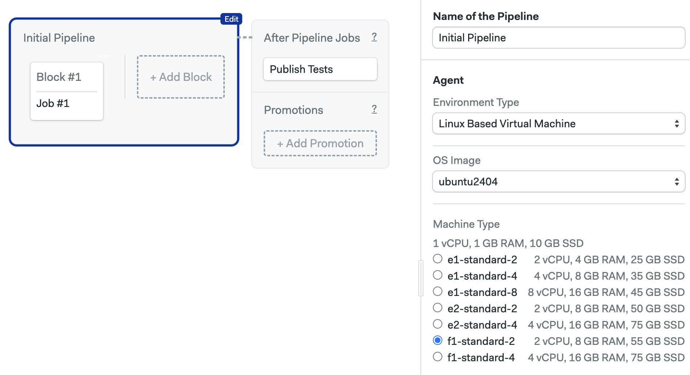

# Ubuntu 24.04 (x86_64)

import Tabs from '@theme/Tabs';
import TabItem from '@theme/TabItem';
import Available from '@site/src/components/Available';
import VideoTutorial from '@site/src/components/VideoTutorial';
import Steps from '@site/src/components/Steps';

<Available/>

:::warning

This image is in the Technical Preview stage. Documentation and the image itself are subject to change.

:::


This is a customized x86_64 image based on [Ubuntu 24.04](https://releases.ubuntu.com/noble/) (Noble Numbat LTS).

<Tabs groupId="editor-yaml">
<TabItem value="editor" label="Editor">

To use this operating system, and choose `ubuntu2404` in the **OS Image** selector. This OS can be paired with [F1 machines](../machine-types#f1) or higher.



</TabItem>
<TabItem value="yaml" label="YAML">

To use this operating system,  you must select an [`f1-standard`] machine and use `ubuntu2204` as the `os_image`:

```yaml
version: 1.0
name: Ubuntu2404 Based Pipeline
agent:
  machine:
  # highlight-start
    type: f1-standard-4
    os_image: ubuntu2404
  # highlight-end
```

</TabItem>
</Tabs>

The following section describes the software pre-installed on the image.

## Toolbox

The image comes with the following [toolbox utilities](../toolbox) preinstalled:

- [sem-version](../toolbox#sem-version): manage language versions on Linux
- [sem-service](../toolbox#sem-service): manage databases and services on Linux


## Version control

Following version control tools are pre-installed:

- Git 2.47.1
- Git LFS (Git Large File Storage) 3.6.0
- GitHub CLI 2.63.2
- Mercurial 6.1.1
- Svn 1.14.1

### Browsers and Headless Browser Testing

- Firefox 102.11.0 (`102`, `default`, `esr`)
- Geckodriver 0.35.0
- Google Chrome 131
- ChromeDriver 131
- Xvfb (X Virtual Framebuffer)
- Phantomjs 2.1.1

Chrome and Firefox both support headless mode. You shouldn't need to do more
than install and use the relevant Selenium library for your language.
Refer to the documentation of associated libraries when configuring your project.

### Docker

 Docker toolset is installed and the following versions are available:

- Docker 27.4.0
- Docker-compose 1.29.2 (used as `docker-compose --version`)
- Docker-compose 2.32.1 (used as `docker compose version`)
- Docker-buildx 0.19.3
- Docker-machine 0.16.2
- Dockerize 0.9.0
- Buildah 1.23.1
- Podman 3.4.4
- Skopeo 1.4.1

### Cloud CLIs

- Aws-cli 2.22.19 (used as `aws`)
- Azure-cli 2.67.0
- Ecs-cli 1.21.0
- Doctl 1.120.0
- Gcloud 504.0.0
- Gke-gcloud-auth-plugin 504.0.0
- Kubectl 1.29.1
- Heroku 10.0.0
- Terraform 1.10.2
- Helm 3.16.3

### Network utilities

- Httpie 3.2.4
- Curl 8.5.0
- Rsync 3.2.7

## Compilers

- gcc: 11, 12, 13 (default)

## Languages

### Erlang and Elixir

Erlang versions are installed and managed via [kerl](https://github.com/kerl/kerl).
Elixir versions are installed with [kiex](https://github.com/taylor/kiex).

- Erlang: 24.3, 25.0, 25.1, 25.2, 25.3, 26.0, 26.1, 26.2, 27.0 (default), 27.1, 27.2
- Elixir: 1.12.x, 1.13.x, 1.14.x, 1.15.x, 1.16.x, 1.17.x (1.17.3 as default)

Additional libraries:

- Rebar3: 3.24.0

### Go

Versions:

- 1.10.x
- 1.11.x
- 1.12.x
- 1.13.x
- 1.14.x
- 1.15.x
- 1.16.x
- 1.17.x
- 1.18.x
- 1.19.x
- 1.20.x
- 1.21.x
- 1.22.x
- 1.23.x (1.23.4 as default)

### Java and JVM languages

- Java: 11.0.25, 17.0.13 (default), 21.0.5
- Scala: 3.2.2
- Leiningen: 2.11.2 (Clojure)
- Sbt 1.10.6

### Additional Java build tools

- Maven: 3.9.9
- Gradle: 8.11.1
- Bazel: 8.0.0

### JavaScript via Node.js

Node.js versions are managed by [nvm](https://github.com/nvm-sh/nvm).
You can install any version you need with `nvm install [version]`.
Installed version:

- v22.12.0 (set as default, with alias 22.11), includes npm 10.9.0

### Additional JS tools

- Yarn: 1.22.22

### PHP

PHP versions are managed by [phpbrew](https://github.com/phpbrew/phpbrew).
Available versions:

- 8.1.x
- 8.2.x
- 8.3.x

The default installed PHP version is `8.1.31`.

### Additional PHP libraries

PHPUnit: 9.5.28

### Python

Python versions are installed and managed by
[virtualenv](https://virtualenv.pypa.io/en/stable/). Installed versions:

- 3.10.16
- 3.11.11
- 3.12.8

Supporting libraries:

- pypy3: 7.3.17
- pip: 24.3.1
- venv: 20.28.0

### Ruby

Available versions:

- 3.0.x
- 3.1.x
- 3.2.x
- 3.3.x
- jruby-9.4.1.0

The default installed Ruby version is `3.3.6`.

### Rust

- 1.83.0


## See also

- [Installing packages on Ubuntu](../os-ubuntu)
- [Machine types](../machine-types)
- [Semaphore Toolbox](../toolbox)
- [Pipeline YAML refence](../pipeline-yaml)
