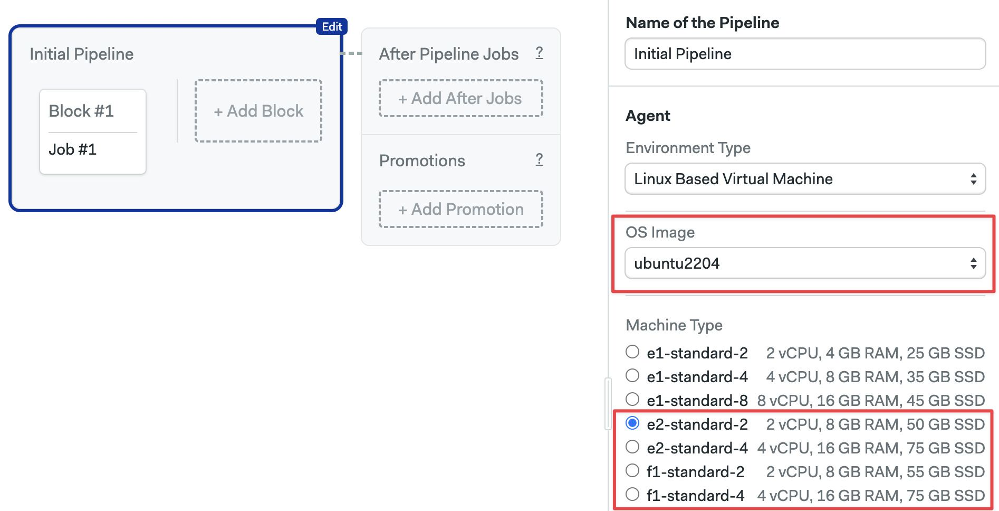

# Linux Ubuntu Images

import Tabs from '@theme/Tabs';
import TabItem from '@theme/TabItem';
import Available from '@site/src/components/Available';
import VideoTutorial from '@site/src/components/VideoTutorial';
import Steps from '@site/src/components/Steps';

<Available/>

This page describes the Ubuntu images supported on Semaphore Cloud.

## Overview

The Operating System image defines what OS and software are pre-installed in your [agents](../using-semaphore/pipelines#agents). 

This page describes OS images to run on Linux-based Semaphore Cloud [machines](./machine-types). You can add more OS options using [self-hosted agents](../using-semaphore/self-hosted).

### Installing packages {#install}

You have full `sudo` passwordless permissions to install and modify OS packages as needed. Ubuntu package manager is [apt](https://ubuntu.com/server/docs/package-management).

To install a package, run:

```shell
sudo apt-get update
sudo apt-get install -y <package-name>
```

:::info

Packages are installed from a package repository located near the machines for more performance.

:::

### Disabled repositories {#disabled-repos}

Due to occasional issues with some of the repositories that break the pipeline during the `apt-get update` command, the following package sources repositories have been disabled and moved to `/etc/apt/sources.list.d/disabled`:

- `azure-cli.list`
- `devel_kubic_libcontainers_stable.list`
- `docker.list`
- `firefox.list`
- `git.list`
- `google-cloud-sdk.list`
- `gradle.list`
- `helm.list`
- `pypy.list`
- `python.list`
- `yarn.list`

If you need any of these package repositories, execute the following command:

```shell
sudo mv /etc/apt/sources.list.d/disabled/<package-repository-file.list> /etc/apt/sources.list.d/
sudo apt-get update
```

### Nested virtualization {#nested-virtualization}

Linux-based machines support nested virtualization. You can create virtual machines inside the virtual machine running your agent using [libvirt]

Follow these commands to use nested virtualization:

<Steps>

1. Check that nested virtualization is supported. The output should be `0`
    ```shell
    grep -cw vmx /proc/cpuinfo
    ```
2. Install the required packages
    ```shell
    sudo apt-get install -y uvtool sshpass net-tools netcat-openbsd
    ```
3. Download prebuilt Ubuntu cloud image
    ```shell
    uvt-simplestreams-libvirt --verbose sync --source http://cloud-images.ubuntu.com/daily release=focal arch=amd64
    uvt-simplestreams-libvirt query
    ```
4. Create a new SSH keypair
    ```shell
    rm -rf ~/.ssh/id_rsa
    echo | ssh-keygen -t rsa  -f ~/.ssh/id_rsa
    ```
5. Create the VM
    ```shell
    uvt-kvm create vm1 --memory 1024 --cpu 1 --disk 4 --password ubuntu --bridge virbr0
    uvt-kvm list
    ```
6. Wait for the machine to be up and IP to be available
    ```shell
    IP=""
    while [ -z $IP ];do IP=$(arp -an | grep $(virsh dumpxml vm1| grep "mac address" | cut -d"'" -f2)|cut -d"(" -f2|cut -d")" -f1);done
    echo $IP
    while ! nc -w5 -z $IP 22; do  echo "Sleep while $IP is up";sleep 1; done
    ```
7. Run the commands in the VM using SSH. For example, this runs `uname -a`
    ```shell
    sshpass -p "ubuntu" -v  ssh -o UserKnownHostsFile=/dev/null -o StrictHostKeyChecking=no ubuntu@$IP -t 'uname -a'
    ```
</Steps>

The predefined default network for nested virtualization is 192.168.123.0/24. The base VM provides virbr0 interface with the IP address: 192.168.123.1.

## Ubuntu 22.04 (x86_64) {#ubuntu2204-x86}

:::note

The Ubuntu 22.04 images is not available for the older generation agent type [e1-standard](./machine-types#e1). This OS version is in technical preview and versions of preinstalled software are subject to change.

:::

This is a customized x86_64 image based on [Ubuntu 22.04](https://wiki.ubuntu.com/JammyJellyfish/ReleaseNotes) (Jammy Jellyfish LTS).

<Tabs groupId="editor-yaml">
<TabItem value="editor" label="Editor">

To use this operating system, and choose `ubuntu2204` in the **OS Image** selector. This OS can only be paired with [E2 machines](./machine-types#e2) or higher.



</TabItem>
<TabItem value="yaml" label="YAML">

To use this operating system,  you must select an [`e2-standard`] machine and use `ubuntu2204` as the `os_image`:

```yaml
version: v1.0
name: Initial Pipeline
agent:
  machine:
  # highlight-start
    type: e2-standard-2
    os_image: ubuntu2204
  # highlight-end
```

</TabItem>
</Tabs>

The following section describes the software pre-installed on the image.

### Version control

The following version control tools are pre-installed:

- Git 2.46.0
- Git LFS (Git Large File Storage) 3.5.1
- GitHub CLI 2.55.0
- Mercurial 6.1.1
- Svn 1.14.1

### Browsers

The following browsers and headless browsers are pre-installed. Chrome and Firefox support headless mode.

- Firefox 102.11.0 (`102`, `default`, `esr`)
- Geckodriver 0.33.0
- Google Chrome 121
- ChromeDriver 121
- Xvfb (X Virtual Framebuffer)
- Phantomjs 2.1.1

### Docker

Docker toolset is installed and the following versions are available:

- Docker 27.2.0
- Docker-compose 1.29.2 (used as `docker-compose --version`)
- Docker-compose 2.29.2 (used as `docker compose version`)
- Docker-buildx 0.16.2
- Docker-machine 0.16.2
- Dockerize 0.7.0
- Buildah 1.23.1
- Podman 3.4.4
- Skopeo 1.4.1

### Cloud CLIs

The following cloud tools are pre-installed:

- Aws-cli 2.17.40 (used as `aws`)
- Azure-cli 2.64.0
- Ecs-cli 1.21.0
- Doctl 1.111.0
- Gcloud 492.0.0
- Gke-gcloud-auth-plugin 492.0.0
- Kubectl 1.29.1
- Heroku 9.2.1
- Terraform 1.9.5
- Helm 3.15.4

### Utilities

The following utilities are pre-installed:

- Httpie 3.2.2
- Curl 8.5.0
- Rsync 3.2.7
- gcc 11, 12, and 13 (default)

### Languages

The following languages and toolsets are pre-installed.

<details>
<summary>JavaScript and Node</summary>
<div>

Node.js versions are managed by [nvm](https://github.com/nvm-sh/nvm).  

You can install any version you need with `nvm install <version>`. 

Pre-installed tools:

- Node.js: v20.17.0 (set as default, with alias 20.17), includes npm 10.8.2
- Yarn: 1.22.22

</div>
</details>

<details>
<summary>Python</summary>
<div>


Python versions are installed and managed by
[virtualenv](https://virtualenv.pypa.io/en/stable/). Installed versions:

- 3.10.14
- 3.11.9
- 3.12.3

Supporting libraries:

- pypy3: 7.3.17
- pip: 24.2
- venv: 20.26.3

</div>
</details>

<details>
<summary>Ruby</summary>
<div>

Available versions:

- 3.0.x
- 3.1.x
- 3.2.x
- 3.3.x
- jruby-9.4.1.0

The default installed Ruby version is `3.3.4`

</div>
</details>

<details>
<summary>Erlang and Elixir</summary>
<div>

Erlang versions are installed and managed via [kerl](https://github.com/kerl/kerl).
Elixir versions are installed with [kiex](https://github.com/taylor/kiex).

- Erlang: 24.3, 25.0, 25.1, 25.2, 25.3, 26.0, 26.1, 26.2, 27.0 (default)
- Elixir: 1.12.x, 1.13.x, 1.14.x, 1.15.x, 1.16.x, 1.17.x (1.17.2 as default)
 
Additional libraries:

- Rebar3: 3.22.1

</div>
</details>

<details>
<summary>Go</summary>
<div>

- 1.10.x
- 1.11.x
- 1.12.x
- 1.13.x
- 1.14.x
- 1.15.x
- 1.16.x
- 1.17.x
- 1.18.x
- 1.19.x
- 1.20.x
- 1.21.x
- 1.22.x
- 1.23.x (1.23.0 as default)

</div>
</details>

<details>
<summary>Java and JVM languages</summary>
<div>

- Java: 11.0.24, 17.0.12 (default)
- Scala: 3.2.2
- Leiningen: 2.11.2 (Clojure)
- Sbt 1.10.1

Build tools:

- Maven: 3.9.6
- Gradle: 8.10
- Bazel: 7.3.1
 
</div>
</details>


<details>
<summary>PHP</summary>
<div>

PHP versions are managed by [phpbrew](https://github.com/phpbrew/phpbrew).
Available versions:

- 8.1.x
- 8.2.x
- 8.3.x

The default installed PHP version is `8.1.29`

Additional tools:

- PHPUnit: 9.5.28

</div>
</details>

<details>
<summary>Rust</summary>
<div>

- 1.81.0

</div>
</details>


## Ubuntu 20.04 (x86_64) {#ubuntu2004}

This is a customized x86_64 image based on [Ubuntu 20.04](https://wiki.ubuntu.com/FocalFossa/ReleaseNotes) (Focal Fossa LTS).

<Tabs groupId="editor-yaml">
<TabItem value="editor" label="Editor">

To use this operating system, choose `ubuntu2004` in the **OS Image** selector. This OS can be paired with any [Linux Machine](./machine-types#linux).


</TabItem>
<TabItem value="yaml" label="YAML">

To use this operating system, use `ubuntu2004` as the `os_image`. This OS can be paired with any [Linux Machine](./machine-types#linux).

```yaml
version: v1.0
name: Initial Pipeline
agent:
  machine:
  # highlight-start
    type: e1-standard-1
    os_image: ubuntu2004
  # highlight-end
```

</TabItem>
</Tabs>

The following section describes the software pre-installed on the image.

### Version control

The following version control tools are pre-installed:

- Git 2.46.0
- Git LFS (Git Large File Storage) 3.5.1
- GitHub CLI 2.55.0
- Mercurial 5.3.1
- Svn 1.13.0

### Browsers

The following browsers and headless browsers are pre-installed. Chrome and Firefox support headless mode.

- Firefox 68.9 (`68`, `esr-old`), 78.1 (`78`, `default`, `esr`), 102.11.0 (`102`, `esr-new`, `esr-latest`)
- Geckodriver 0.33.0
- Google Chrome 128
- ChromeDriver 128
- Xvfb (X Virtual Framebuffer)
- Phantomjs 2.1.1

### Docker

Docker toolset is installed and the following versions are available:

- Docker 25.0.2
- Docker-compose 1.29.2 (used as `docker-compose --version`)
- Docker-compose 2.24.5 (used as `docker compose version`)
- Docker-buildx 0.12.1
- Docker-machine 0.16.2
- Dockerize 0.7.0
- Buildah 1.22.3
- Podman 3.4.2
- Skopeo 1.5.0

### Cloud CLIs

The following cloud tools are pre-installed:

- Aws-cli v1 (used as `aws`) 1.32.35
- Aws-cli v2 (used as `aws2`) 2.15.17
- Azure-cli 2.57.0
- Eb-cli 3.20.10
- Ecs-cli 1.21.0
- Doctl 1.104.0
- Gcloud 425.0.0
- Gke-gcloud-auth-plugin 425.0.0
- Kubectl 1.29.1
- Heroku 8.7.1
- Terraform 1.7.2
- Helm 3.14.0

### Utilities

The following utilities are pre-installed:

- Httpie 3.2.2
- Curl 7.68.0
- Rsync 3.1.3
- gcc 10 (default), and gcc 9

### Languages

The following languages and toolsets are pre-installed.

<details>
<summary>JavaScript and Node</summary>
<div>

Node.js versions are managed by [nvm](https://github.com/nvm-sh/nvm).  

You can install any version you need with `nvm install <version>`. 

Pre-installed tools:

- Node.js: v20.11.0 (set as default, with alias 20.11), includes npm 10.2.4
- Yarn: 1.22.19

</div>
</details>

<details>
<summary>Python</summary>
<div>


Python versions are installed and managed by
[virtualenv](https://virtualenv.pypa.io/en/stable/). Installed versions:

- 3.8.10 (default)
- 3.9.19
- 3.10.13
- 3.11.7
- 3.12.1

Supporting libraries:

- pypy: 7.3.9
- pypy3: 7.3.15
- pip: 24.0
- venv: 20.25.0


</div>
</details>

<details>
<summary>Ruby</summary>
<div>

Available versions:


- 2.6.0 to 2.6.10
- 2.7.0 to 2.7.8
- 3.0.0 to 3.0.7
- 3.1.0 to 3.1.6
- 3.2.0 to 3.2.4
- 3.3.0 to 3.3.4
- jruby-9.2.11.1
- jruby-9.3.9.0
- jruby-9.4.0.0

The default installed Ruby version is `2.7.8`.

</div>
</details>

<details>
<summary>Erlang and Elixir</summary>
<div>

Erlang versions are installed and managed via [kerl](https://github.com/kerl/kerl).
Elixir versions are installed with [kiex](https://github.com/taylor/kiex).

- Erlang: 22.3, 23.3, 24.1, 24.2, 24.3 (default), 25.0, 25.1, 25.2, 25.3, 26.0, 26.1, 26.2, 27.0
- Elixir: 1.9.x, 1.10.x, 1.11.x, 1.12.x, 1.13.x (1.13.4 as default), 1.14.x, 1.15.x, 1.16.x, 1.17.x

Additional libraries:

- Rebar: 2.6.4
- Rebar3: 3.22.1

</div>
</details>

<details>
<summary>Go</summary>
<div>

- 1.10.x
- 1.11.x
- 1.12.x
- 1.13.x
- 1.14.x
- 1.15.x
- 1.16.x
- 1.17.x
- 1.18.x
- 1.19.x
- 1.20.x
- 1.21.x (1.21.6 as default)
- 1.22.x

</div>
</details>

<details>
<summary>Java and JVM languages</summary>
<div>

- Java: 11.0.21 (default), 17.0.9
- Scala: 2.12.15, 3.1.3
- Leiningen: 2.11.1 (Clojure)
- Sbt 1.9.8

Build tools:

- Maven: 3.9.6
- Gradle: 8.3
- Bazel: 7.0.2

</div>
</details>


<details>
<summary>PHP</summary>
<div>

PHP versions are managed by [phpbrew](https://github.com/phpbrew/phpbrew).
Available versions:

- 7.4.x
- 8.0.x
- 8.1.x
- 8.2.x
- 8.3.x

The default installed PHP version is `7.4.33`.

Additional tools:

- PHPUnit: 7.5.20

</div>
</details>

<details>
<summary>Rust</summary>
<div>

- 1.75.0

</div>
</details>

## Ubuntu 22.04 (ARM) {#ubuntu2204-arm}

This is a customized ARM image based on [Ubuntu 22.04](https://wiki.ubuntu.com/JammyJellyfish/ReleaseNotes) (Jammy Jellyfish LTS).

This OS can only be paired with [R1 ARM machines](./machine-types#r1).

The following section describes the software pre-installed on the image.

### Version control

Following version control tools are pre-installed:

- Git 2.42.0
- Git LFS (Git Large File Storage) 3.4.1
- GitHub CLI 2.42.1
- Mercurial 6.1.1
- Svn 1.14.1

### Browsers

The following browsers and headless browsers are pre-installed. Chrome and Firefox support headless mode.

- Firefox 115.7.0 (`115`, `default`, `esr`)
- Geckodriver 0.33.0
- Chromium 120
- Chromium Driver 120
- Xvfb (X Virtual Framebuffer)

### Docker

The Docker toolset is installed and the following versions are available:

- Docker 24.0.7
- Docker-compose 2.24.2 (used as `docker compose version`)
- Docker-buildx 0.12.1
- Docker-machine 0.16.2
- Dockerize 0.7.0
- Buildah 1.23.1
- Podman 3.4.4
- Skopeo 1.4.1

### Cloud CLIs

The following cloud CLIs are pre-installed:

- Aws-cli 2.15.11 (used as `aws`)
- Azure-cli 2.56.0
- Eb-cli 3.20.10
- Ecs-cli 1.21.0
- Doctl 1.102.0
- Gcloud 425.0.0
- Gke-gcloud-auth-plugin 425.0.0
- Kubectl 1.29.1
- Terraform 1.7.0
- Helm 3.13.3

### Utilities

The following utilities are pre-installed:

- Httpie 3.2.2
- Curl 7.81.0
- Rsync 3.2.7
- gcc 11 (default) and gcc 12

### Languages


<details>
<summary>JavaScript and Node</summary>
<div>

Node.js versions are managed by [nvm](https://github.com/nvm-sh/nvm).  

You can install any version you need with `nvm install <version>`. 

Pre-installed tools:

- Node.js: v20.11.0 (set as default, with alias 20.11), includes npm 10.2.4
- Yarn: 1.22.19

</div>
</details>

<details>
<summary>Python</summary>
<div>


Python versions are installed and managed by
[virtualenv](https://virtualenv.pypa.io/en/stable/). Installed versions:

- 3.10.12
- 3.11.7
- 3.12.1

Supporting libraries:

- pypy: 7.3.9
- pypy3: 7.3.15
- pip: 24.0
- venv: 20.25.0


</div>
</details>

<details>
<summary>Ruby</summary>
<div>

Available versions:

- 2.7.0 to 2.7.8
- 3.0.0 to 3.0.7
- 3.1.0 to 3.1.6
- 3.2.0 to 3.2.4
- 3.3.0 to 3.3.4
- jruby-9.3.10.0
- jruby-9.4.2.0

The default installed Ruby version is `3.2.3`.

</div>
</details>

<details>
<summary>Erlang and Elixir</summary>
<div>

Erlang versions are installed and managed via [kerl](https://github.com/kerl/kerl).
Elixir versions are installed with [kiex](https://github.com/taylor/kiex).

- Erlang: 24.3, 25.0, 25.1, 25.2, 25.3 (default), 26.0, 26.1, 26.2, 27.0
- Elixir: 1.9.x, 1.10.x, 1.11.x, 1.12.x, 1.13.x, 1.14.x (1.14.5 as default), 1.15.x, 1.16.x, 1.17.x

Additional libraries:

- Rebar3: 3.22.1

</div>
</details>

<details>
<summary>Go</summary>
<div>

- 1.19.x
- 1.20.x
- 1.21.x (1.21.6 as default)
- 1.22.x

</div>
</details>

<details>
<summary>Java and JVM languages</summary>
<div>

- Java: 11.0.21, 17.0.9 (default)
- Scala: 3.2.2
- Leiningen: 2.10.0 (Clojure)
- Sbt 1.9.7

Build tools:

- Maven: 3.9.6
- Gradle: 8.3
- Bazel: 7.0.2

</div>
</details>


<details>
<summary>PHP</summary>
<div>

PHP versions are managed by [phpbrew](https://github.com/phpbrew/phpbrew).
Available versions:
  
- 8.1.x
- 8.2.x
- 8.3.x

The default installed PHP version is `8.1.27`.

Additional tools:

- PHPUnit: 9.5.28

</div>
</details>

<details>
<summary>Rust</summary>
<div>

- 1.75.0

</div>
</details>


## See also

- [How to configure agents](../using-semaphore/pipelines#agents)
- [Self-hosted agents](../using-semaphore/self-hosted)
- [Machine type references](./machine-types)
- [Apple macOS images reference](./os-apple)
