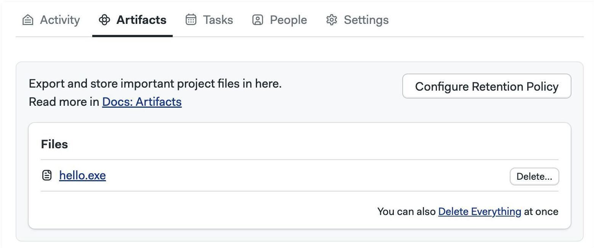

# Artifacts

import Tabs from '@theme/Tabs';
import TabItem from '@theme/TabItem';
import Available from '@site/src/components/Available';
import VideoTutorial from '@site/src/components/VideoTutorial';

<VideoTutorial title="How to use artifacts" src="https://www.youtube.com/embed/yHzZOKwyaAA?si=7qVathl09Cd3d-Gq"/>

Artifacts provide persistent storage for files and folders. This page explains how to store, retrieve and view artifacts and how to manage retention policies.

## Overview

Artifacts provide a persistent file store for all your [projects](./projects). Artifacts are ideal for:

- passing files between [jobs](./jobs) like build artifacts or compiled executables
- long-term storage for final deliverables
- collecting debug data from your jobs like screenshots and build logs
- store test results for processing [Test Reports](./test-reports) and [Flaky Tests](./flaky-tests)

:::note

Using artifacts in [self-hosted agents] requires additional setup steps.

:::

Use cases:
- save build artifacts
- copy files between jobs
- store test results for processing
- save error logs

Diagram?

```shell
artifact pull|push job|workflow|project /path/to/file/or/folder
```

## Artifact scopes

Artifact levels, scopes

    - **job** artifacts are only accessible to the job that created it. Useful for collecting debugging data
    - **workflow** artifacts are accessible to all jobs in all running [pipelines](./pipelines). The main use case is to pass data between jobs.
    - **project** artifacts are always accessible. They are ideal for storing final deliverables. 

### Project artifacts

Purpose, usage, commands

```shell
checkout
go build 
# highlight-next-line
artifact push project hello.exe
```

### Workflow artifacts

Purpose, usage, commands

```shell
checkout
npm run build
# highlight-next-line
artifact push workflow dist
```

```shell
artifact pull workflow dist
```

### Job artifacts

Purpose, usage, commands

## Retention policies

Only via UI?

## Artifact usage pricing

## See also

- [Semaphore toolbox]
- [Test reports]
- [Flaky tests]
- [Using artifacts in jobs]

---

TOC https://docs.semaphoreci.com/essentials/artifacts/
Types of artifacts
Job Artifacts
Workflow Artifacts
Project Artifacts
Artifact retention policies
Applying different retention policies to different folders
Artifact pricing


2. **Publish**: push results file into the [artifact store](./jobs#artifact)
The publish step uploads all report files to the [artifact store](./jobs#artifact). This is accomplished using the `test-results` tool which is part of the _Semaphore toolbox_.
Also in flaky tests


The [artifact] command can be used:

- as a way to move files between jobs and runs
- as persistent storage for artifacts like compiled binaries or bundles

The following example shows how to persist files between jobs. In the first job we have:

```shell
checkout
npm run build
# highlight-next-line
artifact push workflow dist
```

In the following jobs, we can access the content of the dist folder with:

```shell
artifact pull workflow dist
```

Let's do another example: this time we want to save the compiled binary `hello.exe`:

```shell
checkout
go build 
# highlight-next-line
artifact push project hello.exe
```

Artifacts can be viewed and downloaded from the Semaphore [project](./projects).



<details>
 <summary>Artifact namespaces</summary>
 <div>
    Semaphore uses three separate namespaces of artifacts: job, workflow, and project. The syntax is:

    ```shell
    artifact pull|push job|workflow|project /path/to/file/or/folder
    ```

    The namespace used controls at what level the artifact is accessible:

    - **job** artifacts are only accessible to the job that created it. Useful for collecting debugging data
    - **workflow** artifacts are accessible to all jobs in all running [pipelines](./pipelines). The main use case is to pass data between jobs.
    - **project** artifacts are always accessible. They are ideal for storing final deliverables. 

 </div>
</details>
