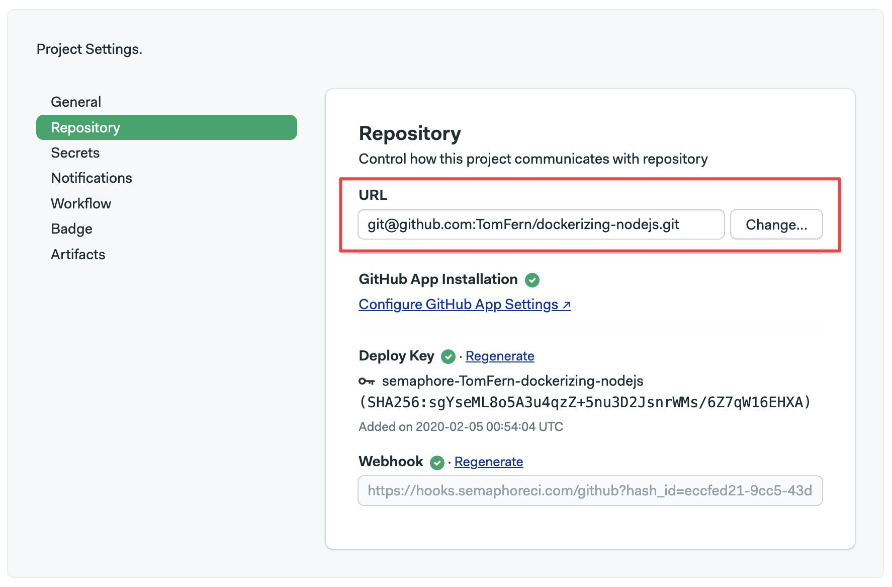

# Connect GitHub with OAuth

import Tabs from '@theme/Tabs';
import TabItem from '@theme/TabItem';
import Available from '@site/src/components/Available';
import VideoTutorial from '@site/src/components/VideoTutorial';

OAuth is the legacy method to access your GitHub repositories. This feature might be deprecated in following releases. Semaphore recommends using [GitHub App](./connect-github) instead of the method described here.

## Overview {#overview}

Semaphore supports two types of ways to access your GitHub repositories:

- [OAuth App](https://github.com/settings/connections/applications/328c742132e5407abd7d): this connection is provides Single-Sign On (SSO) access to your Semaphore account. It is established during the Semaphore [account creation process](../getting-started/guided-tour).
- [GitHub App](https://github.com/apps/semaphore-ci-cd): an optional type of connection providing additional features such as fine-grained control and per-repository permissions.

You can create and revoke access to both types of connections at any time.

## OAuth vs GitHub app {#oauth-vs-app}

The **OAuth App** authorizes Semaphore to impersonate with GitHub using your access credentials. This means you need to have admin-level access to the GitHub repository to connect it with Semaphore.

In addition, with OAuth, you can't control access on a per-repository level. Instead, you can only grant or revoke access to repositories based on their visibility, i.e. if they are public or private. It also means that if you delete your GitHub account, Semaphore loses access to all repositories.

Semaphore recommends using the [GitHub App](./connect-github) whenever possible as it provides two benefits:

- **Granular permissions**: you can grant Semaphore access to individual repositories, giving you control over which data Semaphore has access to.
- **No personal tokens**: since it does not rely on a personal access token, you can offboard people from the GitHub organization without the connection with Semaphore.

## How to sign up using GitHub {#sign-gh}

If you are creating a new Semaphore account, you can sign in with GitHub to create the connection automatically.

Follow these steps to create a Semaphore account using GitHub:

1. Log in to your GitHub account
2. Navigate to the [Semaphore login page](https://semaphoreci.com/login)
3. Select **Log in with GitHub**
4. Grant access to the Semaphore [OAuth App](https://github.com/settings/connections/applications/328c742132e5407abd7d) in GitHub
5. Finish the Semaphore setup

## How to authorize OAuth App {#connect-oauth}

The connection between Semaphore and GitHub should be configured automatically when you sign up. However, this connection can be severed for different reasons. If you don't see your repositories when trying to create a [project](./projects), follow these steps:

1. Navigate to your [Semaphore account page](https://me.semaphoreci.com/account)
2. Click on **Grant public access** or **Grant private access** to grant access to only public or all of your repositories on GitHub
 
3. Press **Authorize semaphoreci**
 

The possible connection status is:

- **Not Connected**: the account is not connected. Log out and back into Semaphore to grant access to your GitHub account
- **Email only**: Semaphore is connected to your repositories [via the GitHub App](./connect-github) only. The OAuth App has not been authorized
- **Public repositories**: Semaphore can connect to all your public repositories [via OAuth App](#oauth)
- **Connected**: Semaphore can connect to all your public and private repositories [via OAuth App](#oauth)

If your GitHub account is fully disconnected, log out of Semaphore and try to log in again. You will be prompted to give Semaphore access to GitHub.

### Connect repositories via OAuth {#oauth}

To connect a GitHub repository with Semaphore using OAuth, you must have admin access to the GitHub repository.

To create a connection using OAuth, follow these steps:

1. Create a [new project](./projects#create-a-project)
2. Select the **GitHub Personal Token** tab
 
3. Choose **Public repositories** or **All repositories**
 
4. Select a repository from the list and finish the [project setup](./projects)

You can only use this method on repositories you have admin-level access to (unavailable repositories are greyed out).

:::note

Depending on the GitHub organization settings, its owner may need to [authorize OAuth App](https://docs.github.com/en/apps/oauth-apps/building-oauth-apps/authorizing-oauth-apps) within the organization.

If you have given full access to Semaphore but you only see your personal repositories, it might mean that the GitHub organization's owner hasn't granted Semaphore access to the organization yet.

:::

## Troubleshooting guide

If your repositories aren't showing in Semaphore or changes are not triggering new workflows, check the connection between GitHub and Semaphore.

1. Navigate to your [Semaphore account](https://me.semaphoreci.com/account)
2. Read the status next to GitHub
 
3. If the status is disconnected, click on **Grant public access** or **Grant private access**

You can check and change the permissions of your OAuth App connection in the [Semaphore OAuth page](https://github.com/settings/connections/applications/328c742132e5407abd7d).

### Verify deploy key health {#deploy-key}

Semaphore generates a [deploy key](https://docs.github.com/en/authentication/connecting-to-github-with-ssh/managing-deploy-keys) when a [project](./projects) is created. This means there is a deploy key per repository connected to Semaphore.

When a deploy key is broken or invalid, Semaphore shows the following error message:

```text
git@github.com: Permission denied (publickey).
fatal: Could not read from remote repository.
```
To verify the status of a deploy key:

1. Open your [project settings](./projects#settings)
2. If there isn't a green check next to **Deploy Key**, the key is invalid
 

To deploy a new key, click on **Regenerate**

:::info

A deploy key can be invalidated if:

- it was manually removed from the repository
- access via OAuth or GitHub App was revoked
- the repository's original owner no longer has access to it (only for projects added [via OAuth](#oauth))

:::

### Verify webhook health {#webhook}

Semaphore uses a webhook to detect changes in your repository. When the webhook is broken, Semaphore can't trigger new workflows.

To verify the status of a webhook:

1. Open your [project settings](./projects#settings)
2. If there isn't a green check next to **Deploy Key**, the key is invalid
 

To fix the broken webhook, click on **Regenerate**. This should generate a new webhook and repair the connection between Semaphore and GitHub.

### Reconnecting moved or renamed projects

There are several actions that can break the connection between GitHub and Semaphore. For example:

- moving the repository to a different location
- renaming the repository
- renaming the GitHub user account
- renaming the GitHub organization

When this happens, you must update the URL of the repository in Semaphore. To do this:

1. Open your [project settings](./projects#settings)
2. Type the new repository URL
3. Press **Change**
 

After changing the URL, double-check the status of the [deploy key](#deploy-key) and the [webhook](#webhook).

## See also

- [Projects](./projects)
- [Getting Started Guide](../getting-started/guided-tour)
- [Semaphore Organizations](./organizations)
- [How to connect with BitBucket](./connect-bitbucket)
