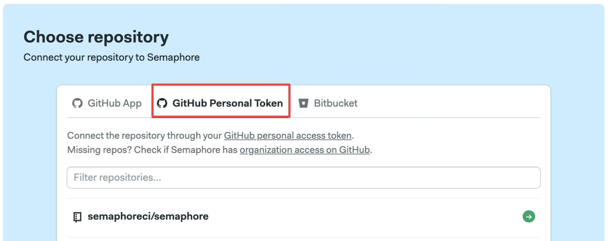
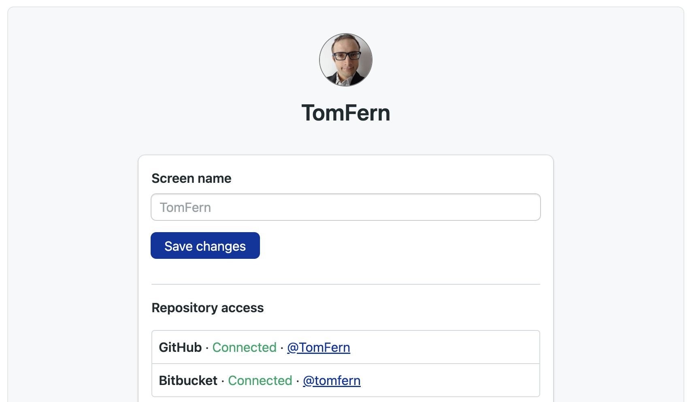

# Connect GitHub

import Tabs from '@theme/Tabs';
import TabItem from '@theme/TabItem';
import Available from '@site/src/components/Available';
import VideoTutorial from '@site/src/components/VideoTutorial';

WIP: https://docs.semaphoreci.com/account-management/connecting-github-and-semaphore/

GitHub users need provide access to Semaphore so it can read their repositories.

## Overview {#overview}

Semaphore supports two types of ways to access your GitHub repositories:

- [OAuth App](https://github.com/settings/connections/applications/328c742132e5407abd7d): also known as *personal access token*, this connection is provides Single-Sign On (SSO) access to your Semaphore account. It is established during the Semaphore [account creation process](../getting-started/guided-tour).
- [GitHub App](https://github.com/apps/semaphore-ci-cd): an optional type of connection providing additional features such as fine-grained control and per-repository permissions.

You can create and revoke access both types of connections at any time. Each one has its own sets of tradeoffs.

## OAuth vs GitHub app {#oauth-vs-app}

The **OAuth App** authorizes Semaphore to impersonate your GitHub account using a personal access token. This means you need to have admin-level access in the GitHub repository to connect it with Semaphore.

In addition, with OAuth you can't control access on a per-repository level. Instead, you can only grant or revoke access to repositores based on their visibility, i.e. if they are public or private. It also means that if you delete your GitHub account, Semaphore loses access to all repositories.

The **GitHub App** is installed on a per-organization basis. Before it can be used, the organization owner must install and grant access to the application. Only organization owners can install this app.

Semaphore recommends using the GitHub App whenever possible as it provides two benefits:

- **Granular permissions**: you can grant Semaphore access to individual repositories, giving you control which data Semaphore has access to.
- **No personal tokens**: since it does not rely on a personal access token, you can offboard people from the GitHub organization without the connection with Semaphore.

## How to connect Semaphore with GitHub {#connect}

The connection between Semaphore and GitHub should be configured automatically when you sign up. However, this connection can be severed for different reasons. If you don't see your repositories when trying to create a [project](./projects), follow these steps:

1. Navigate to your [Semaphore account](https://me.semaphoreci.com/account)
2. Click on **Grant public access** or **Grant private access** to grant access to only public or all of your repositories on GitHub
    
3. Press **Authorize semaphoreci**
    

The possible connection status are:

- **Not Connected**: the account is not connected. Log out and back in to Semaphore to grant access to your GitHub account
- **Email only**: Semaphore is connected to your repositories [via the GitHub App](#ghapp) only. The OAuth App has not been authorized
- **Public repositories**: Semaphore can connect to all your public repositories [via OAuth App](#oauth)
- **Connected**: Semaphore can connect to all your public and private repositories [via OAuth App](#oauth)

If your GitHub account is fully disconnected, log out of Semaphore and try to log in again. You will be prompted to give Semaphore access to GitHub.

## How connect to repositories via OAuth {#oauth}

To connect a GitHub repository with Semaphore usingOAuth, you must have admin access to the GitHub repository.

To create a connection using OAuth, follow this steps:

1. Create a [new project](./projects#create-a-project)
2. Select the **GitHub Personal Token** tab
   
3. Choose **Public repositories** or **All repositories**
   
4. Select a repository from the list and finish the [project setup](./projects)

You can only use this method on repositories you have admin-level access (unavailable repositories are greyed out).

:::note

Depending on the GitHub organization settings, its owner may need to [authorize OAuth App](https://docs.github.com/en/apps/oauth-apps/building-oauth-apps/authorizing-oauth-apps) within the organization.

If you have given full access to Semaphore but you only see your personal repositories, it might mean that the GitHub organization's owner hasn't granted Semaphore access to the organization yet.

:::

## How connect to repositories via GitHub App {#ghapp}

To connect a repository via the GitHub App, you must:

- Have collaborator access to the repository
- Have [authorized the GitHub App](https://docs.github.com/en/apps/using-github-apps/authorizing-github-apps) in the organization that the repository belongs to
- Have granted repository read access to the GitHub App

To create a connection using [GitHub App](https://github.com/apps/semaphore-ci-cd), follow this steps:

1. Create a [new project](./projects#create-a-project)
2. Select the **GitHub App** tab
   
3. Press **Give access to more repositories**
   
4. Select **All repositories** or pick individual repositories
5. Select a repository from the list and finish the [project setup](./projects)

:::note

You might not be able to install the GitHub App if you are not the GitHub organization owner. In this case, following these steps sends an installation request to the organization's owner. You cannot proceed until the owner authorizes the access.

:::

## How to transfer projects from OAuth to GitHub App {#transfer}

Projects [connected via the OAuth App](#oauth) can be transferred to the [GitHub App](#ghapp) at any time. You need to have installed the GitHub App into your organization before the transfer can take place.

To transfer projects, follow these steps:

1. Open the Semaphore [project](./projects) you want to transfer
2. Go to [Project Settings](./projects#settings) and select **Repository**
3. Press the button **Switch to GitHub App**
   

If the project was transferred successfully, you should get a message that says **Project connection type switched to GitHub app**.


Go to Project Settings and select Repository Settings.
If your project is using a personal token to connect to the repository, you will see the following screen:

## Troubleshotting guide

If your repositories aren't showing in Semaphore or changes are not triggering new workflows, check the connection between GitHub and Semaphore.

1. Navigate to your [Semaphore account](https://me.semaphoreci.com/account)
2. Read the status next to GitHub
    
3. If the status is disconnected, click on **Grant public access** or **Grant private access**

You can check and change the permissions of your OAuth App connection in the [Semaphore OAuth page](https://github.com/settings/connections/applications/328c742132e5407abd7d).

### Verify deploy key health

Semaphores generates a [deploy key](https://docs.github.com/en/authentication/connecting-to-github-with-ssh/managing-deploy-keys) when a [project](./projects) is created. This means there is a deploy key per repository connected to Semaphore.

When a deploy key is broken or invalid, Semaphore shows the following error message:

```text
git@github.com: Permission denied (publickey).
fatal: Could not read from remote repository.
```
To verify the status of a deploy key:

1. Open your [project settings](./projects#settings)
2. If there isn't a green check next to **Deploy Key**, the key is invalid
    

To deploy a new key, click on **Regenerate**

:::info

A deploy key can be invalidated if:

- it was manually removed from the repository
- access via OAuth or GitHub App was revoked
- the repository original owner no longer has access to it (only for projects added [via OAuth](#oauth))

:::

### Verify webhook health

Semaphore uses a webhook to detect changes in you repository. When the webhook is broken, Semaphore can'y trigger new workflows.

To verify the status of a webhook:

1. Open your [project settings](./projects#settings)
2. If there isn't a green check next to **Deploy Key**, the key is invalid
    

To fix the broken webhook, click on **Regenerate**. This should generate a new webhook and repair the connection between Semaphore and GitHub.

### Reconnecting moved or renamed projects

There are several actions that can brake the connection between GitHub and Semaphore. For example:

- moving the repository to a different location
- renaming the repository
- renaming the GitHub user account
- renaming the GitHub organization

When this happens, you must update the URL of the repository in Semaphore. To do this:

1. Open your [project settings](./projects#settings)
2. Type the new repository URL
3. Press **Change**
    

After changing the URL, double check the status of the [deploy key](#deploy-key) and the [webhook](#webhook).

## See also

- [Projects](./projects)
- [Getting Started Guide](../getting-started/guided-tour)
- [Semaphore Organizations](./organizations)

