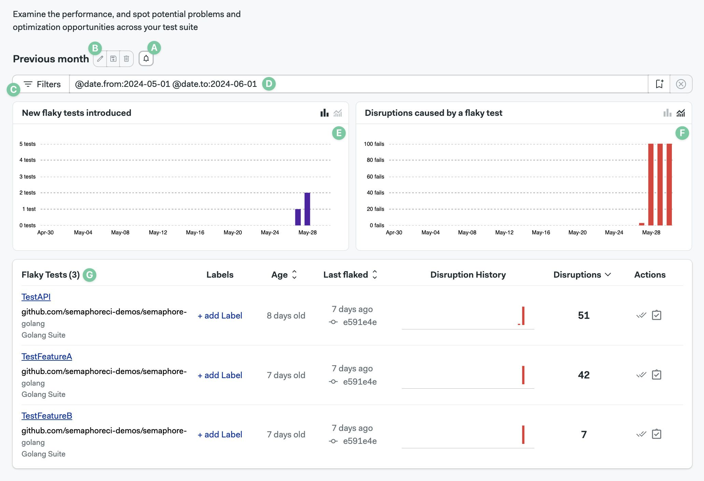

# Flaky Tests

import Tabs from '@theme/Tabs';
import TabItem from '@theme/TabItem';

The flaky test dashboard shows unreliable tests in your [project](./projects). This page explains how they work and how to interpret the flaky test dashboard.

## Overview {#overview}

The flaky test tab helps you find flaky tests in your suite. Flaky tests are tests that fail seemingly random without any obvious cause. Identify flaky tests to improve the reliability of your pipeline.

What is the definition of flaky tests?

A test is considered flaky when one of these conditions happen:

- The test produces different results for the same Git commit
- A passing test that begins to behave unreliably once merged into a branch

## How to set up flaky detection {#setup}

Flaky test detection is automatically enabled once [test reports](./test-reports) are configured. No additional steps are needed to set up flaky tests.

:::note 

It may take a few pipeline runs before flaky tests begin to appear in the flaky test tab

:::

## How to view flaky tests {#view}

Open your [project](./projects) on Semaphore and go to the **Flaky tests** tab.

The dashboard shows:

- A. Create notification button
- B. Edit filters buttons
- C. Saved filters
- D. The current filter
- E. New flaky tests found in the filtered view
- F. Flaky test disruptions by date in the filtered view
- G. The list of flaky tests

## Charts {#charts}

TODO: zoom in charts

The "New flaky tests" chart defaults to displaying data in a daily overview. However, you can opt for a cumulative view by clicking the "Cumulative overview" button located on the top right-hand side of the chart.

The "Disruptions caused by a flaky test" chart presents data in a cumulative overview by default. If you prefer a daily overview, you can select this option by clicking the "Daily overview" button at the top right-hand side of the chart

## Filtering the view {#filters}

You can define, edit, and save filters to view the flaky test data in different ways.

### How to create a filter {#create-filters}

To create a filter, type the [filter key](#filter-key) in the filter box and press Enter/Return. The view will reload with the new data.

Once you have filter key you like, you can save it by:

1. Pressing the Create new filter button
2. Typing your filter name
3. Pressing **Save**

### Filter keys {#filter-keys}

You can combine multiple filter keys to create a filter that suits your needs. The available filter keys are:

| Filter key        | Filter Name         | Filter Type         |
| :--------------:  | :-----------------: | :-----------------: | 
| @git.branch       | Git branch          | text                |
| @git.commit_sha   | Git commit sha      | text                |
| @test.name        | Test name           | text                |
| @test.group       | Group that the test is assigned to | text |
| @test.file        | Test file           | text                |
| @test.class.name  | Name of the test class | text             |
| @test.suite       | Name of the test suite | text             |
| @test.runner      | Name of the test runner | text            |
| @metric.age       | Time passed (days) since first flake | numeric |
| @metric.pass_rate | Pass rate of a test | numeric             |
| @metric.disruptions | Number of disruptions of a test | numeric |
| @label            | Assigned label of the test | text           |
| @is.resolved      | Filter by resolved or unresolved tests | boolean |
| @is.scheduled     | Filter by scheduled or unscheduled tests | boolean |
| @date.from        | Starting date range   | text             | 
| @date.to          | End of filtering range | text        | 

### Text filter keys {#text}

Text filters allow you to specify values using alphanumeric characters. Wildcards (`*` or `%`) can be used to match patterns.

Examples include:

- Test name: `@test.name:"TestAPI"`
- Git branch: `@git.branch:main`
- Test runner: `@test.runner:"golang"`
- [labels](#labels): `@label:"new"`

The `@date.from` and `@date.to` are special cases of text keys. This keys accept:

- Values in ISO date format: `YYYY-MM-DD`
- Values from now: `now-30d` or `now-10d`

### Numeric filter keys {#numeric}

Numeric keys allow you to filter based on numerical values. 

Numeric keys accept:

- Greater than (`>`)
- Less than (`<`)
- Equal to (`=`)
- Not equal to (`!=`)
- Greater than or equal to (`>=`)
- Less than or equal to (`<=`)

Examples include:

- Test age: `@metric.age:<10` shows tests less than 10 days old
- Distruptions: `@metric.disruptions:>30` show tests with more than 30 disruptions
- Pass rate: `@metric.pass_rate:>20` shows tests with greater than 20% pass rate

### Boolean filter keys {#boolean}

Boolean keys accept `true` or `false`. 

Examples of binary filter keys are:

- Tests not [marked as resolved](#actions): `@is.resolved:false`
- Test without [associated tickets](#actions): `@is.scheduled:false`

## Taking actions on tests {#actions}

You have several actions you can take on a flaky test. For instance, you can attach a label to assign a team or team member to fix the test in question. Additionally, you can mark a flaky test as resolved or mark it as unresolved if it was previously marked as resolved. Another option is to link a ticket to the flaky test, providing the ability to filter by scheduled status.

Marking as resolved/unresolved#
To mark a flaky test as resolved or unresolved, locate the flaky test and click the first button (Mark as resolved) in the actions column.

Linking to a ticket#
To add a ticket link to your flaky test, start by locating the flaky test. In the actions column, click on the second button (Create a ticket for this test). Finally, copy the flaky test information in markdown and save the link after creating the ticket.

If needed, you can unlink an existing ticket by clicking the "Unlink" option.

Labels#
To add labels, click the "+ add label" button, give the label a name, and click "OK". Keep in mind that you can only add 3 labels to any given test.

## Charts {#charts}

### Detailed view {#details}

## Notifications {#notifications}

