# Project Insights

import Tabs from '@theme/Tabs';
import TabItem from '@theme/TabItem';
import Available from '@site/src/components/Available';
import VideoTutorial from '@site/src/components/VideoTutorial';
import Steps from '@site/src/components/Steps';

<VideoTutorial title="How to use Project Insights" src="https://www.youtube.com/embed/LKEy2ow7Shw?si=FaMnvO6lU2ZV5c3R" />

Project Insights provides productivity metrics about your [CI pipelines](./pipelines). You can, for instance, how long your pipelines take on average or create a dashboard to track deployment activity.

## How to view project insights {#view}

Project Insights are available in the **Insights** tab on your [project](./projects). Data is loaded automatically from your CI workflow activity, however, you can [configure Insights](#configure) to ensure you're seeing the data accurately.

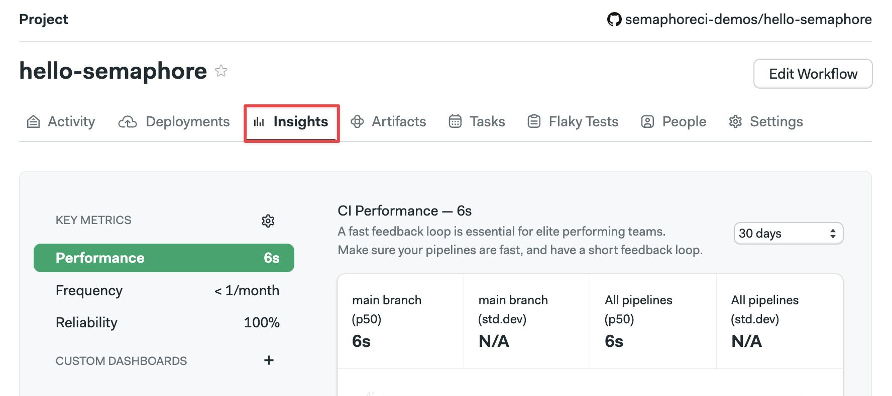

You can select which [metric to view](#metrics) using the left-side menu. 

On the right side, you can change the date range for the data shown.

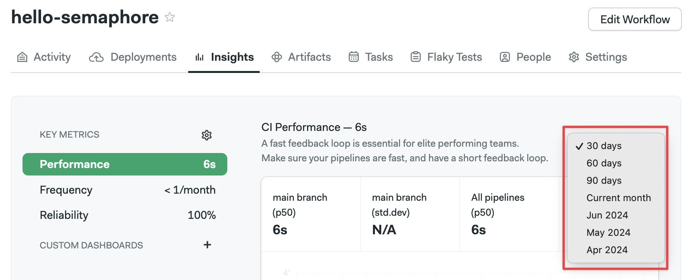

### How to configure insights {#configure}

Semaphore tries to guess which is the main branch in your project. However, to be sure the metrics are shown accurately, it's recommended to configure the branch and [pipeline file](./pipelines#overview) in the settings menu.

The Project Insights settings are split into two sections:

- **Continuous Integration**: this is your project's main pipeline. It should build and run your tests
- **Continuous Deployment**: optional. This pipeline deploys your application to production

Follow the steps below to set up Project Insights:

<Steps>

1. Open the **Insights** tab
2. Click on the Gear Icon on the left side
3. Set the main branch name for your project in the **Continuous Integration** and **Continuous Deployment** sections
4. Set the name of the pipeline file in the **Continuous Integration** and **Continuous Deployment** sections
5. Press **Save Changes**

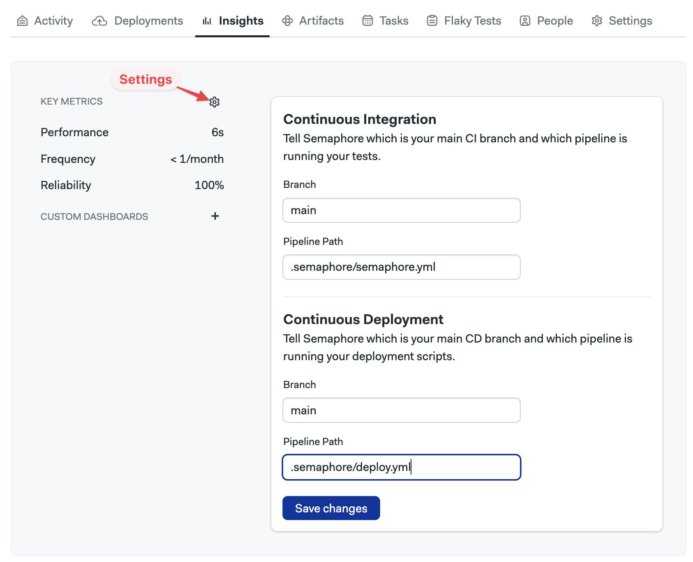

</Steps>

:::note

The pipeline file path should be relative to the repository's root.

:::

After you save changes, Semaphore will start collecting metrics for Project Insights.

## Metrics available {#metrics}

The available metrics are performance, frequency, and reliability. Each metric shows the data for Continuous Integration and Continuous Deployment. You can also create [custom dashboards](#custom) to refine your views.

Metrics data is held for 30 days and updated every 24 hours.

### Performance

Performance metrics show how long pipelines take to run on average. The graph shows the median time (p50) and the standard deviation.

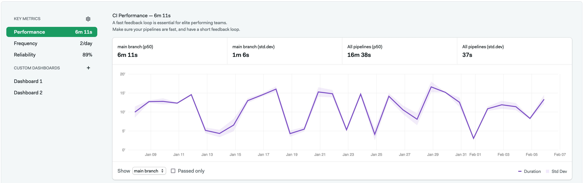

Below the Continuous Integration graph, you can select which branch to view.

If you have [configured Continuous Deployment insights](#configure), you can also see data for the deployment branch. 

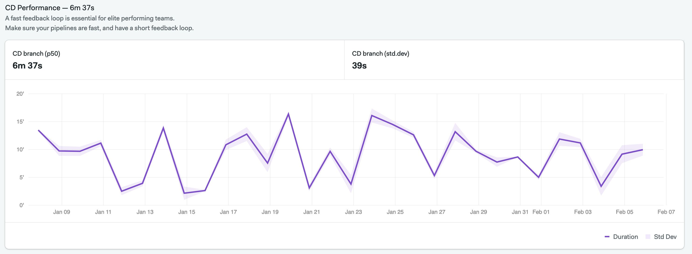

### Frequency

Frequency metrics show the number of pipelines run per week and the total number of runs for all pipelines per day.

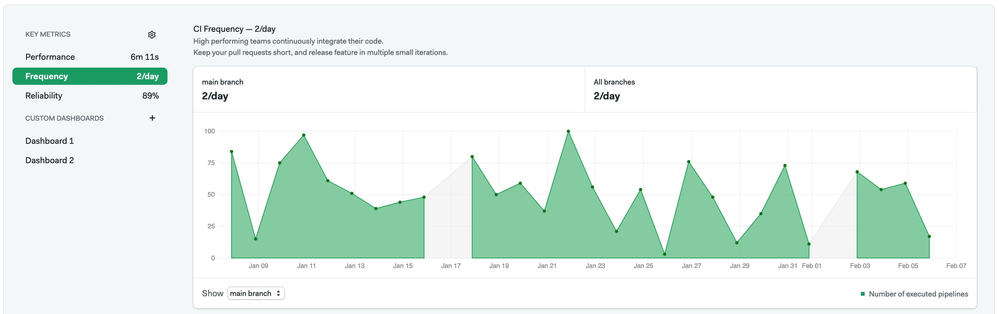

Below the Continuous Integration graph, you can select which branch to view.

If you have [configured Continuous Deployment insights](#configure), you can also see data for the deployment branch. 

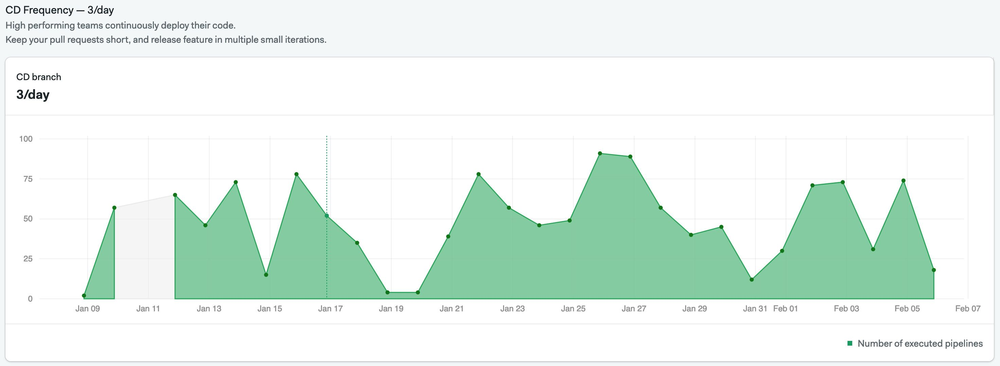

### Reliability

Reliability metrics provide an overview of the pipeline pass rate. In other words, it tells you how frequently the pipeline was disrupted by a [job](./jobs) failure. The graph also shows the mean time it takes to recover from a failed pipeline run and when the last successful run was.

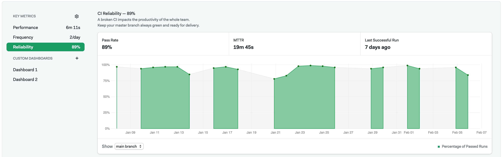

If you have [configured Continuous Deployment insights](#configure), you can also see data for the deployment branch. 

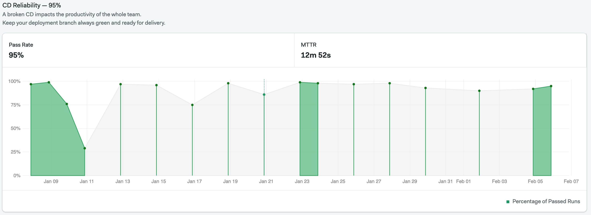

:::note

Although you can specify a branch when creating a reliability metric, the actual branch used is defined under the "Insight" settings in a project.

:::

## How to create custom dashboards {#custom}

Create your own visualization with custom dashboards. You can add any metric already available on the Project Insights page to the dashboard.

To create a Dashboard:

<Steps>

1. Open the Project Insights
2. On the left side, click on the plus sign (+)
3. Enter the name of the dashboard
    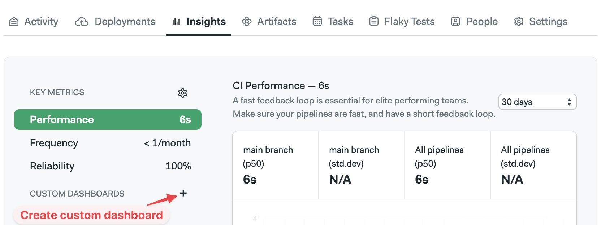
4. Press **Create**

</Steps>

You can also create dashboards using the command line. See [Semaphore Command Line](./../reference/semaphore-cli) and [Dashboard YAML reference](./../reference/dashboard-yaml) for more details.

Once created, you can add metrics to the dashboard following these steps:

<Steps>

1. Open the custom dashboard on the left side
2. Press the **Add metric** button
3. Fill the form:
    - (A) Type the metric name
    - (B) Select the metric type to show from the
    - (C) Type the branch name you want to visualize
    - (D) Type the pipeline file path for the pipeline you want to visualize
    - (E) Type an optional description
4. Press **Save**

    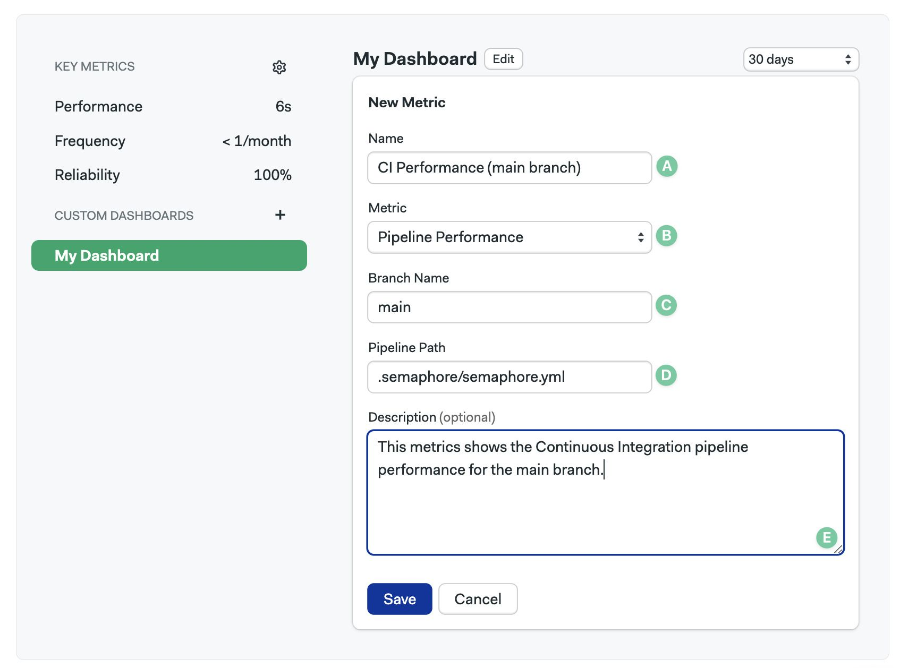

</Steps>

:::note

After you save, a new Metric chart will appear on the Dashboard. It may take up to two days for data to populate the new chart.

:::

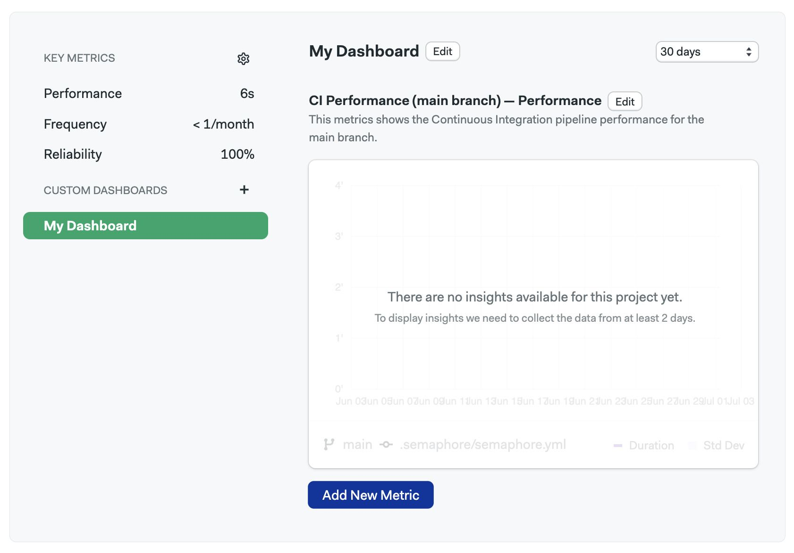

## See also

- [Organization health dashboard](./org-health)
- [Test reports dashboard](./tests/test-reports)
- [Flaky test detection dashboard](./tests/flaky-tests)
- [Dashboards YAML reference](./../reference/dashboard-yaml)