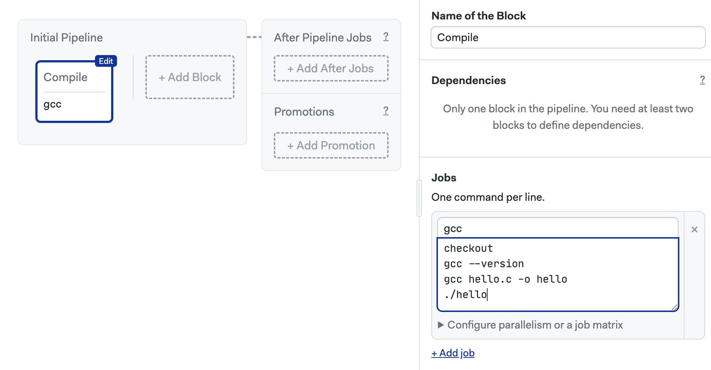
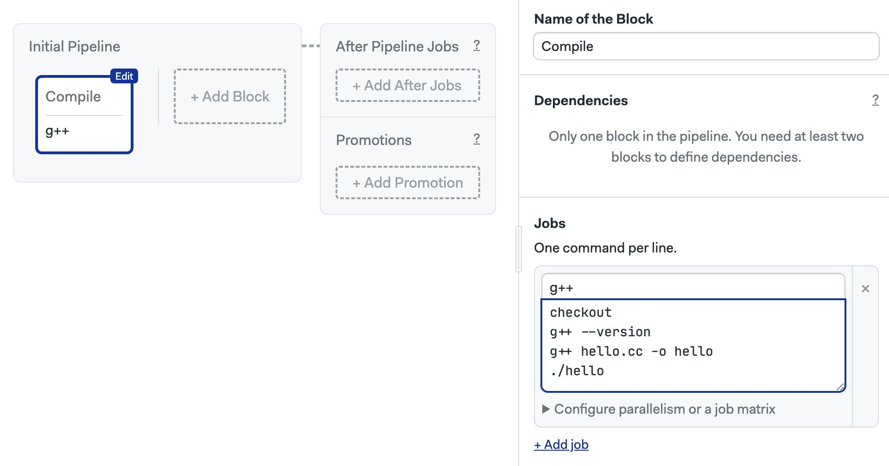

# C and C++

import Tabs from '@theme/Tabs';
import TabItem from '@theme/TabItem';
import Available from '@site/src/components/Available';
import VideoTutorial from '@site/src/components/VideoTutorial';
import Steps from '@site/src/components/Steps';

This guide provides tips and hints for building C and C++ projects.

## Overview

GNU C and C++ compilers are pre-installed in the Semaphore environment. You can switch the active compiler using [sem-version](../../reference/toolbox#sem-version) on Linux machines.

## How to compile C {#compile-c}

The [Ubuntu](../../reference/machine-types#linux) Linux machines ship with the GNU C compiler.

Let's build the following C program in Semaphore:

```c title="hello.c"
#include <stdio.h>

int main() { 
    printf("Hello world"); 
    return 0; 
}
```

<Tabs groupId="editor-yaml">
<TabItem value="editor" label="Editor">

<Steps>

1. Open the pipeline
2. Select one of the Linux Ubuntu machines
3. Use the following commands in the job

    ```shell
    checkout
    gcc --version
    gcc hello.c -o hello
    ./hello
    ```
    

4. Press **Run the workflow**

</Steps>

</TabItem>
<TabItem value="yaml" label="YAML">

<Steps>

1. Open the pipeline file
2. Select one of the Linux Ubuntu agents
3. Add a job to compile the source code with gcc
4. Save and push the pipeline file to the repository

```yaml
version: v1.0
name: Initial Pipeline
agent:
  machine:
    type: e1-standard-2
    os_image: ubuntu2004
blocks:
  - name: Compile
    dependencies: []
    task:
      jobs:
        - name: gcc
          commands:
          # highlight-start
            - checkout
            - gcc --version
            - gcc hello.c -o hello
            - ./hello
          # highlight-end
```

</Steps>

</TabItem>
</Tabs>

See [artifacts](../artifacts) to learn how to save and persist the built binary.

### How to change gcc version {#gcc-version}

Use [sem-version](../../reference/toolbox#sem-version) to switch between gcc compiler versions on Linux. Changing gcc compilers on macOS is not supported.

```shell
# use gcc 10.5
sem-version c 10
$ gcc --version
gcc (Ubuntu 10.5.0-1ubuntu1~20.04) 10.5.0

# use gcc 9.4
sem-version c 9
$ gcc --version
gcc (Ubuntu 9.4.0-1ubuntu1~20.04.2) 9.4.0
```


### Using Docker containers {#containers}

The `sem-version` tool does not work on Docker containers. If the compiler you need is not shipped in the Semaphore Linux or macOS image, you must build a Docker image and run jobs using [Docker environments](../../using-semaphore/pipelines#docker-environments).

Semaphore does not provide pre-built C and C++ Docker images. Find Dockerfiles to build your custom images in the [semaphoreci/docker-images](https://github.com/semaphoreci/docker-images) repository.

## How to compile C++ {#cpp}

The [Ubuntu](../../reference/machine-types#linux) Linux machines ship with the GNU C++ compiler.

Let's build the following C++ program in Semaphore:

```c title="hello.cc"
#include <iostream>

int main() { 
    std::cout << "Hello world"; 
    return 0; 
}
```

<Tabs groupId="editor-yaml">
<TabItem value="editor" label="Editor">

<Steps>

1. Open the pipeline
2. Select one of the Linux Ubuntu machines
3. Use the following commands in the job

    ```shell
    checkout
    g++ --version
    g++ hello.cc -o hello
    ./hello
    ```
    

4. Press **Run the workflow**

</Steps>

</TabItem>
<TabItem value="yaml" label="YAML">

<Steps>

1. Open the pipeline file
2. Select one of the Linux Ubuntu agents
3. Add a job to compile the source code with gcc
4. Save and push the pipeline file to the repository

```yaml
version: v1.0
name: Initial Pipeline
agent:
  machine:
    type: e1-standard-2
    os_image: ubuntu2004
blocks:
  - name: Compile
    dependencies: []
    task:
      jobs:
        - name: g++
          commands:
          # highlight-start
            - checkout
            - g++ --version
            - g++ hello.cc -o hello
            - ./hello
          # highlight-end
```

</Steps>

</TabItem>
</Tabs>

See [artifacts](../artifacts) to learn how to save and persist the built binary.

### How to change the g++ version {#gcc-version}

Use [sem-version](../../reference/toolbox#sem-version) to switch between g++ compiler versions on Linux. Changing gcc compilers on macOS is not supported..

```shell
# use gcc 10.5
sem-version cpp 10
$ g++ --version
g++ (Ubuntu 10.5.0-1ubuntu1~20.04) 10.5.0

# use gcc 9.4
sem-version cpp 9
$ g++ --version
g++ (Ubuntu 9.4.0-1ubuntu1~20.04.2) 9.4.0
```
