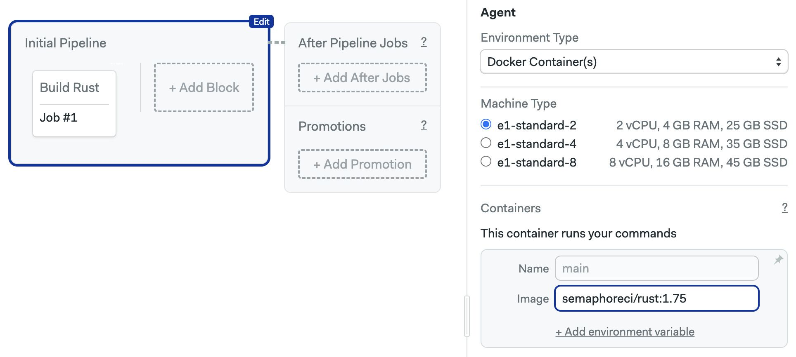

# Rust

import Tabs from '@theme/Tabs';
import TabItem from '@theme/TabItem';
import Available from '@site/src/components/Available';
import VideoTutorial from '@site/src/components/VideoTutorial';
import Steps from '@site/src/components/Steps';

This guide provides tips and hints for building Rust projects.

## Overview

Rust is not preinstalled on Linux Semaphore environments. You must use [Docker Environments](../../using-semaphore/pipelines#docker-environments) to build and test Rust projects.

## How to compile Rust code {#compile}

You may use one of the pre-built [Rust images](../../using-semaphore/optimization/container-registry#rust) to run the jobs in a Docker-based environment.

<Steps>

1. Open the workflow editor
2. Select the pipeline
3. Select **Docker Containers** in the **Environment Type**
4. Select one of the available machines
5. Type the name of a [Rust image](../../using-semaphore/optimization/container-registry#rust), e.g. `semaphoreci/rust:1.75`

    

6. Configure your jobs, for example

    ```shell
    checkout
    rustc main.rs
    ./main
    ```

7. Press **Run the workflow**

</Steps>


Find Dockerfiles to build your custom Rust images in the [semaphoreci/docker-images](https://github.com/semaphoreci/docker-images) repository.
