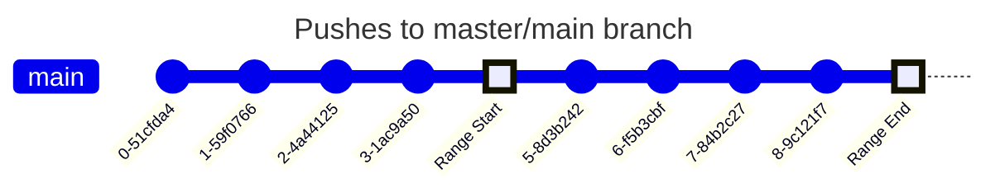
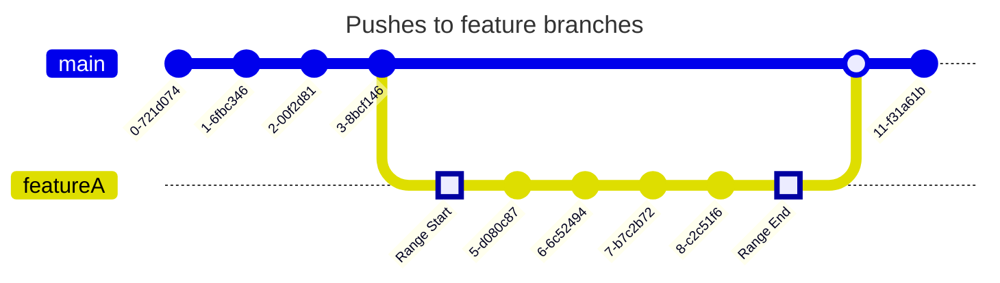
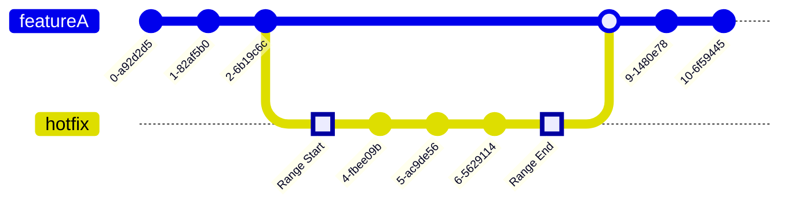
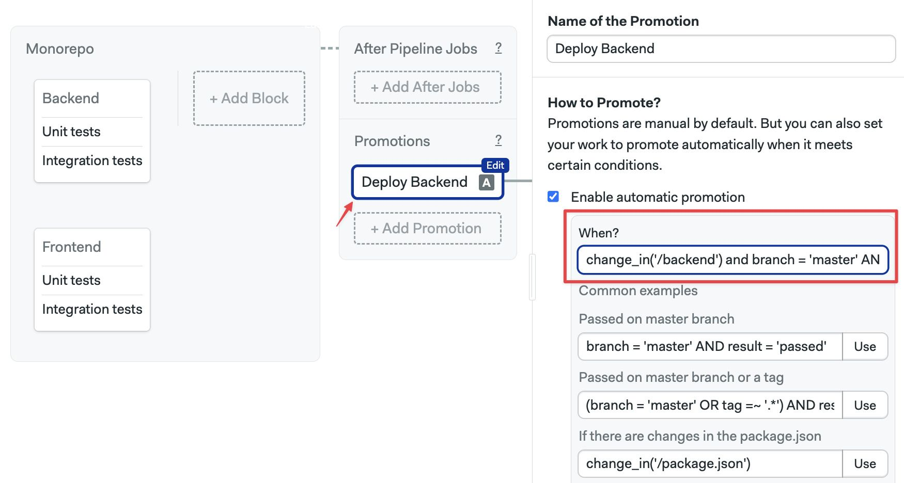
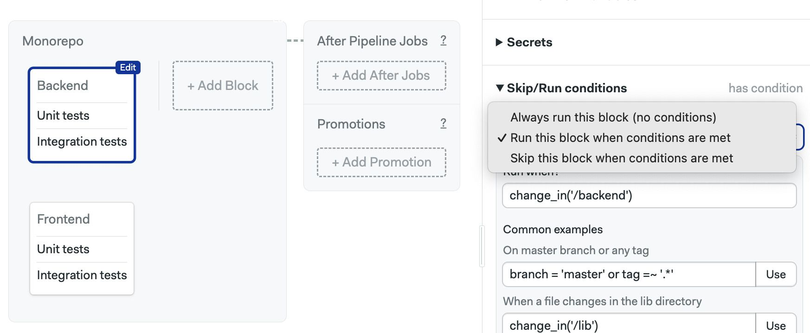
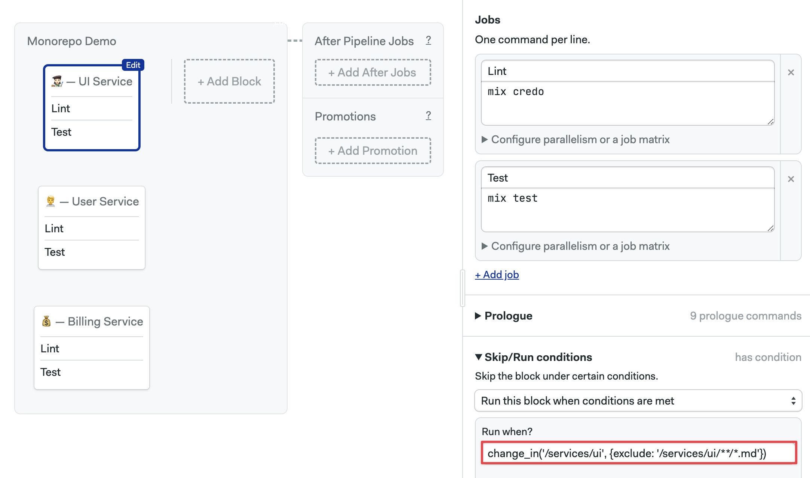

# Monorepos

import Tabs from '@theme/Tabs';
import TabItem from '@theme/TabItem';
import Available from '@site/src/components/Available';
import VideoTutorial from '@site/src/components/VideoTutorial';
import Steps from '@site/src/components/Steps';

<VideoTutorial title="How to use monorepos on Semaphore" src="https://www.youtube.com/embed/DPsQg215Efo?si=UheVJSwMZvuOn7O7" />

Semaphore features a repository change detection strategy to optimize monorepo pipelines. This page explains how to configure monorepo pipelines to reduce time and costs.

## Overview

A [monorepo](https://semaphoreci.com/blog/what-is-monorepo) is a repository that holds many projects. While these projects may be related, they are often logically independent, uncoupled, and sometimes even managed by different teams.

Semaphore can detect changes between commits, allowing you to set up fine-grained jobs that only run when the underlying code changes. Skipping jobs covering unchanged code can greatly speed testing and reduce costs on big codebases.

:::note 

The `change_in` expressions are evaluated in the [pipeline initialization job](./pipelines#init-job).

:::

## Change detection strategies {#strategies}

When change detection is enabled, Semaphore considers two variables to decide which jobs to run: a user-supplied glob pattern and a commit range. If one or more of the commits in the range changed at least one file matching the pattern, the job runs. Otherwise, it is skipped.

The default commit range used depends on a few conditions.

For pushes on the default branch (also known as trunk, i.e. master branch) the commit ranges between the first and the last commit in the push that triggered the workflow.



For pushed in feature branches the commit range starts on the common ancestor with the trunk and ends at the head of the pushed branch.



For pull requests the commit range starts at the common ancestor between the branches and the head of the pushed branch.



In addition, these conditions force the job to run even if no files were changed:

- [Pipeline changes](./pipelines#overview): if the pipeline YAML changes, all jobs run by default. This can be [disabled](#condition)
- **Pushed tags**: all jobs run by default in the push include Git tags. This can be [disabled](#condition)

:::note

Semaphore defaults to **master** as the main/trunk branch name. You can change this value, for example to **main**, in the [config](#condition).

:::

## How to use change detection? {#why}

Let's say we have a repository with two components: frontend and backend. Let us assume that the two codebases are related but can be built and tested separately. We could set up a pipeline like this:


The downside of this strategy is that it will run all jobs even for commits that only affected one of the codebases. In other words, if we make a change on the backend, both the frontend and backend jobs will run every time. This can be a problem for projects consisting of hundreds of components. Think of a project that contains a web app, mobile apps for several platforms, and a backend API service.

We can speed up the pipeline by only running enabling change detection. For example, to run the frontend job only a file in the `/frontend` folder has changed.

:::note

While change detection is mainly geared toward monorepo projects. Nothing is preventing you from using these conditions on regular repositories. You can, for example, use this feature to control when to run long test suites based on what files have recently changed.

:::

### Change detection in jobs {#jobs}

To enable change detection, follow these steps.

<Tabs groupId="editor-yaml">
<TabItem value="editor" label="Editor">


<Steps>

1. Open the **Workflow Editor** for your Semaphore project
2. Select the block
3. Open the **Skip/run conditions** on the right side
4. Select **Run this block when conditions are met**
5. In the **When?** field type the [change condition](#condition), e.g. `change_in("/frontend", {default_branch: "main"})`

  

</Steps>

Repeat the procedure for the rest of the blocks. For example, for the Backend block, we could use the condition `change_in("/backend", {default_branch: "main"})`

Press **Run the workflow** > **Start** to save your changes and run the pipeline.

Conditions are ignored by default when you change the pipeline file. So, the very next run executes all blocks. Subsequent pushes should respect your change detection conditions.

</TabItem>
<TabItem value="yaml" label="YAML">

<Steps>

1. Open your pipeline YAML file
2. Locate the block you wish to add change conditions to
3. Add `run.when` under the block
4. Type the [change condition](#condition), e.g. `change_in("/frontend", {default_branch: "main"})`
5. Repeat the process for the other blocks that need conditions
6. Push the pipeline file to the remote repository 

</Steps>

Conditions are ignored by default when you change the pipeline file. So, the very next run executes all blocks. Subsequent pushes should respect your change detection conditions.

```yaml title="Change conditions"
version: v1.0
name: Monorepo
agent:
  machine:
    type: e1-standard-2
    os_image: ubuntu2004
global_job_config:
  prologue:
    commands:
      - export SAMPLE_ENV_VAR=123abc
      - checkout
blocks:
  - name: Backend
    dependencies: []
    task:
      jobs:
        - name: Unit tests
          commands:
            - 'checkout'
            - 'npm install'
            - 'npm run test'
        - name: Integration tests
          commands:
            - 'checkout'
            - 'npm install'
            - 'npm run test:integration'
    # highlight-start
    run:
      when: 'change_in("/frontend", {default_branch: "main"})'
    # highlight-end
  - name: Frontend
    dependencies: []
    task:
      jobs:
        - name: Unit tests
          commands:
            - 'checkout'
            - 'npm install'
            - 'npm run test'
        - name: Integration tests
          commands:
            - 'checkout'
            - 'npm install'
            - 'npm run test:integration'
    # highlight-start
    run:
      when: 'change_in("/backend", {default_branch: "main"})'
    # highlight-end
```

</TabItem>
</Tabs>

:::note

All paths are relative to the root of the repository.

:::

### Change detection in promotions {#promotions}

You can use change detection in [promotions](./pipelines#connecting-pipelines). This is useful when you have continuous delivery or deployment pipelines that only need to run when certain folders or files in your project change.

With change detection, you can set up smarter deployment pipelines. Imagine you have web and mobile apps in the same repository. The process for deploying each component is different: for a web app you might use a [Docker container](./optimization/docker), the Android app is deployed to the Google Store, while the iOS version goes to Apple.

With change detection on promotions, you can activate the correct deployment pipeline based on what component has changed in the last push.

To activate change detection on promotions, follow these steps:

<Steps>

1. Open the **Workflow Editor** for your Semaphore project
2. Create or select the [promotion](./pipelines#connecting-pipelines)
3. Check the option **Enable automatic promotion**
4. Type the [change condition](#condition), e.g. `branch = "main" AND result = "passed" AND change_in("/backend", {default_branch: "main"})`

  

</Steps>

Repeat the procedure for the rest of the promotions. For example, for the Frontend block, we could use the condition `change_in("/frontend", {default_branch: "main"}) and branch = "main" AND result = "passed"`

<Tabs groupId="editor-yaml">
<TabItem value="editor" label="Editor">
</TabItem>
<TabItem value="yaml" label="YAML">

To use change detection, follow these steps:

<Steps>

1. Open your pipeline YAML file
2. Locate or create the [promotion block](./pipelines#connecting-pipelines) you wish to add conditions to
3. Add `auto_promote.when` under the block
4. Type the [change condition](#condition), e.g. `change_in("/frontend", {default_branch: "main"})`
5. Repeat the process for the other promotions that need conditions
6. Push the pipeline file to the remote repository 

</Steps>

```yaml title="Change conditions for promotions"
version: v1.0
name: Monorepo
agent:
  machine:
    type: e1-standard-2
    os_image: ubuntu2004
blocks:
  - name: Backend
    dependencies: []
    task:
      jobs:
        - name: Unit tests
          commands:
            - 'checkout'
            - 'npm install'
            - 'npm run test'
        - name: Integration tests
          commands:
            - 'checkout'
            - 'npm install'
            - 'npm run test:integration'
    run:
      when: 'change_in("/frontend", {default_branch: "main"})'
  - name: Frontend
    dependencies: []
    task:
      jobs:
        - name: Unit tests
          commands:
            - 'checkout'
            - 'npm install'
            - 'npm run test'
        - name: Integration tests
          commands:
            - 'checkout'
            - 'npm install'
            - 'npm run test:integration'
    run:
      when: 'change_in("/backend", {default_branch: "main"})'
promotions:
  - name: Deploy Backend
    pipeline_file: deploy_backend.yml
    # highlight-start
    auto_promote:
      when: 'change_in("/backend", {default_branch: "main"}) and branch = "main" AND result = "passed"'
    # highlight-end
  - name: Deploy Frontend
    pipeline_file: deploy_frontend.yml
    # highlight-start
    auto_promote:
      when: 'change_in("/frontend", {default_branch: "main"}) and branch = "main" AND result = "passed"'
    # highlight-end
```

</TabItem>
</Tabs>

:::info

Conditions are ignored by default when you change the pipeline file. So, the very next run executes all blocks. Subsequent pushes should respect your change detection conditions.

:::


## Conditions options {#condition}

This section describes the available options for change detection. Note that the conditions are not limited to `change_in`. See the [conditions DSL reference](../reference/conditions-dsl) to view all available conditions.

### Skip vs Run {#skip-run}

<Tabs groupId="editor-yaml">
<TabItem value="editor" label="Editor">

The **Skip/Run** section for blocks has three options available.

- **Always run this block**: disables all conditions, always runs the bloc
- **Run this block when conditions are met**: runs the block when the conditions are true
- **Skip this block when conditions are met**: negated version of the previous option, runs the block when conditions are false



</TabItem>
<TabItem value="yaml" label="YAML">

Using the YAML syntax there are two variants for conditions:

- `run.when`: execute the block when the conditions are true
- `skip.when`: execute the block when the conditions are false

Example with `run.when`:

```yaml title="Using run when conditions"
version: v1.0
name: Monorepo
agent:
  machine:
    type: e1-standard-2
    os_image: ubuntu2004
blocks:
  - name: Backend
    dependencies: []
    task:
      jobs:
        - name: Unit tests
          commands:
            - 'checkout'
            - 'npm install'
            - 'npm run test'
        - name: Integration tests
          commands:
            - 'checkout'
            - 'npm install'
            - 'npm run test:integration'
    # highlight-start
    run:
      when: 'change_in("/backend", {default_branch: "main"})'
    # highlight-end
```

Example showing `skip.when` conditions:

```yaml title="Using skip when conditions"
version: v1.0
name: Monorepo
agent:
  machine:
    type: e1-standard-2
    os_image: ubuntu2004
blocks:
  - name: Backend
    dependencies: []
    task:
      jobs:
        - name: Unit tests
          commands:
            - 'checkout'
            - 'npm install'
            - 'npm run test'
        - name: Integration tests
          commands:
            - 'checkout'
            - 'npm install'
            - 'npm run test:integration'
    # highlight-start
    skip:
      when: 'change_in("/backend", {default_branch: "main"})'
    # highlight-end
```

</TabItem>
</Tabs>

### change_in options {#options}

The full syntax for `change_in` is:

```text
change_in(<glob_pattern>, options)
```

The `options` is an optional hashmap to change the change detection behavior. For example, to change the name of the trunk from master to main:

```text title="Using main instead of master"
change_in("/backend/", {default_branch: "main"})
```
The most common options are:
The supported options are:

| Option | Default | Description |
|--|--|--|
|`on_tags` | `true` | If the value is `true` conditions are not evaluated. The block, job, and promotion always run when a Git tag is pushed |
|`default_branch`| `master` | Changes the name for the trunk branch |
|`pipeline_file` | `track` | If value is `ignore` changes in the pipeline file are ignored. Otherwise, they always cause jobs and promotions to run |
| `exclude` | Empty | A list of globs to exclude from the file matches. Files matching the glob are not taken into account when evaluating changes |

See the [change_in conditions DSL referece](../reference/conditions-dsl#change-in) to view all available options.

### Examples {#examples}

This section shows examples of common change detection scenarios.

```text title="When a directory changes"
change_in("/backend/", {default_branch: "master"})
```

```text title="When a file changes"
change_in("./Gemfile.lock", {default_branch: "master"})
```

```text title="Trunk is main instead of master"
change_in("/backend/", {default_branch: "main"})
```

```text title="Ignoring pipeline file changes"
change_in("/backend/", {pipeline_file: "ignore", default_branch: "main"})
```

```text title="When any file changes, except files in the docs folder"
change_in("/", {exclude: ["/docs"], default_branch: "main"})
```

```text title="Changes in /backend/ folder for branches master or staging"
(branch = "staging" OR branch = "main") and change_in("/backend/", default_branch: "main")
```

```text title="Changes on /backend/ folder for any branch starting with 'hotfix/'"
branch =~ "^hotfix/" and change_in("/backend/", default_branch: "main") 
```

## Demo project {#demo}

This section showcases how to use `change_in` in a workind demo project. 

The project is a microservice application consisting on three components. Each component is located on a separate folder:

- `services/billing`: a billing system written in Go. Provides an HTTP endpoint
- `services/user`: a user account management application. Written in Ruby, it employs an in-memory database and uses Sinatra to expose an HTTP endpoint
- `services/ui`: the Elixir-based Web application component.

The code is located at [semaphoreci-demos/semaphore-demo-monorepo](https://github.com/semaphoreci-demos/semaphore-demo-monorepo)

To run it:

1. Fork the repository
2. Clone the repository to your machine
3. Start it with: `bash start.sh`

### Monorepo pipeline {#demo-pipeline}

The pipeline consists of three blocks. Each block performs the following tests in each of the three components:

- **Lint**: uses a linting tool to detect potential errors in the source code
- **Test**: runs the application's unit tests

The components are uncoupled and self-contained in their own folder. So we use `change_in` to skip the blocks when the underlying code has not changed.

Edit the workflow and view the **Skip/run** section. Each component has different change conditions:

| Component | Change condition |
|--|--|
| Billing | `change_in('/services/billing')` |
| User | `change_in('/services/user')` |
| UI | `change_in('/services/ui')` |

<Tabs groupId="editor-yaml">
<TabItem value="editor" label="Editor">



</TabItem>
<TabItem value="yaml" label="YAML">

```yaml title="Full pipeline"
version: v1.0
name: Monorepo Demo
agent:
  machine:
    type: e1-standard-2
    os_image: ubuntu2004
blocks:
  - name: "UI Service"
    dependencies: []
    run:
      when: 'change_in(''/services/ui'', {exclude: ''/services/ui/**/*.md''})'
    task:
      prologue:
        commands:
          - checkout
          - cd services/ui
          - sem-version elixir 1.9
          - cache restore
          - mix local.hex --force
          - mix local.rebar --force
          - mix deps.get
          - mix deps.compile
          - cache store
      jobs:
        - name: Lint
          commands:
            - mix credo
        - name: Test
          commands:
            - mix test
  - name: "User Service"
    dependencies: []
    run:
      when: 'change_in(''/services/users'', {exclude: ''/services/users/**/*.md''})'
    task:
      prologue:
        commands:
          - checkout
          - cd services/users
          - sem-version ruby 2.5
          - cache restore
          - bundle install
          - cache store
      jobs:
        - name: Lint
          commands:
            - bundle exec rubocop
        - name: Test
          commands:
            - bundle exec ruby test.rb
  - name: "Billing Service"
    dependencies: []
    run:
      when: 'change_in(''/services/billing'', {exclude: ''/services/billing/**/*.md''})'
    task:
      prologue:
        commands:
          - checkout
          - cd services/billing
          - sem-version go 1.14
          - cache restore
          - go get ./...
          - cache store
      jobs:
        - name: Lint
          commands:
            - gofmt -l .
        - name: Test
          commands:
            - go test ./...
```
</TabItem>
</Tabs>


## See also

- [How to create pipelines](./pipelines)
- [How to create jobs](./jobs)
- [change_in DSL reference](../reference/conditions-dsl#change-in)