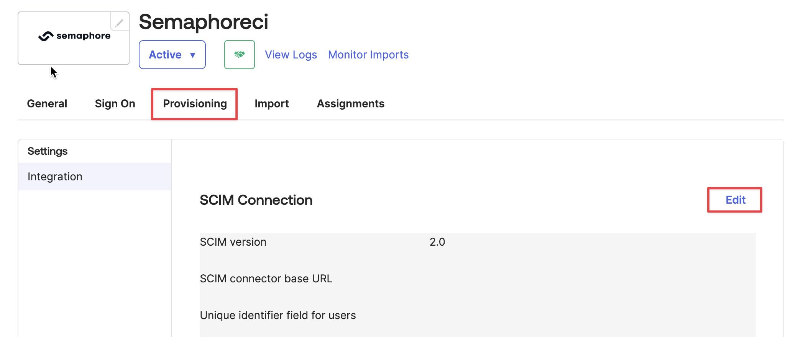
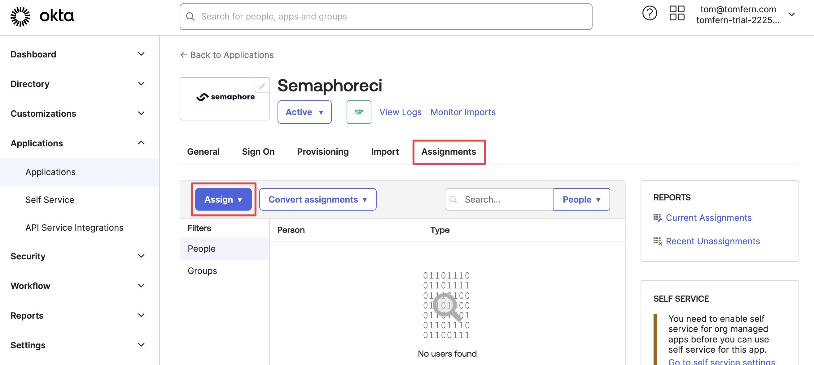
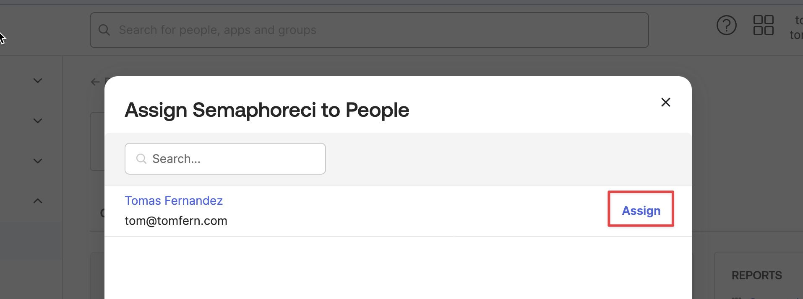
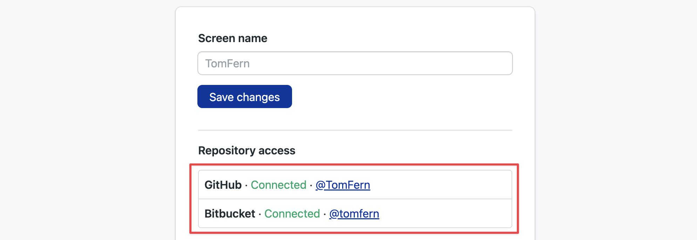

# Okta Integration

import Tabs from '@theme/Tabs';
import TabItem from '@theme/TabItem';
import Available from '@site/src/components/Available';
import VideoTutorial from '@site/src/components/VideoTutorial';
import Steps from '@site/src/components/Steps';

<VideoTutorial title="How to integrate with Okta" src="https://www.youtube.com/embed/2_am8-e0UTc?si=_XEDoQgiEAsnaFCb"/>

Use Okta to provision, manage your user, and provide Single Sign On (SSO) to your users. This page explains how to integrate Okta with Semaphore to manage your users and groups using Okta.

## Overview

<Available plans={['Scaleup']} />

[Okta](https://okta.com) is an enterprise identity management platform. It provides a centralized place to manage your users and groups across different products. You can integrate Okta with Semaphore to manage your users from the Okta application.

It's possible to integrate Semaphore with other SCIM/SAML-based identity providers such as JumpCloud. If that the case, please contact support@semaphoreci.com so we can help you configure the integration.

To use the Okta integration you need the following:

- An Okta organization
- A [Semaphore organization](./organizations)
- Admin access to Okta and Semaphore

:::warning

If you set up and later remove the Okta integration, all the users created during the integration are deleted from Semaphore.

:::

## How to integrate Okta with Semaphore

The process of integrating Okta with Semaphore involves three steps:

1. [Create an Okta app](#create)
2. [Connect Okta app with Semaphore](#token)
3. [Configure user provisioning](#provision)

The set up steps are explained in this section.

### Step 1: Create Okta app {#create}

To create an Okta app integration:

<Steps>

1. Log in to your Okta organization
2. Press the **Admin** button to access the administrator dashboard
3. On the left side, select **Applications** > **Applications**
4. Press **Create App Integration**

    

5. On the next screen, select **SAML 2.0** and press **Next**:

    

    In **General Settings**, fill in the following values and then press **Next**:

    - **App name**: use a descriptive name, e.g. "Semaphore"
    - **App logo**: optional logo image
    - **App visibility**: leave unchecked the option (this is the default)

    

6. On the **Configure SAML** page, fill in the following values and press **Next**:

    - **Single Sign On URL**: this is the [URL of your Semaphore organization](./organizations#general-settings) followed by `/okta/auth`. For example, if your organization URL is `https://my-org.semaphoreci.com`, you must fill in the value `https://my-org.semaphoreci.com/okta/auth`
    - Leave the option **Use this for Recipient URL and Destination URL** checked (default)
    - **Audience URL**: this is the [URL of your Semaphore organization](./organizations#general-settings). For example `https://my-org.semaphoreci.com`
    - **Application username**: choose **Email** from the selection box

    

7. On the **Feedback** page, select **I'm an Okta customer adding an internal app**

    

    You can leave the rest of the settings in their default values. Press **Finish** to complete the setup.

    You should see the new Semaphore application on your Okta applications page.

    

</Steps>

### Step 2: Connect with Semaphore {#token}

The second step is to connect Semaphore with Okta. Before you can do this, you need to copy some values from the Okta application page:

<Steps>

1. Navigate to the Okta Application you created earlier
2. Go to the **Sign On** tab
3. Press **View SAML setup instructions** on the bottom-right corner

    

4. Copy the values shown on the screen. You will need them next.

    

</Steps>

To create the connection between Semaphore and Okta, follow these steps:

<Steps>

1. Log in your Semaphore organization using an admin account
2. Open the organization menu on the top-right corner and select **Settings**
3. Go to **Okta Integration** and press **Set up**
4. Paste the **Single Sign On URL**, **SAML Issuer** and **SAML Certificate** values from the Okta SAML setup instructions

    

5. Once you press **Save**, Semaphore shows your **SCIM Authorization token**. 

    This value is only shown once, so be sure to copy and store it in a safe place as you will need it during the next step.

    

</Steps>

Semaphore is now connected to Okta. You can enable user provisioning in the next step.

### Step 3: Configure user provisioning {#provision}

Before you can manage users from Okta, you need to enable user provisioning in the Okta application.

To enable user management in Okta, open the Okta application you created earlier.

<Steps>

1. Under **General** tab, click on **Edit**.

    

2. Choose **SCIM** as the provisioning option. Press **Save**

    

3. A new tab should have appeared called **Provisioning**. Open that tab and click on **Edit**.

    

4. Fill in the following values:

    - **SCIM connector base URL**: this is your [organization URL](./organizations#general-settings) followed by `/okta/scrim`. For example, if your organization URL is `https://my-org.semaphoreci.com`, the value for this field is `https://my-org.semaphoreci.com/okta/scim`
    - **Unique identifier field for users**: type the string "email"
    - **Supported provisioning actions**: select **Push New Users**, **Push Profile Updates**, and **Push Groups**
    - **Authentication Mode**: select **HTTP Header**
    - **Authorization**: paste the [token that Semaphore showed earlier](#token)

    

5. Press the **Test Configuration** button to test the connection. Press **Save** to save your changes.

    The test connection screen should show green checkmarks next to **Create Users**, **Update User Attributes**, and **Push Groups**

    

</Steps>

The last step is to enable provisioning on Okta. Follow these steps:

<Steps>

1. Select the **Provisioning** tab
2. Click on **Edit**
3. Check **Enable** next to **Create Users**, **Update User Attributes**, and **Deactivate Users**
4. Press **Save**

    

</Steps>

## How to create users and groups in Okta

User creation is not immediate. There can be a few minutes of lag before an added user appears on Semaphore. On big organizations the sync process can take up to one hour.

To create a user or a group in Semaphore using the Okta integration, follow these steps:

<Steps>

1. Go to your Okta organization and enter the admin dashboard
2. Select **Applications** from the left menu
3. Open the Semaphore application
4. Select the **Assignments** tab
5. Press the **Assign** button
6. Select **People** or **Groups** from the selection menu

    

7. Press **Assign** next to the People or Groups you wish to add to Semaphore.

    

</Steps>

You can see the number of connected users in the **Okta integration** settings page in Semaphore.

:::note

Okta can lead to duplicate users when the integration is added on an organization that already had users. To solve the duplicated users, see the [troubleshooting section](#troubleshooting).

:::

## How to use Single Sign On {#sso}

Your users can now log in to Semaphore via Okta Single Sign On (SSO).

The process for SSO login is as follows:

1. The user logs in to Okta
2. The user opens the Semaphore Application in Okta
3. The user is redirected to their Semaphore account

Semaphore asks new users logging in via SSO to [connect their GitHub](./connect-github) or [connect their BitBucket](./connect-bitbucket) accounts. This is an optional step. Users can click on **Connect** to link their BitBucket or GitHub accounts to Semaphore.

## Troubleshooting duplicated users {#troubleshooting}

Semaphore tries to match new users provisioned via SCIM to existing Semaphore users by email address. If the email address associated with the SCIM request matches the email address of existing Semaphore users, the two accounts will be connected, and no new account will be provisioned. Email associated with Semaphore is the primary email from GitHub or BitBucket.

If you are not sure how many organization members have corporate email accounts, or have any other question, feel free to contact our support team at `support@semaphoreci.com` and we will help you update user emails and smoothly integrate our app with your SCIM/SAML provider.

## See also

- [Semaphore organizations](./organizations)
- [How to set up OpenID Connect](./openid.md)
  

