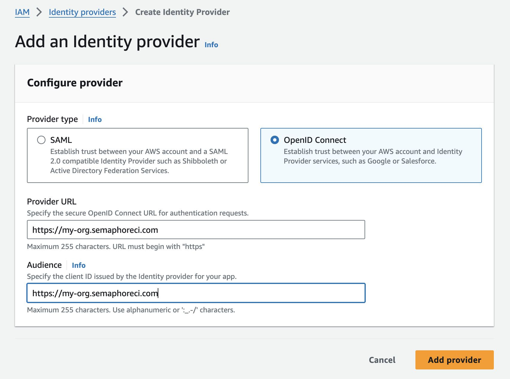
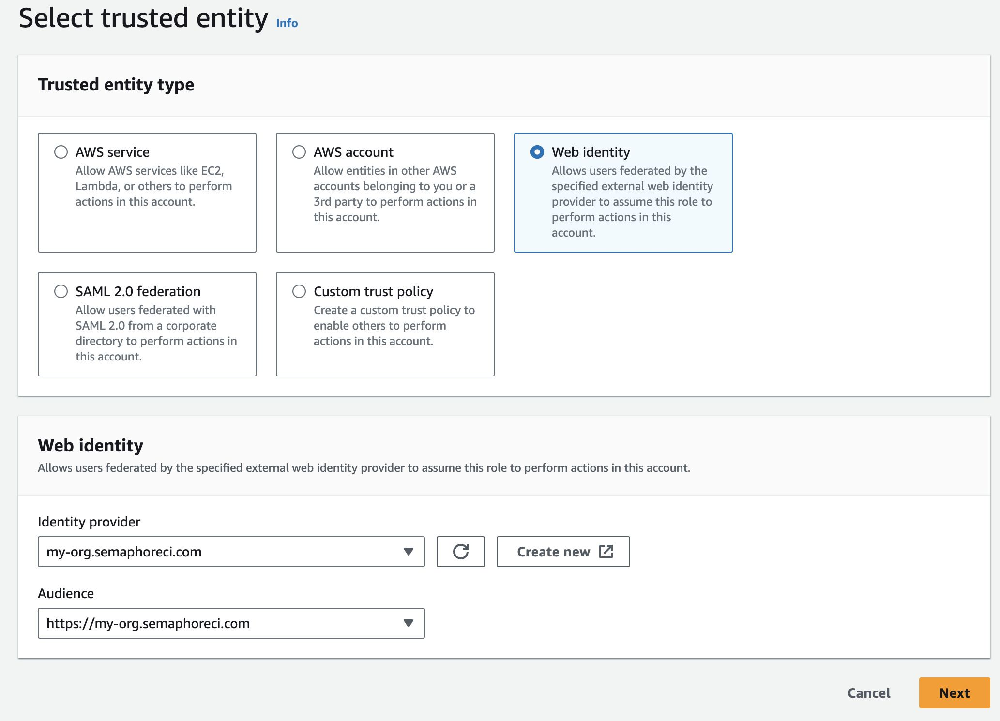

# OpenID Connect

OpenID Connect (OICD) allows you to establish a more secure trust relationship between Semaphore and cloud providers such as AWS or Google Cloud.

import Tabs from '@theme/Tabs';
import TabItem from '@theme/TabItem';
import Available from '@site/src/components/Available';
import VideoTutorial from '@site/src/components/VideoTutorial';

WIP

https://docs.semaphoreci.com/security/open-id-connect/

## Overview

<Available plans={['Scaleup']}/>

Semaphore users traditionally use [secrets](./secrets) to inject credentials or API keys in jobs that need to interact with cloud providers. Every time the CI pipeline needs to deploy an application or fetch resources from a Docker registry or S3 bucket, we need to supply a secret to authorize Semaphrore to access your cloud.

These long-lived credentials present a challenge to maintain security or face exposure to security threats. Access and usage of these secrets needs to be carefully monitored. Secrets need to be regularly rotated and the provided access rights on the cloud should follow the principle of least privilege.

OpenID Connect (OIDC) provides an alternative way to interact with the cloud. Instead of secrets, OIDC uses short-lived access tokens that do not require secret maintanance.

TODO: DIAGRAM

OIDC eliminates the chore of rotating and security secrets related to using cloud vendors for continuous deployment.

## How to configure OpenID Connect

### AWS

To connect to Amazon Web Services (AWS) from Semaphore using OpenID Connect, you will need to perform the following steps:

<details>
<summary>Step 1: Create identity provider</summary>
<div>

1. Log in to the [AWS IAM Console](https://console.aws.amazon.com/iam/)
2. Under **Access management**, select **Identity providers**
3. Press **Add provider**
4. Select **OpenID connect**
5. In **Provider URL** and **Audience** type your [organization URL](./organizations#general-settings). For example: `https://my-org.semaphoreci.com`
6. Press **Add provider**
   


</div>
</details>

<details>
<summary>Step 2: Configure a role and trust policy</summary>
<div>

1. Log in to the [AWS IAM Console](https://console.aws.amazon.com/iam/)
2. Under **Access management**, select **Roles**
3. Press **Create role**
4. Select **Web identity**
5. Under **Identity provider** and **Audience**, select the provider you created in Step 1
6. Press **Next**
7. Choose the permissions you want this role to have. This typically involves selecting a policy that allows access to the AWS resources your pipelines need. For example, if your pipelines need access to S3, you might choose the `AmazonS3FullAccess` policy.
8. Press **Next**
9. Type the **Role name** and an optional description
10. Press **Create role**



Next, edit the trust policy as follows:

1. Select the newly-created Role by name. You may need to use the search box to locate it
2. Select the **Trust relationships** tab
3. Press **Edit trust policy**
4. Edit the `Condition` section (see below for details)
5. Press **Update policy**


The trust policy uses JSON to configure what projects and branches can access the resources assigned to this role. 
    
- Use `StringEquals` to define a specific projects and branches 
- Use `StringLike` to match projects and branches using a pattern
- You can combine `StringEquals` and `StringLike` in the same `Condition`

The following example shows how to grant permissions to:

- organization`my-org` 
- project id `936a5312-a3b8-4921-8b3f-2cec8baac574`
- repository `web`
- branch main

```json title="Assigning trust relationship by exact name"
"Condition": {
    "StringEquals": {
        "my-org.semaphoreci.com:aud": "https://my-org.semaphoreci.com",
        "my-org.semaphoreci.com:sub": "org:my-org:project:936a5312-a3b8-4921-8b3f-2cec8baac574:repo:web:ref_type:branch:ref:refs/heads/main"
    }
}
```

The next example shows how to grant permissions to:

- organization `my-org` 
- project id `936a5312-a3b8-4921-8b3f-2cec8baac574`
- repository `web`
- all branches

```json title="Assigning trust relationship by pattern match"
"Condition": {
    "StringLike": {
        "{org-name}.semaphoreci.com:sub":
        "org:{org-name}:project:936a5312-a3b8-4921-8b3f-2cec8baac574:repo:web:ref_type:branch:ref:refs/heads/*",
    },
}
```

</div>
</details>

<details>
<summary>Step 3: Use OICD in your Semaphore pipelines</summary>
<div>

You can now use OICD to access your AWS resources from any of your pipelines.

In order authenticate with AWS, add these commands to the Semaphore [job](./jobs) that needs access:

```shell "Job commands to authenticate"
export ROLE_ARN="YOUR_AWS_ROLE_NAME"
export SESSION_NAME="semaphore-job-${SEMAPHORE_JOB_ID}"
export CREDENTIALS=$(aws sts assume-role-with-web-identity --role-arn $ROLE_ARN --role-session-name $SESSION_NAME --web-identity-token $SEMAPHORE_OIDC_TOKEN)
export AWS_ACCESS_KEY_ID=$(echo $CREDENTIALS | jq -r '.Credentials.AccessKeyId')
export AWS_SESSION_TOKEN=$(echo $CREDENTIALS | jq -r '.Credentials.SessionToken')
export AWS_SECRET_ACCESS_KEY=$(echo $CREDENTIALS | jq -r '.Credentials.SecretAccessKey')
```

:::note

Replace `YOUR_AWS_ROLE_NAME` with the Role you created in Step 2

:::

</div>
</details>

### Google Cloud

You can use [gcloud](https://cloud.google.com/sdk/gcloud) to set up and configure the connection between Google Cloud and Semaphore. See the [Google Cloud Identity Federation documentation](https://cloud.google.com/iam/docs/configuring-workload-identity-federation#oidc_1) for more details.

To configure OIDC identity provider in GCP, you will perform the following actions:

<details>
<summary>Step 1: Create a new identity pool</summary>
<div>

1. Define a `POOL_ID` name. This a unique name served to identify a Google Cloud IAM pool. For example: `semaphoreci-com-identity-pool`
2. Store the pool in an evironment variable, e.g `semaphoreci-com-identity-pool`

    ```shell title="Define a name for the identity pool"
    export POOL_ID="<unique-pool-name>" 
    ```

3. Create the identify pool

    ```shell title="Create identity pool"
    gcloud iam workload-identity-pools create $POOL_ID \
    --location="global" \
    --description="Semaphore OIDC Pool" \
    --display-name=$POOL_ID
    ```

</div>
</details>


<details>
<summary>Step 2: Configure the mapping and conditions</summary>
<div>

Next, we need to map fields from the Semaphore OIDC provider to Google Cloud attributes and set conditions where Semaphore can access the identity pool. See [attribute mapping](https://cloud.google.com/iam/docs/configuring-workload-identity-federation#mappings-and-conditions) and [condition mapping](https://cloud.google.com/iam/docs/configuring-workload-identity-federation#mappings-and-conditions) to learn more.

1. Define `PROVIDER_ID` with a unique name for the OIDC provider, for example: `semaphoreci-com`. The variable `ISSUER_URI` should contain your [organization URL](./organizations#general-settings), e.g. `https://my-org.semaphoreci.com`

    ```shell title="Define PROVIDER_ID and ISSUER_URI"
    export PROVIDER_ID="<unique-provider-name>"
    export ISSUER_URI="https://my-org.semaphoreci.com"
    ```

2. Use the following template to grant Google Cloud access to the identity pool created in Step 1. 

    Replace:
    - `<REPOSITORY>` with your repository name, e.g. `web`
    - `<BRANCH>` with the branch that can access the cloud resources, e.g. `refs/heads/main`
    - `<PROJECT_NAME>` with your project name on Semaphore

    ```shell title="Grant access to the identity pool"
    gcloud iam workload-identity-pools providers create-oidc $PROVIDER_ID \
    --location="global" \
    --workload-identity-pool=$POOL_ID \
    --issuer-uri="$ISSUER_URI" \
    --allowed-audiences="$ISSUER_URI" \
    --attribute-mapping="google.subject="semaphore::<REPOSITORY>::<BRANCH>" \
    --attribute-condition="'semaphore::<PROJECT_NAME>::<BRANCH>' == google.subject"
    ```

</div>
</details>


<details>
<summary>Step 3: Connect the pool with a Google Cloud service account</summary>
<div>

Connnecting to the pool allows Semaphore to impersonate your Google Cloud service account. To create the connection follow these steps:

1. Define environment variables:
    - `<REPOSITORY>` is the repository name, e.g. `web`
    - `<BRANCH>` is the branch, e.g. `refs/heads/main`

    ```shell
    export SUBJECT="semaphore::<REPOSITORY>::<BRANCH"
    export PROJECT_NUMBER=$(gcloud projects describe $(gcloud config get-value core/project) --format=value\(projectNumber\))
    export MEMBER_ID="principal://iam.googleapis.com/projects/$PROJECT_NUMBER/locations/global/workloadIdentityPools/$POOL_ID/subject/$SUBJECT"
    ```

2. Bind the workload identity user to the service account

    ```shell
    # ID of the service account who you want to impersonate in the pipelines
    export SERVICE_ACCOUNT_EMAIL="myemail@example.com" 

    gcloud iam service-accounts add-iam-policy-binding $SERVICE_ACCOUNT_EMAIL \
        --role=roles/iam.workloadIdentityUser \
        --member="MEMBER_ID"
    ```


See [Granting external identities imporsonation permissions](https://cloud.google.com/iam/docs/using-workload-identity-federation#impersonate) to learn more about service accounts.
</div>
</details>

<details>
<summary> Step 4: Use OIDC connection in Semaphore jobs</summary>
<div>

Add the following commands to the Semaphore [job](./jobs) that needs to access your Google Cloud resources

```shell title="Using OIDC in a Semaphore job"
export POOL_ID="<YOUR_POOL_ID>"
export PROVIDER_ID="<YOUR_PROVIDER_ID_NAME>"
export PROJECT_ID="<YOUR_GOOGLE_CLOUD_PROJECT_ID>" 
export SERVICE_ACCOUNT_EMAIL="<YOUR_SERVICE_ACCOUNT_EMAIL>" 
export POOL_URI="projects/$PROJECT_ID/locations/global/workloadIdentityPools/$POOL_ID/providers/$PROVIDER_ID"
echo $SEMAPHORE_OIDC_TOKEN > /tmp/oidc_token
gcloud iam workload-identity-pools create-cred-config $POOL_URI --service-account="$SERVICE_ACCOUNT_EMAIL" --service-account-token-lifetime-seconds=600 --output-file=/home/semaphore/creds.json --credential-source-file=/tmp/oidc_token --credential-source-type="text"
export GOOGLE_APPLICATION_CREDENTIALS=/home/semaphore/creds.json
gcloud auth login --cred-file=/home/semaphore/creds.json
gcloud projects list
```

</div>
</details>

### HashiCorp Vault

https://docs.semaphoreci.com/security/open-id-connect-vault/


## Implementation details / reference

See [OpenID Connect token reference page](../reference/openid).

## See also

- a
- b
- c
