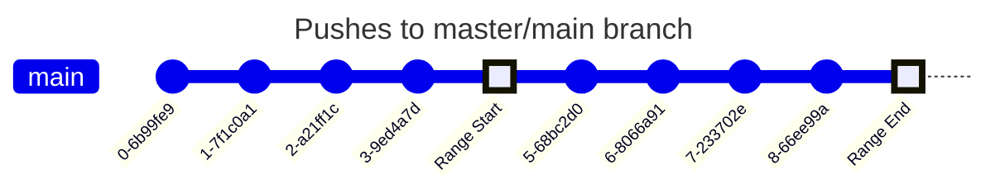
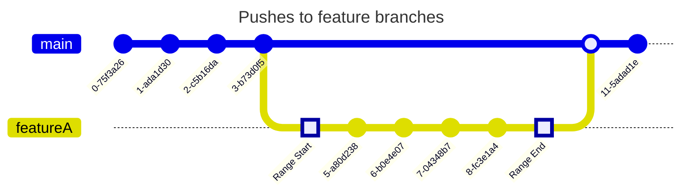
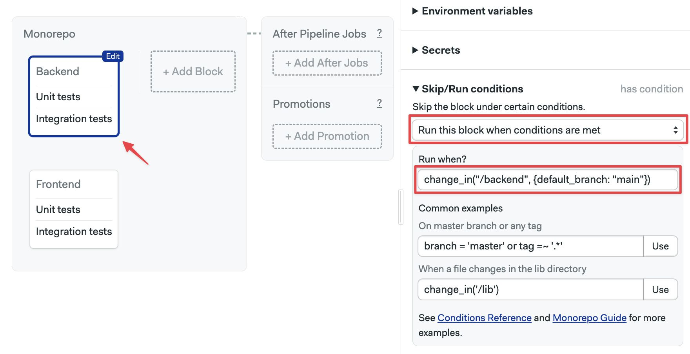

# Monorepos

WIP

import Tabs from '@theme/Tabs';
import TabItem from '@theme/TabItem';
import Available from '@site/src/components/Available';
import VideoTutorial from '@site/src/components/VideoTutorial';

Semaphore features a repository change detection strategy to optimize monorepo pipelines. This page explains how to configure monorepo pipelines to reduce time and costs.

## Overview

A [monorepo](https://semaphoreci.com/blog/what-is-monorepo) is a repository that holds many projects. While these projects may be related, they are often logically independent, uncoupled, and sometimes event managed by different teams.

Semaphore can detect changes between commits, allowing you to set up fine-grained jobs that only run when the underlying code changes. Skipping jobs covering unchanged code can greatly speed up testing and reduce costs on big codebases.

## Change detection strategies

<!-- Semaphore takes into account a range of commits for a given branch, Git tags, or pull request to decide when to run or skip a block of jobs or a promotion.  -->

When change detection is enabled, Semaphore takes into account two variables to decide which jobs to run: a user-supplied glob pattern and a commit range. If one or more of the commits in the range changed at least one file matching the pattern, the job runs. Otherwise it is skipped.

The default commit range used depends on a few conditions.

For pushes on the **trunk**, i.e. master branch, the commit ranges between the first and the last commit in the push that triggered the workflow.



For pushed in feature branches the commit range starts on the common ancestor with the trunk and ends at the head of the pushed branch.



For pull requests the commit range starts at the common ancestor between the branches and the head of the pushed branch.


In addition, these conditions force the job to run even if no files where changed:

- [Pipeline changes](../pipelines#overview): if the pipeline YAML changes, all jobs run by default. This can be [disabled](#config)
- **Pushed tags**: all jobs run by default is the push includes Git tags. This can be [disable](#config)

:::note

Semaphore defaults to **master** as the main/trunk branch name. You can change this value, for example to **main**, in the [config](#config).

:::

## How to use change detection? {#why}

Let's say we have a repository with two separate components: frontend and backend. Let us asumme that the two codebases are related but can be built and tested separetely. We could set up a pipeline like this:


The downside of this strategy is that it will run all jobs even for commits that only affected one of the codebases. In other words, if we make a change on the backend, both the frontend and backend jobs will run every time. This can be a problem for projects consisting of hundreds of components. Think of a project that contains a web app, mobile apps for several platforms, and a backend API service.

We can speed up the pipeline by only running enabling change detection. For example, to run the frontend job only a file in the `/frontend` folder has changed.

### Change detection in jobs {#jobs}

To enable change detection


<Tabs groupId="editor-yaml">
<TabItem value="editor" label="Editor">

To enable change detection, follow these steps:

1. Open the **Workflow Editor** for your Semaphore project
2. Select the block
3. Open the **Skip/run conditions** on the right side
4. Select **Run this block when conditions are met**
5. In the **When?** field type the [change condition](#condition), e.g. `change_in('/frontend')`



Repeat the procedure for the rest of the blocks. For example for the Backend block we could use the condition `change_in('/backend')`

Press **Run the workflow** > **Start** to save your changes and run the pipeline.

</TabItem>
<TabItem value="yaml" label="YAML">

1. Open your pipeline YAML file
2. Locate the block you wish to add change conditions to
3. Add `run.when` under the block
4. Type the [change condition](#condition), e.g. `change_in('/frontend')`
5. Repeat the process for the other blocks that need conditions
6. Push the pipeline file to the remote repository 

```yaml title="Change conditions"
version: v1.0
name: Monorepo
agent:
  machine:
    type: e1-standard-2
    os_image: ubuntu2004
global_job_config:
  prologue:
    commands:
      - export SAMPLE_ENV_VAR=123abc
      - checkout
blocks:
  - name: Backend
    dependencies: []
    task:
      jobs:
        - name: Unit tests
          commands:
            - 'checkout'
            - 'npm install'
            - 'npm run test'
        - name: Integration tests
          commands:
            - 'checkout'
            - 'npm install'
            - 'npm run test:integration'
    # highlight-start
    run:
      when: change_in('/frontend')
    # highlight-end
  - name: Frontend
    dependencies: []
    task:
      jobs:
        - name: Unit tests
          commands:
            - 'checkout'
            - 'npm install'
            - 'npm run test'
        - name: Integration tests
          commands:
            - 'checkout'
            - 'npm install'
            - 'npm run test:integration'
    # highlight-start
    run:
      when: change_in('/backend')
    # highlight-end
```

</TabItem>
</Tabs>

:::info

Conditions are ignored by default when you change the pipeline file. So, the very next run executes all blocks. Subsequent pushes should respect your change detection conditions.

:::

### Change detection in promotions {#promotionms}

### Conditions config {#condition}

## See also

optimized workflows for monorepos. 

By detecting changes in your repository, Semaphore can skip jobs related to unchanged code.

 This page explains how to reduce time and costs for pipelines running on monorepos.

A monorepo is a repository that holds many projects. While these projects may be related, they are often logically independent and run by different teams. 


this page is all about monorepo setup and optimizations