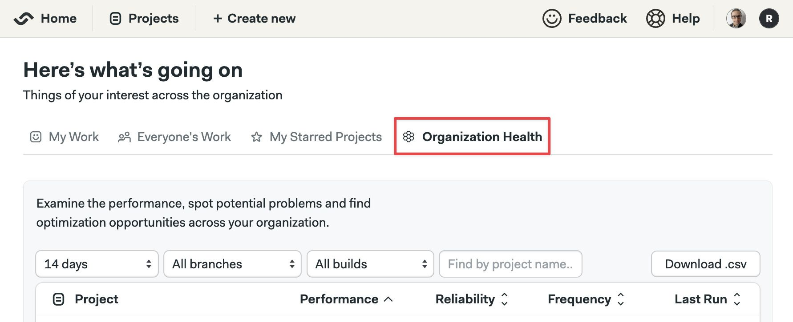
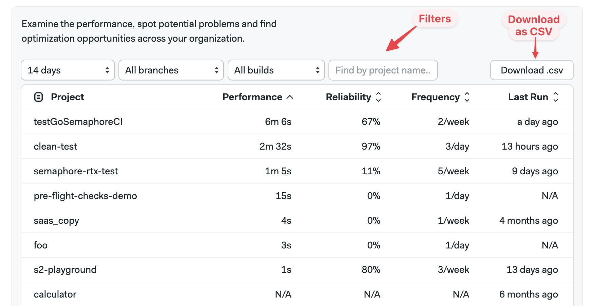

# Organization Health

import Tabs from '@theme/Tabs';
import TabItem from '@theme/TabItem';
import Available from '@site/src/components/Available';
import VideoTutorial from '@site/src/components/VideoTutorial';

<Available plans={['ScaleUp']} />

The Organization Health dashboard summarizes all your [Project Insights](./insights) in a single place.

## Overview

Organization Health provides a central location to view the Project Insights across all the projects in your [organization](../organizations). For instance, you can see the lower-performing projects in the last 30 days to find optimization opportunities.

## How to view Organization Health

The Organization Health dashboard is shown in a tab on the home page for your organization.

## Available metrics

Organization Health lists your projects and their [Project Insight metrics](./insights):

- **Performance**: how long pipelines take to run on average
- **Reliability**: percentage of pipeline pass rate
- **Frequency**: number of pipelines run per week or day
- **Last run**: last time a pipeline was run for the project

Semaphore uses the data across all branches to calculate health. As a result, the numbers might not match exactly what you see in [Project Insights](./insights).

The default sort order is from lowest to highest performance. Projects at the top have the lowest ranking in overall performance. You can change the order by clicking on the table columns. Use the filter above the columns to change the date range, and filter by branches or project name.

:::note

Metrics are calculated every few hours, so Last Run might not always be accurate.

:::

## See also

- [Project Insights dashboard](./insights)
- [Test reports dashboard](../tests/test-reports)
- [Flaky test detection dashboard](../tests/flaky-tests)

