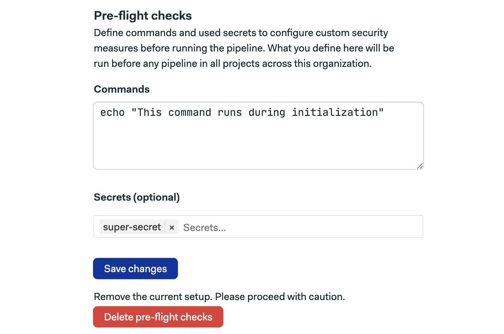

# Preflight Checks for Organizations

import Tabs from '@theme/Tabs';
import TabItem from '@theme/TabItem';
import Available from '@site/src/components/Available';
import VideoTutorial from '@site/src/components/VideoTutorial';

<Available plans={['Scaleup']}/>

Pre-flight checks are user-defined commands executed before the pipeline begins as part of the [pipeline initialization job](./pipelines#init-job). This page explains how to use this feature and shows some examples.

:::note

Pre-flight checks cause Semaphore to run an [initialization job](./pipelines#init-job) before your pipeline starts.

:::

## Overview

Pre-flight checks allow you to manually run commands before any pipeline for any project starts. This allows you to add sanity checks or customize your environment for all your projects.

Pre-flight checks can be used to:

- run security checks
- perform dependency management
- validate custom access controls

:::warning

Pre-flight checks have the potential to disrupt all the pipelines in your organization. Semaphore encourages you to be cautious and familiar with the CI/CD platform before attempting to configure these checks. 

:::

## Permissions required {#permissions}

Only members with *organization admin permissions* can add, remove, or modify pre-flight checks.

## How to set up pre-flight checks {#add}

To access the organization's pre-flight checks, follow these steps:

1. Open the [organization settings](./organizations#org-settings)
2. Select **Initialization jobs**
3. Scroll down to **Pre-flight checks**
4. Type the commands you wish to run during initialization
5. Optionally, add [secrets](./secrets) needed during initialization
6. Press **Save changes**



On the same screen, you can delete the existing pre-flight check by pressing the **Delete pre-flight checks** button.

:::warning

If any of the commands in the pre-flight check exits with a non-zero exit code, the process stops with an error and the pipeline is never processed. As a result, *no further obs are executed*.

:::

## Environment variables {#env-vars}

Semaphore exposes several environmental variables in the pre-flight environment. The most commonly used variables are:

- [`SEMAPHORE_PROJECT_NAME`](../reference/env-vars#project-name): the name of the Semaphore project 
- [`SEMAPHORE_GIT_REPO_SLUG`](../reference/env-vars#git-repo-slug): the name of the Git repository in the form `owner/repo_name`, e.g. `semaphoreci/docs`
- [`SEMAPHORE_GIT_BRANCH`](../reference/env-vars#git-branch): the name of the branch active for the current pipeline, e.g. `main`
- [`SEMAPHORE_PIPELINE_PROMOTION`](../reference/env-vars#pipeline-promotion): is `true` when the pipeline is started via a [promotion](./pipelines#connecting-pipelines)
- [`SEMAPHORE_PIPELINE_PROMOTED_BY`](../reference/env-vars#pipeline-promoted-by): contains the name of the GitHub or BitBucket account that started the promotion
- `INPUT_FILE`: the path to the original pipeline file, e.g. `semaphore.yml`
- `OUTPUT_FILE`: the path to the compiled pipeline file, created as output for the [initialization job](./pipelines#init-job). This is the pipeline definition Semaphore ultimately uses to run the workflow

See [initialization environment variables reference](../reference/env-vars#init) for more details.

## Examples

This section illustrates pre-flight checks' possible uses with examples.

### Restricting secrets

The following example shows how to ensure that only allowed pipelines can access your [secrets](./secrets). 

The sample [check-secret](https://raw.githubusercontent.com/renderedtext/snippets/master/check-secret.sh) script takes the following arguments:

1. The name of the secret to check
2. The name of the project that can use the secret
3. The path to the pipeline file that might use the secret
4. The name of the active branch

The script exits with status code 1 if the secret is not allowed to run in the current project, pipeline, or branch.

The following pre-flight checks only allow a secret called `my-super-secret` on the project called `awesome-project` on the deployment pipeline for the `master` branch:

```shell
curl https://raw.githubusercontent.com/renderedtext/snippets/master/check-secret.sh -o check-secret

bash check-secret "my-super-secret" "awesome-project" ".semaphore/deployment.yml" "master"
```

If the secret is not allowed for this combination of project, pipeline, and branch, the job fails preventing the pipeline from ever starting.

:::note

You can achieve a similar result with [organization secret policies](./secrets#secret-access-policy) or [project secrets](./secrets#create-project-secrets).

:::

### Restricting who can start promotions

The following example shows how to restrict promotions to a list of allowed users. The list of users that can start a promotion is listed on the first line of the example.

```shell
printf '%s\n' 'user-1' 'user-2' 'user-3' > allowed_users.txt
user_is_allowed () { grep -Fxq $SEMAPHORE_PIPELINE_PROMOTED_BY allowed_users.txt; }
is_promotion () { [ $SEMAPHORE_PIPELINE_PROMOTION == "true" ]; }

if is_promotion; then if user_is_allowed; then echo "Promotion allowed."; else false; fi; else echo "Initial pipelines are allowed."; fi
```

If a non-allowed user tries to start a promotion, the job fails preventing the promotion from being started.

### Dynamically changing pipeline files

The following example shows how to increase the [job parallelism](./jobs#parallelism) from 2 to 10 when commit history contains a change in the folder called `big_project`.

```shell
my_lib_dir_changed () { spc list-diff --default-branch main | grep -q "^big_project/"; }
increase_parallelism () { `sed -i 's/parallelism: 2/parallelism: 10/' $OUTPUT_FILE`; }

if my_lib_dir_changed; then increase_parallelism; fi
```

## See also

- [Initialization jobs](./pipelines#init-job)
- [How to change the agent running initialization jobs](./organizations#init-agent)
- [Project pre-flight checks](./project-preflight)
