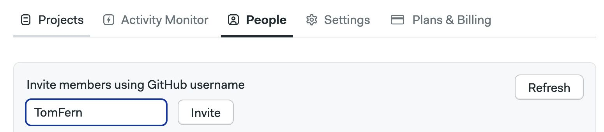
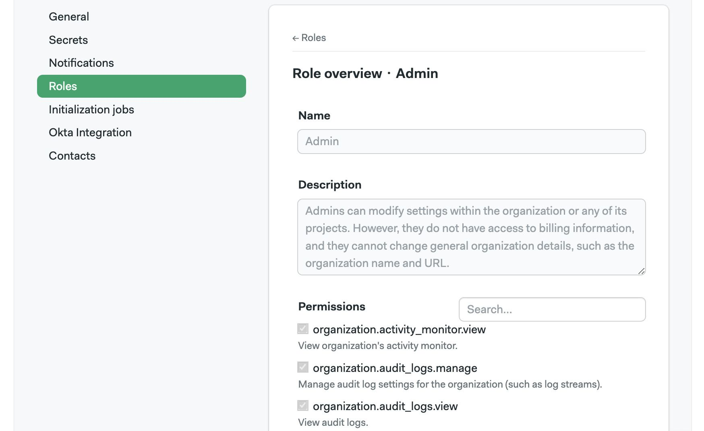
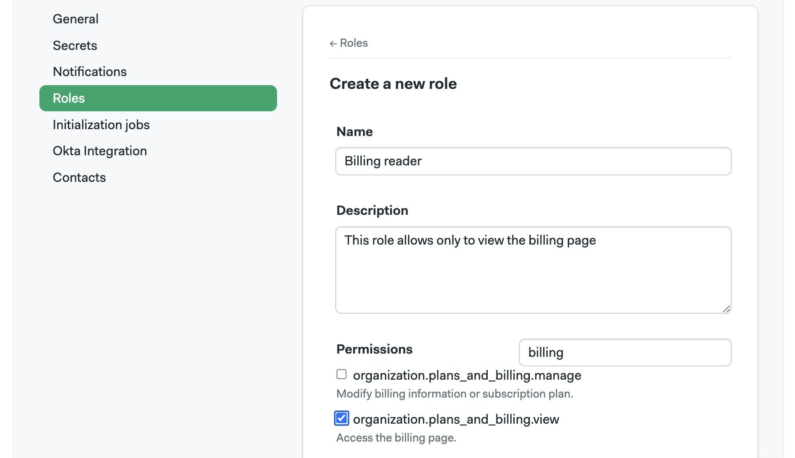
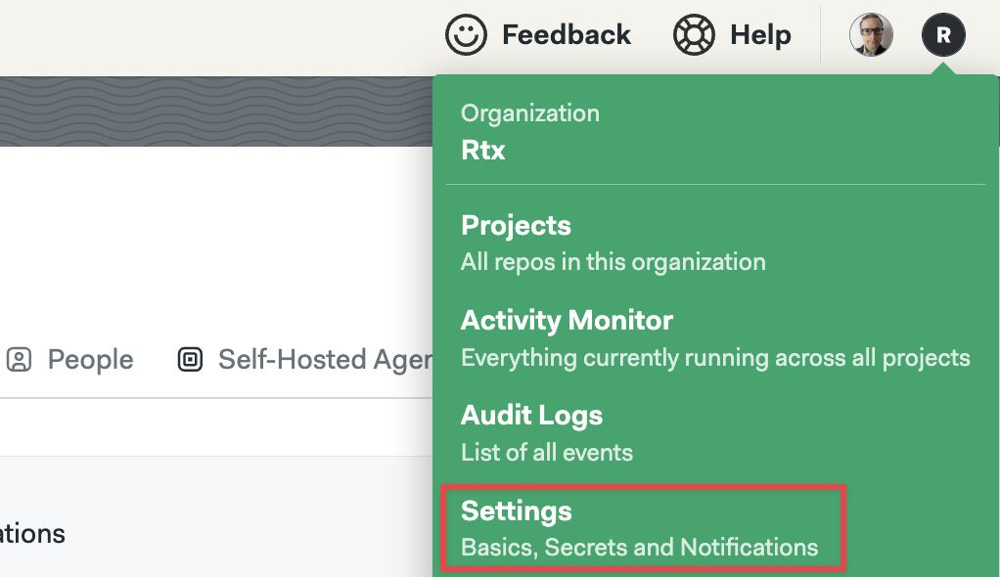
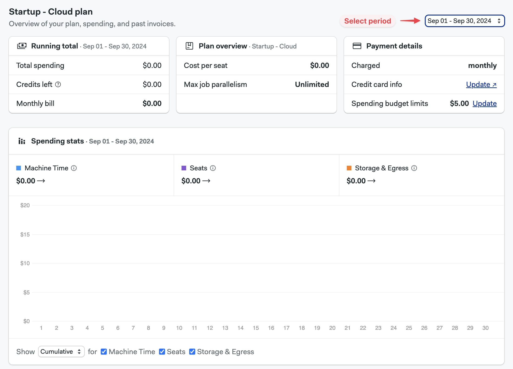

# Organizations

import Tabs from '@theme/Tabs';
import TabItem from '@theme/TabItem';
import Available from '@site/src/components/Available';
import VideoTutorial from '@site/src/components/VideoTutorial';
import Steps from '@site/src/components/Steps';

Organizations are the administrative unit for Semaphore. This page explains how to set up [notifications](./notifications), manage users, and what settings are available.

## Overview {#overview}

In order to access any non-public resources on Semaphore you must be invited to the organization your team or company has created. 

If you are trying out Semaphore for the first time, we suggest the [Guided Tour](../getting-started/guided-tour), where we show how to create your first organization.

Organizations have:

- zero or more [projects](./projects)
- a billing plan
- one or more owners
- users and groups with [role-based permissions](./rbac)
- a dedicated URL, for example, `https://my-org.semaphoreci.com` 

## How to change organizations {#org-selection}

Switch the active organization to change its settings or view its projects.

<Tabs groupId="ui-cli">
<TabItem value="ui" label="UI">

To view or create other organizations, open the organization menu in the top right corner and select **Change Organization**.


</TabItem>
<TabItem value="cli" label="CLI">

You must install and connect the [Semaphore command line](../reference/semaphore-cli) to access your organizations

<Steps>

1. Run `sem context` to show the organizations connected to the tool. The active organization has an asterisk (*) next to it
    ```shell title="View connected organizations"
    $ sem context
        myorg1_semaphoreci_com
        myorg2_semaphoreci_com
        # highlight-next-line
      * myorg3_semaphoreci_com
    ```
2. Change organization with `sem context <organization-name>`
    ```shell title="Change active organization"
    $ sem context myorg1_semaphoreci_com
    switched to context "myorg1_semaphoreci_com"
    ```

</Steps>

</TabItem>
</Tabs>

## Managing users {#people}

Semaphore users a [Role Based Access Control](./rbac) model to manage permissions at the organization and project level. You can add up to 500 persons to an organization.

You can only invite people with GitHub or BitBucket accounts to your organization.

To manage users in your organization, open the organization menu and select **People**. This tab shows users and groups in your organization along with their:


### How to invite users {#add-people}

To invite a user to your organization, press the **Add people** button. You have two options:

- **By their [GitHub username](https://docs.github.com/en/get-started/learning-about-github/github-glossary#username)**, e.g. `TomFern`

  - Type their GitHub handle
  - Press **Invite**

  

  This option **does not allow email addresses** and doesn't send email notifications to users. To notify users via email, use the option below.

- **By existing projects**
  
  The list shows GitHub and BitBucket users that already have access to repositories but have not yet been added to the Semaphore project

  - Select the users and optionally type an email
  - Press **Add selected** to add them to the organization and project

  

:::note In case of delays

In case of delays, click on the **Refresh** button in the top right corner of the page after sending an invite. This will trigger a sync between GitHub and Semaphore, which can typically last up to 2 to 5 minutes.

:::

### How to change user roles {#roles-people}

To change the role of a user, press the **Change Role** button next to the person.


See [organization roles](./rbac#org) to learn what roles are available.

### How to create groups {#add-groups}

<Available plans={['Scaleup']}/>

User groups streamline user management by allowing bulk actions. After creating a group, you can:

- Add members to the group
- Assign a role to the group

All members of the group automatically inherit the permissions associated with the assigned role.

As an example, let's say you want to give the Finance team access to the [Billing pages](#plans) in your organization. To achieve that you can:

1. Create a [custom role](#custom) with view permissions on the Billing page
2. Create a Finance group
3. Assign the new custom role to the group
4. Add everyone in the Finance team to the group
5. As the team changes, you can add or delete persons from the group

To create a group, open the organization menu and select **People**. 

<Steps>

1. Press on **Create group**
2. Type in the group name and description
3. Type the names of the persons to add to the group
4. Press **Save changes** to create the group

  

</Steps>

The new group has the [member](./rbac#org-member) role by default. You can change it by pressing the **Modify Role** button and selecting a different role.

You can also define [custom organization roles](#custom) if none of the pre-defined roles suit your needs.

### How to change group roles {#group-role}

To change the role of a group, press the **Change Role** button next to the group.


### How to add members groups {#change-groups}

To add or remove users in a group, press the **Modify group** button next to it.

- Press the **X** button to remove the user from the group
- Type the name of the persons you want to add to the group
- Press **Save changes** to finish editing the group


### How to view pre-defined roles {#org-roles}

Semaphore provides pre-defined roles for organizations. You can see what actions each role can perform by following these steps:

<Steps>

1. Open the Organization **Settings** menu
2. Select **Roles**
    
3. In the **Organization Roles** section, press the eye button next to the role you want to examine

</Steps>

The actions with enabled checkbox are allowed for that role.



### How to create custom roles {#custom}

<Available plans={['Scaleup']}/>

Create custom roles to give your users the precise permissions they need. 

<Steps>

1. Open the Organization **Settings** menu
2. Select **Roles**
3. On the **Organization Roles** section, press **New Role**
4. Give a name a description to the new role
5. Enable the permissions allowed to the role. You can use the search box to narrow down options
6. Press **Save changes**

  

</Steps>

## Organization settings {#org-settings}

To access your organization settings, open the organization menu and click on **Settings**.



### General settings {#general-settings}

Your organization main settings.  Here, you can change its name, its URL, and control how [workflows](./workflows) run. 


:::info

The *URL of your organization* is the URL that leads to the Home page in your Semaphore organization. By default it follows the pattern `your-organization-name.semaphoreci.com`

:::

### Notifications {#slack-notifications}

You can set up Slack and other webhook-based notifications to get your team notified whenever there [project](./projects) finishes running.

To learn more, see the [notificaction documentation](./notifications.md)

### Initialization agent {#init-agent}

Some types of pipelines require [initialization job](./pipelines#init-job) to evaluate and compile the them before the workload beings.

Semaphore tries to pick the best type of agent automatically but you change it for the whole organization. This is particularly useful when you are using [self-hosted agents](./self-hosted).

To change the initialization job agent for all your [projects](./projects) in your organization, follow these steps:

<Steps>

1. Select **Initialization job** from the settings menu
2. Select the **Environment type**
3. Select the **Machine type**
4. Select the **OS image**
5. Press **Save**

  

</Steps>

To change the initialization agent for a single project, see [project pre-flight checks](./projects#preflight).

:::info

If you experience errors during initialization, see the [initialization job logs](./pipelines#init-logs) to help troubleshoot the issue.

:::

### Okta integration {#okta-integration}

<Available plans={['Scaleup']} />

Integration with Okta allows you to automate user management within your Semaphore organization, as well as to use Okta apps for Single Sign On.

For more information, see the [Okta integration page](./okta.md)

### Contacts {#contacts}

Manage your contact information.

In this section, you can add contact details in case the Semaphore Support Team needs to reach you. Add your name, phone number and email in three categories:

- **Finance**: used any billing-related messaging related to your organization
- **Main**: used as the primary point of communication
- **Security**: used to discuss any issues related to security in your organization

## Audit logs {#audit-log}

<Available plans={['Scaleup']} />

To support compliance, accountability, and security, Semaphore provides logs of audited events. Audit Log events are events that affect your organization, projects, users, or any other resources in Semaphore. Events contain information about when who and what was the performed activity.

You can find audit logs in your organization settings under Audit Logs.


The audit logs shows all the [audited events](../reference/audit-events) in reverse cronological order. Latest events are shown first.


### How to export audit logs {#audit-export}

<Available plans={['Scaleup']} />

Audit logs can be exported in two ways:

- CSV file
- Streaming to an S3-compatible bucket

To export the logs as CSV, press the **Export as CSV** button.


To configure streaming to an S3-compatible bucket, press the **Configure Streaming** button and:

<Steps>

1. Select between AWS and Google Cloud
2. Type the region (AWS only)
3. Type the bucket name
4. Type the access token

    - **AWS**: provide the Access Key ID and Access Key Secret for the IAM account
    - **Google Cloud**: provide the [HMAC Key](https://cloud.google.com/storage/docs/authentication/managing-hmackeys#command-line) for a service account

    The service account credentials provided must have write and read access to the bucket

5. Press **Looks Good**

  

</Steps>

:::info

Audit logs are streamed to the bucket once per day.

:::

## Organization queues {#queue}

You can use assign pipelines to organization queues to control the order in which pipelines are executed. See [named queues](./pipelines#named-queues) for more information.

## Activity monitor {#activity-monitor}

The activity monitor show the [agent](./pipelines#agents) utilization and the currently running pipelines.

To view the activity monitor, open your organization menu and select **Activity Monitor**.


In the activity monitor, you can see the machine quota utilization for your organization. Here, you can have an overview on how Semaphore Cloud machines and [self-hosted agents](./self-hosted) are being used.


In the lower part of the activity monitor you can find the currently running workflows for all the [projects](./projects) in your organization. Use this to know what [jobs](./jobs) are running, and see which ones are waiting in the queue to debug usage issues.


## Plans and billing {#plans}

Every organization is Semaphore is tied to a billing plan. 

To see your spending:

<Steps>

1. Open your organization menu
2. Select **Plans & Billing**
3. The overview tab shows your monthly spendings

    

4. You can view detailed breakdowns in three ways

    - **Spending**: shows costs due to machine usage, storage and egress
    - **Projects**: shows the costs generated by your most active projects

</Steps>


## Transfer ownership {#manage-ownership}

Before you can transfer of an organization, the following conditions need to happen:

- The new owner is a member of the organization
- The new owner must have logged in Semaphore at least once
- Only the current owner can transfer ownership

To promote a new owner to the organization:

<Steps>

1. Go to the organization **People** tab
2. Press the **Change Role** button
3. Select **Owner**

</Steps>

It might take several minutes for the update to be completed.

:::note

Updating the ownership of an organization doesn't automatically transfer the project ownership. For more information, see [How to transfer project ownership](./projects#general).

:::

### How to remove an owner {#remove-owner}

If you need to demote or remove an owner from the organization, any user with the Owner permission level needs to send an email to support@semaphoreci.com from the primary email address associated with their GitHub or Bitbucket account used to log into Semaphore.

## See also

- [How to configure Okta integration](./okta)
- [How to configure notifications](./notifications)
- [How to configure projects](./projects)