# Organizations

import Tabs from '@theme/Tabs';
import TabItem from '@theme/TabItem';
import Available from '@site/src/components/Available';
import VideoTutorial from '@site/src/components/VideoTutorial';

Organizations are the administrative unit for Semaphore. This page explains how to create organizations, manage users, and what settings are available.

## Overview {#overview}

The fist time you log in to Semaphore you'll be prompted to create an *organization*. An organization is the basic unit of administration. 

Organizations have:

- zero or more [projects](./projects)
- a [billing plan](https://semaphoreci.com/pricing)
- one or more owners
- users and groups with permission levels

## How to change organizations {#org-selection}

Switch the active organization to change its settings or view its projects.

<Tabs groupId="ui-cli">
<TabItem value="ui" label="UI">

To view or create other organizations, open the organization menu on the top right corner and select **Change Organization**.


</TabItem>
<TabItem value="cli" label="CLI">

You must install and connect the [Semaphore command line](../reference/semaphore-cli) to access your organizations

1. Run `sem context` to show the organizations connected to the tool. The active organization has an asterisk (*) next to it
    ```shell title="View connected organizations"
    $ sem context
        myorg1_semaphoreci_com
        myorg2_semaphoreci_com
        # highlight-next-line
      * myorg3_semaphoreci_com
    ```
2. Change organization with `sem context <organization-name>`
    ```shell title="Change active organization"
    $ sem context myorg1_semaphoreci_com
    switched to context "myorg1_semaphoreci_com"
    ```

</TabItem>
</Tabs>

## Managing users {#people}

Semaphore uses roles to manage user access. You can add an unlimited number of persons to your organization.

To manage users in your organization, open the organization menu and select **People**.

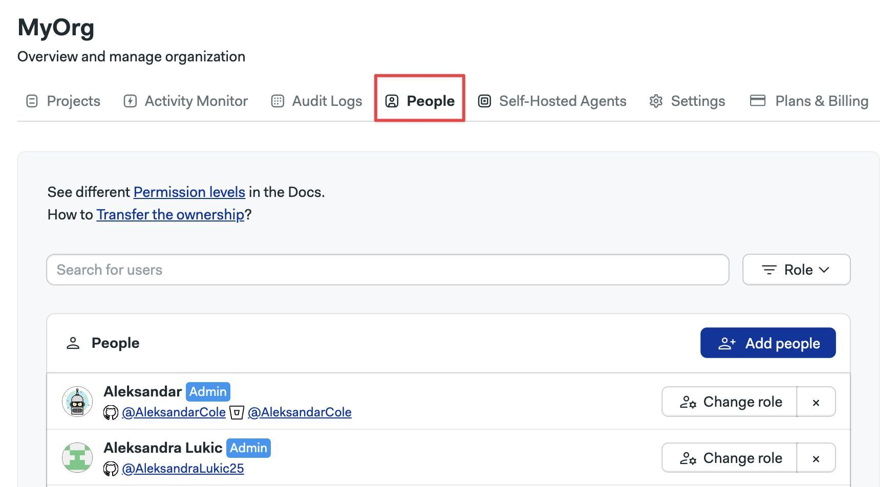

### Organization roles {#roles}

The default organization roles are:

- **Members**
  - Can create new [projects](./projects)
  - Can view existing notifications and settings.
- **Admins**
  - Can view, manage, and modify everything within the organization except general settings and financial information.
  - Get admin access to every project inside the organization
- **Owners**
  - Can do everything within the organization, including changing general settings and deleting it
  - By default, this role is assigned to the user that creates the organization
  - Get admin access to every project inside the organization 

The **People** tab shows users in your organization along with their:

- Semaphore usernames
- GitHub or BitBucket handles
- Role


### How to add users {#add-people}

To add a user, press the **Add people** button. You have two options:

- By their GitHub handle
  - Type their GitHub handle and press **Invite**
  - Invitees will receive an email to join the organization
- By shared GitHub organization
  - The list shows users who already belong in the same GitHub organization as you
  - Select the users and optionally type an email
  - Press **Add selected** to add them to the organization

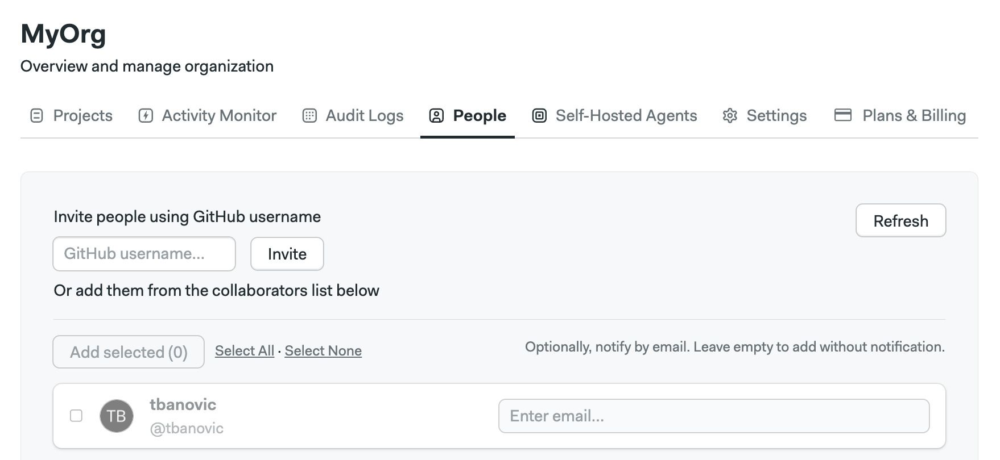

### How to change user roles {#roles-people}

To change the role of a user, press the **Change Role** button next to the person.

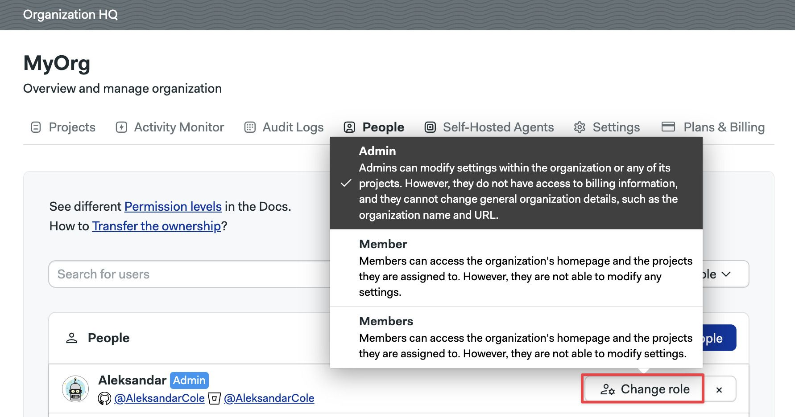

### How to create user groups {#add-groups}

<Available plans={['Scaleup']}/>

User groups allows you to manage users in bulk. Instead of managing users one by one, add them to a group and assign a role to it.

To create a group, open the organization menu and select **People**. 

1. Press on **Create group**
2. Type in the group name and description
3. Type the names of the persons to add to the group
4. Press **Save changes** to create the group

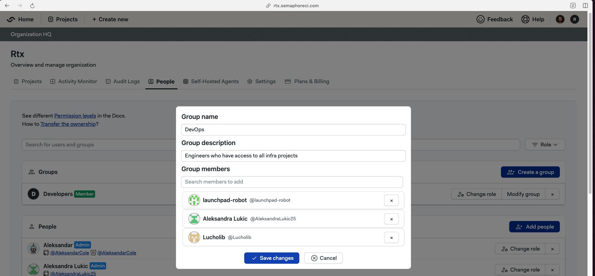

### How to change the role of a group {#group-role}

To change the role of a group, press the **Change Role** button next to the group.


### How to add/remove users to a group {#change-groups}

To add or remove users in a group, press the **Modify group** button next to it.

- Press the **X** button to remove the user from the group
- Type the name of the persons you want to add to the group
- Press **Save changes** to finish editing the group


## Organization settings {#org-settings}

To access your organization settings, open the organization menu and click on **Settings**.

### General settings {#general-settings}

Your organization main settings.  Here, you can change its name, its URL, and control how workflows run.

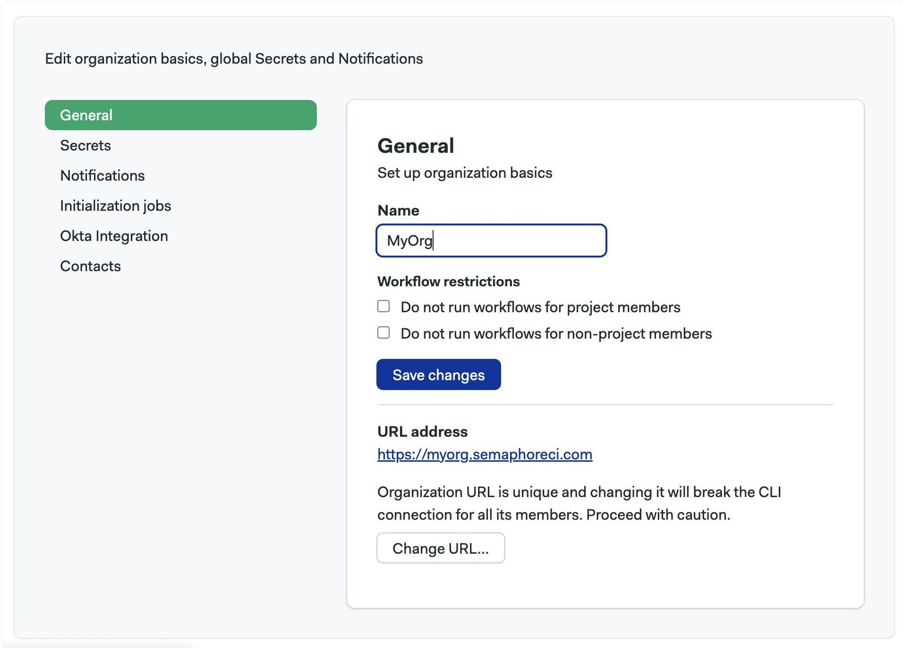

### Notifications {#slack-notifications}

You can set up Slack and other webhook-based notifications to get your team notified whenever there [project](./projects) finishes running.

To learn more, see the [notificaction documentation](./notifications.md)

### Initialization jobs {#initialization-jobs}

Configure how pipelines are initialized.

Semaphore must run some initialiation steps before it can start a [pipeline](./pipelines). It must fetch and validate the pipeline YAML and, in some cases like [monorepos] or [pre-flight checks](./preflight), even do a full repository clone.

By default, Semaphore chooses automatically which kind of [agent](./pipelines#agents) run the initialization job, but in this section you can customize it for all [projects](./projects).

<details>
<summary>Show me</summary>
<div>
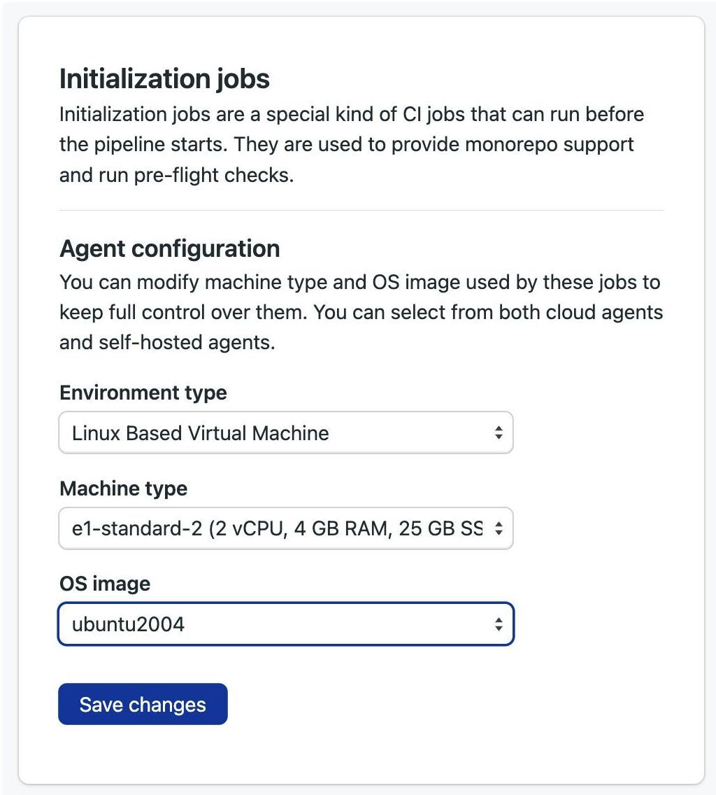
</div>
</details>

### Okta integration {#okta-integration}

<Available plans={['Scaleup']} />

Integration with Okta allows you to automate user management within your Semaphore organization, as well as to use Okta apps for Single Sign On.

For more information, see the [Okta integration page](./okta.md)

### Contacts {#contacts}

Manage your contact information.

In this section, you can add contact details in case the Semaphore Support Team needs to reach you. Add your name, phone number and email in three categories:

- **Finance**: used any billing-related messaging related to your organization
- **Main**: used as the primary point of communication
- **Security**: used to discuss any issues related to security in your organization

## Audit logs {#audit-log}

<Available plans={['Scaleup']} />

To support compliance, accountability, and security, Semaphore provides logs of audited events. Audit Log events are events that affect your organization, projects, users, or any other resources in Semaphore. Events contain information about when who and what was the performed activity.

You can find audit logs in your organization settings under Audit Logs.

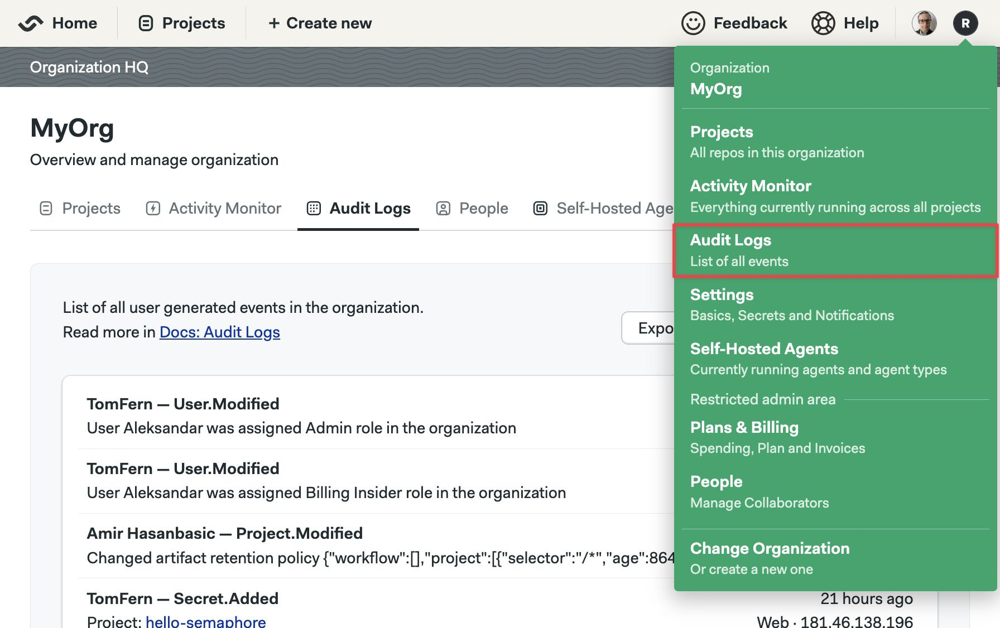

The audit logs shows all the [audited events](../reference/audit-events) in reverse cronological order. Latest events are shown first.

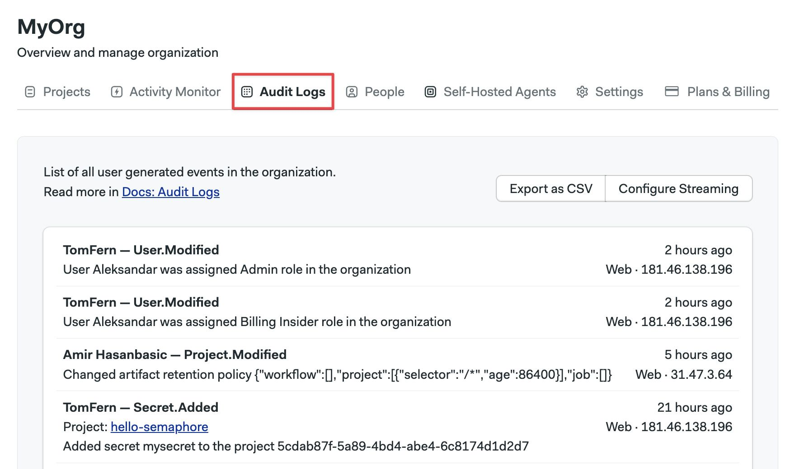

### How to export audit logs {#audit-export}

<Available plans={['Scaleup']} />

Audit logs can be exported in two ways:

- CSV file
- Streaming to an S3-compatible bucket

To export the logs as CSV, press the **Export as CSV** button.

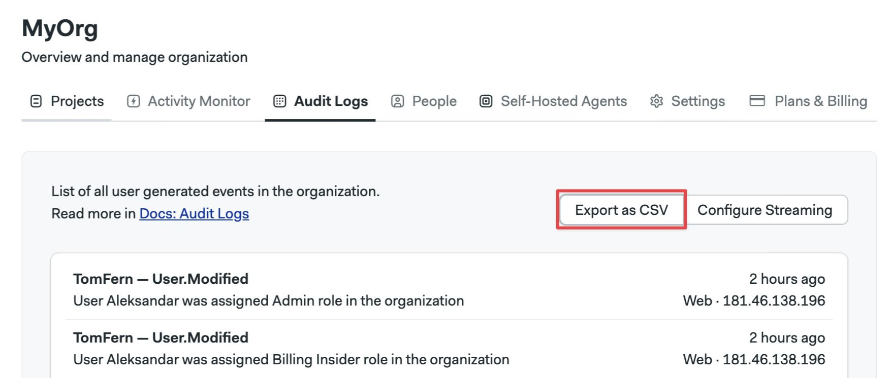

To configure streaming to an S3-compatible bucket, press the **Configure Streaming** button and:

1. Select between AWS and Google Cloud
2. Type the region (AWS only)
3. Type the bucket name
4. Type the access token. They should have write access to the bucket
5. Press **Looks Good**

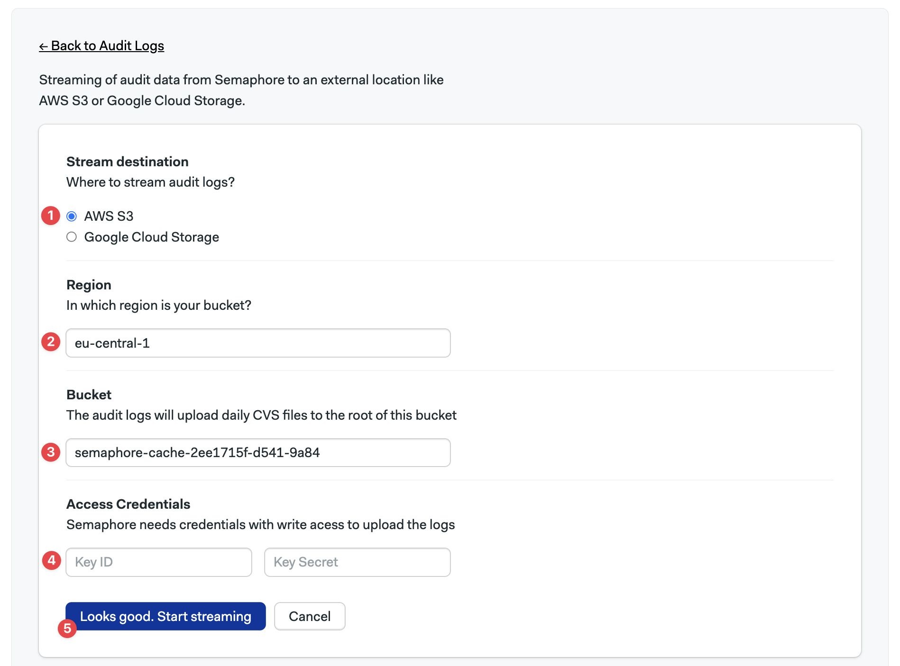

:::info

Audit logs are streamed to the bucket once per day.

:::

## Activity monitor {#activity-monitor}

The activity monitor show the [agent](./pipelines#agents) utilization and the currently running pipelines.

To view the activity monitor, open your organization menu and select **Activity Monitor**.

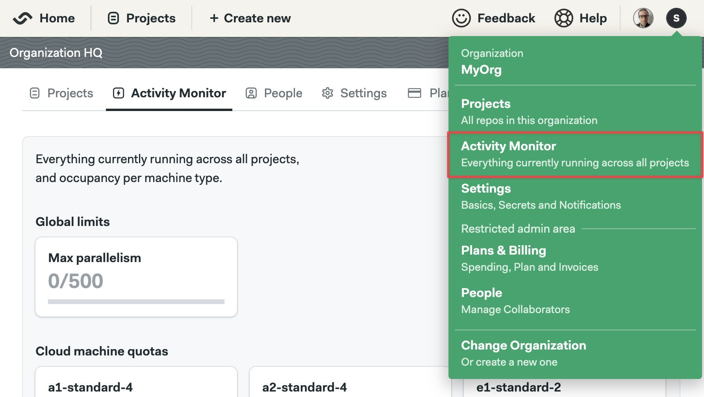

In the activity monitor, you can see the machine quota utilization for your organization. Here, you can have an overview on how Semaphore Cloud machines and [self-hosted agents](./self-hosted) are being used.

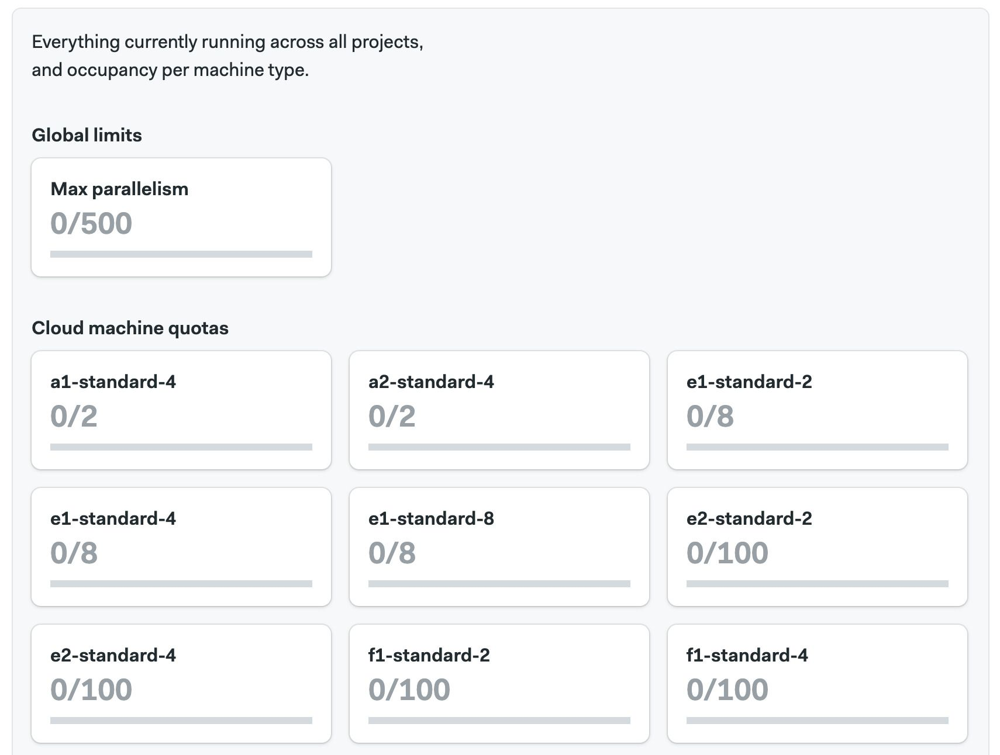

In the lower part of the activity monitor you can find the currently running workflows for all the [projects](./projects) in your organization. Use this to know what [jobs](./jobs) are running, and see which ones are waiting in the queue to debug usage issues.

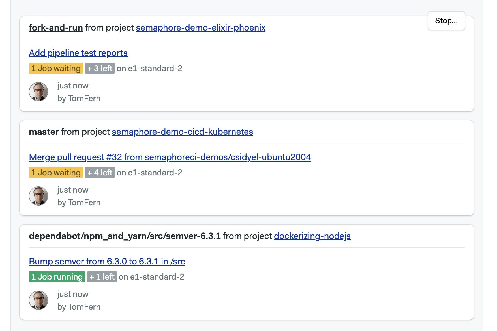

## Plans and billing {#plans}

Every organization is Semaphore is tied to a billing plan. To learn about available plans, see the [Semaphore plans documentation](./plans).

## Transfer ownership {#manage-ownership}

Before you can transfer of an organization, the following conditions need to happen:

- The new owner is a member of the organization
- The new owner must have logged in Semaphore at least once
- Only the current owner can transfer ownership

To promote a new owner to the organization:

1. Go to the organization **People** tab
2. Press the **Change Role** button
3. Select **Owner**

It might take several minutes for the update to be completed.

:::note

Updating the ownership of an organization doesn't automatically transfer the project ownership. For more information, see [How to transfer project ownership](./projects#manage-ownership)

:::

### How to remove an owner {#remove-owner}

If you need to demote or remove an owner from the organization, any user with the Owner permission level needs to send an email to support@semaphoreci.com from the primary email address associated with their GitHub or Bitbucket account used to log into Semaphore.

## See also

- Okta integration
- How to configure notifications
- How to configure projects