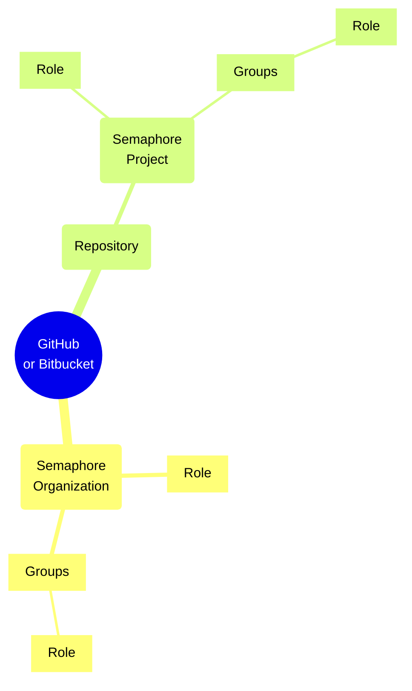

# Role Based Access Control

import Tabs from '@theme/Tabs';
import TabItem from '@theme/TabItem';
import Available from '@site/src/components/Available';
import VideoTutorial from '@site/src/components/VideoTutorial';

Role Based Access Control (RBAC) allows you to manage user permissions in the organization and its projects. This page describes how the RBAC model works.

## Overview

Semaphore uses a Role Based Access Control (RBAC) model to manage user permissions and access withing the [organization](./organizations).

Users need to be added to the organization before they can log into Semaphore or access any of your projects. Users need a GitHub or BitBucket account in order to log in your organization.

### Role scopes

Semaphore manages roles on two levels:

- [Organization](#org): these roles allow users to perform various task on the organization. Users need to be added to the organization before they can access projects.
- [Project](#project): these roles give access to a [project](./projects) within the organization. Users need to have access to the repository connected to the project.

Roles can be gained in three ways:

- **Direct**: you can directly assign up to one organization role and one project role to the user
- **Group**: you can create a [group](#groups) with up to one organization role and one project role. Users in the group inherit the assigned roles
- **Repository**: users with access to the repository can inherit roles based on their [repository-level permissions](#repo)

Permissions are additive. Users gaining roles though more than one way obtain the sum of all the permissions from all the assigned roles.

### Groups

## Organization roles {#org}

Table with overview and links to anchors

### Member

### Admin

### Owner

### Custom roles

## Project roles {#project}

Table with overview and links to anchors

### Reader

### Contributor

### Admin

### Custom roles

## Repository permissions {#repo}

## Examples

## See also

- okta integration
- How to manage organization users
- How to manage project permissions

