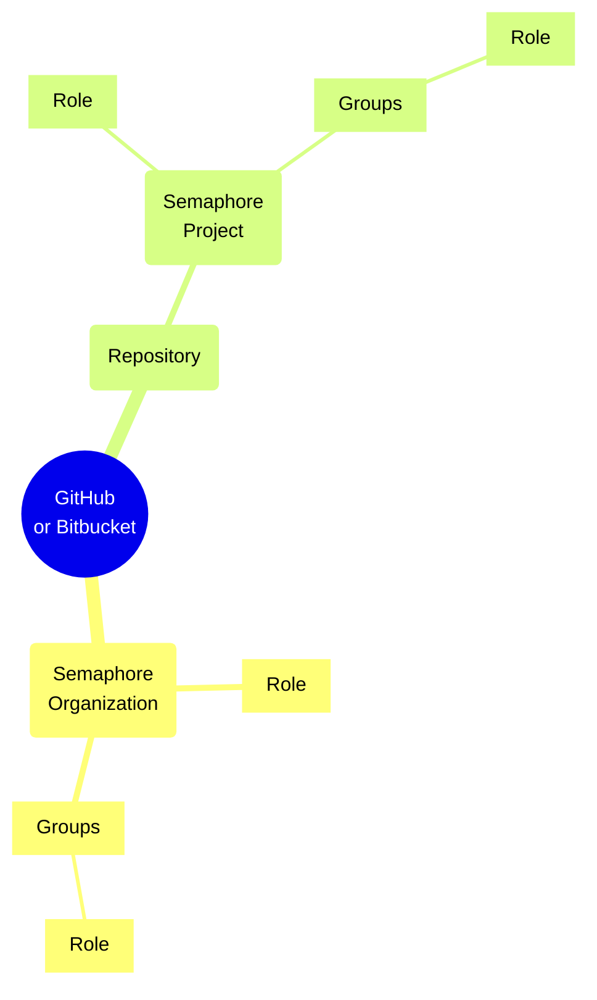

# Role Based Access Control

import Tabs from '@theme/Tabs';
import TabItem from '@theme/TabItem';
import Available from '@site/src/components/Available';
import VideoTutorial from '@site/src/components/VideoTutorial';

Role Based Access Control (RBAC) allows you to manage user permissions in the organization and its projects. This page describes how the RBAC model works.

## Overview

Semaphore uses a Role Based Access Control (RBAC) model to manage user permissions and access withing the [organization](./organizations).

Users need to be added to the organization before they can log into Semaphore or access any of your projects. Users need a GitHub or BitBucket account in order to log in your organization.

Only organization [Admins](#org-admin) or [Owners](#org-owner) can invite users to the organization.

### Role scopes

Semaphore manages roles on two levels:

- [Organization](#org): these roles allow users to perform various task on the organization. Users need to be added to the organization before they can access projects.
- [Project](#project): these roles give access to a [project](./projects) within the organization. Users need to have access to the repository connected to the project.

Roles can be gained in three ways:

- **Direct**: you can directly assign up to one organization role and one project role to the user
- **Group**: you can create a [group](#groups) with up to one organization role and one project role. Users in the group inherit the assigned roles
- **Repository**: users with access to the repository can inherit roles based on their [repository-level permissions](#repo)

Permissions are additive. Users gaining roles though more than one role obtain the sum of all the permissions belonging to the assigned roles.

### Groups

Groups exist at the organization level. A group can have exactly one role directly assigned.

Groups can be added to project and assigned exactly on [project-level role](#project). This grants every member of the group access to the project and grants them all the permissions inherited from the roles.

## Organization roles {#org}

Organization roles control what actions the users may perform in Semaphore. Users need to be added to the organization via their GitHub or BitBucket usernames before they can be granted a role. Only users that are part of the organization can log in into Semaphore.

The only exception is when a user is added via the [Okta integration](./okta).

### Member {#org-member}

Organization members can access the organization's homepage and the projects they are assigned to. They can't modify any settings.

This is the default role assigned when a user is added to the organization.

Among other actions, members can:

- View the organization activity
- View and manage dashboards
- View and manage [notifications](./notifications)
- Create [projects](./projects)
- View and manage [secrets](./secrets)
- View and manage [self-hosted agents](./self-hosted)

For the full list of member permissions, see [organization roles](./organizations#roles).

### Admin {#org-admin}

Admins can modify settings within the organization or any of its projects. They do not have access to billing information, and they cannot change general organization details, such as the organization name and URL.

Only Admins and Owners can invite users to the organization.

In addition to the [member permissions](#org-member), admins can:

- View and manage organization settings
- View and manage the [Okta integration](./okta)
- Invite users to the organization
- Remove people from the organization
- View and manage billing plans
- View and manage [pre-flight checks](./org-preflight)
- View and manage [usage policy for secrets](./secrets#secret-access-policy)

For the full list of admin permissions, see [organization roles](./organizations#roles).

### Owner {#org-owner}

The owner of the organization is the person that created it. An organization can have multiple owners.  Owners have access to all functionalities within the organization and any of its projects. They cannot be removed from the organization.

Only Admins and Owners can invite users to the organization.

For the full list of owner permissions, see [organization roles](./organizations#roles).

## Project roles {#project}

Project roles control what actions the users may perform on the project. Project roles are assigned per project.

To grant a user access to a given project they need to:

- Be part of the Semaphore organization
- Have access to the related repository in GitHub or BitBucket
- Be granted access to the Semaphore project

The role given when a user is added to the project depends on their repository-level permissions. The following table shows how repository permissions map to project roles.

TODO TABLE

### Reader {#project-reader}

Readers can access the project page, view workflows, their results, and job logs. They cannot make any modifications within the project.

Readers have:

- Read-only access to [artifacts](./artifacts)
- Read-only access to [deployment targets (environment)](./promotions#deployment-targets)
- Read-only access to [test reports](./tests/test-reports) and [flaky tests](./tests/flaky-tests)
- Read-only access to [tasks](./tasks)
- View project notifications
- View project [pre-flight checks](./projects#preflight)

For the full list of reader permissions, see [project roles](./project#roles).

### Contributor {#project-contributor}

Contributors can view, rerun, change workflows and SSH into jobs. Can promote and view insights, and run schedulers.

In addition to the [reader permisions](#project-reader), contributors can:

- Delete the project
- Change project settings
- Manage project [pre-flight checks](./projects#preflight)
- Manage [test reports](./tests/test-reports) and [flaky tests](./tests/flaky-tests)
- Manage [tasks](./tasks)

For the full list of contributor permissions, see [project roles](./project#roles).

### Admin {#project-admin}

Admins have the authority to modify any setting within the projects, including the ability to add new individuals, or remove them.

## Custom roles {#custom-roles}

## Repository permissions {#repo}

## Examples

## See also

- okta integration
- How to manage organization users
- How to manage project permissions

