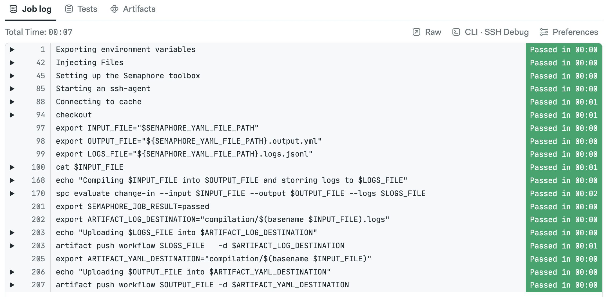
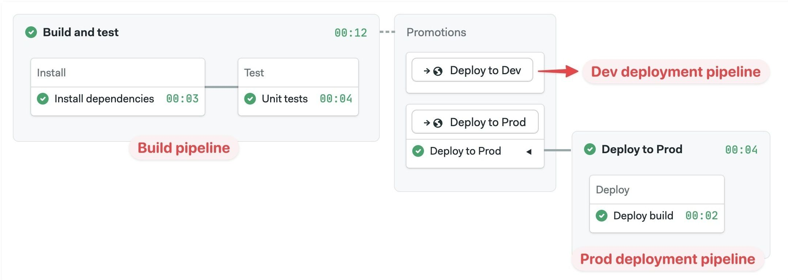

# Pipelines


import Tabs from '@theme/Tabs';
import TabItem from '@theme/TabItem';
import Available from '@site/src/components/Available';
import VideoTutorial from '@site/src/components/VideoTutorial';
import Steps from '@site/src/components/Steps';

A pipeline is a group of connected blocks. This page explains what pipelines are, how they organize workflow execution order, and what settings are available.

## Overview {#overview}

Pipelines are groups of blocks that can be connected via dependencies to define their execution order.

Pipelines are also the *unit of configuration*. Each pipeline is encoded as separate a YAML file in the `.semaphore` folder. 

For reference, here is an example pipeline with its respective YAML.

<Tabs groupId="editor-yaml" queryString>
<TabItem value="editor" label="Example pipeline">


</TabItem>
<TabItem value="yaml" label="YAML">

```yaml title=".semaphore/semaphore.yml"
version: v1.0
name: Initial Pipeline
agent:
  machine:
    type: e1-standard-2
    os_image: ubuntu2004
blocks:
  - name: Build
    task:
      jobs:
        - name: Build
          commands:
            - checkout
            - echo "build commands here"
  - name: Test
    dependencies:
      - Build
    task:
      jobs:
        - name: Unit tests
          commands:
            - checkout
            - echo "unit tests commands here"
        - name: Integration tests
          commands:
            - checkout
            - echo "integration tests commands here"
  - name: UI Tests
    dependencies:
      - Test
    task:
      jobs:
        - name: UI Test
          commands:
            - checkout
            - echo "UI tests commands here"
```

</TabItem>
</Tabs>

## Block execution order {#dependencies}

In the same way that a block is a group of [jobs](./jobs), a pipeline is a group of blocks. Blocks can be connected using dependencies, which Semaphore uses to determine the execution order.

Take the following example:

- Blocks B and C depend on Block A
- Block D depends on both Blocks B and C


In this scenario, Block B and C wait until Block A is done. Block D in turn, waits for Blocks B and C to be finished.

You can reorder blocks by changing their dependencies using the visual editor.

<VideoTutorial title="How to reorder blocks" src="https://www.youtube.com/embed/6o8gssc5JIQ?si=el9coKJyPzMXpKTq" opened={true} />

<details>
 <summary>What if we removed all dependencies?</summary>
 <div>If we removed dependencies between blocks, then all of them would run in parallel.</div>
</details>

## Pipeline initialization {#init}

Before Semaphore can start running the jobs in the pipeline, the pipeline YAML file needs to be retrieved from the repository. As a first step, Semaphore request the file via the GitHub or BitBucket API and inspects its contents.

There are two types of pipelines:

- **Static**: they don't require runtime evaluations and can be used as-is
- **Dynamic**: contain elements that must be evaluated at runtime

Dynamic pipelines contain at least one of these elements:

- [Change detection (monorepos)](./monorepo)
- [Job matrices](./jobs#matrix)
- [Parameterized promotions](./promotions#parameters)
- [Organization pre-flight checks](./org-preflight)
- [Project pre-flight checks](./projects#preflight)

Dynamic pipelines are evaluated in the initialization job.

### Initialization job {#init-job}

The initialization job only takes place for dynamic pipelines. It runs in a dedicated [initialization agent](#init-agent) and performs the following steps:

1. Clones the repository using Git
2. Parses and evaluates conditions in the input YAML file using Semaphore Pipeline Compiler (spc)
3. Executes [organization pre-flight checks](./org-preflight), if any
4. Executes [project pre-flight checks](./projects#preflight), if any
5. Saves the job output log

:::info

The Semaphore Pipeline Compiler (spc) is an open-source component. You can find the code in the [spc repository](https://github.com/semaphoreci/spc)

:::

### How to change the agent for init jobs {#init-agent}

You can change the agent that runs the initialization job in two ways:

- **For the organization**: affects all projects in the organization. See [organization init agent](./organizations#init-agent) to learn how to change this setting
- **For the project**: changes the agent running initialization for a single project. See [project pre-flight checks](./projects#preflight) to learn how to change this setting

### How to access init logs {#init-logs}

Semaphore shows an **Initializing** message for pipelines with an initialization job. You can see the log by clicking on the **See log** link at the top of the pipeline.


Here you can see the how spc evaluated the pipeline and all the actions taken during initialization.



## Connecting pipelines with promotions {#connecting-pipelines}

Your project can have multiple pipelines to perform different tasks such as build, release, or test. [Promotions](./promotions) connect pipelines. Multiple pipelines can be chained to create branching workflows to automate almost any task.

The [workflow](./workflows) always starts with the default pipeline (located at `.semaphore/semaphore.yml`) and flows from left to right following promotions.



For more information, see the [Promotions page](./promotions).

## Pipeline settings {#settings}

Pipeline settings are applied to all its blocks. You can change pipeline settings with the editor or directly in the YAML. 

### Agents {#agents}

An agent is the machine and operating system where a job run. Semaphore keeps a pool of warm agents to ensure there's always one ready to work.

Semaphore Cloud provides the following agent types in x86 and ARM architectures:

- [Linux](../reference/machine-types#linux) Virtual Machines
- [Docker containers](#docker-environments) running on Linux
- [Apple macOS](../reference/machine-types#macos) Machines
- [Windows](./self-hosted-install) Virtual Machines (only for self-hosted agents) 

You can add your own machines by [installing self-hosted agents](./self-hosted).

To select the agent running your jobs in a pipeline:

<Tabs groupId="editor-yaml">
<TabItem value="editor" label="Editor">

<Steps>

1. Select the pipeline
2. Select the **Environment Type**
3. Select the **Operating System**
4. Select the [machine type](../reference/machine-types)

</Steps>

The available hardware changes depending on the type of environment you selected.


</TabItem>
<TabItem value="yaml" label="YAML">


<Steps>

1. Add the `agent` and `machine` keys
2. Add the hardware `type`. The value must be one of the supported [machine types](../reference/machine-types)
3. Add the `os_image`. The value must be one of the supported operating systems

</Steps>

```yaml title=".semaphore/semaphore.yml"
version: v1.0
name: Initial Pipeline
# highlight-start
agent:
  machine:
    type: e1-standard-2
    os_image: ubuntu2004
# highlight-end
blocks:
  - name: 'Block #1'
    dependencies: []
    task:
      agent:
        machine:
          type: e1-standard-2
          os_image: ubuntu2004
      jobs:
        - name: 'Job #1'
          commands:
            - checkout
```

</TabItem>
</Tabs>


### Docker containers {#docker-environments}

:::tip

If you want to build and run Docker images in your jobs, check the [working with Docker page](./optimization/docker).

:::

Jobs can run inside Docker containers. This allows you to define a custom-build environment with pre-installed tools and dependencies needed for your project. You can enable this setting in the pipeline agent or in the [block agent override](./jobs#agent-override).

You can run multiple containers at the same time. The job runs in the first container (called `main`) and attaches the other containers to the same network. This is similar to how containers inside a Kubernetes pod communicate. 

The network addresses of all containers are mapped to their names. Let's say you have two containers, "main" and "mysql", you can connect to the database from main with:

```shell title="container 'main'"
mysql --host=mysql --user=root
```

To run the job inside a Docker container:

<Tabs groupId="editor-yaml">
<TabItem value="editor" label="Editor">

<Steps>

1. Select the pipeline
2. In **Environment Types** select **Docker Container(s)**
3. Select the [machine type](../reference/machine-types)
4. Type the **Image** name for this container
5. Optionally, add environment variables
6. Optionally, add more containers

  

</Steps>

</TabItem>
<TabItem value="yaml" label="YAML">

<Steps>

1. Add the `agent` and `machine`
2. Add a `containers` key
3. Each list item is a container. The first one must be called `main`
4. Add the `image`
5. Optionally, add `env_vars`
6. Optionally, add more containers

</Steps>

```yaml title=".semaphore/semaphore.yml"
version: v1.0
name: Initial Pipeline
agent:
  machine:
    type: e1-standard-2
    os_image: ubuntu2004
  # highlight-start
  containers:
    - name: main
      image: 'semaphoreci/ubuntu:20.04'
      env_vars:
        - name: FOO_1
          value: BAR_1
    - name: web
      image: nginx
  # highlight-end
blocks:
  - name: 'Block #1'
    dependencies: []
    task:
      jobs:
        - name: 'Job #1'
          commands:
            - 'curl http://web'
```

</TabItem>
</Tabs>

To use images in private repositories see [Private Docker Registries](#docker-private).

### Prologue {#prologue}

Commands in the *prologue* run before the jobs in the block start. Semaphore prepends these commands to every job contained in the pipeline. This works like the [block prologue](./jobs#prologue) but for all blocks in the pipeline.

<Tabs groupId="editor-yaml">
<TabItem value="editor" label="Editor">


</TabItem>
<TabItem value="yaml" label="YAML">

```yaml title=".semaphore/semaphore.yml"
version: v1.0
name: Initial Pipeline
agent:
  machine:
    type: e1-standard-2
    os_image: ubuntu2004
# highlight-start
global_job_config:
  prologue:
    commands:
      - checkout
      - npm install
# highlight-end
blocks:
  - name: Build
    dependencies: []
    task:
      jobs:
        - name: Build
          commands:
            - npm run build
  - name: Tests
    dependencies:
      - Build
    task:
      jobs:
        - name: Lint
          commands:
            - npm run build
```

</TabItem>
</Tabs>

### Epilogue {#epilogue}

Commands in the *epilogue* run at the end of the jobs in all blocks. Semaphore appends these commands to every job contained in the pipeline.  This works like the [block epilogue](./jobs#epilogue) but for all blocks in the pipeline.

<Tabs groupId="editor-yaml">
<TabItem value="editor" label="Editor">


</TabItem>
<TabItem value="yaml" label="YAML">

```yaml title=".semaphore/semaphore.yml"
version: v1.0
name: Initial Pipeline
agent:
  machine:
    type: e1-standard-2
    os_image: ubuntu2004
# highlight-start
global_job_config:
  epilogue:
    always:
      commands:
        - echo "the job has ended"
    on_pass:
      commands:
        - echo "the job has passed"
    on_fail:
      commands:
        - echo "the job has failed"
# highlight-end
blocks:
  - name: Build
    dependencies: []
    task:
      jobs:
        - name: Build
          commands:
            - npm run build
  - name: Tests
    dependencies:
      - Build
    task:
      jobs:
        - name: Lint
          commands:
            - npm run build
```
</TabItem>
</Tabs>

### Execution time limit {#time-limit}

The time limit for job execution. Defaults to 1 hour. Jobs running longer that the limit are forcibly terminated.

<Tabs groupId="editor-yaml">
<TabItem value="editor" label="Editor">


</TabItem>
<TabItem value="yaml" label="YAML">

```yaml title=".semaphore/semaphore.yml"
version: v1.0
name: Initial Pipeline
agent:
  machine:
    type: e1-standard-2
    os_image: ubuntu2004
# highlight-start
execution_time_limit:
  hours: 2
# highlight-end
blocks:
  - name: Build
    dependencies: []
    task:
      jobs:
        - name: Build
          commands:
            - npm run build
  - name: Tests
    dependencies:
      - Build
    task:
      jobs:
        - name: Lint
          commands:
            - npm run build
```
</TabItem>
</Tabs>

### Fail-fast {#fail-fast}

Changes Semaphore behavior when a job fails. The possible actions are:

- **Stop**: stop all running jobs
- **Cancel**: already-running jobs are allowed to finish

The available strategies are:

- **Do nothing**: fail fast is disabled
- **Stop all remaining jobs**: stops the jobs
- **Cancel pending jobs**: cancels the jobs that have not yet started
- **Stop remaining jobs, unless on the master branch**: stops the jobs when the current branch is not "master"
- **Run a custom fail-fast strategy**: define custom conditions for stop and cancel. See [conditions DSL](../reference/conditions-dsl)

<Tabs groupId="editor-yaml">
<TabItem value="editor" label="Editor">


</TabItem>
<TabItem value="yaml" label="YAML">

```yaml title=".semaphore/semaphore.yml"
version: v1.0
name: Initial Pipeline
agent:
  machine:
    type: e1-standard-2
    os_image: ubuntu2004
# highlight-start
fail_fast:
  stop:
    when: 'true'
# highlight-end
blocks:
  - name: Build
    dependencies: []
    task:
      jobs:
        - name: Build
          commands:
            - npm run build
  - name: Tests
    dependencies:
      - Build
    task:
      jobs:
        - name: Lint
          commands:
            - npm run build
```

</TabItem>
</Tabs>

### Auto-cancel {#auto-cancel}

Define what happens when changes are pushed to the remote repository while a pipeline is running. By default, all pipelines will enter a First-In-First-Out (FIFO) queue and be executed in turn.

The possible strategies when a new pipeline is queued are:

- **running**: stops and cancels all pipelines in the queue. Starts the new pipeline immediately
- **queued**: cancels queued but no-yet-started pipelines. Waits for running pipelines to finish before starting the new one

The options are:

- **Do nothing**: disables auto-cancel
- **Cancel all pipelines, both running and queued**: stops running pipelines and cancel queued pipelines
- **Cancel only queued pipelines**: cancels queued pipelines, wait for already-started pipelines to finish
- **On the master branch cancel only queued pipelines, on others cancel both running and queued**: a mix of the last two strategies
- **Run a custom auto-cancel strategy**: define custom conditions for stop and cancel. Uses the [conditions DSL](../reference/conditions-dsl)

<Tabs groupId="editor-yaml">
<TabItem value="editor" label="Editor">


</TabItem>
<TabItem value="yaml" label="YAML">

```yaml title=".semaphore/semaphore.yml"
version: v1.0
name: Initial Pipeline
agent:
  machine:
    type: e1-standard-2
    os_image: ubuntu2004
# highlight-start
auto_cancel:
  running:
    when: 'true'
# highlight-end
blocks:
  - name: Build
    dependencies: []
    task:
      jobs:
        - name: Build
          commands:
            - npm run build
  - name: Tests
    dependencies:
      - Build
    task:
      jobs:
        - name: Lint
          commands:
            - npm run build
```
</TabItem>
</Tabs>


### YAML file path {#yaml-path}

This option overrides the location of the pipeline file. This option is not available for the default pipeline (located at `.semaphore/semaphore.yml`).

<Tabs groupId="editor-yaml">
<TabItem value="editor" label="Editor">


</TabItem>
<TabItem value="yaml" label="YAML">

```yaml title=".semaphore/deploy.yml"
version: v1.0
name: Deploy
agent:
  machine:
    type: e1-standard-2
    os_image: ubuntu2004
blocks:
  - name: 'Block #1'
    task:
      jobs:
        - name: 'Job #1'
          commands:
            - echo "job 1"
```

</TabItem>
</Tabs>

### After pipeline jobs {#after-pipeline-job}

You can configure jobs to run once a pipeline stops. After pipeline jobs always run, even when jobs are canceled or have failed.

After-pipeline jobs are executed in parallel. Typical use cases for after-pipeline jobs are sending notifications, collecting [test reports](./tests/test-reports), or submitting metrics to an external server.

You can add after-pipeline jobs using YAML or the editor.

<Tabs groupId="editor-yaml">
<TabItem value="editor" label="Editor">

<Steps>

1. Press **+Add After Jobs**
2. Type the name of the job
3. Add your commands
4. Optionally, you can add more jobs
5. To delete them, click the X next to the job

  

</Steps>

</TabItem>
<TabItem value="yaml" label="YAML">

<Steps>

1. Add `after_pipeline` key at the top level of the YAML.
2. Create a `task.jobs` key
3. Add the list of jobs with `name` and `commands`

</Steps>

```yaml title=".semaphore/semaphore.yml"
version: v1.0
name: Initial Pipeline
agent:
  machine:
    type: e1-standard-2
    os_image: ubuntu2004
blocks:
  - name: 'Block #1'
    dependencies: []
    task:
      agent:
        machine:
          type: e1-standard-2
          os_image: ubuntu2004
      jobs:
        - name: 'Job #1'
          commands:
            - checkout
            - make build
# highlight-start
after_pipeline:
  task:
    jobs:
      - name: Submit metrics
        commands:
          - export DURATION_IN_MS=$((SEMAPHORE_PIPELINE_TOTAL_DURATION * 1000))
          - 'echo "ci.duration:${DURATION_IN_MS}|ms" | nc -w 3 -u statsd.example.com'
# highlight-end
```

</TabItem>
</Tabs>


## Private Docker Registries {#docker-private}

If the images you need for your [docker environment](#docker-environments) are not publicly available, you need to provide authentication credentials in your pipeline. This feature is only available by editing the pipeline YAML directly.

See [containers in pipeline YAML](../reference/pipeline-yaml#containers) for more details.

### Images in Docker Hub {#docker-hub}

To pull images from a private Docker Hub registry, follow these steps:

<Steps>

1. Create a [secret](./secrets) with the following key-value pairs:

    - `DOCKER_CREDENTIAL_TYPE` = `DockerHub`
    - `DOCKERHUB_USERNAME` = `<your Docker Hub account username>`
    - `DOCKERHUB_PASSWORD` = `<your Docker Hub account password>`

2. Import the secret by name into the agent using `image_pull_secret`. The following example assumes the secret is called `dockerhub-pull`

  ```yaml title=".semaphore/semaphore.yml"
  agent:
     machine:
       type: e1-standard-2
     containers:
       - name: main
         image: <your-private-repository>/<image>
         # highlight-start
     image_pull_secrets:
       - name: dockerhub-pull
         # highlight-end
  ```

</Steps>

### Images in AWS ECR {#docker-ecr}

To pull images from a private AWS Elastic Container Registry (ECR), follow these steps:

<Steps>

1. Create a [secret](./secrets) with the following key-value pairs:

    - `DOCKER_CREDENTIAL_TYPE` = `AWS_ECR`
    - `AWS_REGION` = `<aws-ecr-region>`
    - `AWS_ACCESS_KEY_ID` = `<your-aws-access-key>`
    - `AWS_SECRET_ACCESS_KEY` = `<your-aws-secret-key>`

2. Import the secret by name into the agent using `image_pull_secret`. The following example assumes the secret is called `ecr-pull`

  ```yaml title=".semaphore/semaphore.yml"
  agent:
     machine:
       type: e1-standard-2
     containers:
       - name: main
         image: <your-private-repository>/<image>
         # highlight-start
     image_pull_secrets:
       - name: ecr-pull
         # highlight-end
  ```

</Steps>

### Images in Google GCR {#docker-gcr}


To pull images from a private Google Container Registry (GCR), follow these steps:

<Steps>

1. Create a [secret](./secrets) with the following key-value pairs:

    - `DOCKER_CREDENTIAL_TYPE` = `GCR`
    - `GCR_HOSTNAME` = `gcr.io`

2. Download the [service account keyfile](https://cloud.google.com/artifact-registry/docs/docker/authentication#json-key) that provides access to your Google Container Registry.

3. Upload the keyfile to the secret created on step 1
  
     **Important**: the file must be mounted on `/tmp/gcr/keyfile.json`

     

4. Import the secret by name into the agent using `image_pull_secret`. The following example assumes the secret is called `gcr-pull`

  ```yaml title=".semaphore/semaphore.yml"
  agent:
     machine:
       type: e1-standard-2
     containers:
       - name: main
         image: <your-private-repository>/<image>
         # highlight-start
     image_pull_secrets:
       - name: gcr-pull
         # highlight-end
  ```

</Steps>

### Images in Quay.io {#docker-quay}

To pull images from a private Quay.io registry, follow these steps:

<Steps>

1. Create a [secret](./secrets) with the following key-value pairs:

    - `DOCKER_CREDENTIAL_TYPE` = `GenericDocker`
    - `DOCKER_URL` = `quay.io`
    - `DOCKER_USERNAME` = `<your-quay-username>`
    - `DOCKER_PASSWORD` = `<your-quay-password>`

2. Import the secret by name into the agent using `image_pull_secret`. The following example assumes the secret is called `quay-pull`

  ```yaml title=".semaphore/semaphore.yml"
  agent:
     machine:
       type: e1-standard-2
     containers:
       - name: main
         image: <your-private-repository>/<image>
         # highlight-start
     image_pull_secrets:
       - name: quay-pull
         # highlight-end
  ```

</Steps>

### Images in generic registries {#docker-any}

To pull images from any arbitrary Docker registry, follow these steps:

<Steps>

1. Create a [secret](./secrets) with the following key-value pairs:

    - `DOCKER_CREDENTIAL_TYPE` = `GenericDocker`
    - `DOCKER_URL` = `<your-repository-url>`
    - `DOCKER_USERNAME` = `<your-registry-username>`
    - `DOCKER_PASSWORD` = `<your-registry-password>`

2. Import the secret by name into the agent using `image_pull_secret`. The following example assumes the secret is called `registry-pull`

  ```yaml title=".semaphore/semaphore.yml"
  agent:
     machine:
       type: e1-standard-2
     containers:
       - name: main
         image: <your-private-repository>/<image>
         # highlight-start
     image_pull_secrets:
       - name: registry-pull
         # highlight-end
  ```

</Steps>


## Pipeline queues {#pipeline-queues}

Queues allow you to control the order in which pipelines run. Semaphore pipelines can run sequentially or in parallel. For example, you can run CI pipelines in parallel on the main branch, while limiting deployment pipelines to run one at at time to prevent conflicts or race conditions.

### Default and named queues {#named-queues}

Semaphore creates a queue for each Git push or pull requests. All workflows sharing the same commit SHA belong in the same queue and run sequentially. 

In other words, every time you re-run a workflow, create a pull request, push a tag, or start a [promotion](./pipelines#connecting-pipelines), the pipeline is added to the end of the same-commit queue.


The downside of this strategy is that it may create conflicts due to pipelines running in parallel. In the example above, two deploy pipelines may try to deploy conflicting versions into the same environment, leading to instability.

You can avoid conflicts with named queues. Named queues allow you to manually assign pipelines to specific queues to they always run in sequence.


In the example above we have two queues. The "main" queue runs CI pipelines for all commits. The possibly-disrupting deployment pipelines are assigned to a separate "deployment" queue. Thus, deployments are forced to run in sequence, avoiding conflicts due to parallelism.

### Queue scopes {#queue-scopes}

Queues can be configured on two scopes:

- **Project** (the default): pipelines belonging to the same [project](./projects)
- **Organization**: pipelines belonging to all projects withing an [organization](./organizations)

### How to assign named queues {#assign-queue}

Queues can only be defined using the [pipeline YAML](../reference/pipeline-yaml). There is currently no support for queue management using the visual editor.

To assign a pipeline to a named queue, follow these steps:

<Steps>

1. Open the pipeline file
2. Add `queue`, `name` and `scope` at the root level of the YAML
3. Save the file and push it to the repository

</Steps>

The following example shows how to assign the pipeline to project-level queue called "Deployment queue".

```yaml title="Pipeline assigned to a project-level queue"
version: v1.0
name: Production deployment
agent:
  machine:
    type: e1-standard-2
    os_image: ubuntu2004
# highlight-start
queue:
  name: Deployment queue
  scope: project
# highlight-end
blocks:
  - name: Deploy
    task:
      jobs:
      - commands:
          - make deploy
```

We can do the same with organization-level queues. This example shows how to assign the pipeline a queue called "Shared deployment queue" for all projects in the organization.

```yaml title="Pipeline assigned to an organization-level queue"
version: v1.0
name: Project A deployment
agent:
  machine:
    type: e1-standard-2
    os_image: ubuntu2004
# highlight-start
queue:
  name: Shared deployment queue
  scope: organization
# highlight-end
blocks:
  - name: Deploy
    task:
      jobs:
      - commands:
          - make deploy
```

### How to disable queues {#disable-queues}

You can force pipelines to run in parallel by disabling queuing. This can help to obtain faster feedback when pipelines are completely independent and have no chance of causing conflicts.

To disable queue for a pipeline, follow these steps:

<Steps>

1. Open the pipeline file
2. Add `queue`, `processing: parallel` at the root level of the YAML
3. Save the file and push it to the repository

</Steps>

The following example shows a pipeline that always runs in parallel. So, the pipeline starts as soon as an agent is available to take the jobs.

```yaml title="Pipeline that always runs in parallel"
version: v1.0
name: Tests
agent:
  machine:
    type: e1-standard-2
    os_image: ubuntu2004
# highlight-start
queue:
  processing: parallel
# highlight-end
blocks:
  - name: Unit Tests
    task:
      jobs:
      - commands:
          - make test
```

### Conditional queues {#conditional-queues}

You can use conditional statements to assign pipelines based on parameters like branch name or tag name. 

The following example uses three rules:

- On "master" branch: assign pipeline to organization queue called "Production"
- When the commit includes any Git tag: assign pipeline to project-level queue called "Image build queue"
- If none of the other rule match: default to running pipeline in parallel (no queue)

```yaml title="Conditional queue example"
version: v1.0
name: Example project
agent:
  machine:
    type: e1-standard-2
    os_image: ubuntu2004
# highlight-start
queue:
  - when: "branch = 'master'"
    name: Production
    scope: organization
  - when: "tag =~ '.*'"
    name: Image build queue
  - when: true
    processing: parallel
# highlight-end
blocks:
  - name: Unit Tests
    task:
      jobs:
      - commands:
          - make test
  - name: Build and push image
    run:
      when: "branch = 'master' or tag =~ '.*'"
    task:
      jobs:
      - commands:
          - make image.build
          - make image.push
  - name: Deploy to production
    run:
      when: "branch = 'master'"
    task:
      jobs:
      - commands:
          - make deploy
```

See [conditional queue reference](../reference/pipeline-yaml#queue) for more details.

## Pipeline limits {#limits}

Semaphore enforces a few limits to prevent misconfigured jobs and runaway processes from using all the resources in your organization.

This section describes the limits that Semaphore applies to pipelines. See [job limits](./jobs#limits) to see limits that apply to jobs.

### Global job duration {#max-job-duration}

All jobs in a pipeline have a *1 hour limit*. Jobs exceeding this limit are terminated.

You can change the limit up to a maximum value of *24 hours*.

<Tabs groupId="editor-yaml">
<TabItem value="editor" label="Editor">

To change the global time limit for all jobs in a pipeline, follow these steps:

<Steps>

1. Open the workflow editor
2. Select the pipeline
3. Scroll down to **Execution time limit** on the right-side menu
4. Select a new value in **Hours** or **Minutes**
5. Press **Run the workflow**, then **Start**

  

</Steps>

</TabItem>
<TabItem value="yaml" label="YAML">


<Steps>

1. Open the pipeline YAML
2. Add and `execution_time_limit` element at the root of the pipeline
3. Add `hours` or `minutes`, set the new value
4. Save the file and push it to the repository

</Steps>

```shell title="Changing max duration for a single job"
version: v1.0
name: Pipeline using execution_time_limit
agent:
  machine:
    type: e1-standard-2
    os_image: ubuntu2004
# highlight-start
execution_time_limit:
  hours: 3
# highlight-end
blocks:
  - name: All jobs have a 3 hour limit
    commands:
      - checkout
      - npm install
      - npm test
```

</TabItem>
</Tabs>

:::note

See [job time limit](./jobs#job-duration) to change the maximum duration for a single job.

:::

### Max pipelines per queue {#max-pipelines}

[Pipeline queues](#pipeline-queues) have a limit of *30 pipelines*. This limit is not configurable.

You can workaround the queue limit by assigning pipelines to [named queues](#named-queues).

If you have a use case in which this limit is too constraining, please contact us at support@semaphoreci.com and we will try to work out a solution.

### Max blocks per pipeline {#max-blocks}

There is a hard limit of a 100 blocks per pipeline.

This limit is not adjustable. If you have a use case in which this limit is too constraining, please contact us at support@semaphoreci.com and we will try to work out a solution.

## See also

- [How to create jobs](./jobs#job-create)
- [How to connect pipelines with promotions](./promotions)
- [Run pipelines on a schedule with Tasks](./tasks)
- [Pipeline YAML reference](../reference/pipeline-yaml)
- [Semaphore environment variable reference](../reference/env-vars#semaphore-variables)
