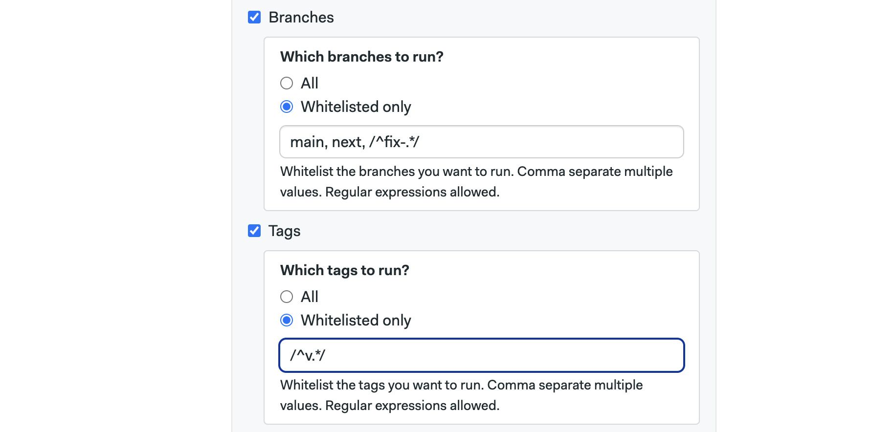
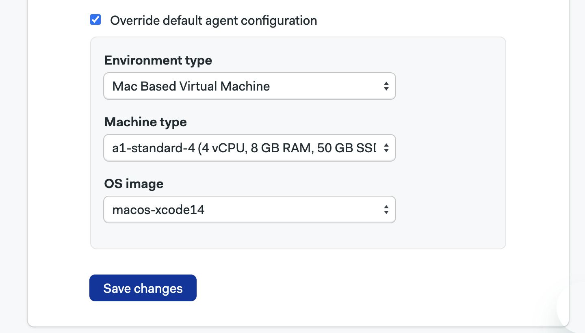

# Projects

import Tabs from '@theme/Tabs';
import TabItem from '@theme/TabItem';
import Available from '@site/src/components/Available';
import VideoTutorial from '@site/src/components/VideoTutorial';

Projects are repositories [continuosly integrated](https://semaphoreci.com/continuous-integration) through Semaphore. A project links your Git repository with Semaphore, so it can run [jobs](./jobs) to test, build, or deploy your application. 

This page explains how to set up projects and what settings are available.

## Create a project {#project-creation}

<VideoTutorial title="Create a Project" src="https://www.youtube.com/embed/Y4Ac5EJpzEc?si=INZVrNw4LTWg3l6k"/>

To create a Semaphore project you need:

- A [Semaphore](https://semaphoreci.com) account with an [organization](./organizations.md)
- A GitHub or Bitbucket account. For more information, see the connection guides
  - [How to connect to GitHub](./connect-github)
  - [How to connect to Bitbucket](./connect-bitbucket)
- A repository with at least one commit

<Tabs groupId="ui-cli">
<TabItem value="ui" label="UI">

Go to Semaphore, press **+Create New** 1 and then press **Choose repository**


1. Select the GitHub or Bitbucket tab. You may need to press the **Connect account** button if this is the first time
2. Select the repository from the list and press on **Choose**
    <details>
    <summary>Show me</summary>
    <div>
    
    </div>
    </details>
3. [Admins and Owners](./rbac#org) may optionally invite repository memebrs to your Semaphore organization and project. Press **Continue**
    <details>
    <summary>Show me</summary>
    <div>
    
    </div>
    </details>
4. Select a started workflow. If in doubt, select **Single Job** and **Start**
    <details>
    <summary>Show me</summary>
    <div>
    
    </div>
    </details>

Semaphore creates a new [pipeline](./pipelines) file in the `.semaphore` folder in the repository and starts working.


</TabItem>
<TabItem value="cli" label="CLI">

After installing and connecting the [Semaphore command line](../reference/semaphore-cli):

1. Clone the repository in your machine
2. Run `sem init` at the root of the repository
3. Push a change to get Semaphore working
 
 ```shell title="Push pipeline to the repository
    git add .semaphore
    git commit "Initalize Semaphore"
    git push origin main
 ```


You can override the project name and URL by using [additional options](../reference/semaphore-cli#sem-edit)

```shell
sem init --project-name <project_name> --project-url <project_url>
```

If you get permission or not find error message, double check the connection between Semaphore and your Git provider:
- [How to connect to GitHub](./connect-github)
- [How to connect to Bitbucket](./connect-bitbucket)

</TabItem>
</Tabs>

## View projects {#view-projects}

<Tabs groupId="ui-cli">
<TabItem value="ui" label="UI">

You can find your projects in Semaphore by pressing on the **Projects** tab and searching by project name.


Semaphore shows the latest activity in the last few days when logging in. 


</TabItem>
<TabItem value="cli" label="CLI">

To get the list of the projects in your organization:

1. If needed, [switch the context](./organizations#org-selection) to your organization
2. Run [sem get](../reference/semaphore-cli) to list your projects

```shell
$ sem get project
NAME                                 REPOSITORY
semaphore-demo-flutter               git@github.com:semaphoreci-demos/semaphore-demo-flutter.git
hello-semaphore                      git@github.com:semaphoreci-demos/hello-semaphore.git
```

</TabItem>
</Tabs>

## How to add people {#people-add}

Semaphore users a [Role Based Access Control](./rbac) model to manage permissions at the organization and project level.

You can only add people to the project if:

- The person has been already invited to your Semaphore organization. Only [Admins and Owners](./rbac#org) can do this
- The person already has access to the GitHub or BitBucket repository

People added to the project can take actions according to their [project-level permisions](./rbac#project). To add a person, open the project on Semaphore and go to the **People** tab:

1. Press **Add People**
2. Select the user from the list of options
3. Select the role
4. Press **Add Selected**


If none of the pre-defined roles suit your needs, you can create [custom project roles](#custom).

:::note

The people you add during [project creation](#project-creation) are assigned roles depending on their permission level on the repository. See [project roles](./rbac#project) to learn how repository roles are mapped to project roles.

:::

## How to change people roles {#people-roles}

To change the role for the project, open your project and go to the **People** tab:

1. Press the **Change role** next to the project member
2. Select the new role


## Project roles {#project-roles}

Semaphore provides pre-defined roles for projects. You can see what actions each role can perform by following these steps:

1. Open the Organization **Settings** menu
2. Select **Roles**
    
3. Scroll down to **Project Roles**
4. Press the eye button next to the role you want to examine

The actions with enabled checkbox are allowed for that role.


### Custom project roles {#custom}

Create custom roles to give your users the precise permissions they need. 

1. Open the Organization **Settings** menu
2. Select **Roles**
3. Scroll down to **Project Roles**
4. Press **New Role**
5. Give a name a description to the new role
6. Enable the permissions allowed to the role. You can use the search box to narrow down options
7. Press **Save changes**


## Project tabs {#manage-projects}

Project members can view or manage the following project elements:

- **Activity**: shows the latest [pipeline](./pipelines) runs
- **Deployments**: access the [project's environment](./promotions#deployment-targets) (formerly deployment targets)
- **Insights**: shows the [insights](./optimization/insights)
- **Artifacts**: shows the [project-level artifacts](./artifacts#projects) and [retention policy](./artifacts#retention)
- **Tasks**: shows the [tasks](./tasks)
- **Flaky Tests**: shows the [flaky tests](./tests/flaky-tests) detected in the project
- **People**: shows the [project members](#people)
- **Settings**: shows the [project-level settings](#settings)


## Settings {#settings}

The **Settings** tab in your project allows you to customize your project settings, add project-level secrets, and manage [artifacts](./artifacts)

### General settings {#general}

In the general project settings, you can: 

- Change the owner of the project. The new owner [must be already part](#people-add) of the project.
- Change the visibility and make the project publicly-viewable
- Change the project name or description
- Delete the project


In addition, you can select when the project is triggered:

- **Do not run on any events** disables automatic runs on Semaphore. You can still run workflows manually or with [tasks](./tasks)
- **Run on** lets you enable or disable running workflows on Semaphore on branches, tags, pull requests, and forked pull requests.
- You can create an allow list for branches and tags



### Repository {#settings-repo}

In **Repository** settings page you can:

- change the URL of your Git repository if you moved it
- configure or reinstall the [GitHub](./connect-github) or [Bitbucket](./connect-bitbucket) connections
- regenerate the [git webhook](./connect-github) if Semaphore is not picking up on the remote changes


### Project secrets {#project-secrets}

In **Secrets** page, you can create project-level [secrets](./secrets.md). These are only accessible for this project and not globally to all the organizations.

To learn how to create project secrets, see the [secrets documentation page](./secrets#create-project-secrets).

Project roles: https://docs.semaphoreci.com/security/default-roles/

### Badges

The **Badge** settings page shows you [shields](https://shields.io/) embed codes for your README or any webpage, allowing team members and users about the build status of your project.

To get a badge embed code:

1. Type the branch name you want to show the status for. This is typically "main" or "master"
2. Select a badge style. This is only a style choice
3. Choose the file format where you will embed the badge
4. Copy the code into your README or webpage


### Artifacts

The **Artifacts** settings page lets you configure the [artifact](./artifacts) retention policy.

To learn more, see the [artifacts retention page](./artifacts#retention)

## Pre-flight checks {#preflight}

<Available plans={['Scaleup']}/>

Pre-flight checks are user-defined commands executed before the pipeline begins as part of the pipeline [initialization job](./pipelines#init-job). They checks allow you to define the type of agent running the initialization job and to manually run commands before a pipeline starts.

:::note

If you want to run commands for all pipelines in your organization, see [organization pre-flight checks](./org-preflight).

:::

### How to set up checks {#preflight-add}

To create, edit, or delete project pre-flight checks, follow these steps:

1. Open the project on Semaphore
2. Go to the **Settings** tab
3. Select **Pre-flight checks**
4. Type the pre-flight commands
5. Optionally, type the name of [secrets](./secrets) to be injected during the initialization job
6. Press **Save changes**


See the [organization pre-flight page](./org-preflight#env-vars) to learn about the available environment variables and see examples of pre-flight checks.

### How to change init agent {#init-agent}

You can change the agent in which the initialization and pre-flight commands run.

To change the initialization for the project, follow these steps:

1. Go to the [Pre-flight settings page](#preflight-add)
2. Check the box **Override default agent configuration**
3. Select an **Environment type**
4. Select a **Machine type**
5. Select an **OS image**
6. Press **Save changes**



:::note

This setting overrides the [organization-wide initialization agent](./organizations#init-agent).

:::

## See also

- [Role Based Access Control](./rbac)
- [Organization pre-flight checks](./org-preflight)
- [How to manage organizations](./organizations.md)
- [How to configure test reports](./tests/test-reports)

