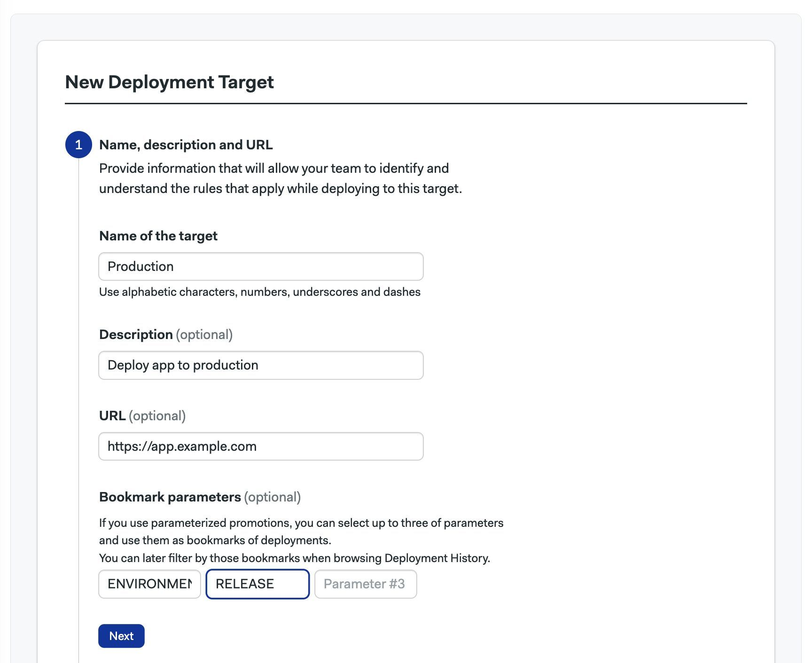

# Promotions

import Tabs from '@theme/Tabs';
import TabItem from '@theme/TabItem';
import Available from '@site/src/components/Available';
import VideoTutorial from '@site/src/components/VideoTutorial';
import Steps from '@site/src/components/Steps';

<VideoTutorial title="How to use promotions" src="https://www.youtube.com/embed/rbf2jb3Uh-E?si=UH-_74icf4KdGYCf" />

Promotions connect [pipelines](./pipelines) to implement continuous delivery and deployment, or other types of automation, such as [blue-green](https://semaphoreci.com/blog/blue-green-deployment) deployments and [canary](https://semaphoreci.com/blog/what-is-canary-deployment) deployments. 

This page explains promotions, how to use them to connect pipelines, and what settings are available.

## Connecting pipelines {#promotions}

If your [project](./projects) contains multiple pipelines, you can use promotions to chain them. 

Using promotions, we can create a tree-like structure where pipelines branch off from other pipelines. The root of the tree is the default pipeline located at `.semaphore/semaphore.yml`.

Promoted pipelines are typically used for continuous delivery and continuous deployment. The following example shows the default pipeline branching into two continuous delivery pipelines: production and development. In each of these, we define the sequence of [jobs](./jobs) needed to deploy the application in the respective environment.


## Promotion triggers {#triggers}

Triggering a promotion means starting the next pipeline in the chain. There are three ways of triggering a promotion:

- **Manual promotions**: This is the default. Start the next pipeline manually.
- **Auto promotions**: Automatically start a promotion based on predefined conditions.
- **Parameterized promotions**: Allow you to pass values as environment variables into the next pipelines, enabling pipeline reuse for different tasks.
- 
## How to add promotions {#create-promotions}

Promotions are defined as pointers to the next pipelines in the chain. You can create multiple promotions and nest pipelines as needed.


<Tabs groupId="editor-yaml">
<TabItem value="editor" label="Editor">

<Steps>

1. Press **+Add Promotion**. 
2. Set a descriptive name for the promotion.
3. Configure the new pipeline and add jobs as needed.

  

</Steps>

Press **Delete Promotion** to completely delete the promotion along with *all its child pipelines*.

</TabItem>
<TabItem value="yaml" label="YAML">

<Steps>

1. Create a new pipeline file in the `.semaphore` folder, e.g., `deploy.yml`.
2. Edit the pipeline from which the new one (from step 1) branches off, e.g., `semaphore.yml`.
3. Add the `promotions` key at the root level of the YAML.
4. Type the `name` of the promotion.
5. Type the `pipeline_file` filename of the pipeline created in step 1.

</Steps>

```yaml title=".semaphore/semaphore.yml"
version: v1.0
name: Initial Pipeline
agent:
  machine:
    type: e1-standard-2
    os_image: ubuntu2004
blocks:
  - name: Build
    dependencies: []
    task:
      jobs:
        - name: Build
          commands:
            - checkout
            - npm run build
# highlight-start
promotions:
  - name: Promotion 1
    pipeline_file: deploy.yml
# highlight-end
```

</TabItem>
</Tabs>

### Automatic promotions {#automatic-promotions}

Automatic promotions start a pipeline based on user-defined conditions.

After [adding a promotion](#promotions), you can set automatic conditions. Whenever Semaphore detects that these conditions are met, the child pipeline automatically starts.

<Tabs groupId="editor-yaml">
<TabItem value="editor" label="Editor">

<Steps>

1. Open the promotion you want to autostart.
2. Enable the checkbox **Enable automatic promotion**.
3. Type in the [start conditions](../reference/conditions-dsl).

  

</Steps>

</TabItem>
<TabItem value="yaml" label="YAML">

<Steps>

1. Open the pipeline file containing the promotion you want to autostart.
2. Add an `auto_promote` key.
3. Add a child `when` key. Type in the [start conditions](../reference/conditions-dsl).

</Steps>

```yaml title=".semaphore/semaphore.yml"
version: v1.0
name: Initial Pipeline
agent:
  machine:
    type: e1-standard-2
    os_image: ubuntu2004
blocks:
  - name: 'Block #1'
    dependencies: []
    task:
      jobs:
        - name: 'Job #1'
          commands:
            - checkout
            - make build
# highlight-start
promotions:
  - name: Promotion 1
    pipeline_file: deploy.yml
    auto_promote:
      when: branch = 'master' AND result = 'passed'
# highlight-end
```

</TabItem>
</Tabs>

### Tagged promotions {#tagged}

Many teams use Git tags to manage their release cycles. To auto-trigger a promotion with tags, you can use Perl Compatible Regular Expressions.

For example:

- `tag =~ '.*'` matches all tags. The presence of any Git tag alone is enough to match the condition.
- `tag =~ '^v1\.'` matches any tag starting with "v1".

You can mix tags and other conditions to trigger promotions with a high level of control.

<Tabs groupId="editor-yaml">
<TabItem value="editor" label="Editor">

The following example shows how to trigger a deployment promotion when all tests have passed and there is a Git tag starting with "v1".


</TabItem>
<TabItem value="yaml" label="YAML">

The following example shows how to trigger a deployment promotion when all tests have passed and there is a Git tag starting with "v1".

```yaml
version: v1.0
name: Continuous Integration Pipeline
agent:
  machine:
    type: e1-standard-2
    os_image: ubuntu2004
blocks:
  - name: Install
    dependencies: []
    task:
      jobs:
        - name: Job
          commands:
          - checkout
          - npm install
          - npm test

promotions:
  - name: Deploy on v1 tag
    pipeline_file: deploy.yml
    # highlight-start
    auto_promote:
      when: result = 'passed' AND tag =~ '^v1\.'
    # highlight-end
```

</TabItem>
</Tabs>


## Parameterized promotions {#parameters}

Parameterized promotions allow you to propagate environment variables across all jobs in the next pipeline.

Use parameters to reduce pipeline duplication. For example, if you create a parameterized pipeline that reads the target environment from a variable, you can reuse it to deploy an application to both production and testing environments. Parameters work with both [manual](#manual-promotions) and [automatic](#automatic-promotions) promotions.

:::note

Parameterized promotions cause Semaphore to run an [initialization job](./pipelines#init-job) before the pipeline starts.

:::

### How to add parameters {#parameters-add}

To add parameters to a promotion, follow these steps:

<Tabs groupId="editor-yaml">
<TabItem value="editor" label="Editor">

<Steps>

1. Select the promotion to which you want to add parameters.
2. Click **+Add Environment Variable**.

    

3. Set the variable name.
4. Set an optional description.
5. Set optional valid options. Leave blank to input value as freeform text.
6. Enable the "This is a required parameter" checkbox if the parameter is mandatory.
7. Set a default value (only when the parameter is mandatory).
8. Add more parameters as needed.

    

</Steps>

</TabItem>
<TabItem value="yaml" label="YAML">

<Steps>

1. Edit the file where you want to add the parameters.
2. Add a `parameters.env_vars` key.
3. Every list item is a new parameter. Set the `name` of the environment variable.
4. Type an optional `description`.
5. Optionally set `required` to `true|false`.
6. Optionally set `options`. Each item in the list is a valid option. Leave blank to input value as freeform text.
7. If `required: true`, set the `default_value`. Optional parameters don't have a default value.

</Steps>

```yaml title=".semaphore/semaphore.yml"
# ...
promotions:
  - name: Push to Prod
    pipeline_file: pipeline_8.yml
    parameters:
      # highlight-start
      env_vars:
        - required: true
          options:
            - Stage
            - Production
          default_value: Stage
          description: Where to Deploy?
          name: ENVIRONMENT
      # highlight-end
```

</TabItem>
</Tabs>

:::info

When a pipeline is triggered with [automatic promotions](#automatic-promotions) the parameter values are automatically filled following these rules:

- Mandatory parameters use the default value.
- Optional parameters are left blank.

:::

### Promoting with the UI {#manual-promotions}

Once you have [added a parameter](#parameters-add), you can select its value from the Semaphore UI.

<Steps>

1. Press the promotion button.
2. Select or type in the value. Optional parameters can be left blank.
3. Press **Start promotion**.

</Steps>

<Tabs>
<TabItem value="options" label="Select value from options">


</TabItem>
<TabItem value="freeform" label="Freeform type value">


</TabItem>
</Tabs>

### Promoting with the API {#api-promotions}

<Available/>

You can pass parameter values to the promotion when it is triggered using the [Semaphore API](../reference/api).

The following is an example of a curl call that includes parameters:

```shell
curl -H "Authorization: Token {api_token}" \
 -d "name={promotion_name}&pipeline_id={parent_pipeline_id}&{param_1_name}={param_1_value}&{param_2_name}={param_2_value}" \
 -X POST "https://{org_name}.semaphoreci.com/api/v1alpha/promotions"
```

### Accessing values in jobs {#access-parameters-jobs}

Parameters are exported as [environment variables](./jobs#environment-variables) in all the jobs contained in the promoted pipeline.

You can access the parameter value by directly using the environment variable in your commands.

<Tabs groupId="editor-yaml">
<TabItem value="editor" label="Editor">


</TabItem>
<TabItem value="yaml" label="YAML">

The parameters are accessible as regular environment variables in the `commands` section.

```yaml title="deploy.yml"
version: v1.0
name: Deployment pipeline
agent:
  machine:
    type: e1-standard-2
    os_image: ubuntu2004
blocks:
  - name: Deploy
    task:
      jobs:
        - name: Deploy
          commands:
            # highlight-next-line
            - echo "Deploy to $ENVIRONMENT"
```

</TabItem>
</Tabs>


### Accessing values in pipelines {#access-parameters-pipeline}

You can access parameter values in pipeline elements like the pipeline name.

Parameters can be accessed in the pipeline configuration using the `${{parameters}}` namespace. For example, if you defined a parameter called `ENVIRONMENT`, you can read its value in the pipeline config as:

```shell
${{parameters.ENVIRONMENT}}
```

Parameters are available in the following places:

- Pipeline `name`.
- Pipeline [queue name](../reference/pipeline-yaml#queue) (only available via YAML).
- As the name of a [secret in the job](./jobs#secrets) (only available in YAML).

<Tabs groupId="editor-yaml">
<TabItem value="editor" label="Editor">


</TabItem>
<TabItem value="yaml" label="YAML">
The following YAML pipeline shows all the places where a parameter value can be used:

```yaml title="deploy.yml"
version: v1.0
# highlight-start
# Use parameter values in the pipeline name
name: '${{parameters.ENVIRONMENT}} deployment of the release: ${{parameters.RELEASE}}'
# highlight-end
agent:
  machine:
    type: e1-standard-2
    os_image: ubuntu2004
queue:
  # highlight-start
  # Use parameter values in the pipeline queue name
  name: '${{parameters.ENVIRONMENT}}-queue'
  scope: project
  # highlight-end
blocks:
    task:
      jobs:
        - name: Using promotion as env. var
          commands:
            # highlight-start
            # Use parameter values inside a job
            - echo $ENVIRONMENT
            - echo $RELEASE
            # highlight-end
version: v1.0
# highlight-next-line
name: '${{parameters.ENVIRONMENT}} deployment of the release: ${{parameters.RELEASE}}'
agent:
  machine:
    type: e1-standard-2
    os_image: ubuntu2004
# highlight-start
queue:
  name: '${{parameters.ENVIRONMENT}}-queue'
  scope: project
# highlight-end
blocks:
  - name: Install
    dependencies: []
    task:
      jobs:
        - name: npm install
          commands:
            # highlight-start
            - echo "Release: $RELEASE"
            - echo "Deploying to $ENVIRONMENT"
            # highlight-end
      # highlight-start
      secrets:
        - name: 'creds-for-${{parameters.ENVIRONMENT}}'
      # highlight-end
```

</TabItem>
</Tabs>

## Environments (deployment targets) {#deployment-targets}

<VideoTutorial title="How to Use Environments" src="https://www.youtube.com/embed/xId2H2wlKx4?si=0IXKyNNUVVjDDvHz" />

Environments provide additional controls over [pipelines](./pipelines). You can limit who can trigger a pipeline and when, or define fine-grained secrets and environment variables.

:::note

Environments were formerly known as "Deployment Targets".

:::

### Overview {#overview-environments}

Environments allow you to tightly control [promotions](#promotions), preventing unauthorized users from starting a critical pipeline. Additionally, deployment targets can restrict branches, and pull requests, and protect [secrets](./secrets).

Environments also provide a convenient way to [view the history of your deployments](#view-history).

Configuring a deployment target is a two-step process:

1. Create a deployment target.
2. Associate the target with a promotion.

### How to create an environment {#create-environment}

Environments can be defined once and used in multiple promotions in a project.

To create an environment, navigate to your Semaphore project and:

<Steps>

1. Go to the **Deployment Targets** tab.
2. Press **Create your first Deployment Target**.

    

3. Fill in the deployment details:
    - Name of the deployment.
    - Optional description.
    - Optional URL of the deployed application.
    - Optional bookmarks.
4. Press **Next**

    

</Steps>

The bookmarks are useful when using [parameterized promotions](#parameters). You can add up to three bookmarks matching the names of the parameters in the promotions. Think of the bookmarks as additional filters available in the deployment history view.

### Credentials and secrets {#credentials}

Credentials are a restricted type of [secrets](./secrets) that are only accessible to authorized members of your organization.

In the second part, you can define environment variables and upload files that will be accessible to the promoted pipelines. All information will be encrypted once saved.

Credentials are optional. Go to the next step if you don't need them.

<Steps>

1. Set the environment variable name and value.
2. Add more variables as needed.
3. Upload a file and set where to put it in the [agent](./pipelines#agents).
4. Add more files as needed.
5. Press **Next**.

    <details>
    <summary>Show me</summary>
    <div>
    
    </div>
    </details>

</Steps>

### Granular permissions {#granular-permissions}

<Available plans={['Scaleup']} />

In the "Who can deploy?" section, you can define the users and roles that can manually start the promotion. Granular permissions are optional. You can go to the next section if you don't need to restrict access to the promotion.

By default, everyone can start the promotion linked to this environment. To restrict access:

<Steps>

1. Select **Allow only particular users to deploy**.
2. Optionally, select the roles that can deploy from the list.
3. Optionally, select the members of your organization that can deploy.
4. Uncheck the **Allow automatic promotions from target** option to disallow [automatic promotions](#automatic-promotions).
5. Press **Next**.

    <details>
    <summary>Show me</summary>
    <div>
    
    </div>
    </details>

</Steps>

### Git-based permissions {#git-permissions}

In the fourth part, you can restrict which Git branches and tags are allowed to start a promotion. Here, you can also block promotions coming from pull requests. This section is optional.

To restrict Git-based access:

<Steps>

1. Select which branches are enabled for promotions: all, none, or a list of allowed branches.
2. Select which Git tags are enabled: all, none, or a list of allowed tags.
3. Enable or disable pull requests from triggering promotions.
4. Press **Next**.
5. Press **Create**.

    <details>
    <summary>Show me</summary>
    <div>
    
    </div>
    </details>

</Steps>

Once done, you can see the created environment in the **Deployments** tab.

:::tip Exact match or regular expressions?

Branches and tags can be matched in two ways:
- **Exact match**: strings must match exactly.
- **Regex match**: strings are matched using Perl-compatible regular expressions. See the [Erlang re module documentation](https://www.erlang.org/doc/man/re.html) to see more details on the syntax.

:::

### How to view deployment history {#view-history}

The **Deployment** tab allows you to track your previous deployments. In this tab, you can see:

- Who started the last deployment.
- Which commit was used.
- Which [workflow](./workflows) the deployment belongs to.

You can also stop a running pipeline or rerun a promotion if you have the rights to do so.


Press **View full history** to see the latest deployments in reverse chronological order.


Use **Newer** and **Older** buttons to navigate to other pages. You can also jump to a specific date.

You can also filter deployments by:
- **Type**: View branches, tags, pull requests, or everything.
- **Author**: Everyone or just you.
- **Origin**: Branch, tag, or pull request.
- **Promotion parameters**: These are the [bookmarks](#create-environment) added to the environment target.

To filter using promotion parameters, type the value of the parameter and press Enter. This feature is useful when you have [parameterized promotions](#promotions).


### How to target promotions {#promotion-target}

Once you have created at least one environment, you can associate it with a [promotion](#promotions). This creates a targeted promotion.


<Tabs groupId="editor-yaml">
<TabItem value="editor" label="Editor">

Press **Edit workflow** to open the visual editor and:

<Steps>

1. Select or create a promotion.
2. In **Deployment target**, select the target from the dropdown list.

  Select **No target** to remove the association between the deployment target and the promotion.
  

</Steps>

</TabItem>
<TabItem value="yaml" label="YAML">

<Steps>

1. Edit the pipeline file with the promotion you want to target.
2. Add a `deployment_target` key to the promotion. The value is the name of the environment you want to associate with this promotion.

</Steps>

Delete `deployment_target` to remove the association between the environment and the promotion.

```yaml title=".semaphore/semaphore.yml"
# ...
promotions:
  - name: Promotion 1
    pipeline_file: pipeline_4.yml
    # highlight-next-line
    deployment_target: Production
```

</TabItem>
</Tabs>

### Promoting environments {#targeted-promotions}

Promotions with attached environments show a lock icon next to the promotion button. The icon will be unlocked if you have permission to start the promotion or locked if you don't.

<Tabs groupId="targeted-promotions">
<TabItem value="unlocked" label="Unlocked promotion">

The promotion is unlocked. Press the promotion button to start the next pipeline.


</TabItem>
<TabItem value="locked" label="Locked promotion">

The promotion is locked. The button is grayed out, and you can't start the next pipeline.


</TabItem>
</Tabs>

:::warning

Anyone with write access to the repository can edit the pipeline file and remove the environment in the promotion.

:::

### Help! I can't start a promotion {#promotion-debug}

Once a [promotion](#promotions) is targeted, you may be locked out from starting it. The most common reasons that a promotion appears as blocked are:

- You don't have the correct permissions to deploy to the bound [environment](#overview-environments).
- You are on a Git branch, tag, or pull request that is not allowed.
- You are not logged in, or you are viewing a build of a public project.
- The environment is deactivated or deleted.

### Promoting environments via API {#promotion-api}

You can also use the [Public API (alpha)](../reference/api) to trigger promotions. If a promotion is forbidden by the environment, you will receive an `HTTP 400 Bad Request` response with a reason in the body.

## See also

- [Pipeline YAML reference](../reference/pipeline-yaml)
- [Promotion conditions reference](../reference/conditions-dsl)
- [Plan job and block execution with pipelines](./pipelines)
