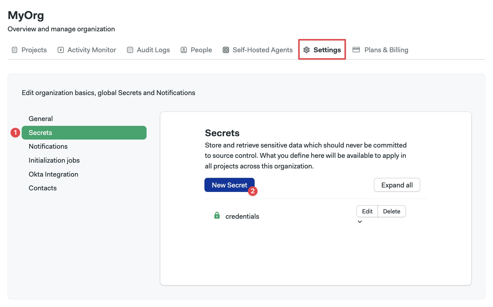
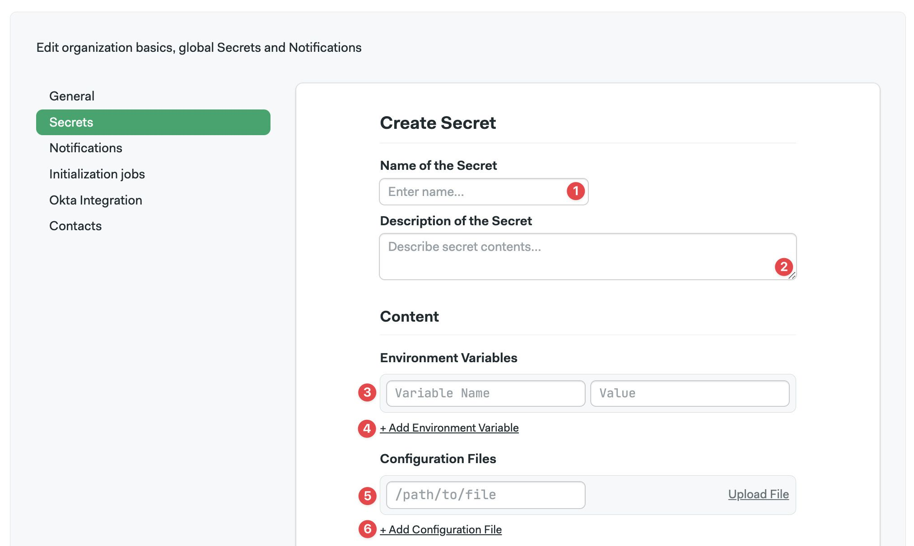
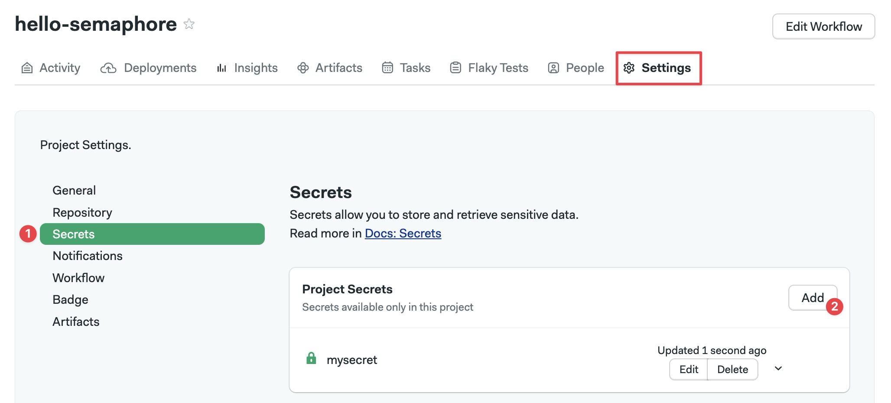
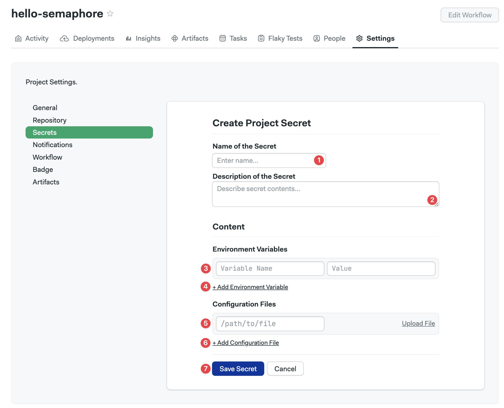

# Secrets

import Tabs from '@theme/Tabs';
import TabItem from '@theme/TabItem';
import Available from '@site/src/components/Available';
import VideoTutorial from '@site/src/components/VideoTutorial';
import Steps from '@site/src/components/Steps';

<VideoTutorial title="How to use secrets" src="https://www.youtube.com/embed/rAJIRX81DeA"/>

Secrets store sensitive data such as API keys, passwords, or SSH keys. This page explains the different kinds of secrets, their scopes, and how to create and secure them.

## Overview {#overview}

Secrets are encrypted on creation and decrypted on runtime when required for [jobs](./jobs#secrets). Once a secret is created, its contents are no longer visible to users.

Secrets implement two kinds of values:

- **Variables**: key-value pairs. Available as environment variables in jobs
- **Files**: arbitrary files, they are injected into the job environment at a specified path

Secrets can be created in three scopes:

- [Organization](./organizations): organization secrets are available in all projects in your organization
- [Project](./projects): project secrets are available only to a single project
- [Environment credentials](./promotions#credentials): environment credentials are available only to pipelines targeted by [deployment targets (environments)](./promotions#deployment-targets)

<details>
<summary>How are secret collisions managed?</summary>
<div>

A collision happens when secrets with the same name are defined on multiple levels. The collision is resolved with the narrowest scope always winning. In other words:

- Environment credentials always take precedence
- Project secrets win over organization secrets
- Organization secrets take the least precedence

</div>
</details>

## How to create organization secrets {#org-secrets}

Organization secrets are available to all the [projects](./projects) in the organization. If you need more fine-grained control, you can set up [secret access policies](#secret-access-policy) or use the [credentials in environments](./promotions#credentials) instead.

You can create secrets using the UI or the command line.


<Tabs groupId="ui-cli">
<TabItem value="ui" label="UI">

To create an organization secret, go to the [organization settings](./organizations#general-settings) and:


<Steps>

1. Select **Secrets**
2. Press **New Secret**

    

3. Enter the name of the secret
4. Add an optional description
5. To add a key value, add the secret name and value
6. Add more variables as needed
7. To add a file, add the path and upload the file
8. Add more files as needed
9. Press **Save secret** or continue to [access policy](#secret-access-policy)

    

</Steps>

</TabItem>
<TabItem value="cli" label="CLI">

To create a secret using the Semaphore command line tool use:

```shell title="Creating a secret"
sem create secret <secret-name> \
 -e <VAR_NAME>=<var_value> \
    -f <local_file_path>:<agent_file_path>
```

You can define multiple environment variables at once:

```shell title="Defining multiple variables example"
sem create secret awskey \
 -e AWS_ACCESS_KEY_ID=your-value \
    -e AWS_SECRET_KEYID=your-value
```

In addition, you can upload multiple files as secrets:

```shell title="Creating multiple secret files example"
sem create secret sshkeys \
 -f $HOME/.ssh/id_rsa:/home/semaphore/.ssh/id_rsa \
    -f $HOME/.ssh/id_rsa.pub:/home/semaphore/.ssh/id_rsa.pub
```

To view all organization secrets:

```shell title="Viewing organization secrets"
$ sem get secret
NAME                   AGE
awskey                 1d
sshkeys                1d
```

To view a specific secret use `sem get secret <secret-name>`:

```shell title="Viewing a secret"
$ sem get secret awskey
apiVersion: v1beta
kind: Secret
metadata:
  name: awskey
  id: 31887bfb-fac5-4f5b-9a6a-059ecebcc851
  create_time: 1556828155
  update_time: 1621528405
data:
  env_vars:
  - name: AWS_ACCESS_KEY_ID
  - name: AWS_SECRET_ACCESS_KEY
  files: []
```

To edit a secret:


<Steps>

1. Run `sem edit secret <secret-name>`
2. Make your changes in the editor
3. When done, save and exit the editor to save your changes

</Steps>

</TabItem>
</Tabs>

To create secrets with the Semaphore API, see the [API reference page](../reference/api#secrets)

### Access policy {#secret-access-policy}

<VideoTutorial title="How to configure secret access policu" src="https://www.youtube.com/embed/gB1Oat4HwTo?si=_dvCKllE0bPgtDFe" />

<Available plans={['Scaleup']}/>

Access policies let you control how and who can use [organization secrets](#org-secrets). 

You can apply a policy on three levels:

- **Projects**: the secret is available on all, none, or a list of projects
- **Debug Sessions**: persons connecting with [debug session](./jobs#debug-jobs) can see the contents of the secrets. Here you can disable debug sessions for jobs using this secret
- **Attaching to jobs**: likewise, [attaching to a running job](./jobs#attach-job) can likewise expose secrets. Disabling this option prevents this secret from being viewed

<details>
<summary>Show me</summary>
<div>

</div>
</details>

## How to create project secrets {#create-project-secrets}

<Available plans={['Scaleup']}/>

Project secrets are only available to the [project](./projects) it is tied to.

<Tabs groupId="ui-cli">
<TabItem value="ui" label="UI">

To create a project secret, navigate to your project and select the **Settings** tab.


<Steps>

1. Select **Secrets**
2. Press **Add**

    

3. Type the name of the secret
4. Type a description
5. To add a key value, add the secret name and value
6. Add more values as needed
7. To add a file, add the path and upload the file
8. Add more files as needed
9. Press **Save secret**

    

</Steps>

</TabItem>
<TabItem value="cli" label="CLI">

To create a project secret using the Semaphore command line tool use:

```shell title="Creating a secret"
sem create secret -p <project-name> <secret-name> \
 -e <VAR_NAME>=<var_value> \
    -f <local_file_path>:<agent_file_path>
```

You can define multiple environment variables at once:

```shell title="Defining multiple variables example"
sem create secret -p myproject awskey \
 -e AWS_ACCESS_KEY_ID=your-value \
    -e AWS_SECRET_KEYID=your-value
```

In addition, you can upload multiple files as secrets:

```shell title="Creating multiple secret files example"
sem create secret -p myproject sshkeys \
 -f $HOME/.ssh/id_rsa:/home/semaphore/.ssh/id_rsa \
 -f $HOME/.ssh/id_rsa.pub:/home/semaphore/.ssh/id_rsa.pub
```

:::info

Absolute paths for `<agent_path_file>` are mounted relative to the root on the agent's disk. So `/etc/hosts` is actually mounted at `/etc/hosts` in the agent's machine or container.

Relative paths are mounted relative to the agent's service account home directory. So `.ssh/id_rsa` is mounted as `/home/semaphore/.ssh/id_rsa`.

:::

To view all organization secrets:

```shell title="Viewing project secrets"
$ sem get secret -p <project-name>
NAME                   AGE
awskey                 1d
sshkeys                1d
```

To view a specific secret use `sem get secret -p <project-name> <secret-name>`:

```shell title="Viewing a secret"
$ sem get secret awskey
apiVersion: v1beta
kind: Secret
metadata:
  name: awskey
  id: 31887bfb-fac5-4f5b-9a6a-059ecebcc851
  create_time: 1556828155
  update_time: 1621528405
data:
  env_vars:
  - name: AWS_ACCESS_KEY_ID
  - name: AWS_SECRET_ACCESS_KEY
  files: []
```

To edit a secret:

<Steps>

1. Run `sem edit secret -p <project-name> <secret-name>`
2. Make your changes in the editor
3. When done, save and exit the editor to save your changes

</Steps>

</TabItem>
</Tabs>

It's worth noting that if you define a secret with the same name at both the organization and project levels, the project-level secret will take precedence over the organization-level secret.

To create secrets with the Semaphore API, see the [API reference page](../reference/api#secrets)

## Environment credentials

Environment credentials are active only for specific pipelines attached to environments.

For more information, see the [promotions and environments](./promotions#credentials)

## See also

- [How to create secrets with the Semaphore CLI](../reference/toolbox)
- [How to manage organization secrets](./organizations.md)
- [How to create secrets with the Semaphore API](../reference/api.md#secrets)