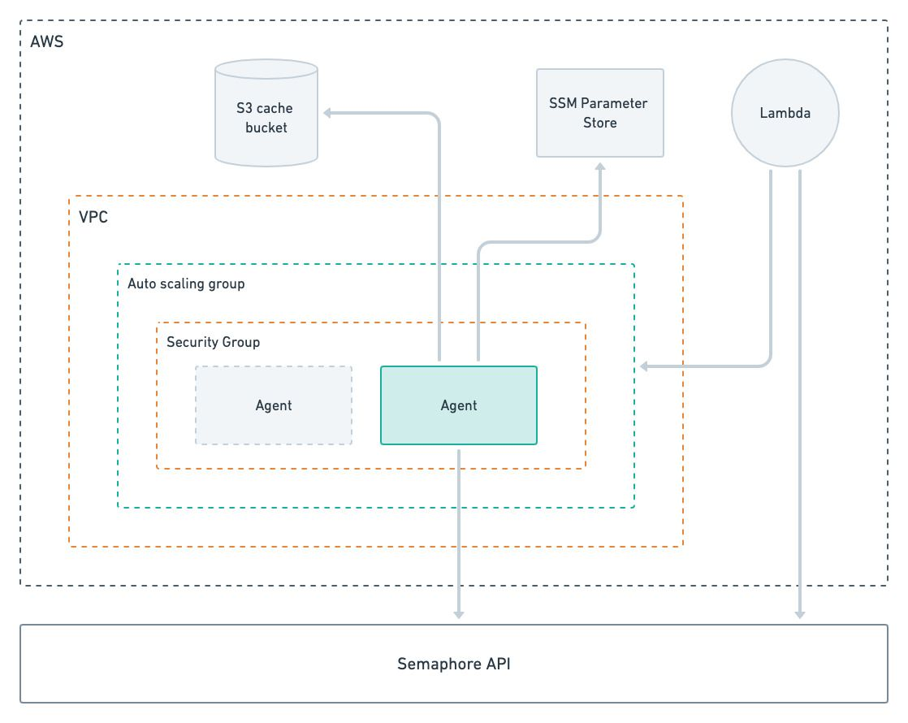

# Autoscaling with AWS

import Tabs from '@theme/Tabs';
import TabItem from '@theme/TabItem';
import Available from '@site/src/components/Available';
import VideoTutorial from '@site/src/components/VideoTutorial';

<Available plans={['Startup (Hybrid)', 'Scaleup (Hybrid)']}/>

Semaphore provides the open-source [AWS agent stack](https://github.com/renderedtext/agent-aws-stack) to help you deploy an autoscaling fleet of self-hosted agents in AWS.


## Overview

The AWS agent stack lets you autoscale EC2 instances on demand. Running cloud instances only when they are needed can help you gracefully manage bursts of activity and save costs when there is no work being done.

The AWS agent stack provides the following features:

- run self-hosted agents for Linux, macOS, and Windows
- [scale up and down](#scale) the number of agents based on demand
- manage [multiple stacks](#stacks) of agents using different agent types
- access agents EC2 instances [with SSH](#ssh) or using [AWS Session Manager](https://docs.aws.amazon.com/systems-manager/latest/userguide/session-manager.html)
- use S3 buckets to provide cache storage
- fine-grained control for the size of your agent instances and your agent pool




## Prerequisites

The AWS agent stack requires the following:

- An AWS account
- [AWS CDK](https://docs.aws.amazon.com/cdk/v2/guide/home.html)
- [Make](https://www.gnu.org/software/make/)
- [Packer.io](https://www.packer.io/)
- Node v18 and npm or greater
- Python 3.9 or greater

## How to deploy AWS agents {#deploy}

Follow these steps to deploy self-hosted agents in AWS.

1. Install the [latest AWS stack](https://github.com/renderedtext/agent-aws-stack/releases) and dependencies

    ```shell title="Installing AWS stack and dependencies"
    curl -sL https://github.com/renderedtext/agent-aws-stack/archive/refs/tags/v0.3.6.tar.gz -o agent-aws-stack.tar.gz
    tar -xf agent-aws-stack.tar.gz
    cd agent-aws-stack-0.3.6
    npm install
    ```

2. Build the AMI images

    Build the container images using Packer.io. You can build Linux, Windows, and macOS images

    Images are built by default for the "us-east-1" region. To change regions add `AWS_REGION` to the Packer command. For example:

    ```shell title="Changing AWS region"
    make packer.build AWS_REGION=us-west-1
    ```

    <details>
    <summary>Linux AMI</summary>
    <div>

    ```shell title="Build Ubuntu-based Docker image"
    make packer.init
    make packer.build
    ```

    </div>
    </details>

    <details>
    <summary>Windows AMI</summary>
    <div>

    ```shell title="Build Windows Server-based image"
    make packer.init
    make packer.build PACKER_OS=windows
    ```

    </div>
    </details>


    <details>
    <summary>macOS AMI</summary>
    <div>

    ```shell title="Build macOS image"
    make packer.init

    # To build an AMD AMI (EC2 mac1 family)
    make packer.build PACKER_OS=macos AMI_ARCH=x86_64 AMI_INSTANCE_TYPE=mac1.metal

    # To build an ARM AMI (EC2 mac2 family)
    make packer.build PACKER_OS=macos AMI_ARCH=arm64 AMI_INSTANCE_TYPE=mac2.metal
    ```

    </div>
    </details>


3. Encrypt your registration token

    The registration token created when registering the agent must be encrypted on AWS using [SSM](https://docs.aws.amazon.com/systems-manager/latest/userguide/ssm-agent.html)

    To create an SSM secret, run the following command replacing:

    - `<ssm-parameter-name>` with the name for the secret, e.g. `semaphore-registration-token`
    - `<token>` with the registration token obtained during [agent registration](./self-hosted-install#register-agent)

    ```shell title="Creating an SSM secret"
    aws ssm put-parameter \
        --name <ssm-parameter-name> \
        --value "<token>" \
        --type SecureString
    ```

4. Create an execution policy for Cloudformation

    Run the following command to create `execution-policy.json`. This instructs CDK to list the Cloudformation permissions it needs to deploy the self-hosted agents

    ```shell title="Obtaining the Cloudformation policy"
    aws iam create-policy \
        --policy-name agent-aws-stack-cfn-execution-policy \
        --policy-document file://$(pwd)/execution-policy.json \
        --description "Cloudformation policy to deploy the agent-aws-stack"
    ```

5. Configure the stack

    Create configuration files for all the image types you plan to use. These files are used by the self-hosted agent to access your Semaphore organization

    Replace:
    - `<stack-name>` with the name of the stack, e.g. `my-aws-agents-linux`
    - `<ssm-parameter-name>` with the name of the secret created on Step 3
    - `<your-organization>.semaphoreci.com` with your [organization URL](./organizations#general-settings), e.g. `my-org.semaphoreci.com`
    - `<license-configuration>` the license information from Apple (only for macOS)

    <br>
   <details>
    <summary>Linux</summary>
    <div>

    ```json title="config.json for Linux" 
    {
        "SEMAPHORE_AGENT_STACK_NAME": "<stack-name>",
        "SEMAPHORE_AGENT_TOKEN_PARAMETER_NAME": "<ssm-parameter-name>",
        "SEMAPHORE_AGENT_TOKEN_KMS_KEY": "<ssm-parameter-name>",
        "SEMAPHORE_ENDPOINT": "<your-organization>.semaphoreci.com"
    }
    ```
    </div>
    </details>

    <details>
    <summary>Windows</summary>
    <div>

    ```json title="config.json for Windows" 
    {
        "SEMAPHORE_AGENT_STACK_NAME": "<stack-name>",
        "SEMAPHORE_AGENT_TOKEN_PARAMETER_NAME": "<ssm-parameter-name>",
        "SEMAPHORE_AGENT_TOKEN_KMS_KEY": "<ssm-parameter-name>",
        "SEMAPHORE_ENDPOINT": "<your-organization>.semaphoreci.com",
        "SEMAPHORE_AGENT_OS": "windows"
    }
    ```
    </div>
    </details>

    <details>
    <summary>macOS</summary>
    <div>

    ```json title="config.json for macOS" 
    {
        "SEMAPHORE_AGENT_STACK_NAME": "<stack-name>",
        "SEMAPHORE_AGENT_TOKEN_PARAMETER_NAME": "<ssm-parameter-name>",
        "SEMAPHORE_AGENT_TOKEN_KMS_KEY": "<ssm-parameter-name>",
        "SEMAPHORE_ENDPOINT": "<your-organization>.semaphoreci.com",
        "SEMAPHORE_AGENT_OS": "macos",
        "SEMAPHORE_AGENT_DISCONNECT_AFTER_IDLE_TIMEOUT": "86400",
        "SEMAPHORE_AGENT_MAC_FAMILY": "mac1",
        "SEMAPHORE_AGENT_INSTANCE_TYPE": "mac1.metal",
        "SEMAPHORE_AGENT_AZS": "us-east-1a,us-east-1b,us-east-1d",
        "SEMAPHORE_AGENT_LICENSE_CONFIGURATION_ARN": "arn:aws:license-manager:<region>:<accountId>:license-configuration:<license-configuration>"
    }
    ```

    :::info


    When a macOS instance is terminated it may take a long time for new one to start in its place. This may affect the time to rotate agents.

    macOS dedicated hosts are allocated for a minimum of 24 hours. It is recommended to set [`SEMAPHORE_AGENT_DISCONNECT_AFTER_IDLE_TIMEOUT`](../reference/self-hosted-config#disconnect-after-idle-timeout) to at least 24 hours for macOS-based agents. This means that new instances started up due to a burst of demand may continue running idle for a long time before being shutdown.

    See [Amazon EC2 Mac instances](https://docs.aws.amazon.com/AWSEC2/latest/UserGuide/ec2-mac-instances.html) for more information.

    :::

    </div>
    </details>

7. Bootstrap the CDK application

    Open the file `execution-policy.json` created in Step 4 and copy the ARN value. 
    Replace:
    - `<Arn>` with the value from the policy file
    - `<AWS_ACCOUNT_ID>` your AWS account id
    - `<AWS_REGION>` your AWS region

    ```shell title="Bootstrapping the CDK application"
    SEMAPHORE_AGENT_STACK_CONFIG=config.json \
        npm run bootstrap -- aws://<AWS_ACCOUNT_ID>/<AWS_REGION> \
        --cloudformation-execution-policies <Arn>
    ```

    :::note

    If you omit the option `--cloudformation-execution-policies` the stack will be deployed using full AdministratorAccess policies

    :::

8. Deploy the stack

    To deploy the stack, execute the following command

    ```shell title="Deploy the stack"
    SEMAPHORE_AGENT_STACK_CONFIG=config.json npm run deploy
    ```

## How to upgrade self-hosted agents

Changing a configuration settings or any of the deployed images requires an in-place upgrade. The CDK application will compute the Cloudformation changes required.

You can see what changed by running:

```shell
npm run diff
```

Update the stack with:

```shell
npm run deploy
```

After the update, you must restart all the running agents.

## How to delete AWS agents

To delete the AWS agents stack, run the following command:

```shell title="WARNING this will delete all the self-hosted agents"
SEMAPHORE_AGENT_STACK_CONFIG=config.json npm run destroy
```

:::info

After deleting a macOS stack you need to manually delete the host resource group the hosts where attached to. You must also manually release the dedicated hosts associated to that resource group.

:::

## Configuration settings

See the [self-hosted parameters reference](../reference/self-hosted-config) for all the available parameters.

### Cache

See [setting up S3 cache](./optimization/cache#aws) to learn how to configure cache with AWS S3 buckets.

### Autoscaling {#scale}

The self-hosted AWS stack dynamically scales agents based on the job demand. A Lambda function periodically polls the Semaphore API to determine the number of pending jobs for a given agent type. When the function determines more agents are needed, it will update the autoscaling group, resulting in new EC2 instances being launched.

When there are more running agents than jobs over a period of time, the function will decrease the capacity of the autoscaling group, effectively shutting down idle agents. When all agents are idle the autoscaling capacity is decreased to zero.

You con control the autoscaling behavior using the following parameters in `config.json`:

- [`SEMAPHORE_AGENT_DISCONNECT_AFTER_IDLE_TIMEOUT`](../reference/self-hosted-config#disconnect-after-idle-timeout) time in minutes allowed for the agent to idle before being shutdown. Default is 5 minutes. Setting this value to 0 prevents the agent from ever shutting down
- `SEMAPHORE_AGENT_ASG_MAX_SIZE` this is the upper limit for the autoscaling group for a given agent type. The Lambda function will never spin up more than this number of machines
- `SEMAPHORE_AGENT_ASG_MIN_SIZE` this is the lower limit for the autoscaling group for a given agent type. When set to a value greater than 0 the Lambda function will leave this number of agents idling without shuttind them down
- `SEMAPHORE_AGENT_USE_DYNAMIC_SCALING` when set to false, the autoscaling is disabled. In this scenario, the stack consists of a static number of agents always running

### Multiple agent types {#stacks}

You need to create an AWS stack for every agent type you run self-hosted. For example, if you wish to run Linux and Windows machines, you need two stacks.

To create multiple stacks, follow the [deploy steps](#deploy) and:

- Use a different `SEMAPHORE_AGENT_STACK_NAME` for every agent type
- Create an SSM encrypted parameter for each agent registration token
- Set `SEMAPHORE_AGENT_TOKEN_PARAMETER_NAME` to point to the respective SSM encrypted parameter

### Job isolation {#isolation}

AWS stacks give you full job isolation out of the box since the agent will shutdown after executing a job. A new agent will be launched for the following job.

Rotating EC2 instances in this way can be slow. You can opt for not shutting down the agent after a job by setting the [`SEMAPHORE_AGENT_DISCONNECT_AFTER_JOB`](../reference/self-hosted-config#disconnect-after-job) parameter.

### Network VPC

Self-hosted agents in AWS connect to your [default AWS VPC](https://docs.aws.amazon.com/vpc/latest/userguide/default-vpc.html). All agents have public and private IPv4 addresses and run on a public subnet.

You can change this behavior by creating a new VPC and subnets and configuring the parameters `SEMAPHORE_AGENT_VPC_ID` and `SEMAPHORE_AGENT_SUBNETS` during setup.


## Troubleshooting tips

This section explains how to troubleshoot, view logs, and access the EC2 instances.

### Agent logs {#logs}

Agents use [CloudWatch](https://docs.aws.amazon.com/AmazonCloudWatch/latest/monitoring/Install-CloudWatch-Agent.html) to push logs to CloudWatch.

You can find the logs in these locations:

- **Agent logs**: agent log belong to the `semaphore/agent` log group 
  - **Linux logs**: located at `/tmp/agent_log`
  - **Windows logs**: located at `/tmp/agent_log`
- **Linux cloud init logs**: pushed to the `/semaphore/cloud-init` and `/semaphore/cloud-init/output` log groups
- **Windows cloud init logs**: pushed to the `/semaphore/EC2Launch/UserdataExecution` log group
- **System logs**: pushed to the `/semaphore/system` log group

Agent logs, cloud init logs and systems logs are pushed from the EC2 instance to CloudWatch using the CloudWatch agent:

Agent logs are pushed to the semaphore/agent log group. In Linux instances, the agent logs are located at /tmp/agent_log. In Windows instances, the agent logs are located at C:\\semaphore-agent\\agent.log.
In Linux instances, the cloud init logs are pushed to the /semaphore/cloud-init and /semaphore/cloud-init/output log groups. In Windows instances, the cloud init logs are pushed to the /semaphore/EC2Launch/UserdataExecution log group.
System logs are pushed to the /semaphore/system log group

### SSH access {#ssh}

You can access your EC2 machines in two ways:

- **SSH**: only works for instances with public IPs. The default security group does not allow inbound access so to allow SSH access you have to create a security group and use the `SEMAPHORE_AGENT_SECURITY_GROUP_ID` to instruct the stack to use it
- **AWS Session Manager**: [AWS Systems Manager Session Manager](https://docs.aws.amazon.com/systems-manager/latest/userguide/session-manager.html) allows access to instances using private IPs. This is the only way to access machines in private subnets

### Invalid agent registration {#invalid-agent}

If you experience agent registration errors, follow these steps to troubleshoot:

1. Go to the CloudWatch console
2. Select Log Groups
3. Select the `semaphore/agent` log group
4. Select the EC2 instance id for the instance running your agent
5. Verify that the agent is running. If not, check for messages about failed registration requests

## See also

- [What are self-hosted agents](./self-hosted)
- [Self-hosted agents configuration reference](../reference/self-hosted-config)
- [Docker environments](./pipelines#docker-environments)
