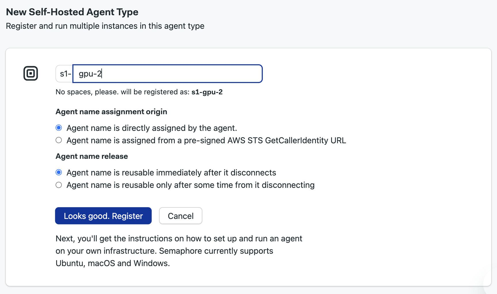
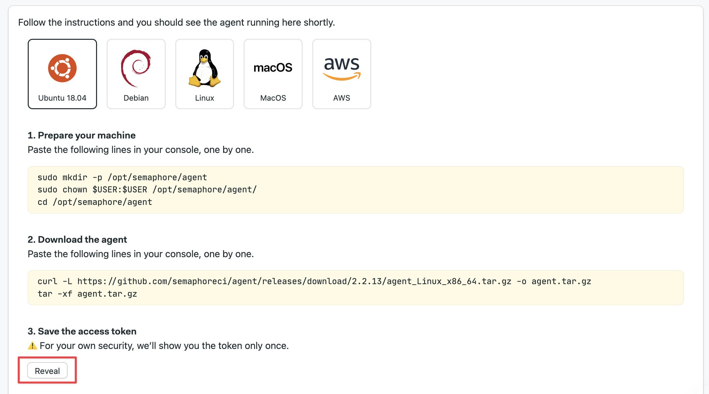

# Install Agents

import Tabs from '@theme/Tabs';
import TabItem from '@theme/TabItem';
import Available from '@site/src/components/Available';
import VideoTutorial from '@site/src/components/VideoTutorial';

<Available plans={['Startup (Hybrid)', 'Scaleup (Hybrid)']}/>

## Overview


Before you can run jobs in your hardware, you need to install and register the self-hosted agent stack. This page explains how to install the stack on several platforms.

## How to register agent type {#register-agent}

The agent type is the name assigned to agents running on the same hardware or platform. Semaphore expects all self-hosted agents to belong to one agent type.

To register a self-hosted agent type, follow these steps:

1. Open the [organization](./organizations) menu on the top-right corner
2. Select **Self-hosted agents**
3. Press **Add self-hosted agent type**
4. Type the name of the agent type. Self hosted agents all begin with `s1-`, e.g. `s1-gpu-2`
5. Select **Agent name is directly assigned by the agent** unless you're using [AWS Security Tokens](#aws)
6. Select if the agent is available immediately after disconnection or not
7. Press **Looks good**



The next page shows detailed instructions to install and connect the self-hosted agent in the platform of choice. Press the **Reveal** button to show the registration token. Save it in a safe place for the next step.



## How to install agent stack {#install}

The Semaphore self-hosted agent is [open source](https://github.com/semaphoreci/agent). The prerequisites to install the self-hosted agent stack are:

- Git
- Bash (Linux and macOS) or PowerShell (Windows)
- A local user with sudo powers and Docker management permissions (Linux or macOS)
- A user with sudo powers (Linux and macOS)
- Docker [running as non-root](https://docs.docker.com/engine/install/linux-postinstall/#manage-docker-as-a-non-root-user) (Linux and macOS)
- Docker Compose (Linux and macOS)

Scroll down to learn how to install the stack in your hardware.

### Kubernetes {#kubernetes}

Semaphore provides [Helm charts](https://github.com/renderedtext/helm-charts) to run agents in a Kubernete cluster.

To install the Semaphore custom controller, follow these steps:

1. Install [Helm](https://helm.sh/)
2. Add the Semaphore Helm chart

    ```shell title="Add Helm repository"
    helm repo add renderedtext https://renderedtext.github.io/helm-charts
    ```

3. Install the [agent-k8s-controller](https://github.com/renderedtext/agent-k8s-controller) with Helm

    Replace:
    - `<my-org.semaphoreci.com>` with your [organization URL](./organizations#general-settings)
    - `<token>` with the [registration token](#register-agent) you received earlier

    ```shell title="Install agent-k8s-controller"
    helm upgrade --install semaphore-controller renderedtext/controller \
    --namespace semaphore \
    --create-namespace \
    --set endpoint=my-org.semaphoreci.com \
    --set apiToken=<token>
    ```

4. Create a secret to register the agent type in the Kubernetes cluster. Create a new YAML resource file.

     Replace: 
     - `<AGENT_TYPE>` with the type you [created during registration](#register-agent)
     - `<AGENT_TYPE_REGISTRATION_TOKEN>` with the token you received during registration
     - The custom controllers looks for the `label` shown below to know what secret is relevant to this connection

    ```yaml title="semaphore-secret.yml"
    apiVersion: v1
    kind: Secret
    metadata:
        name: my-semaphore-agent-type
        namespace: semaphore
        labels:
            semaphoreci.com/resource-type: agent-type-configuration
    stringData:
        agentTypeName: <AGENT_TYPE>
        registrationToken: <AGENT_TYPE_REGISTRATION_TOKEN>
    ```

5. Create the secret in Kubernetes

    ```shell
    kubectl apply -f semaphore-secret.yml
    ```

The Helm chart provides a few additional configuration options so you can tweak your installation to best suit your needs. Run `helm show values renderedtext/controller` to view all available settings.

See the [Helm chart repo](https://github.com/renderedtext/helm-charts/tree/main/charts/controller) to learn more.

### Ubuntu/Debian {#ubuntu}

Follow these steps to install self-hosted agent in Ubuntu or Debian:

1. Create a user to run the agent service with sudo permissions, e.g. `semaphore`
2. Log in or switch to the agent service user

    ```shell
    su - semaphore
    ```
3. Prepare the machine

    ```shell title="Prepare machine"
    sudo mkdir -p /opt/semaphore/agent
    sudo chown $USER:$USER /opt/semaphore/agent/
    cd /opt/semaphore/agent
    ```
4. Download the agent package. Find the [latest release](https://github.com/semaphoreci/agent/releases/) for your platform and architecture

    ```shell title="Download agent package"
    curl -L https://github.com/semaphoreci/agent/releases/download/v2.2.23/agent_Linux_x86_64.tar.gz -o agent.tar.gz
    tar -xf agent.tar.gz
    ```

5. Install the agent and follow the prompts. Type the [organization URL](./organizations#general-settings), the registration token and the name of the local service user. The registration token is the one revealed during [agent registration](#register-agent)

    ```shell title="Install agent"
    $ sudo ./install.sh
    Enter organization: my-org.semaphoreci.com
    Enter registration token: <access token>
    Enter user [root]: <local-service-user>
    Downloading toolbox from https://github.com/semaphoreci/toolbox/releases/latest/download/self-hosted-linux.tar...
    [sudo] password for semaphore: 
    Creating agent config file at /opt/semaphore/agent/config.yaml...
    Creating /etc/systemd/system/semaphore-agent.service...
    Starting semaphore-agent service...
    ```

6. Add GitHub and BitBucket SSH fingerprints

    ```shell
    sudo mkdir -p /home/$USER/.ssh
    sudo chown -R $USER:$USER /home/$USER/.ssh

    curl -sL https://api.github.com/meta | jq -r ".ssh_keys[]" | sed 's/^/github.com /' | tee -a /home/$USER/.ssh/known_hosts
    curl -sL https://bitbucket.org/site/ssh | tee -a /home/$USER/.ssh/known_hosts

    chmod 700 /home/$USER/.ssh
    chmod 600 /home/$USER/.ssh/known_hosts
    ```

7. Add your SSH private keys into the `~/.ssh/` folder
8. Test SSH connection to GitHub or BitBucket

    ```shell title="Testing SSH connection"
    ssh -T git@bitbucket.org
    ssh -T git@github.com
    ```

9. Restart the agent service

    ```shell title="Restart agent service"
    sudo systemctl restart semaphore-agent
    ```

10. Check that the agent is working and is connected

    ```shell title="Checking self-hosted agent status"
    $ sudo systemctl status semaphore-agent
    ● semaphore-agent.service - Semaphore agent
        Loaded: loaded (/etc/systemd/system/semaphore-agent.service; disabled; preset: enabled)
        Active: active (running) since Fri 2024-07-12 14:09:28 UTC; 10s ago
    Main PID: 5154 (agent)
        Tasks: 11 (limit: 509)
        Memory: 13.0M (peak: 13.8M)
            CPU: 77ms
        CGroup: /system.slice/semaphore-agent.service
                ├─5154 /opt/semaphore/agent/agent start --config-file /opt/semaphore/agent/config.yaml
                └─5157 /opt/semaphore/agent/agent start --config-file /opt/semaphore/agent/config.yaml

    Jul 12 14:09:28 selfhosted agent[5157]: Jul 12 14:09:28.345 sywinVS8IgIkZzgIgk2D : Starting to poll for jobs
    Jul 12 14:09:28 selfhosted agent[5157]: Jul 12 14:09:28.345 sywinVS8IgIkZzgIgk2D : SYNC request (state: waiting-for-jobs)
    Jul 12 14:09:28 selfhosted agent[5157]: Jul 12 14:09:28.442 sywinVS8IgIkZzgIgk2D : SYNC response (action: continue)
    Jul 12 14:09:28 selfhosted agent[5157]: Jul 12 14:09:28.442 sywinVS8IgIkZzgIgk2D : Waiting 4.888s for next sync...
    Jul 12 14:09:33 selfhosted agent[5157]: Jul 12 14:09:33.331 sywinVS8IgIkZzgIgk2D : SYNC request (state: waiting-for-jobs)
    ```

See [self-hosted agent configuration](./self-hosted-configure) to see the next steps in the setup. If the installation fails, try the [Generic Linux installation](#linux) or [installing from source](#rhel).

### Generic Linux {#linux}

Follow these steps to install self-hosted agent in any Linux distribution:

1. Create a user to run the agent service with sudo permissions, e.g. `semaphore`
2. Log in or switch to the agent service user

    ```shell
    su - semaphore
    ```
3. Prepare the machine

    ```shell title="Prepare machine"
    sudo mkdir -p /opt/semaphore/agent
    sudo chown $USER:$USER /opt/semaphore/agent/
    cd /opt/semaphore/agent
    ```

4. Create the configuration file for the agent. Replace the endpoint with your [organization URL](./organizations#general-settings) (without HTTPS), and the registration token revealed during [agent registration](#register-agent)

    ```shell title="Create config file"
    cat > config.yaml <<EOF
    endpoint: "my-org.semaphoreci.com"
    token: "[token]"
    EOF
    ```

5. Download and install the [Semaphore toolbox](https://github.com/semaphoreci/agent/releases/). Selec the correct platform and architecture

    ```shell title="Install Semaphore toolbox"
    curl -L "https://github.com/semaphoreci/toolbox/releases/latest/download/self-hosted-linux.tar" -o toolbox.tar
    tar -xf toolbox.tar
    mv toolbox ~/.toolbox
    bash ~/.toolbox/install-toolbox
    source ~/.toolbox/toolbox
    echo "source ~/.toolbox/toolbox" >> ~/.bash_profile
    ```

6. Download the agent package. Find the [latest release](https://github.com/semaphoreci/agent/releases/) for your platform and architecture

    ```shell title="Download agent package"
    curl -L https://github.com/semaphoreci/agent/releases/download/v2.2.23/agent_Linux_x86_64.tar.gz -o agent.tar.gz
    tar -xf agent.tar.gz
    ```

7. Add GitHub and BitBucket SSH fingerprints

    ```shell
    sudo mkdir -p /home/$USER/.ssh
    sudo chown -R $USER:$USER /home/$USER/.ssh

    curl -sL https://api.github.com/meta | jq -r ".ssh_keys[]" | sed 's/^/github.com /' | tee -a /home/$USER/.ssh/known_hosts
    curl -sL https://bitbucket.org/site/ssh | tee -a /home/$USER/.ssh/known_hosts

    chmod 700 /home/$USER/.ssh
    chmod 600 /home/$USER/.ssh/known_hosts
    ```

8. Add your SSH private keys into the `~/.ssh/` folder
9. Test SSH connection to GitHub or BitBucket

    ```shell title="Testing SSH connection"
    ssh -T git@bitbucket.org
    ssh -T git@github.com
    ``` 

10. Start the agent

    ```shell title="Start the agent"
    agent start --config-file config.yaml
    ```

See [self-hosted agent configuration](./self-hosted-configure) to see the next steps in the setup.

### Red Hat Enterprise Linux (RHEL) {#rhel}

In order to run the self-hosted agent in FIPS-enabled Red Hat Enterprise Linux (RHEL), you must compile the binary from source. 

To compile the agent, follow these steps:

1. Verify the host has FIPS mode enabled

    ```shell
    sudo fips-mode-setup --check
    ```

2. Install the [go-toolset](https://developers.redhat.com/blog/2019/06/24/go-and-fips-140-2-on-red-hat-enterprise-linux#using_go_toolset)

    ```shell
    sudo yum install go-toolset
    ```

3. Download the source and compile it. Find the [latest release](https://github.com/semaphoreci/agent/releases/) and downlad the source package

    ```shell
    curl -L https://github.com/semaphoreci/agent/archive/refs/tags/v2.2.23.tar.gz -o agent.tar.gz
    tar -xf agent.tar.gz
    cd agent-2.2.23
    go build -ldflags='-s -w -X "main.VERSION=v2.2.23"' -o build/agent main.go
    ```

4. Verify that the binary is FIPS compatible

    ```shell
    go tool nm ./build/agent | grep FIPS
    ```

5. Install???

To finish the setup, follow these instructions:

### macOS {#macos}

To install the Semaphore self-hosted agent in macOS

1. Create a user to run the agent service with sudo permissions, e.g. `semaphore`
2. Log in or switch to the agent service user

    ```shell
    su - semaphore
    ```
3. Prepare the machine

    ```shell title="Prepare machine"
    sudo mkdir -p /opt/semaphore/agent
    sudo chown $USER:$USER /opt/semaphore/agent/
    cd /opt/semaphore/agent
    ```
4. Download the agent package. Find the [latest release](https://github.com/semaphoreci/agent/releases/) for your platform and architecture (x86_64 or arm64)

    ```shell title="Download agent package"
    curl -L https://github.com/semaphoreci/agent/releases/download/v2.2.23/agent_Darwin_arm64.tar.gz -o agent.tar.gz
    tar -xf agent.tar.gz
    ```

5. Install the agent and follow the prompts. Type the [organization URL](./organizations#general-settings), the registration token and the name of the local service user. The registration token is the one revealed during [agent registration](#register-agent)

    ```shell title="Install agent"
    $ sudo ./install.sh
    Enter organization: my-org.semaphoreci.com
    Enter registration token: <access token>
    Enter user [root]: <local-service-user>
    Downloading toolbox from https://github.com/semaphoreci/toolbox/releases/latest/download/darwin.tar...
    [sudo] password for semaphore: 
    Creating agent config file at /opt/semaphore/agent/config.yaml...
    Creating /etc/systemd/system/semaphore-agent.service...
    Starting semaphore-agent service...
    ```

6. Add GitHub and BitBucket SSH fingerprints

    ```shell
    sudo mkdir -p /home/$USER/.ssh
    sudo chown -R $USER:$USER /home/$USER/.ssh

    curl -sL https://api.github.com/meta | jq -r ".ssh_keys[]" | sed 's/^/github.com /' | tee -a /home/$USER/.ssh/known_hosts
    curl -sL https://bitbucket.org/site/ssh | tee -a /home/$USER/.ssh/known_hosts

    chmod 700 /home/$USER/.ssh
    chmod 600 /home/$USER/.ssh/known_hosts
    ```

7. Add your SSH private keys into the `~/.ssh/` folder
8. Test SSH connection to GitHub or BitBucket

    ```shell title="Testing SSH connection"
    ssh -T git@bitbucket.org
    ssh -T git@github.com
    ```

### macOS with Homebrew {#homebrew}

1. Install [Homebrew](https://brew.sh/)
2. Install the Semaphore self-hosted agent

    ```shell
    brew install semaphoreci/tap/agent
    ```

3. Download and install the [Semaphore toolbox](https://github.com/semaphoreci/agent/releases/). Select the correct platform and architecture

    ```shell title="Install Semaphore toolbox"
    curl -L "https://github.com/semaphoreci/toolbox/releases/download/v1.21.19/darwin-arm.tar" -o toolbox.tar
    tar -xf toolbox.tar
    mv toolbox ~/.toolbox
    bash ~/.toolbox/install-toolbox
    source ~/.toolbox/toolbox
    echo "source ~/.toolbox/toolbox" >> ~/.bash_profile
    ```

4. Add GitHub and BitBucket SSH fingerprints

    ```shell
    sudo mkdir -p /home/$USER/.ssh
    sudo chown -R $USER:$USER /home/$USER/.ssh

    curl -sL https://api.github.com/meta | jq -r ".ssh_keys[]" | sed 's/^/github.com /' | tee -a /home/$USER/.ssh/known_hosts
    curl -sL https://bitbucket.org/site/ssh | tee -a /home/$USER/.ssh/known_hosts

    chmod 700 /home/$USER/.ssh
    chmod 600 /home/$USER/.ssh/known_hosts
    ```

5. Add your SSH private keys into the `~/.ssh/` folder
6. Test SSH connection to GitHub or BitBucket

    ```shell title="Testing SSH connection"
    ssh -T git@bitbucket.org
    ssh -T git@github.com
    ``` 

7. Start the agent. Replace the endpoint with your [organization URL](./organizations#general-settings). Type the [registration token](#register-agent) you received earlier

    ```shell title="Start the agent"
    agent start --endpoint my-org.semaphoreci.com --token <TOKEN>
    ```

### Windows {#windows}

To install the self-hosted agent in Windows, follow these steps:

1. Prepare your machine

    ```shell
    New-Item -ItemType Directory -Path C:\semaphore-agent
    Set-Location C:\semaphore-agent
    ```

2. Download the agent. Find the [latest release](https://github.com/semaphoreci/agent/releases/) for your platform and architecture

    ```shell
    Invoke-WebRequest "https://github.com/semaphoreci/agent/releases/download/v2.2.23/agent_Windows_x86_64.tar.gz" -OutFile agent.tar.gz
    tar.exe xvf agent.tar.gz
    ```

3. Install the agent and follow the prompts

    ```shell
    $env:SemaphoreEndpoint = "<your-organization>.semaphoreci.com"
    $env:SemaphoreRegistrationToken = "<your-agent-type-registration-token>"
    .\install.ps1
    ```

### AWS {#aws}

With AWS (or any other cloud), you can spin up an EC2 instance and install the [Ubuntu](#ubuntu) or [Linux](#linux) agents. 

Semaphore, however, also provides an AWS stack to run an auto-scaling fleet of agents. To learn how this feature works, see the [Autoscaling agents in AWS page](./self-hosted-aws.md).

## See also

- [How to configure self-hosted agents](./self-hosted-configure)
- [How to run an autoscaling fleet of agents in AWS](./self-hosted-aws)
- [Self-hosted agents configuration reference](../reference/self-hosted-config)
