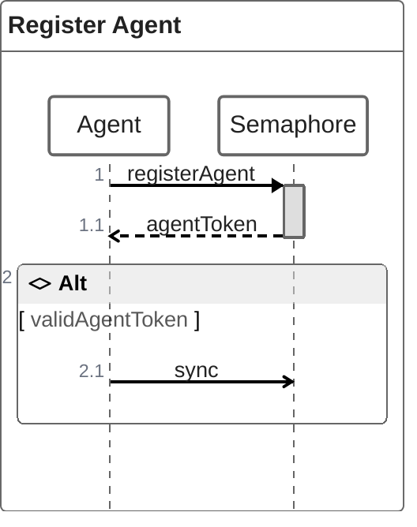
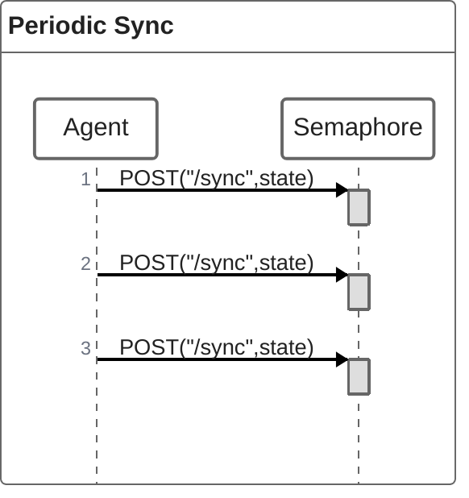
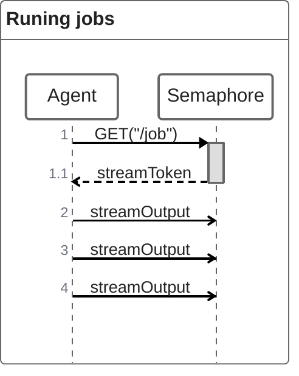

# Self-hosted Agents

import Tabs from '@theme/Tabs';
import TabItem from '@theme/TabItem';
import Available from '@site/src/components/Available';
import VideoTutorial from '@site/src/components/VideoTutorial';

Run Semaphore jobs in your own hardware with self-hosted agents. This page explains what agents are and links to installation and configuration pages.

## Overview

<Available plans={['Startup (Hybrid)', 'Scaleup (Hybrid)']}/>

An [agent](./pipelines#agents) is a physical or virtual machine you own that can be dedicated to run Semaphore [jobs](./jobs). You can mix and match your own agents with the [machines provided by Semaphore](../reference/machine-types).

Self-hosted agents allow you to run workflows on machines that are not currently available as part of Semaphore Cloud plans, such as GPU-enabled machines for machine learning workloads.

## One way communication

Self-hosted agents use one-way communications to connect with Semaphore. Requests are always initiated by the agent and secured using HTTPS TLS 1.3.

When the agent boots up it attempts to register with Semaphore. Once registered, the agent enters in *sync mode* and sends periodic requests to notify what the agent is doing and request instructions on what to do next.

:::note

A registration failure causes the agent to stop running jobs. The agent shuts down after failing to sync for some time.

:::

### Sync and get jobs

Once the agent is registered, it will periodically send POST requests to Semaphore API `/sync` endpoint. This request sends state information about the agent.

Agents also periodically send GET requests to the `/job` endpoint to retrieve new jobs. Semaphore sends a unique stream token for every scheduled job, which the agent uses to stream the job's output.

## Supported toolbox features

Not all of the [Semaphore toolbox](../reference/toolbox) commands are available on self-hosted agents. In some cases, you need additional setup steps to use these features.

| Feature                                     | Available | Notes                                           |
|---------------------------------------------|-----------|-------------------------------------------------|
| Using the [cache](../reference/toolbox#cache)                                   | Optional | Using [S3](./self-hosted-configure#cache-s3) or [GCS](./self-hosted-configure#cache-gcp) as a storage backend |
| [Artifact](./artifacts) storage                                                 | Yes |                                           |
| [Test results](./tests/test-reports) and [flaky tests](./tests/flaky-tests)     | Yes |                                           |
| Checking code with [checkout](../reference/toolbox#checkout)                    | Yes |                                           |
| Starting [debug jobs](./jobs#debug-jobs)                                        | No  | See the [self-hosted debug jobs](#debug)  |
| Changing language versions with [sem-version](../reference/toolbox#sem-version) | No  |                                           |
| Managing databases with [sem-service](../reference/toolbox#sem-service)         | No  |                                           |

## How to debug jobs on self-hosted {#debug}

Since Semaphore does not have direct access to the self-hosted agents, the convenient 

Since communication is always initiated from the self-hosted agent, Semaphore has no way to start or attach to jobs using the [debug command](./jobs#debug-jobs). Instead, Semaphore will only display the name of the agent running the job and wait until the session stops.

To debug jobs on a self-hosted agent you need to log in the agent machine. Keep in mind that:

- You should log in with the same user the agent is running under. For example, if you're using [agent-aws-stack](https://github.com/renderedtext/agent-aws-stack), the user is `semaphore`
- The agent does not automatically load environment variables for the job. To load the variables, you must source the files located at `/tmp/.env-*`

## See also

- [How to install self-hosted agents](./self-hosted-install)
- [How to configure self-hosted agents](./self-hosted-configure)