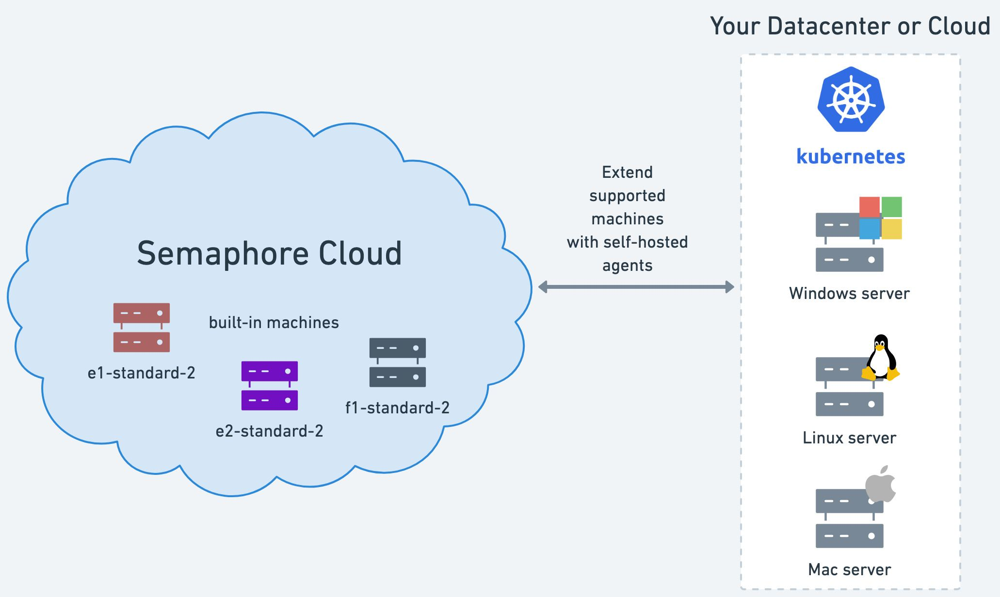
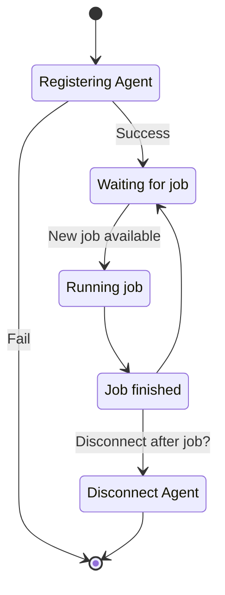
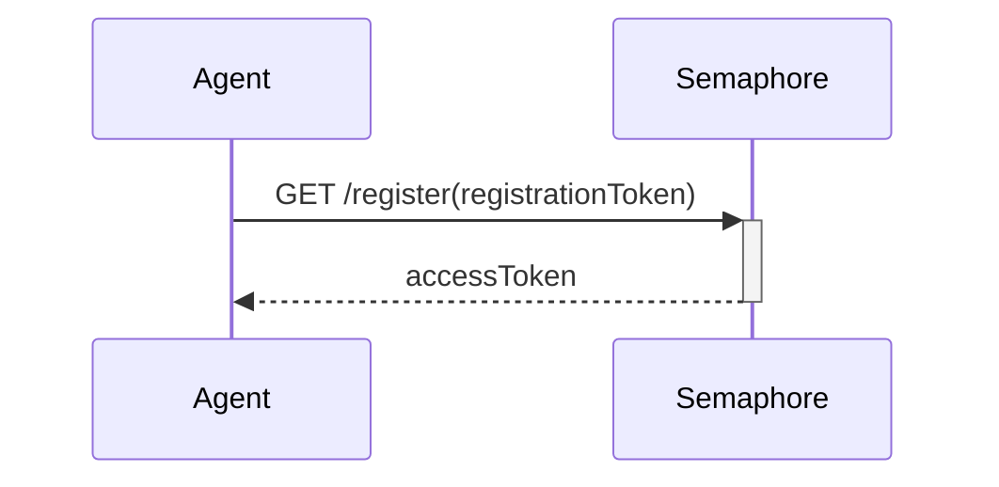
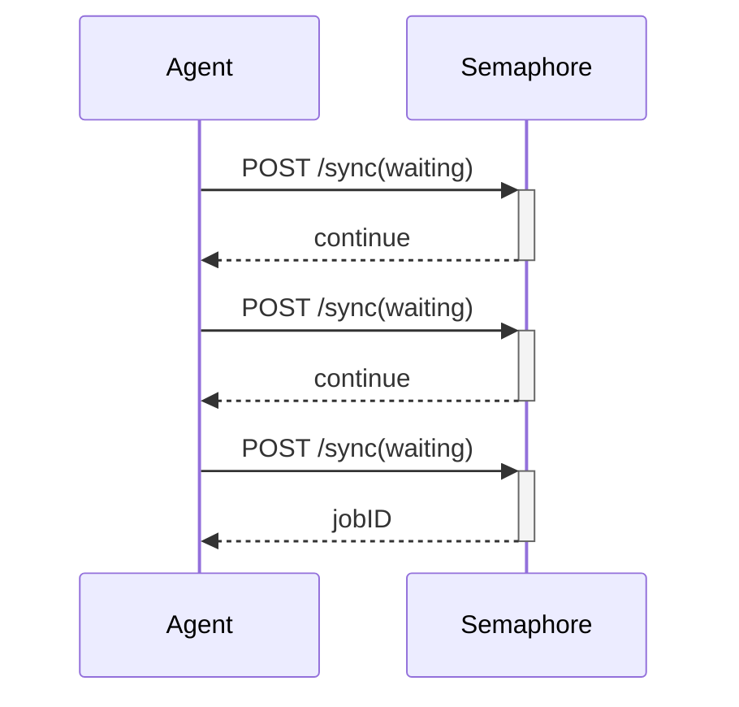
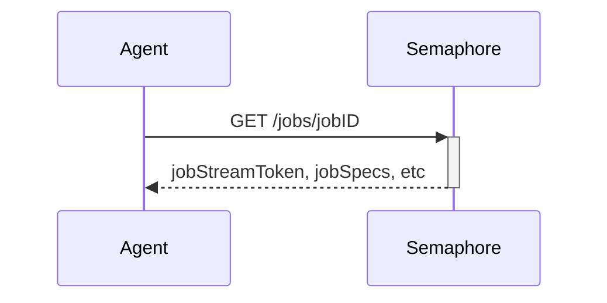
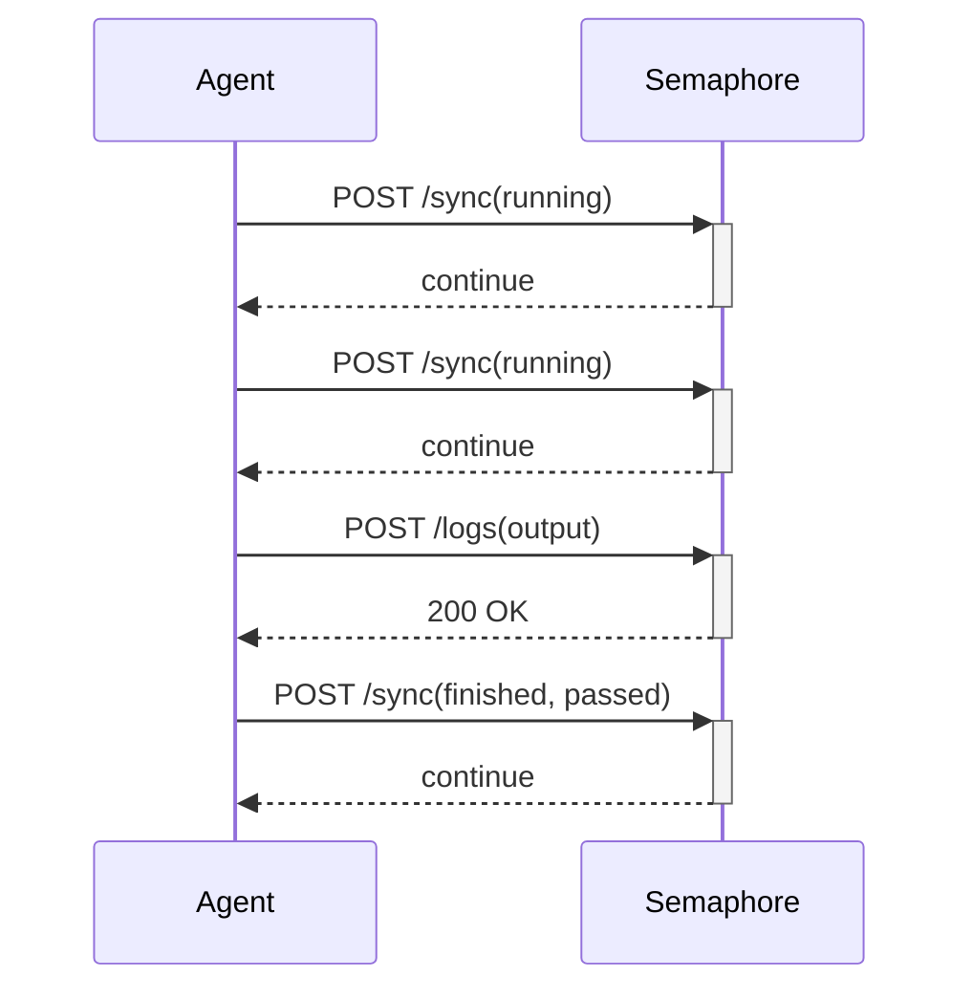
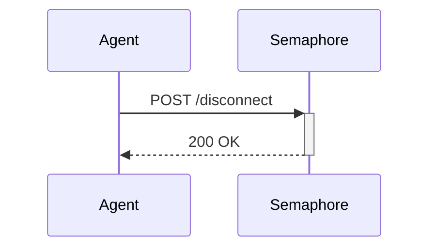
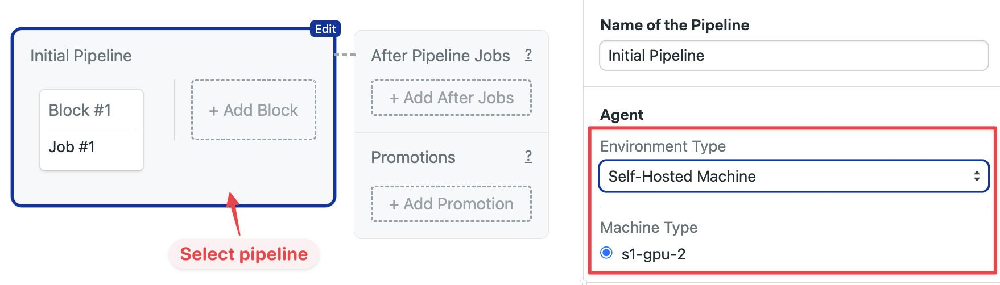

# Self-hosted Agents

import Tabs from '@theme/Tabs';
import TabItem from '@theme/TabItem';
import Available from '@site/src/components/Available';
import VideoTutorial from '@site/src/components/VideoTutorial';
import Steps from '@site/src/components/Steps';

Semaphore Hybrid lets you run jobs on your own hardware. This page explains what self-hosted agents are and how to install them on several platforms.

## Overview {#overview}

<Available plans={['Startup (Hybrid)', 'Scaleup (Hybrid)']}/>

An [agent](./pipelines#agents) is a physical or virtual machine you own that can be dedicated to running Semaphore [jobs](./jobs). You can mix and match your own agents with the [machines provided by Semaphore](../reference/machine-types).

Self-hosted agents allow you to run [workflows](./workflows) on machines that are not currently available as part of Semaphore Cloud plans, such as GPU-enabled machines for machine learning workloads.



## Agent lifecycle {#lifecycle}

The agent attempts on startup to register with the Semaphore Control Plane by sending a registration request. Once registered, it waits for jobs. Repeated failure to register the agent causes it to shutdown.

The agent enters into a running state when a new job is available. Depending on its configuration, once the job is done the agent may disconnect and shutdown, or go back to the waiting state until a new job is available.



## Agent communication {#communication}

Self-hosted agents use one-way communication to connect with Semaphore. Requests are always initiated by the agent and secured using HTTPS TLS 1.3. This means you don't need to inbound open ports in your firewall to use Semaphore in Hybrid mode.

### Registration request {#registration}

When the agent boots up it sends a register request using a registration token. If the registration succeeds, the agent receives an access token to be used in all future communications and enters the *waiting for job* state.




:::note

A registration failure prevents the agent from connecting to the Semaphore Control Plane. Unregistered agents cannot run any jobs.

:::

### Sync request {#sync}

Waiting agents periodically send sync requests to the control plane with its state information. Semaphore responds with a continue message unless there is a job in the queue to be executed, in which case Semaphore sends the jobID.



### Get job request {#get-job}

When the agent receives a new jobID it enters the *starting job* state and sends a request to the `/jobs` endpoint. Semaphore responds with the job specs and an job log stream token.



Semaphore responds with a token used to stream the job output and the job specs, including commands, environment variables, files, prologues, epilogues, containers, among other details.

### Job output request {#logs}

Agents running a job periodically send sync requests along with the output of the active job. Once the job is done, the agent sends the remainder of the logs and a sync request with the job result (passed or failed).



### Disconnect request {#disconnect}

[Depending on its configuration](./self-hosted-configure#disconnect), the agent can either disconnect and shutdown after the job is finished, or go back to the *waiting for job* state.



## Supported toolbox features {#toolbox}

Not all of the [Semaphore toolbox](../reference/toolbox) commands are available on self-hosted agents. In some cases, you need additional setup steps to use these features.

| Feature                                     | Available | Notes                                           |
|---------------------------------------------|-----------|-------------------------------------------------|
| Using the [cache](../reference/toolbox#cache)                                   | Optional | Using [S3](./optimization/cache#aws), [GCP](./optimization/cache#gcp), or [SFTP](./optimization/cache#sftp) as a storage backend |
| [Artifact](./artifacts) storage                                                 | Yes |                                           |
| [Test results](./tests/test-reports) and [flaky tests](./tests/flaky-tests)     | Yes |                                           |
| Checking code with [checkout](../reference/toolbox#checkout)                    | Yes |                                           |
| Starting [debug jobs](./jobs#debug-jobs)                                        | No  | See the [self-hosted debug jobs](#debug)  |
| Changing language versions with [sem-version](../reference/toolbox#sem-version) | No  |                                           |
| Managing databases with [sem-service](../reference/toolbox#sem-service)         | No  |                                           |

## How to run jobs in self-hosted agents {#run-agent}

Once you have [installed](./self-hosted-install) and [configured](./self-hosted-configure) the self-hosted agent, you can use it in your jobs by selecting the new agent type in your pipeline.

<Tabs groupId="editor-yaml">
<TabItem value="editor" label="Editor">

To run jobs on a self-hosted agent, follow these steps:

<Steps>

1. Open your Semaphore [project](./projects) and press **Edit Workflow**
2. Select the pipeline
3. Under **Environment Type** select **Self-hosted machine**
4. Select the machine from the selection list

  

</Steps>

You can also change the agent for a single job using the [agent override option](./jobs#agent-override).

</TabItem>
<TabItem value="yaml" label="YAML">

To run jobs on a self-hosted agent, follow these steps:

<Steps>

1. Edit the [pipeline YAML](./pipelines)
2. In `agent.machine.type` add the agent type
3. Leave `os_image` as an empty string
4. Push the new YAML file to your repository

</Steps>

```yaml title="Semaphore pipeline"
version: v1.0
name: Initial Pipeline
agent:
  machine:
    type: s1-gpu-2
    os_image: ''
blocks:
  - name: 'Block #1'
    task:
      jobs:
        - name: 'Job #1'
          commands:
            - checkout
```

You can also change the agent for a single job using the [agent override option](./jobs#agent-override).

</TabItem>
</Tabs>

### Job sessions {#sessions}

The self-hosted agent executes the job commands in two different ways depending on the platform where it is running:

- On Linux and macOS, a new PTY session is created at the beginning of every job. All commands run in that single session
- On Windows, PYT sessions are not used. Instead, each command is executed in a new PowerShell process with `powershell -NonInteractive -NoProfile`

See [self-hosted configuration](./self-hosted-configure#isolation) to learn how to run jobs in isolation.

### Initialization agents {#init-agent}

If you want to run [initialization jobs](./pipelines#init-job) on self-hosted agents, you must change the default initialization agent. You can do this in two places:

- **Organization**: affects all projects in the organization. See [organization init agent](./organizations#init-agent) to learn how to change this setting
- **Project**: changes the agent running initialization for a single project. See [project pre-flight checks](./projects#preflight) to learn how to change this setting

## How to debug jobs on self-hosted {#debug}

Before you can [debug jobs](./jobs#debug-jobs) you must enable self-hosted debugging on to the [project settings](./projects#general).

Debug jobs work in a different way on self-hosted agents. Instead of connecting directly to the job via SSH as in cloud debug jobs, Semaphore starts the debug job and displays the name of the agent that is running the job. You must connect to the host running the agent and debug the job manually.

Keep in mind that:

- You should log in with the same user the agent is running under. For example, if you're using [agent-aws-stack](https://github.com/renderedtext/agent-aws-stack), the user is `semaphore`
- The agent does not automatically load environment variables for the job. To load the variables, you must source the files located at `/tmp/.env-*`

## See also

- [How to install self-hosted agents](./self-hosted-install)
- [How to configure self-hosted agents](./self-hosted-configure)
- [How to run an autoscaling fleet of agents in AWS](./self-hosted-aws)
- [Self-hosted agents configuration reference](../reference/self-hosted-config)

