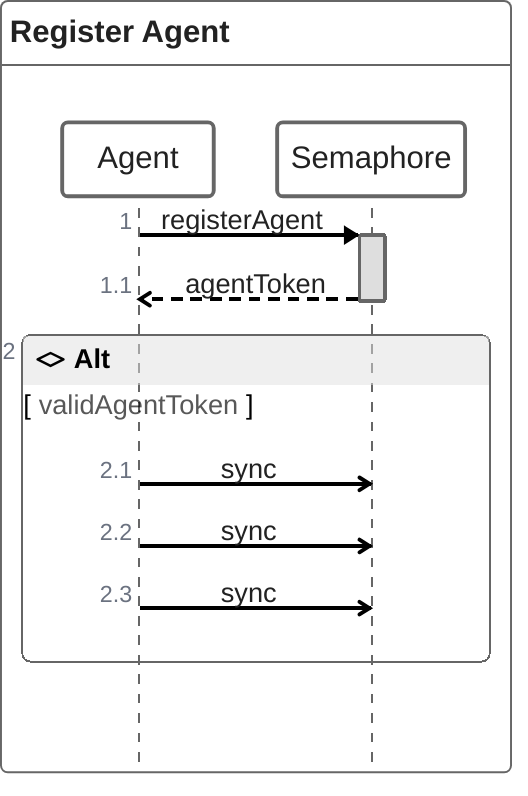
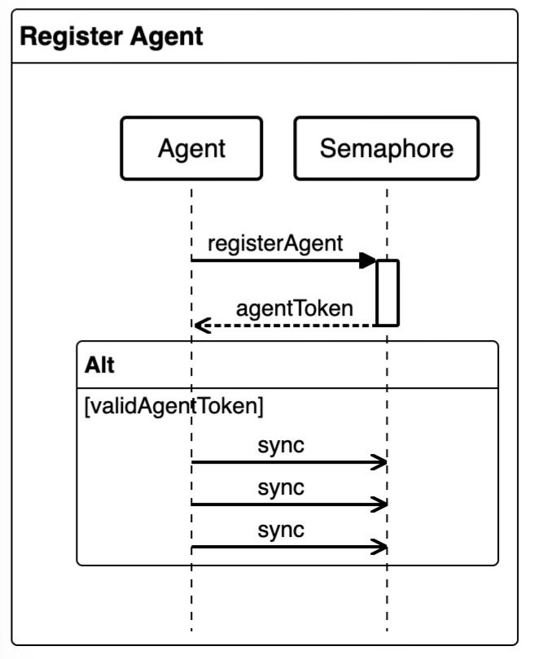

# Self-hosted Agents

import Tabs from '@theme/Tabs';
import TabItem from '@theme/TabItem';
import Available from '@site/src/components/Available';
import VideoTutorial from '@site/src/components/VideoTutorial';

WIP: https://docs.semaphoreci.com/ci-cd-environment/self-hosted-agents-overview/

Run Semaphore jobs in your own hardware with self-hosted agents. This page explains what agents are and links to installation and configuration pages.

## Overview

<Available plans={['Startup - Hybrid', 'Scaleup - Hybrid']}/>

An [agent](./pipelines#agents) is a physical or virtual machine you own that can be dedicated to run Semaphore [jobs](./jobs). You can mix and match your own agents with the [machines provided by Semaphore](../reference/machine-types).

Self-hosted agents allow you to run workflows on machines that are not currently available as part of Semaphore Cloud plans, such as GPU-enabled machines for machine learning workloads.

DIAGRAM 1

### One way communication

All communication between the agent and Semaphore is one-way -- from the agent to Semaphore -- and is secured via HTTPS TLS 1.3.

When booting, the agent attempts to register with the Semaphore API. If it succeeds, it enters sync mode, sending periodic requests to Semaphore's API to tell it what it is doing and asking for instructions regarding what to do next. If it fails to register, the agent does not start and does not receive any jobs. If it fails to sync, it will not receive any further jobs and will eventually shutdown.

https://mermaid.js.org/syntax/zenuml.html#alt
https://mermaid.live/edit#pako:eNp1j01qwzAQha8yzKqBtAfQImDoCeoutRmssS2qnzAeBdKQu1e2TNJFq4303vfmDbrhkB2jwW9OJQaboB71Ghg-ePKLskA3cdJGOqDlt-5X3XOk85yF98zrqX-TfXjLwq0RAGEtkoBW9zN_cWrg3i4_vlwoeNc98OE52ooNLNc0_OVt8j-wr8EjRpZI3tUfb80WdebIFk19Oh6pBLVo0xqlormvBWhUCh9RcplmNCOFpapydqT87mkSirt7_wGQ7mcx





Tokens used for communication#
Three different types of tokens are used by the agent to communicate with Semaphore:

Agent type registration token: this is the token that is used to start up the agent. It has only one purpose: register the agent on Semaphore. After registration, every agent gets a unique access token for further communication.
Agent access token: this is the token used to coordinate the agent's state with Semaphore. It allows the agent to execute POST /sync and GET /job requests. When an agent fetches a job from Semaphore, it uses the log stream token to stream logs back to Semaphore.
Job logs stream token: each job gets a unique log stream token to send back logs to Semaphore. This token is generated for each job and its lifetime is limited to the job's execution lifecycle.

DIAGRAM 3

```mermaid
  value={`graph TD;
    A-->B;
    A-->C;
    B-->D;
    C-->D;`}
```

### Supported toolbox features

Not all of the [Semaphore toolbox](../reference/toolbox) commands are available on self-hosted agents. In some cases, you need additional setup steps to use these features.

| Feature                                     | Available | Notes                                           |
|---------------------------------------------|-----------|-------------------------------------------------|
| Using the [cache](../reference/toolbox#cache)                       | Optional       | Using [S3](./self-hosted-configure#cache-s3) or [GCS](./self-hosted-configure#cache-gcp) as a storage backend |
| [Artifact](./artifacts) storage                            | Yes       |                                                 |
| [Test results](./tests/test-reports) and [flaky tests](./tests/flaky-tests)                   | Yes       |                                                 |
| Checking code with [checkout](../reference/toolbox#checkout) | Yes       |                                                 |
| Starting [debug jobs](./jobs#debug-jobs)                            | Optional       | Since Semaphore does not have access to the machine running the debug job, the Semaphore CLI will not automatically log into it. See the [self-hosted debug jobs][debug jobs] page for more information |
| Changing language versions with [sem-version](../reference/toolbox#sem-version) | No        |                                                 |
| Managing databases with [sem-service](../reference/toolbox#sem-service)         | No        |                                                 |

## See also