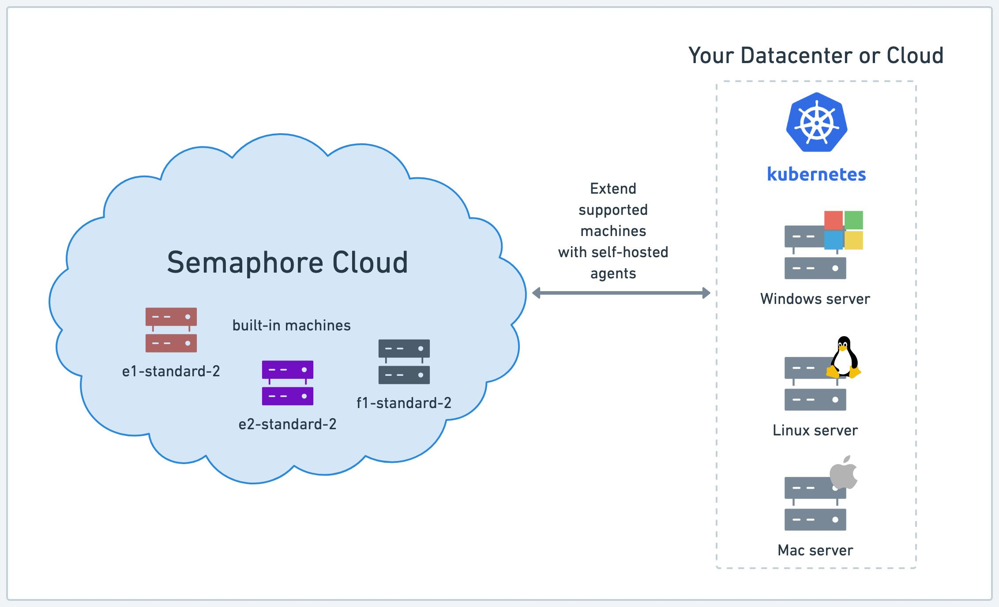

# Self-hosted Agents

import Tabs from '@theme/Tabs';
import TabItem from '@theme/TabItem';
import Available from '@site/src/components/Available';
import VideoTutorial from '@site/src/components/VideoTutorial';

Semaphore Hybrid lets you run jobs on your own hardware. This page explains what self-hosted agents are and how to install them on several platforms.

## Overview {#overview}

<Available plans={['Startup (Hybrid)', 'Scaleup (Hybrid)']}/>

An [agent](./pipelines#agents) is a physical or virtual machine you own that can be dedicated to running Semaphore [jobs](./jobs). You can mix and match your own agents with the [machines provided by Semaphore](../reference/machine-types).

Self-hosted agents allow you to run workflows on machines that are not currently available as part of Semaphore Cloud plans, such as GPU-enabled machines for machine learning workloads.




## Agent communication {#communication}

Self-hosted agents use one-way communication to connect with Semaphore. Requests are always initiated by the agent and secured using HTTPS TLS 1.3. This means you don't need to inbound open ports in your firewall to use Semaphore in Hybrid mode.

When the agent boots up it attempts to register with Semaphore.


:::note

A registration failure causes the agent to stop running jobs. The agent shuts down after failing to sync for some time.

:::

Once registered, the agent enters *sync mode* and sends periodic requests to notify what the agent is doing and request instructions on what to do next. The agent periodically sends POST requests to the Semaphore API `/sync` endpoint. The request sends state information about the agent.


Agents also send GET requests to the Semaphore API `/job` endpoint to determine what job to run next. Semaphore responds with a unique stream token for every scheduled job, which the agent uses to stream the job's output.


## Agent lifecycle {#lifecycle}

On start up, the agent attempts to register with the Semaphore API. When it succeeeds it enters into *idle* state.

Idle agents periodically poll the Semaphore API for job assignments. When a new job is scheduled, the agent enters into *running* state. Once done, the agent goes back to *idle* and the cycle starts again.

Agents stay *idle* forever unless [a disconnection condition is set](./self-hosted-configure#disconnect). When an agent disconnects it automatically shuts down.

:::danger

TODO: what happens with the agent name after disconnecting? there is a setting during registration to control if the name is released immediately or after some time. What is it's purpose?

:::

```mermaid
stateDiagram-v2
    Start: Agent Start
    Shutdown: Agent Shutdown
    Start --> Disconnected
    Disconnected --> Shutdown
    Disconnected --> Idle: Register
    Idle --> Running: Job Scheduled
    Running --> Idle: Job Done
    Idle --> Disconnected: 
```


## Supported toolbox features {#toolbox}

Not all of the [Semaphore toolbox](../reference/toolbox) commands are available on self-hosted agents. In some cases, you need additional setup steps to use these features.

| Feature                                     | Available | Notes                                           |
|---------------------------------------------|-----------|-------------------------------------------------|
| Using the [cache](../reference/toolbox#cache)                                   | Optional | Using [S3](./self-hosted-configure#cache-s3) or [GCS](./self-hosted-configure#cache-gcp) as a storage backend |
| [Artifact](./artifacts) storage                                                 | Yes |                                           |
| [Test results](./tests/test-reports) and [flaky tests](./tests/flaky-tests)     | Yes |                                           |
| Checking code with [checkout](../reference/toolbox#checkout)                    | Yes |                                           |
| Starting [debug jobs](./jobs#debug-jobs)                                        | No  | See the [self-hosted debug jobs](#debug)  |
| Changing language versions with [sem-version](../reference/toolbox#sem-version) | No  |                                           |
| Managing databases with [sem-service](../reference/toolbox#sem-service)         | No  |                                           |

## How to run jobs in self-hosted agents {#run-agent}

Once you have [installed](./self-hosted-install) and [configured](./self-hosted-configure) the self-hosted agent, you can use it in your jobs by selecting the new agent type in your pipeline.

<Tabs groupId="editor-yaml">
<TabItem value="editor" label="Editor">

To run jobs on a self-hosted agent, follow these steps:

1. Open your Semaphore [project](./projects) and press **Edit Workflow**
2. Select the pipeline
3. Under **Environment Type** select **Self-hosted machine**
4. Select the machine from the selection list


You can also change the agent for a single job using the [agent override option](./jobs#agent-override).

</TabItem>
<TabItem value="yaml" label="YAML">

To run jobs on a self-hosted agent, follow these steps:

1. Edit the [pipeline YAML](./pipelines)
2. In `agent.machine.type` add the agent type
3. Leave `os_image` as an empty string
4. Push the new YAML file to your repository

```yaml title="Semaphore pipeline"
version: v1.0
name: Initial Pipeline
agent:
  machine:
    type: s1-gpu-2
    os_image: ''
blocks:
  - name: 'Block #1'
    task:
      jobs:
        - name: 'Job #1'
          commands:
            - checkout
```

You can also change the agent for a single job using the [agent override option](./jobs#agent-override).

</TabItem>
</Tabs>

### Job sessions

The self-hosted agent executes the job commands in two different ways depending on the platform where it is running:

- On Linux and macOS, a new PTY session is created at the beginning of every job. All commands run in that single session
- Since Windows does not support PTYs, each command is executed in a new PowerShell process with `powershell -NonINteractive -NoProfile`. The only way to have aliases available to commands is through PowerShell modules.

See [self-hosted configuration](./self-hosted-configure#isolate-jobs) to learn how to run jobs in isolation.

## How to debug jobs on self-hosted {#debug}

Since communication is always initiated from the self-hosted agent, Semaphore has no way to start or attach a terminal to jobs running on self-hosted agents. This means that the [debug command](./jobs#debug-jobs) does not work. 

To debug jobs on a self-hosted agent you need to log in to the agent machine. Keep in mind that:

- You should log in with the same user the agent is running under. For example, if you're using [agent-aws-stack](https://github.com/renderedtext/agent-aws-stack), the user is `semaphore`
- The agent does not automatically load environment variables for the job. To load the variables, you must source the files located at `/tmp/.env-*`

## See also

- [How to install self-hosted agents](./self-hosted-install)
- [How to configure self-hosted agents](./self-hosted-configure)
- [How to run an autoscaling fleet of agents in AWS](./self-hosted-aws)
- [Self-hosted agents configuration reference](../reference/self-hosted-config)

