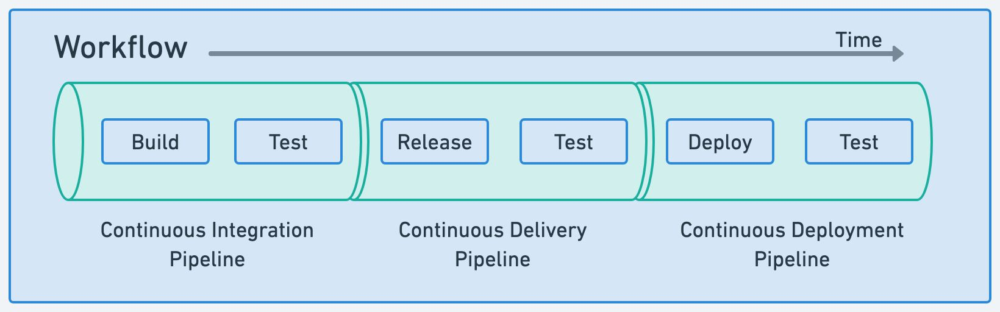
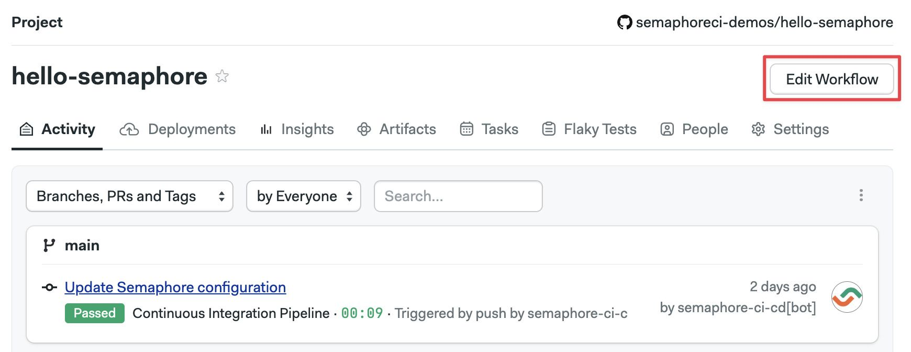
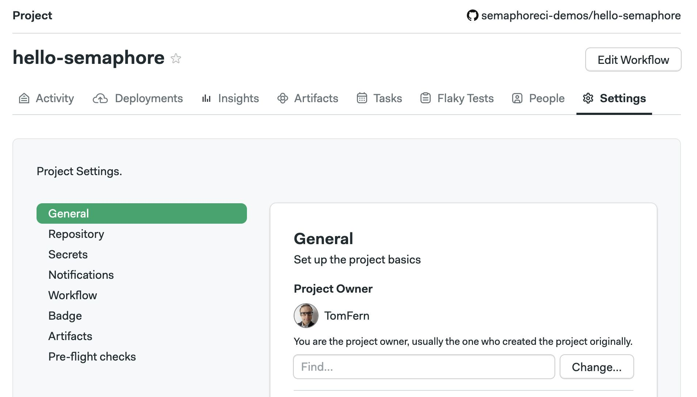
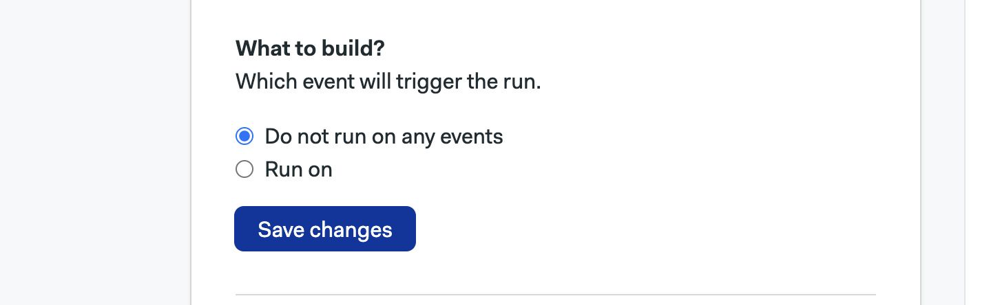
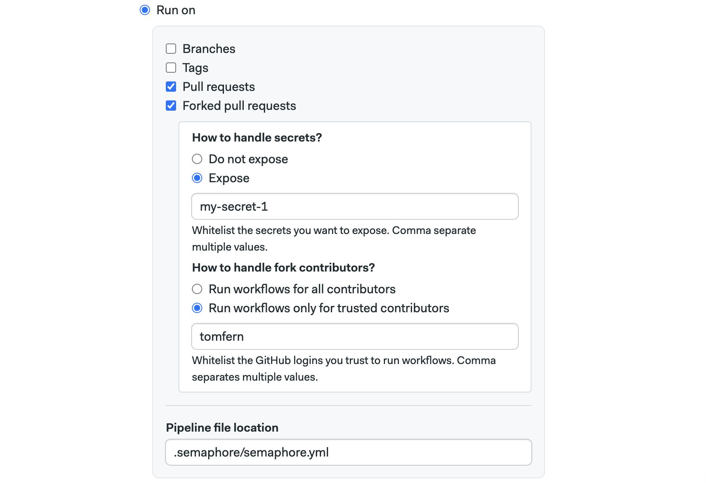

# Workflows

import Tabs from '@theme/Tabs';
import TabItem from '@theme/TabItem';
import Available from '@site/src/components/Available';
import VideoTutorial from '@site/src/components/VideoTutorial';
import Steps from '@site/src/components/Steps';

A workflow is the series of automated steps to build, test, release, or deploy your application. This page explains workflows in details, how they are triggered and their settings.

If this is your first time using Semaphore, check out [Guided Tour](../getting-started/guided-tour).

## Overview

In the context of Continuous Integration and Delivery (CI/CD) a a workflow represents the automated steps or processes that define how code changes are handled from development to deployment.

Workflows in Semaphore consists of one or more [pipelines](./pipelines). A pipeline typically has one goal such as build, release, or deploy. Pipelines define the sequence of tasks to achive said goal.



Before you can run a workflow in Semaphore you need:

- A Semaphore account connected to GitHub or BitBucket
- A repository on GitHub or BitBucket
- A [project](./projects) to link the repository with Semaphore
- One or more [pipelines](./pipelines)

You can see all the running and past workflows by opening your [project page](./projects#view-projects).

## Visual workflow editor {#workflow-editor}

You can define most aspect of your workflows using the visual editor. 

To access the editor, open one of your projects on and press **Edit Workflow**. All your changes are stored as YAML pipeline definitions on your Git repository. You can make changes using the visual editor, or edit the YAML directly by clicking on the pipeline YAML file.



See the [jobs page](./jobs) to learn how define jobs and blocks.

## Workflow triggers

The following events or actions trigger workflows by default:

- Pushing commits into any branch
- Pushing Git tags
- Creating pull requests
- Changing any pipelines
- Manually re-running workflows 
- Running pipelines using [Tasks](./tasks)

The defaults are meant to work for most scenarios, but you can always customize the triggers.

### How to customize triggers {#project-triggers}

Triggers are configured in the [project settings](./projects#general). To change what actions can trigger a workflow, follow these steps:

<Steps>

1. Open your project on Semaphore
2. Go to the **Settings** tab

    

3. In the **General** section scroll down to **What to build**
4. Change the settings and press **Save**

</Steps>

Selecting **Do not run on any events** disables all triggers, effectively pausing the project. You can, however, still run workflows manually or with [tasks](./tasks).



Selecting **Run on** allows you to configure what triggers are enabled for the project.

- The **Branches** option allows you to run workflows on all branches or configure an allow list with branch names. Regular expressions are supported
- The **Tags** options work the same but for Git tags


- Enabling **Pull requests** option allows Semaphore to run workflows on pull requests originating in the same repository
- The **Forked pull request** works the same for pull requests originating from forked pull requests. [To prevent security leaks](#pr), you can configure a list of allowed secrets and GitHub/BitBucket usernames that can trigger workflows in this way
  



## How to skip commits {#skip}

If you don't want to start a Semaphore workflow for type one of the following options in the commit message. The skip message doesn't work on [pushed tags](./promotions#tagged).

- `[ci skip]`
- `[skip ci]`

For example, this push does not trigger a Semaphore pipeline execution, it is completely ignored:

```shell title="Skipping a commit"
git add -A
git commit -m "[skip ci] Initial commit"
git push origin main
```

:::note

Merging a pull request with the squash commit option is also ignored unless the skip message is removed manually.

:::
