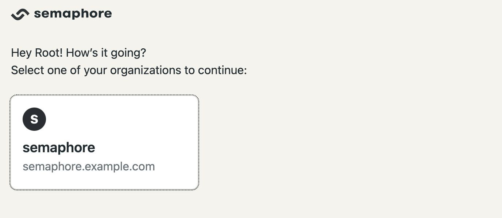
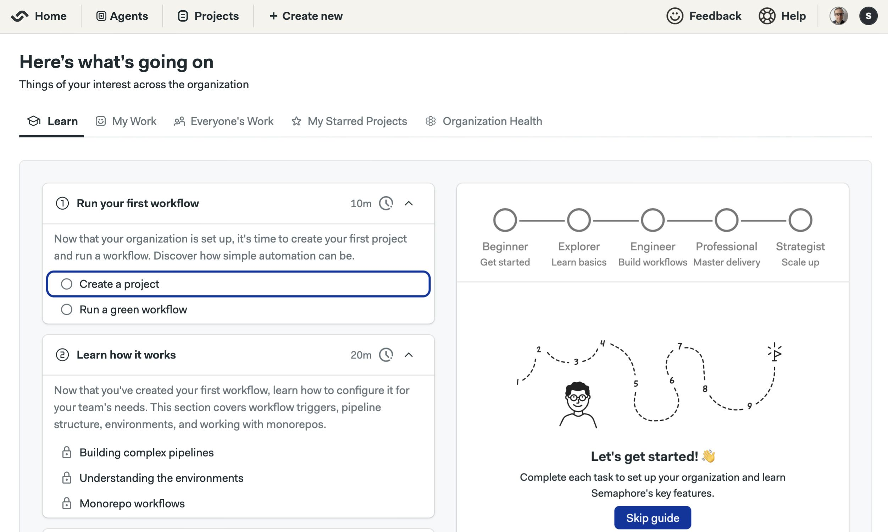

# Google Cloud Compute (VM)

import Tabs from '@theme/Tabs';
import TabItem from '@theme/TabItem';
import Available from '@site/src/components/Available';
import VideoTutorial from '@site/src/components/VideoTutorial';
import Steps from '@site/src/components/Steps';
import FeatureNotAvailable from '@site/src/components/FeatureNotAvailable';

This page explains how to install Semaphore Community Edition on a [Google Cloud Compute Engine (VMs)](https://cloud.google.com/products/compute).

## Overview

If this is your first time using Semaphore we suggest trying out [Semaphore Cloud](../../../docs/getting-started/guided-tour.md) to see if the platform fits your needs. You can create a free trial account without a credit card and use every feature.

The self-hosted installation is recommended for users and teams familiar with Semaphore.

## Prerequisites {#prerequisites}

- A DNS domain
- A Google Cloud account

## Step 1 - Install dependencies {#dependencies}

Install the following tools:

- [Google Cloud SDK](https://cloud.google.com/sdk): command line tools to create and manage your Google Cloud services

## Step 2 - Create SSH keypair {#ssh}

:::note

You may skip this step if you already have an SSH key pair.

:::

To generate your SSH keys, run the following command. Follow the on-screen instructions. 


```shell
ssh-keygen -t rsa
```

The generated keys should be located in the `$HOME/.ssh` folder. The exact names can change if you're using a different cipher to create the keys. For example:

- `id_rsa`: this is the **private** key, do not share it with anyone
- `id_rsa.pub`: this is your public key, it can be installed on your servers to get SSH access.

## Step 3 - Set up Google project {#setup}

We recommend creating a separate [Google Cloud Project](https://cloud.google.com/resource-manager/docs/creating-managing-projects) for your Semaphore installation. Once you have created your project, take note of the **Google Project ID**.

Create a config file to store your Google Cloud parameters. We'll call it `google-config`. Adjust the values to match your Project ID and which zone the compute instance should run on. Ensure you the paths for the [SSH keypairs generated earlier](#ssh) are correct (warning: never switch the public with the private keys).


```shell title="contents of google-config"
export GOOGLE_CLOUD_PROJECT_ID="<your-project-id>"
export GOOGLE_INSTANCE_NAME="<name-for-the-machine>"
export GOOGLE_CLOUD_ZONE="<google-cloud-zone-datacenter>"
export SSH_KEY_PUBLIC="<path-to-your-public-ssh-key>"
export SSH_KEY_PRIVATE="<path-to-your-private-ssh-key>"
```

Once you have modified the configuration file, you should have something like the following example:

```shell title="contents of google-config"
export GOOGLE_CLOUD_PROJECT_ID="my-semaphore-323342"
export GOOGLE_INSTANCE_NAME="semaphore-control-machine"
export GOOGLE_CLOUD_ZONE="us-central1-a"
export SSH_KEY_PUBLIC="$HOME/.ssh/id_rsa.pub"
export SSH_KEY_PRIVATE="$HOME/.ssh/id_rsa"
```

Authenticate with your Google Cloud account before continuing. The command opens a browser to log in to your account.

```shell title="Login to GCP"
gcloud auth login
```

Once logged in, activate to your Semaphore project on the terminal with the following commands:

```shell title="Switch to your Semaphore project"
source google-config
gcloud config set project "${GOOGLE_CLOUD_PROJECT_ID}"
```

## Step 4 - Create VM {#vm}

Run the following command to create your Google Compute instance:

```shell
source google-config
gcloud compute instances create ${GOOGLE_INSTANCE_NAME} \
    --zone=${GOOGLE_CLOUD_ZONE} \
    --project=${GOOGLE_CLOUD_PROJECT_ID} \
    --network-interface=network-tier=PREMIUM,stack-type=IPV4_ONLY,subnet=default \
    --scopes=https://www.googleapis.com/auth/devstorage.read_only,https://www.googleapis.com/auth/logging.write,https://www.googleapis.com/auth/monitoring.write,https://www.googleapis.com/auth/service.management.readonly,https://www.googleapis.com/auth/servicecontrol,https://www.googleapis.com/auth/trace.append \
    --tags=http-server,https-server \
    --machine-type=e2-standard-8 \
    --image-family=ubuntu-2404-lts-amd64 \
    --image-project=ubuntu-os-cloud \
    --boot-disk-size=64GB \
    --metadata "ssh-keys=$(whoami):$(cat $SSH_KEY_PUBLIC)"
```

## Step 5 - Get public IP Address {#ip}

Run the following command to retrieve the assigned IP address for your new server:

```shell
export IP_ADDRESS=$(gcloud compute instances describe ${GOOGLE_INSTANCE_NAME} --zone ${GOOGLE_CLOUD_ZONE} --format='text(networkInterfaces.[].accessConfigs.[].natIP)' | awk -F': ' '{print $2}')
```

Take note of the public IP address of your instance:

```shell
echo $IP_ADDRESS
```

## Step 6 - Update DNS records {#dns}

Configure your DNS by creating two A records that point to the reserved IP:

<Steps>

1. Go to your domain provider's DNS settings
2. Create root domain A record

      - Type: A
      - Name: `semaphore` (e.g. `semaphore.example.com`)
      - Value: the public IP address of your Linux machine

3. Create a wildcard record

      - Type: A
      - Name: `*.semaphore` (e.g. `*.semaphore.example.com`)
      - Value: the public IP address of your Linux machine

4. Wait for DNS propagation (typically a few minutes)

    You can verify the creation of the TXT record in the [Online Dig Tool](https://toolbox.googleapps.com/apps/dig/#A/) for:

      - `semaphore.example.com`
      - `*.semaphore.example.com`

</Steps>

## Step 7 - Check firewall rules {#firewall}

Ensure the Google Cloud firewall is configured to allow inbound connections to your servers on ports 80 (HTTP) and 443 (HTTPS).

You can see the firewall rules in the [Google Cloud Console](https://console.cloud.google.com/net-security/firewall-manager/firewall-policies/list) or by running the following command:

```shell
$  gcloud compute firewall-rules list

NAME                                            NETWORK  DIRECTION  PRIORITY  ALLOW                         DENY       DISABLED
default-allow-http                              default  INGRESS    1000      tcp:80                                   False
default-allow-https                             default  INGRESS    1000      tcp:443                                  False
default-allow-icmp                              default  INGRESS    65534     icmp                                     False
default-allow-internal                          default  INGRESS    65534     tcp:0-65535,udp:0-65535,icmp             False
default-allow-rdp                               default  INGRESS    65534     tcp:3389                                 False
default-allow-ssh                               default  INGRESS    65534     tcp:22                                   False
```

If needed, you can open the ports with the following commands:

```shell
gcloud compute firewall-rules create default-allow-http \
  --allow=tcp:80 \
  --direction=INGRESS \
  --source-ranges=0.0.0.0/0 \
  --target-tags=http-server

gcloud compute firewall-rules create default-allow-https \
  --allow=tcp:443 \
  --direction=INGRESS \
  --source-ranges=0.0.0.0/0 \
  --target-tags=https-server
```

## Step 8 - Log into the instance {#env}

First, connect to the server using SSH. This should open a terminal on the Google Cloud VM:

```shell
gcloud compute ssh --zone=${GOOGLE_CLOUD_ZONE} --project=${GOOGLE_CLOUD_PROJECT_ID} --ssh-key-file ~/.ssh/id_ed25519 ${GOOGLE_INSTANCE_NAME}
```

Create a folder to store the configuration and certificates:

```shell title="remote shell - create install folder"
mkdir semaphore-install
cd semaphore-install
```

Create a file with the following environment variables. For the rest of the guide, we'll call this file `semaphore-config`. Change the values as needed:

```shell title="contents of semaphore-config file"
export DOMAIN="<your-domain>"
export IP_ADDRESS=<public-IP-address-of-machine>
```

:::info Important

We highly recommend **installing Semaphore on a subdomain**, e.g. `semaphore.example.com`. Installing Semaphore on your main domain is discouraged as its operation might interfere with other services running on the same domain.

For example, if your domain is `example.com`, consider installing Semaphore on `semaphore.example.com`. See the example below.

```shell title="example of semaphore-config file"
export DOMAIN="semaphore.example.com"
export IP_ADDRESS=1.2.3.4
```

:::


## Step 9 - Create TLS certificates {#certs}

:::note

You may skip this section if you already have wildcard certificates, e.g. `*.semaphore.example.com` for the domain where you are installing Semaphore.

:::

We can use [certbot](https://certbot.eff.org/) to create a free wildcard TLS certificate. Install certbot with the following command:

```shell title="remote shell - install tools"
sudo apt-get update
sudo apt-get -y install certbot
```

Next, create the certificates with the following command:

```shell title="remote shell - create certificates with certbot"
source semaphore-config
mkdir -p certs
certbot certonly --manual --preferred-challenges=dns \
    -d "*.${DOMAIN}" \
    --register-unsafely-without-email \
    --work-dir certs \
    --config-dir certs \
    --logs-dir certs
```

When you are prompted to create a DNS TXT record to verify domain ownership. For example:

```text
Please deploy a DNS TXT record under the name:

_acme-challenge.semaphore.example.com.

with the following value:

EL545Zty7vUUvIHQRSkwxXTWsirldw91enasgB5uOHs
```

Create the DNS TXT record before continuing the certificate generation. Follow the instructions on the terminal.

:::tip

You can verify the creation of the TXT record in the [Google Dig Tool](https://toolbox.googleapps.com/apps/dig/#TXT/). Type the challenge DNS TXT record and check if its value corresponds to the correct value.

:::

Once done, you should get a message like this:

```shell
Successfully received certificate.
Certificate is saved at: certs/live/semaphore.example.com/fullchain.pem
Key is saved at:         certs/live/semaphore.example.com/privkey.pem
This certificate expires on 2025-02-27.
These files will be updated when the certificate renews.
```

Check the existence of the certificate files on the following paths. You will require both files during the Semaphore installation.

- **Full chain certificate**: `./certs/live/$DOMAIN/fullchain.pem`
- **Private key certificate**: `./certs/live/$DOMAIN/privkey.pem`

You may delete the TXT record from your domain at this point. It's no longer needed.

## Step 10 - Install k3s and Helm {#k3s}

Still inside the remote shell in your Google compute instance, install Helm with:

```shell title="remote shell - install Helm"
curl -fsSL -o get_helm.sh https://raw.githubusercontent.com/helm/helm/main/scripts/get-helm-3 && chmod 700 get_helm.sh && ./get_helm.sh
```

Next, install k3s:

```shell title="remote shell - install k3s"
curl -sfL https://get.k3s.io | K3S_KUBECONFIG_MODE="644" sh -
export KUBECONFIG=/etc/rancher/k3s/k3s.yaml
```

## Step 11 - Install Semaphore {#install}

We recommend running the following sanity checks to confirm you're ready for installation. The commands should not fail and return valid values.

```shell title="remote shell - check if ready to install"
source semaphore-config
echo "DOMAIN=${DOMAIN}"
echo "IP_ADDRESS=${IP_ADDRESS}"
ls certs/live/${DOMAIN}/fullchain.pem certs/live/${DOMAIN}/privkey.pem
```

Before installing Semaphore, we need the [Emissary Ingress Controller](https://www.getambassador.io/docs/latest/topics/install/yaml-install/) to manage the ingress resources. Install it with:

```shell title="remote shell - install Emissary CRD"
export KUBECONFIG=/etc/rancher/k3s/k3s.yaml
kubectl apply -f https://app.getambassador.io/yaml/emissary/3.9.1/emissary-crds.yaml
kubectl wait --timeout=90s --for=condition=available deployment emissary-apiext -n emissary-system
```
Finally, install Semaphore with Helm:

```shell title="remote shell - install Semaphore"
helm upgrade --install --debug semaphore oci://ghcr.io/semaphoreio/semaphore \
  --version v1.0.1 \
  --timeout 20m \
  --set global.domain.ip=${IP_ADDRESS} \
  --set global.domain.name=${DOMAIN} \
  --set ingress.enabled=true \
  --set ingress.ssl.enabled=true \
  --set ingress.className=traefik \
  --set ingress.ssl.type=custom \
  --set ingress.ssl.crt=$(cat certs/live/${DOMAIN}/fullchain.pem | base64 -w 0) \
  --set ingress.ssl.key=$(cat certs/live/${DOMAIN}/privkey.pem | base64 -w 0)
```

Once the installation is done, the following command should appear in the terminal:

```text
=============================================================================================
Congratulations, Semaphore has been installed successfully!

To start using the app, go to https://id.semaphore.example.com/login

You can fetch credentials for the login by running this command:

echo "Email: $(kubectl get secret user-creds -n default -o jsonpath='{.data.email}' | base64 -d)"; echo "Password: $(kubectl get secret user-creds -n default -o jsonpath='{.data.password}' | base64 -d)"
=============================================================================================
```

Execute the shown command to retrieve the login credentials.

```shell title="remote shell - get login credentials"
$ echo "Email: $(kubectl get secret user-creds -n default -o jsonpath='{.data.email}' | base64 -d)"; echo "Password: $(kubectl get secret user-creds -n default -o jsonpath='{.data.password}' | base64 -d)"

Email: root@example.com
Password: AhGg_2v6uHuy7hqvNmeLw0O4RqI=
API Token: nQjnaPKQvW6TqXtpTNSx
```

## Step 12 - First login {#login}

:::note

On new installations, the system may take up to a few minutes to finish all setup tasks. If you cannot log in right away, wait a few minutes and try again.

:::

Open a browser and navigate to the domain to `id.<your-domain>/login`. For example: `id.semaphore.example.com/login`

Fill in the username and password obtained at the end of [step 11](#install).


Once logged in, select the Semaphore organization to continue.



You should be greeted with the onboarding guide.



## Post-installation tasks

Once you have Semaphore up and running, check out the following pages to finish setting up:

- [Connect with GitHub](../using-semaphore/connect-github.md): connect your instance with GitHub to access your repositories
- [Guided tour](./guided-tour): complete the guided tour to get familiarized with Semaphore Community Edition
- [Invite users](../using-semaphore/organizations#people): invite users to your instance so they can start working on projects
- [Add self-hosted agents](../using-semaphore/self-hosted): add more machines to scale up the capacity of your CI/CD platform

## How to Uninstall Semaphore from Google Compute

If you want to completely uninstall Semaphore, follow these steps.

:::danger

If you uninstall Semaphore you will lose access to all your projects, workflows, and logs. You cannot undo this action.

:::

Login into your compute instance:

```shell title="Connect to compute instance"
source google-config
gcloud compute ssh --zone=${GOOGLE_CLOUD_ZONE} --project=${GOOGLE_CLOUD_PROJECT_ID} --ssh-key-file ~/.ssh/id_ed25519 ${GOOGLE_INSTANCE_NAME}
```

Run the following commands to uninstall Semaphore:

```shell title="remote shell - uninstall Semaphore"
export KUBECONFIG=/etc/rancher/k3s/k3s.yaml
helm uninstall semaphore
```

Delete the persistent volume claims:

```shell title="remote shell - remove PVCs"
kubectl delete pvc \
  minio-artifacts-storage-minio-artifacts-0 \
  minio-cache-storage-minio-cache-0 \
  minio-logs-storage-minio-logs-0 \
  postgres-storage-postgres-0 \
  rabbitmq-storage-rabbitmq-0 \
  redis-data-redis-0
```

If you want to remove the Google Compute instance (VM), run the following commands to completely destroy the server:

```shell title="delete compute instance"
source google-config
gcloud compute instances delete ${GOOGLE_INSTANCE_NAME} \
    --zone="${GOOGLE_CLOUD_ZONE}"
```

## See also

- [Installation guide](./install.md)
- [Getting started guide](./guided-tour)
- [Migration guide](./migration/overview)

