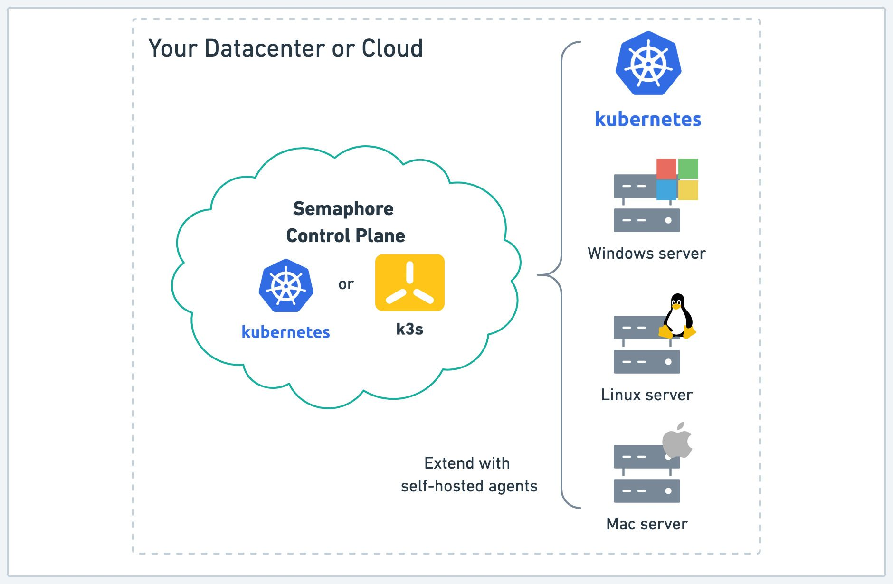

# Install Prerequisites

import Tabs from '@theme/Tabs';
import TabItem from '@theme/TabItem';
import Available from '@site/src/components/Available';
import VideoTutorial from '@site/src/components/VideoTutorial';
import Steps from '@site/src/components/Steps';
import FeatureNotAvailable from '@site/src/components/FeatureNotAvailable';
import { NiceButton, ButtonContainer } from '@site/src/components/NiceButton';
import { GKEIcon, EKSIcon, UbuntuIcon, GCPCompute, AWSEC2Icon } from '@site/src/components/CustomIcons';

This page shows an overview of the prerequisites and different methods to install **Semaphore Community Edition** on your systems. If you have any questions or issues during installation, you can get help in the [official Semaphore Discord server](https://discord.gg/FBuUrV24NH).

## Overview

A Semaphore CI/CD platform consists of two components:

- **Control plane**: the control plane orchestrates jobs, serves the web application and public API, handles logging, manages permissions, and connects with your repositories. The control plane requires a Kubernetes cluster or a server running [k3s](https://k3s.io/).
- **Agents**: the only purpose of an agent is to run jobs. The default Semaphore installation includes one agent that runs on the same cluster as the control plane. Agents connect to the control plane, waiting for jobs to be scheduled. See [self-hosted agents](../using-semaphore/self-hosted) to learn how to scale your Semaphore setup.

## Prerequisites

To install Semaphore, you need:

- A DNS domain
- The ability to create A, AAAA, or CNAME records for your domain
- A Kubernetes cluster or a Ubuntu machine
- The node or machine should have at least **16 GB of RAM and 8 CPUs**
- Installation and setup time: about 1-2 hours

## Choose your platform {#install-method}

You can install Semaphore on a single Linux/Ubuntu machine or in a Kubernetes cluster.

Each platform presents trade-off. Use the following table as a guide:

| Facility | Single-alone machine | Kubernetes cluster |
|--|--|--|
| Backup and restore | Simple | Complex |
| Infraststructure costs | Lower | Higher |
| Scalability of control plane | Low  
ⓘCan only be scaled vertically with a more powerful machine.
 | High 
ⓘCan be scaled horizontally and vertically.
 |
| Scalability of job runner (agents) | High | High |
| Redundancy | None | High |
| Availability | Low 
ⓘServer is single point of failure.
 | High 
ⓘIf a node goes down, Kubernetes can autoheal.
 |

### Single-machine installation

<ButtonContainer>
   <NiceButton
    icon={UbuntuIcon}
    title="Install on Ubuntu"
    subtitle="Ubuntu Machine with k3s"
    url="./install-ubuntu"
  />
  <NiceButton
    icon={GCPCompute}
    title="Install on Google VM"
    subtitle="Google Cloud Compute"
    url="./install-gcompute"
  />
  <NiceButton
    icon={AWSEC2Icon}
    title="Install on EC2"
    subtitle="Amazon EC2 VM"
    url="./install-aws-ec2"
  />
</ButtonContainer>

### Kubernetes installation

<ButtonContainer>
  <NiceButton
    icon={GKEIcon}
    title="Install on GKE"
    subtitle="Google Cloud Kubernetes"
    url="./install-gke"
  />
<!--
  <NiceButton
    icon={EKSIcon}
    title="Install on EKS"
    subtitle="Amazon Elastic Kubernetes (pending)"
    url="./install"
  />
-->
</ButtonContainer>

## See also

- [Getting started guide](./guided-tour)
- [Migration guide](./migration/overview)

