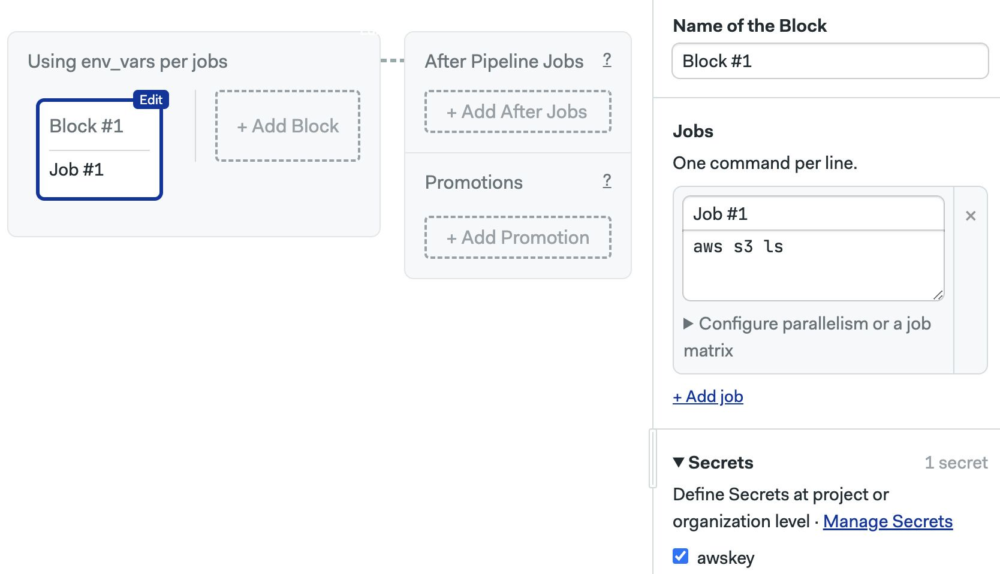

# Jenkins

import Tabs from '@theme/Tabs';
import TabItem from '@theme/TabItem';
import Available from '@site/src/components/Available';
import VideoTutorial from '@site/src/components/VideoTutorial';
import Steps from '@site/src/components/Steps';

## Overview

The main difference between Jenkins and Semaphore is that Semaphore is a managed service while Jenkins is purely self-hosted.

In Jenkins you are in charge of configuring everything, installing plugins for all the functionality you need, managing the agents to run the workflows, creating the connections to the Git providers, managing the Jenkins instance, and the list goes on. 

Semaphore is always ready to use, once you create an account and connect your Git provider you're ready to go. There is nothing to manage and you get first-class support.

## Jenkins vs Semaphore

This section describes how to implement common Jenkins functionalities in Semaphore.

### Checkout

Checkout clones the repository in the CI system. This is usually near the beginning of every job and workflow.

<Tabs groupId="migration">
<TabItem value="old" label="Jenkins">

In Jenkins, we use the Git plugin to connect and retrieve the repository history. You need to add authentication credentials on the Jenkins instance and use them in the stage.

```groovy
stage('Checkout repository') {
    steps {
        // highlight-start
        git branch: 'main',
            credentialsId: '<my-repo-auth>',
            url: 'git@github.com:<owner>/<project-name>.git'
        // highlight-end

        sh "cat README.md"
    }
}
```

</TabItem>
<TabItem value="new" label="Semaphore">

When we create a project in Semaphore, the Git repository is automatically linked to the project. To clone the repository we only need to execute [`checkout`](../../reference/toolbox#checkout) near the beginning of the job.

```shell
# highlight-next-line
checkout
# now the code is the current working directory
cat README.md
```

</TabItem>
</Tabs>

### Artifacts

Artifacts are used to store deliverables and persist files between runs.

<Tabs groupId="migration">
<TabItem value="old" label="Jenkins">

In Jenkins we use `archiveArtifacts` to store files:

```groovy
stage('Build') {
    steps {
        // Your build steps here
        // ...
        
        // highlight-next-line
        archiveArtifacts artifacts: 'build/output/**/*.jar', fingerprint: true
    }
}
```

And `copyArtifacts` to retrieve them:

```groovy
stage('Deploy') {
    steps {
        // highlight-next-line
        copyArtifacts(projectName: 'MyProject', filter: '**/*.jar', target: 'deploy-directory')
    }
}
```

</TabItem>
<TabItem value="new" label="Semaphore">

Semaphore provides an integrated artifact store that can be accessed with the [`artifact`](../../reference/toolbox#artifact) tool inside any job.

To store a file we use:

```shell
artifact push workflow build
```

We can restore the folder with:

```shell
artifact pull workflow build
```

</TabItem>
</Tabs>


### Caching

The cache speeds up workflows by keeping a copy of dependencies in storage.

<Tabs groupId="migration">
<TabItem value="old" label="Jenkins">

In Jenkins, we need to install the [jobcacher](https://plugins.jenkins.io/jobcacher/) plugin to enable the cache. Then, we a cache stage to the workflow before building the project.

```groovy
stage('Cache Dependencies') {
     steps {
        // highlight-next-line
         cache(maxCacheSize: 250, caches: [
             [$class: 'ArbitraryFileCache', 
              includes: ['**/node_modules/**'], 
              excludes: [],
              path: 'node_modules',
              fingerprintingStrategy: [$class: 'DefaultFingerprintStrategy']]
         ]) {
             // Your build steps go here
            sh 'npm install'
        }
    }
}
```

</TabItem>
<TabItem value="new" label="Semaphore">

Semaphore provides an integrated cache that can be accessed with the [cache](../../reference/toolbox#cache) cache tool.

```shell
checkout
# highlight-next-line
cache restore
npm install
# highlight-next-line
cache store
```

</TabItem>
</Tabs>

### Language versions

We often need to activate specific language or tool versions to ensure consistent builds.

<Tabs groupId="migration">
<TabItem value="old" label="Jenkins">


Jenkins doesn't have a native way to activate languages. That means you have to install a plugin or run the language installation commands manually in a stage.

```groovy
stage('Setup Go') {
    steps {
        sh '''
            source ~/.gvm/scripts/gvm
            gvm install go1.21.0  # or whatever version you need
            gvm use go1.21.0
            go version
        '''
    }
}

stage('Build') {
    steps {
        sh 'go build'
    }
}
```

</TabItem>
<TabItem value="new" label="Semaphore">

Semaphore provides the [Docker environments](../../using-semaphore/pipelines#docker-environments) to run your jobs in environments with all your build tools. You can connect multiple Docker images to provide database services for your end-to-end or smoke tests.

</TabItem>
</Tabs>


### Databases and services

Testing sometimes requires disposable databases and services in the CI environment.

<Tabs groupId="migration">
<TabItem value="old" label="Jenkins">

Jenkins has plugins for various databases and services. It also supports running services with Docker, which is often the easiest way to run disposable instances.


```groovy
stages {
    // highlight-start
    stage('Start Database') {
        steps {
            sh 'docker run --name test-postgres -e POSTGRES_PASSWORD=mysecretpassword -d postgres'
            // Wait for database to be ready
            sh 'sleep 10'
        }
    }
    // highlight-end
    
    stage('Run Tests') {
        steps {
            sh 'npm test'
        }
    }
    
    stage('Cleanup') {
        steps {
            sh 'docker stop test-postgres'
            sh 'docker rm test-postgres'
        }
    }
}
```

</TabItem>
<TabItem value="new" label="Semaphore">

Semaphore provides the [Docker environments](../../using-semaphore/pipelines#docker-environments) to run your jobs in environments with all your build tools. You can connect multiple Docker images to provide database services for your end-to-end or smoke tests.

</TabItem>
</Tabs>

### Secrets

Secrets inject sensitive data and credentials into the workflow securely.

<Tabs groupId="migration">
<TabItem value="old" label="Jenkins">

In Jenkins, we create the credentials at the instance level and then initialize variables using the credentials id.

```groovy
environment {
        AWS_ACCESS_KEY_ID     = credentials('jenkins-aws-secret-key-id')
        AWS_SECRET_ACCESS_KEY = credentials('jenkins-aws-secret-access-key')
}

// later in stages ...

    stage('AWS S3 Access') {
        steps {
            sh 'aws s3 ls'
        }
    }
```

</TabItem>
<TabItem value="new" label="Semaphore">

In Semaphore, we create the [secret](../../using-semaphore/secrets) at the server or project level and activate it on a block. 

The secret contents are automatically injected as environment variables in all jobs contained on that block.



</TabItem>
</Tabs>


### Complete example

The following comparison shows how to build and test a Ruby on Rails project on Jenkins and on Semaphore.

<Tabs groupId="migration">
<TabItem value="old" label="Jenkins">

This pipeline runs all the tests in different sequential stages.

```groovy
pipeline {
    agent any

    environment {
        RAILS_ENV = 'test'
    }

    stages {
        stage('Scan Ruby') {
            agent { label 'ubuntu' }
            steps {
                // Checkout code
                checkout scm

                // Set up Ruby
                sh '''
                    curl -sSL https://get.rvm.io | bash -s stable --ruby=$(cat .ruby-version)
                    source /usr/local/rvm/scripts/rvm
                    bundle install
                '''

                // Scan for common Rails security vulnerabilities
                sh 'bin/brakeman --no-pager'
            }
        }

        stage('Scan JS') {
            agent { label 'ubuntu' }
            steps {
                // Checkout code
                checkout scm

                // Set up Ruby
                sh '''
                    curl -sSL https://get.rvm.io | bash -s stable --ruby=$(cat .ruby-version)
                    source /usr/local/rvm/scripts/rvm
                    bundle install
                '''

                // Scan for security vulnerabilities in JavaScript dependencies
                sh 'bin/importmap audit'
            }
        }

        stage('Lint') {
            agent { label 'ubuntu' }
            steps {
                // Checkout code
                checkout scm

                // Set up Ruby
                sh '''
                    curl -sSL https://get.rvm.io | bash -s stable --ruby=$(cat .ruby-version)
                    source /usr/local/rvm/scripts/rvm
                    bundle install
                '''

                // Lint code for consistent style
                sh 'bin/rubocop -f github'
            }
        }

        stage('Test') {
            agent { label 'ubuntu' }
            steps {
                // Install packages
                sh 'sudo apt-get update && sudo apt-get install --no-install-recommends -y curl libjemalloc2 libvips sqlite3'

                // Checkout code
                checkout scm

                // Set up Ruby
                sh '''
                    curl -sSL https://get.rvm.io | bash -s stable --ruby=$(cat .ruby-version)
                    source /usr/local/rvm/scripts/rvm
                    bundle install
                '''

                // Run Rake tasks
                sh '''
                    cp .sample.env .env
                    bundle exec rake db:setup
                    bundle exec rake
                '''

                // Run tests
                sh 'bin/rails db:test:prepare test test:system'
            }
        }
    }
    post {
        always {
            // Clean up
            deleteDir()
        }
    }
}
```

</TabItem>
<TabItem value="new" label="Semaphore">

The following commands in a job run the same CI procedure. You can optimize for speed by splitting the tests into different jobs.

```shell
sudo apt-get update
sudo apt-get install --no-install-recommends -y curl libjemalloc2 libvips sqlite3
checkout
cache restore
bundle install --path vendor/bundle
cache store
cp .sample.env .env
bundle exec rake db:setup
bundle exec rake
bin/brakeman --no-pager
bin/importmap audit
bin/rubocop -f github
bin/rails db:test:prepare test test:system
```

</TabItem>
</Tabs>

## See also

- [Migration guide for GitHub Actions](./github-actions)
- [Migration guide for Travis CI](./travis)
- [Migration guide for BitBucket Pipelines](./bitbucket)
