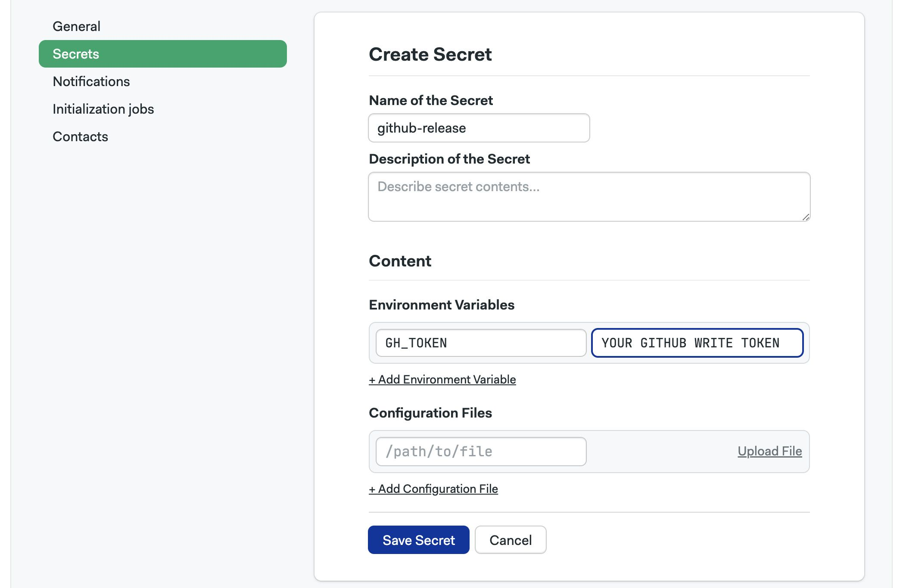
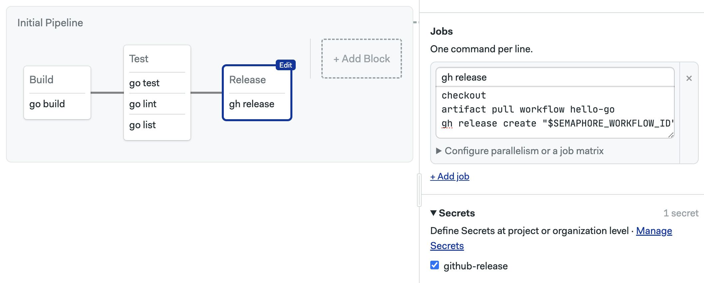
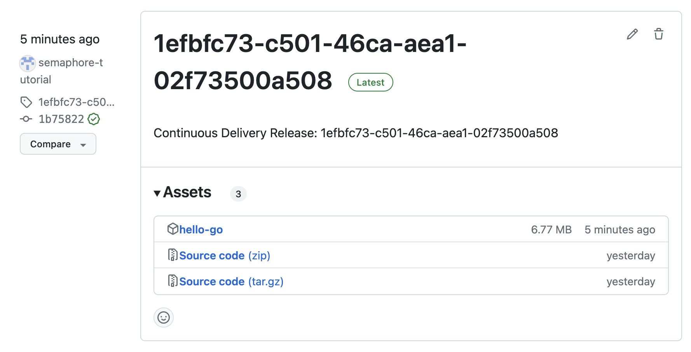

# Continuous Delivery

import Tabs from '@theme/Tabs';
import TabItem from '@theme/TabItem';
import Available from '@site/src/components/Available';
import VideoTutorial from '@site/src/components/VideoTutorial';
import Steps from '@site/src/components/Steps';

We succeeded into having a program built and tested using Continuous Integration. It's time to release it automatically using Continuous Delivery.

In this section you will learn about:

- Protecting sensitive data with Secrets
- Releasing your compiled application to GitHub

## Prerequisites

For this part of the tutorial you will need:

- A [GitHub Access Token](https://github.com/settings/tokens) with read+write content permissions
- The `git` command line tool

## Releasing to the world

The goal is to automatically deploy the built binary to the GitHub repository so people can download and enjoy our program. Next, we're going to add a job that automatically uploads the binary to the repository every time we tag a release with `git tag`

## Creating a Secret {#secret}

In order to upload files from the Semaphore job we need to authenticate with your GitHub account. For that, we'll need an access token.

Now, the problem with such tokens is that they should remain secret. This rules out using environment variables in our jobs to store the token, as these are visible to anyone with read access to the repository.

We can protect sensitive data such as tokens with *secrets*. Secrets provide a secure way to store key-value pairs and files within your Semaphore instance. So, even if our repository is public, no one outside can access these secrets.

To create a secret, follow these steps:

<Steps>

1. Open the project in Semaphore and go to the **Settings** tab
2. Go to **Secrets**
3. Press **New Secret**
4. Type a name for the secret, e.g. `github-release`
5. Type the key-value pair required to authenticate with GitHub

    The variable name is `GH_TOKEN` and the value is your unique token generated in your GitHub account

    

6. Press **Save Secret**

</Steps>

## Release job {#release}

Now we're ready to add a release job. We can use the [gh command line tool](https://cli.github.com/) to automate the release from a Semaphore job.

<Steps>

1. Open the workflow editor
2. Add a block
3. Type the following commands

    ```shell title="Release job"
    checkout
    artifact pull workflow hello-go
    gh release create "$SEMAPHORE_WORKFLOW_ID" hello-go --latest -t "$SEMAPHORE_WORKFLOW_ID" -n "Continuous Delivery Release: $SEMAPHORE_WORKFLOW_ID"
    ```

    The job pulls the binary from the artifact repository and publishes it using a unique UUID generated by Semaphore

4. Open the **Secrets** section on the block and enable `github-release`
   
    
    
5. Start the workflow

</Steps>

After the workflow finishes you should see a new release on your GitHub repository.



## What have we learned?

- How to create and use Secrets
- How to release packages to GitHub

## What's next?

That's all for the guided tour. What you've learned here will serve you well to build complex workflows for a lot of scenarios.

There is, of course, a lot more to learn. Semaphore is packed with features that do more with less work and optimizations to greatly speed up your workflows.

We recommend going next to the [Using Semaphore](../../using-semaphore/workflows) page. Here you will find the complete handbook for all Semaphore operations.

Thank you for trying out Semaphore and happy building!
