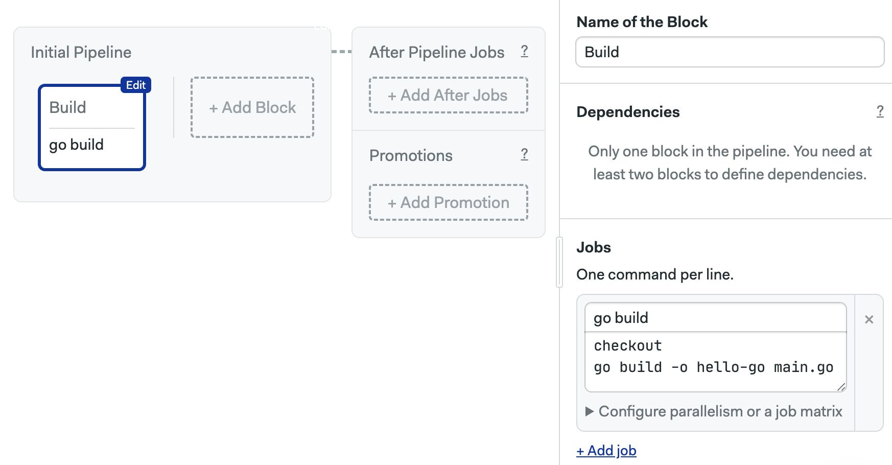
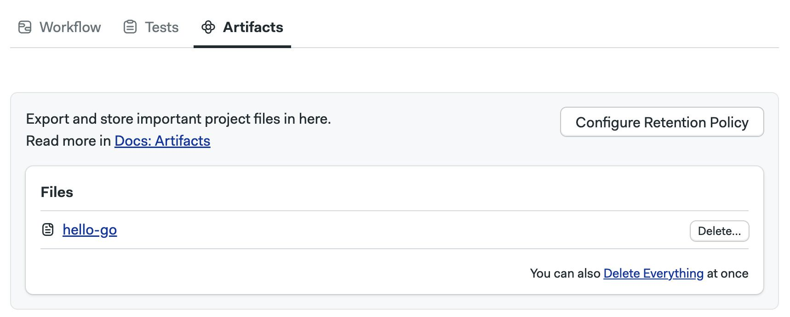
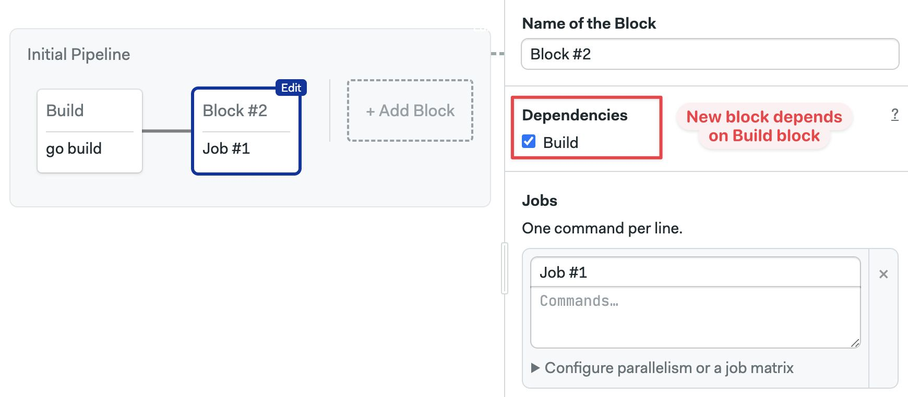
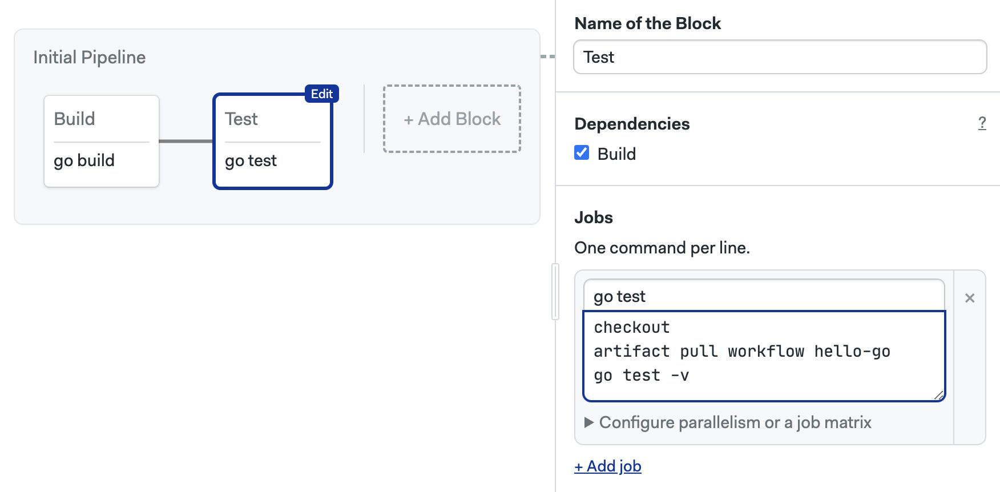
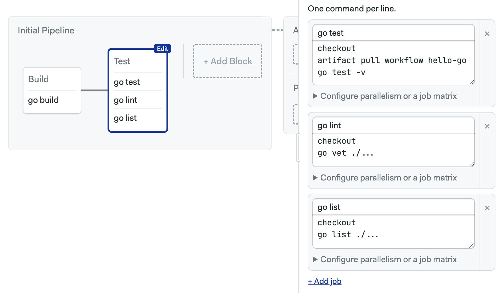
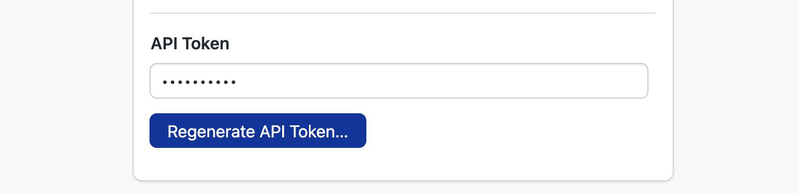
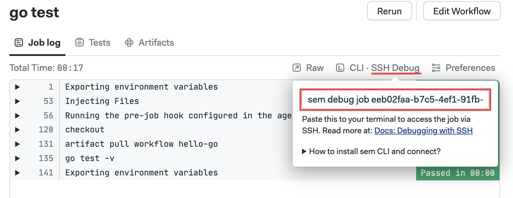
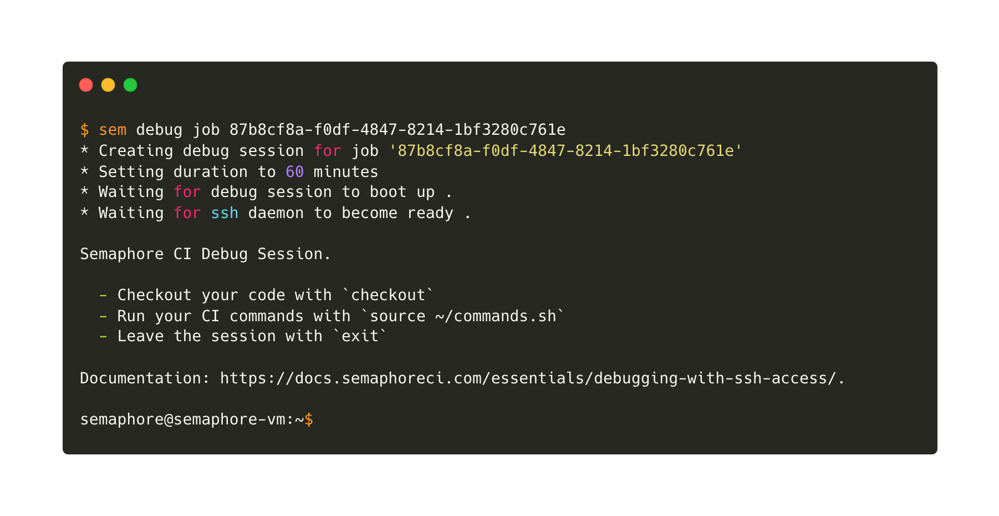

# Continuous Integration

import Tabs from '@theme/Tabs';
import TabItem from '@theme/TabItem';
import Available from '@site/src/components/Available';
import VideoTutorial from '@site/src/components/VideoTutorial';
import Steps from '@site/src/components/Steps';

With the basics covered, we're ready to tackle more CI on a more complete project.

In this section you will learn about:

- Blocks dependencies
- Using artifacts
- Debugging with SSH

## Prerequisites

For this part of the tutorial you will need:

- A Git repository
- The `git` command line tool
- The [Golang toolchain](https://go.dev)

## Something to build {#demo}

In most cases, the first step in CI is building the application. This proves that the main trunk is not broken and usually gives us a target to test.

So, our first task is to have something to build. In this case, we'll build a "Hello, World!" HTTP server in Go.

<Steps>

1. [Clone the repository](https://docs.github.com/en/repositories/creating-and-managing-repositories/cloning-a-repository) to your machine
2. Fetch the `setup-semaphore` branch, which was created in the [Hello World](./hello-world) part of the tour

    ```shell
    git fetch origin setup-semaphore
    git checkout setup-semaphore
    ```

3. Execute `go mod init hello-go` to initialize the Go module
4. Create `main.go` with the following contents. This provides an HTTP endpoint that returns "Hello Go!" in the body

    ```go title="main.go"
    package main

    import (
        "fmt"
        "net/http"
    )

    func helloHandler(w http.ResponseWriter, r *http.Request) {
        fmt.Fprintln(w, "Hello Go!")
    }

    func main() {
        http.HandleFunc("/", helloHandler)
        fmt.Println("Starting server on :8080")
        if err := http.ListenAndServe(":8080", nil); err != nil {
            fmt.Println("Failed to start server:", err)
        }
    }
    ```

5. Create `main_test.go` with the following contents

    ```go title="main_test.go"
    package main

    import (
        "io/ioutil"
        "net/http/httptest"
        "testing"
    )

    func TestHelloHandler(t *testing.T) {
        req := httptest.NewRequest("GET", "/", nil)
        w := httptest.NewRecorder()
        helloHandler(w, req)

        resp := w.Result()
        body, _ := ioutil.ReadAll(resp.Body)

        expected := "Hello Go!\n"
        if string(body) != expected {
            t.Errorf("expected %q, got %q", expected, string(body))
        }
    }
    ```

6. Push all files into your repository

    ```shell
    git add -A
    git commit -m "Initial commit"
    git push origin setup-semaphore
    ```

</Steps>

## The build job {#build}

Now that we have something to build, let's create a build job in Semaphore.

<Steps>

1. Open the Workflow Editor
2. Type descriptive names for the block and job
3. Add these commands to the job

    ```shell title="Build job"
    checkout
    go build -o hello-go main.go
    ```

    First, the `checkout` command clones the repository into the CI environment. It also changes the working directory so you're now inside the codebase

    Second, we use `go build` to build a Linux binary.

    

4. Press **Run the workflow** > **Start**

</Steps>

The build should finish without error. If at any point you come into a problem, see [debugging with SSH](#ssh).

## Keeping the build artifact {#artifact}

A very important fact about Semaphore jobs is that the CI environment is scrapped once the job ends. This means that the compiled binary we built is completely lost when the workflow finishes.

To keep the binary we must use the *artifact store*. Artifacts keep files and directories on persistent storage after the job ends.

So, modify the job like this to save the `hello-go` binary:

```shell title="Build job with artifacts"
checkout
go build -o hello-go main.go
# highlight-next-line
artifact push workflow hello-go
```

Run the workflow again. Once it has completed, you should be able to see the binary file in the **Artifacts** tab.



Artifacts can also be used to share files between jobs. You could download the binary in any other job with:

```shell
artifact pull workflow hello-go
```

Semaphore supports various scopes and options for artifacts. See [Artifacts](../../using-semaphore/artifacts) to learn more.

## The test job

CI wouldn't be CI if we didn't do any testing. So, let's add a test job.

<Steps>

1. Open the Workflow Editor
2. Press **Add Block** a new block appears

    Notice that the new block is connected to the Build block. This is because there is a dependency between the two blocks. Dependencies force the workflow to jobs to run in sequence.

    You can change dependencies using the checkboxes in the block settings.

    

3. Type the following commands

    ```shell title="Test block"
    checkout
    artifact pull workflow hello-go
    go test -v
    ```

    

4. Press **Run the workflow** > **Start**

</Steps>

We're only scratching the surface of what you can test. So, here's an idea, try adding more tests jobs in the test block. You could run the Go linter, do syntax checking, or check formatting, all in parallel.



## Debugging with SSH {#ssh}

Sooner or later you'll find that a command that runs fine in your machine fails miserably in the CI environment. The cause for this is often a subtle difference between the environments.

Fortunately, Semaphore provides a great way to debug jobs. You can actually SSH into the CI environment to run the commands interactively, dig around, and try solutions. Once you find what's wrong, you can update the jobs to fix the error.

Before you can perform SSH debugging, you need to set the Semaphore Command Line:

<Steps>

1. Go to your account menu and select **Profile Settings**
2. Press the **Regenerate API Token** button

    

3. Copy the token displayed and keep it safe
4. Install the Semaphore Command Line

    ```shell title="Installing the Semaphore CLI"
    curl https://storage.googleapis.com/sem-cli-releases/get.sh | bash
    ```

5. Connect the tool to your Semaphore instance, use the API key shown in step 2

    ```shell title="Connecting to your server"
    sem connect semaphore.<your-domain> <YOUR_API_TOKEN>
    ```

6. You're ready to do SSH debugging

</Steps>

The next time you encounter a failing job, follow these steps:

<Steps>

1. Open the failing job
2. Click on **SSH Debug**
3. Copy the command shown and paste it in your terminal

    

4. Wait for the SSH session to begin

    

5. Dig around. You can run the job commands interactively by executing `source ~/commands.sh`

</Steps>

## What have we learned?

- We built and tested a real program
- We learned how to use dependencies to run jobs sequentially
- We used artifacts
- We explored how to debug jobs using SSH
