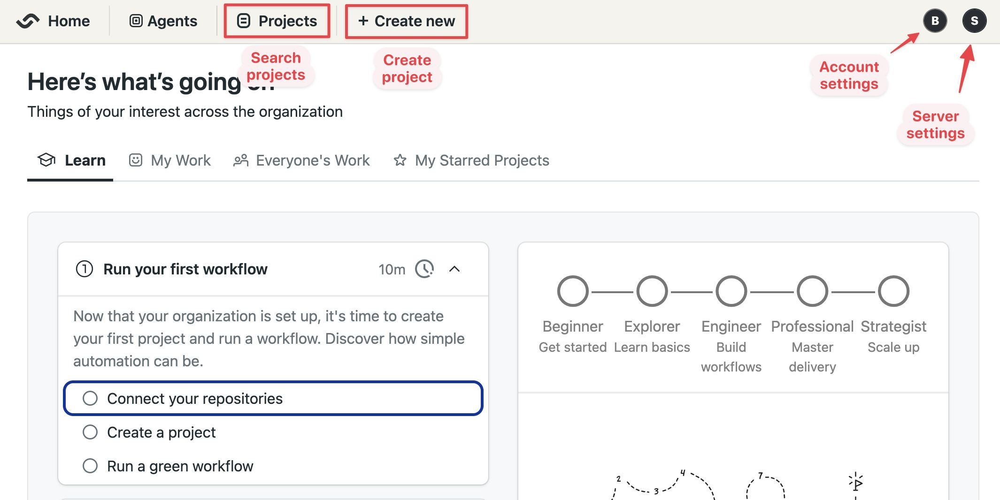
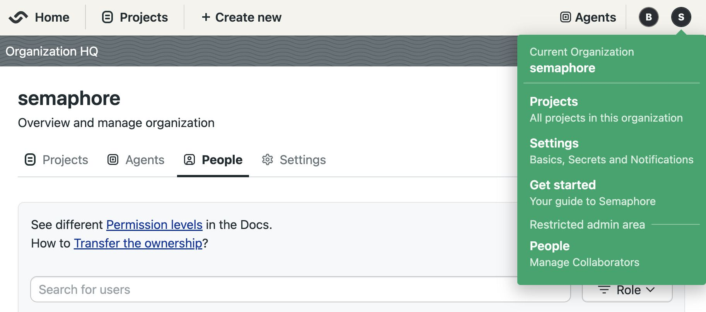
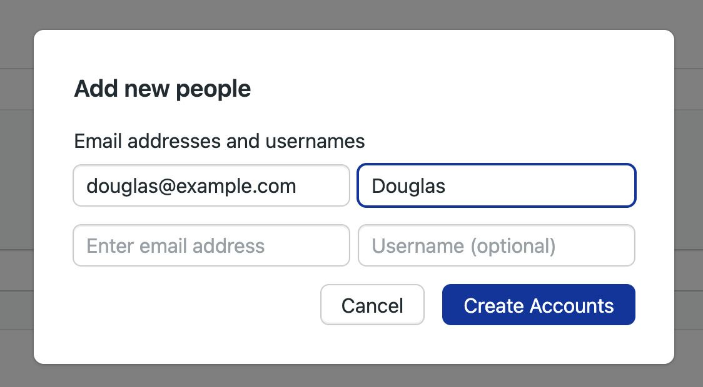
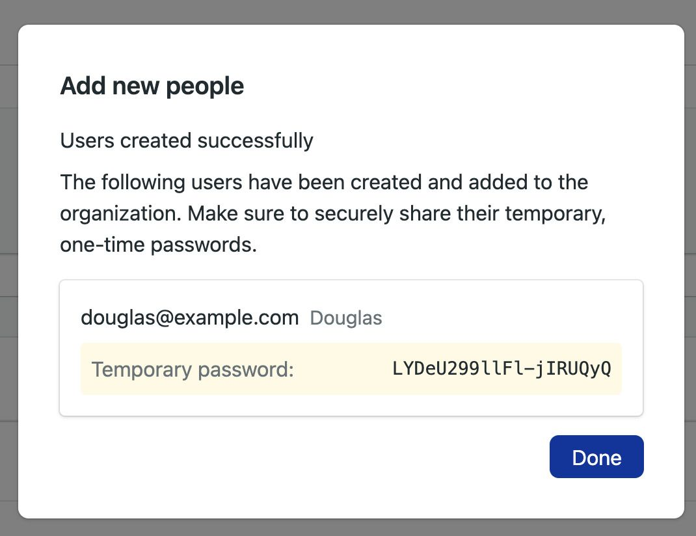
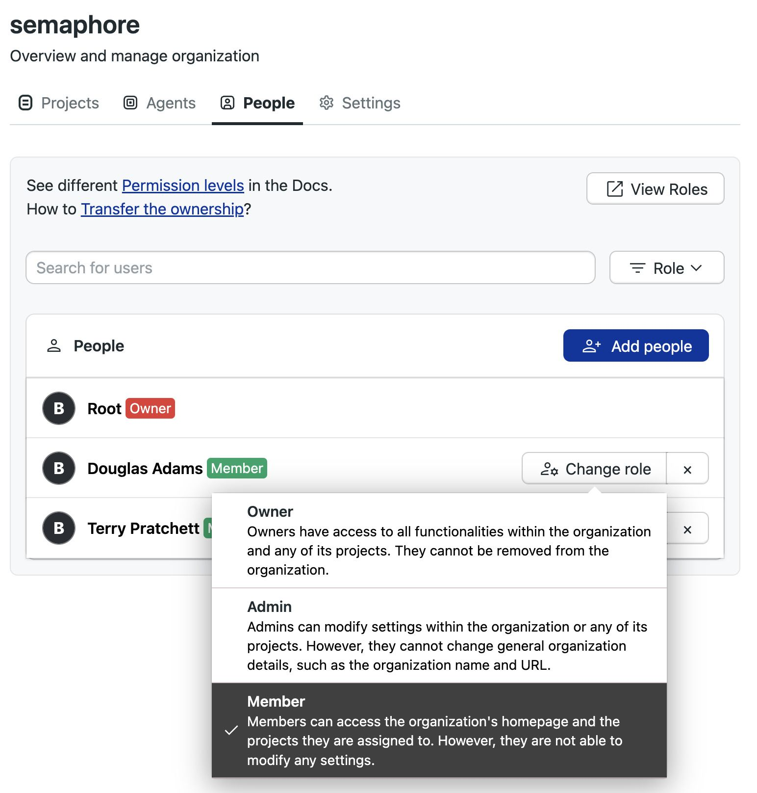
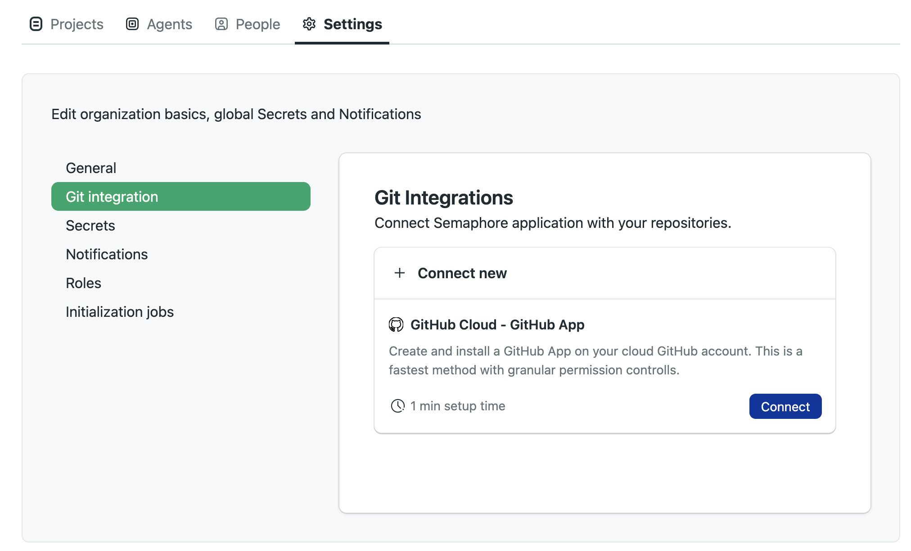

# First steps

import Tabs from '@theme/Tabs';
import TabItem from '@theme/TabItem';
import Available from '@site/src/components/Available';
import VideoTutorial from '@site/src/components/VideoTutorial';
import Steps from '@site/src/components/Steps';

You will need a Semaphore account to follow this guided tour. Don't worry, the only thing you will need is an account on GitHub or BitBucket.

In this section we'll learn about:

- What's the purpose of CI/CD?
- Overview of the Semaphore homepage
- How to invite users to your Semaphore instance

## Prerequisites

To use Semaphore Community Edition you need:

- A [Semaphore Installation](../install)
- Either a [GitHub](https://github) or [BitBucket](https://bitbucket.org) account

## Login to Semaphore

During the [Semaphore installation](../install) you get the username and password for the root account. To log into your Semaphore instance, navigate to the domain where you installed Semaphore and use the root account username and password.

## Semaphore homepage

At this point, you should be seeing your homepage. Let's get our bearings.

On the top left side you'll find:

- Project search box
- Project creation button

On the top right side, there is:

- The account menu: here you can manage your account and log off Semaphore
- The server menu: lets you invite people and configure your Semaphore server

:::info

On Semaphore Community Edition we use the terms organization, server, and instance interchangeably.

:::

## Invite users and manage permissions

Since the root account is not tied to an specific person and has elevated privileges, we recommend creating individual accounts and managing their permissions with [roles](../../using-semaphore/rbac).

To create new accounts, follow these steps:

<Steps>

1. Open the server menu
2. Select **People**

    

3. Press **Add people**
4. Type the email of the persons you wish to invite
5. Optionally, set a username. If not provided, the username is inferred from the email
6. When you are done adding users, press **Create Accounts**

    

7. Take note of the temporary passwords for each account

    

8. When the new user first logs in with the temporary password, they will be prompted to create a new one. After that, they can start using Semaphore normally.

</Steps>

By default, new accounts have the member role, which gives basic permissions to the Semaphore instance. We recommend to create at least a new account with the admin or owner roles to manage the server without using the root account.

You can change the role of a new user by pressing the **Change Role** button and selecting a new role.

See [roles](../../using-semaphore/rbac) to learn more about roles.

## Connect Semaphore to GitHub

To connect Semaphore with GitHub, follow these steps:

<Steps>

1. Open the server menu and select **Settings**

    

2. Select **Git Integration**
3. Press **Connect**

    

4. Sign into your GitHub account
5. Select what type of access to authorize

    - **All repositories**: grant access to Semaphore to all your current *and future repositories*
    - **Only select repositories**: select from the list which repositories can be accessed by Semaphore

6. Press **Install**

</Steps>

:::note

You might not be able to install the GitHub App if you are not the GitHub organization owner. In this case, following these steps sends an installation request to the organization's owner. You cannot proceed until the owner authorizes the access.

:::

## What have you done so far?

- Logged in to your Semaphore instance
- Learned the basics of Semaphore
- Invited new users and 

## What's next?

In the next section, we'll create our first project.
