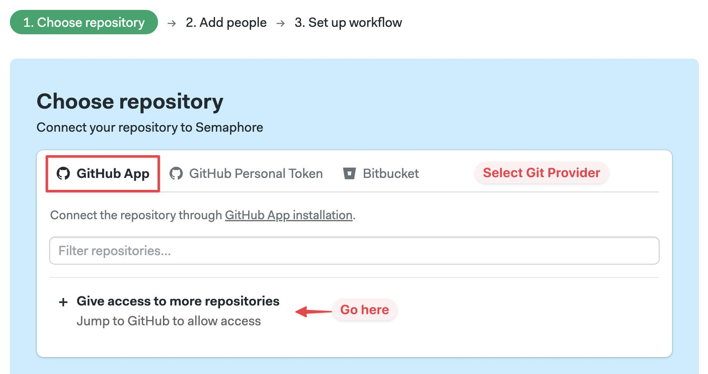
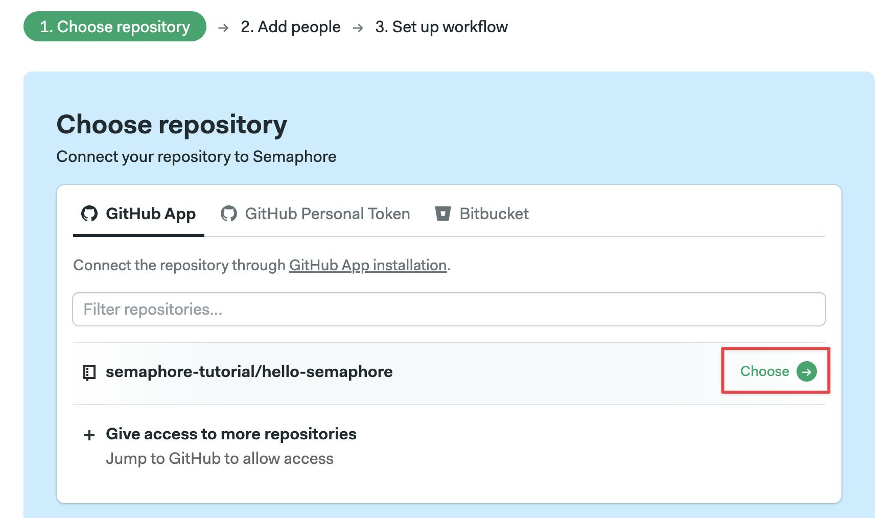
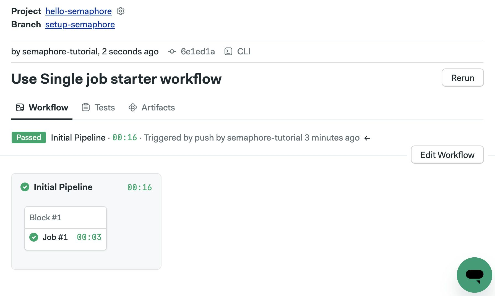
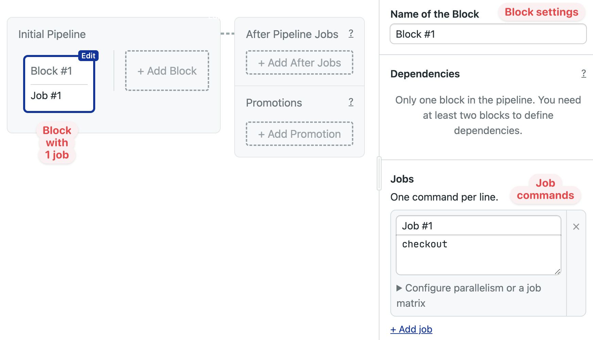
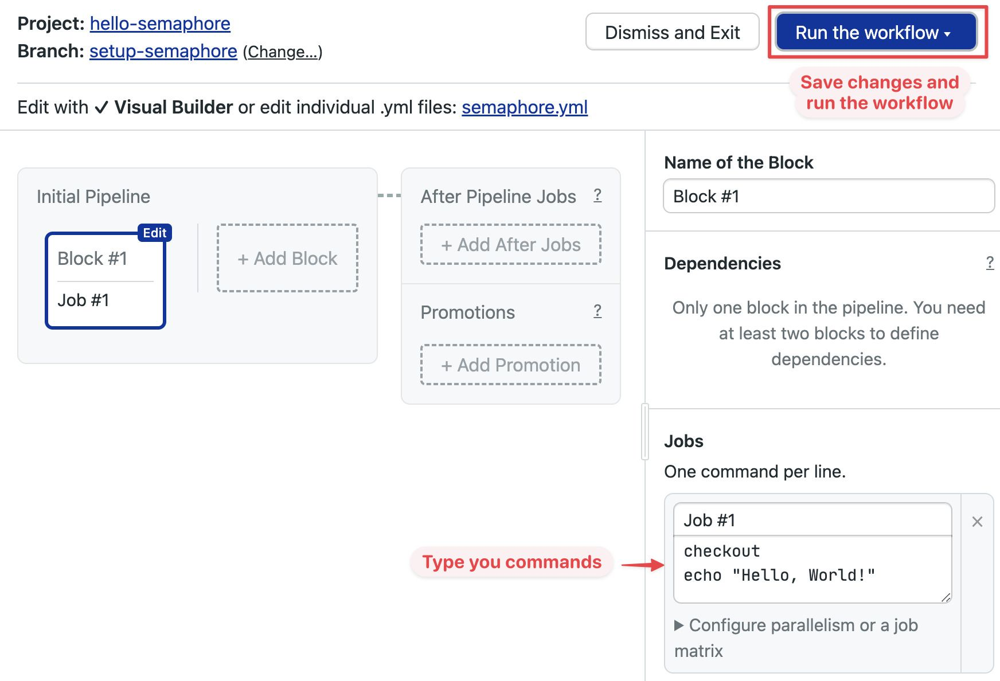
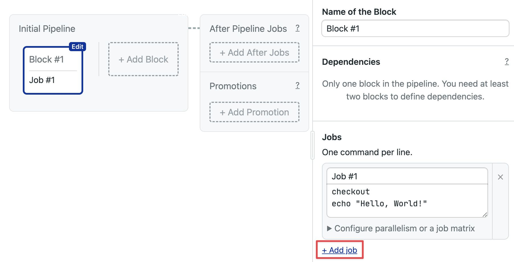
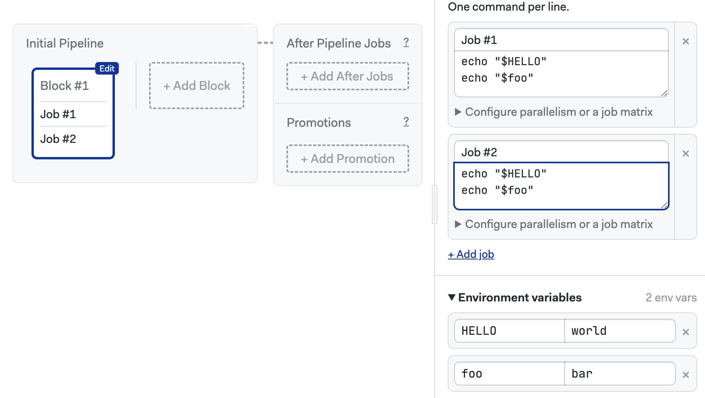

# Hello, World

import Tabs from '@theme/Tabs';
import TabItem from '@theme/TabItem';
import Available from '@site/src/components/Available';
import VideoTutorial from '@site/src/components/VideoTutorial';
import Steps from '@site/src/components/Steps';

Projects allow Semaphore to perform user-defined actions every time there is a change in your Git repository. Projects can build and test your code, and release and deploy your applications.

In this section, you will:

- Create your first project
- Learn about workflows and pipelines
- Set up jobs and use environment variables

## Prerequisites

- A repository with at least one commit

## What is a project? {#project}

A project connects Semaphore to your Git repository. Every project on Semaphore must be connected to one repository to work. Repositories can be hosted on GitHub or BitBucket.

Every time *something* changes in the repository, Semaphore initiates a workflow. The workflow runs all the pipelines you have configured (we'll get to that in a bit). These pipelines can virtually do anything, including building your application, testing it, and deploying it to your servers.

By default, a workflow can be initiated by any of these events:

- Pushing commits into any branch
- Pushing Git tags
- Creating pull requests
- Changing any pipelines
- Manually re-running workflows or pipelines
- Running pipelines using Scheduled Tasks

## Hello, world! {#hello}

These are the steps to create your first project:

<Steps>

1. Press the **Create new** button

    

2. Press **Choose repository**
3. Select the tab corresponding to your provider: GitHub or BitBucket.  Press **Give access** or **Connect**

    

4. Back in Semaphore, select a repository from the list

    

5. Wait a few moments for Semaphore to connect to your repository and set up the project

6. Next, you'll see a list with all the existing contributors in the repository. These are all individuals with some level of access to your Git provider

    Select the individuals you wish to invite to the project and press **Add selected**

    You can also [add people later](#people)

    

7. You'll be presented with a list of pre-defined pipelines. For now, let's stick with the default one. Press **Looks good, Start**

</Steps>

Once you're done the following things will happen:

- The project is created and linked to your repository
- The selected individuals are invited into your Semaphore instance and granted access to the project
- A new branch called `setup-semaphore` is created in your repository
- A new pipeline file called `.semaphore/semaphore.yml` is created in your repository
- The first workflow immediately starts

## Working with pipelines {#workflow-editor}

<VideoTutorial src="https://www.youtube.com/embed/dg2jDQmYJ_4?si=bg8jqKwVgtpxa6k-" title="Workflow Editor Overview"/>

Pipelines are YAML files located in the `.semaphore` folder at the root of your project. They what actions Semaphore performs when a workflow starts.

Press the **Edit Workflow** on the right. This will open the Visual Workflow Editor. This will open a visual representation of the main or initial pipeline.

Let's get our bearings. The highlighted element is a *block*. A block is a container for jobs. Currently, there is only one job in the block.

On the right-side menu, you can see the block settings and the job command, which currently has one command (`checkout`). Every line here represents one command to run on a Bash shell.

Try adding the command `echo "Hello, World!"` and pressing **Run the workflow** > **Start**.

The new workflow starts immediately. Clicking on the job reveals the job log. You can view the output of each command by clicking on them.

## Adding more jobs {#jobs}

A block can have many jobs. Let's add a second job by pressing **Edit Workflow** and then clicking on **Add Job**

Add a few commands in the second job and press  **Run the workflow** > **Start**.

The first thing you'll notice is that both jobs run in parallel. Job contained in the same block always runs concurrently.

## Using environment variables {#variables}

A block not only runs jobs in parallel; it also contains settings that all its child jobs share.

Open the workflow editor again and scroll down the right menu until you reach the section called **Environment variables**.

Click **Add env_vars** and set a few variables. You can define the variable name and value. Variables defined on the block are available to all its jobs.

Execute this workflow and see the output of the jobs. Both jobs should show the same message.

:::warning No sensitive data in environment variables

Do not put sensitive data such as passwords or API tokens in environment variables. Environment variables are not secure. They are stored in plain text in the pipeline file. So, anyone with read permissions in the repository can view your environment variables.

Use [Secrets](../../using-semaphore/secrets) to for sensitive data. We'll use secrets in the last part of the guided tour [Continuous Delivery](./continuous-delivery)

:::

## Inviting people to the project {#people}

If you want to allow other persons access to the project, you must first [invite them to your Semaphore server](../../using-semaphore/organizations#people). Once they are invited, you can grant them access to the project by following these steps:

<Steps>

1. Open your project
2. Go to the **People** tab
3. Press **Add people**
4. Type the name of the person to add
5. Press **Add**

</Steps>

## What have we learned?

- How to create a project
- How to invite people to a project
- What blocks and jobs are
- How jobs in the same block run in parallel
- That block settings apply to all jobs in the block

## What's next?

In the next section, we'll do our first steps with Continuous Integration.
