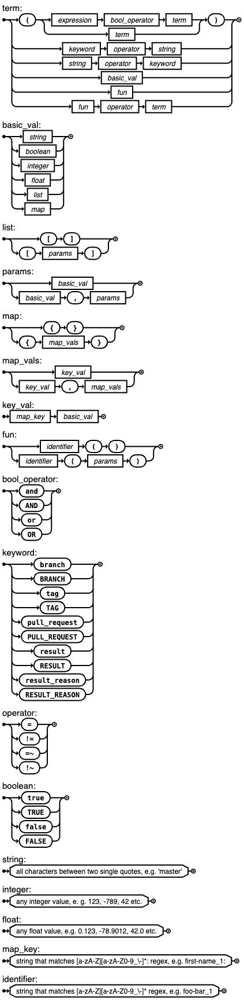

# Conditions Syntax DSL

import Tabs from '@theme/Tabs';
import TabItem from '@theme/TabItem';
import Available from '@site/src/components/Available';
import VideoTutorial from '@site/src/components/VideoTutorial';

The conditions syntax allows the use of regular expressions to match different conditions and take actions.

## Overview

Conditions allow you to combine regular expressions to trigger things like auto-promotions or define job priorities based on workflow outcomes.

For example, the following condition resolves to `true` when:

- the current branch is master or ... 
- the workflow contains a Git tag that begins with "v1", e.g. "v1.1.2"

```shell title="Example condition"
branch = 'master' OR tag =~ '^v1\.'
```

You can use conditions in the following situations:

- To determine [job priorities](../using-semaphore/jobs#priority)
- In [pipeline queues](../using-semaphore/pipelines#pipeline-queues)
- In the [auto cancel](../using-semaphore/pipelines#auto-cancel) policy
- To [fail fast](../using-semaphore/pipelines#fail-fast) pipelines
- As block [skip/run conditions](../using-semaphore/jobs#skip-run)
- With [monorepo projects](../using-semaphore/monorepo) using the [change_in function](#change-in)

You can find detailed information about the `when` keyword in our [library repository](https://github.com/renderedtext/when?tab=readme-ov-file#when-library).

## Basic syntax

The basic syntax for conditions is:

```text
keyword operator term
```

The expression should result in either `true` or `false`. In its simplest form:

```text
true
```

Always resolves in a true (matching) condition.

Here are a few more complex examples:

| Keyword | Operator | Term | Meaning |
|--|--|--|--|
| branch | = | "master" | Branch is master |
| branch | =~ | ".*" | Any branch (regexp matches all) |
| result | = | "failed" | At least one job has failed |
| tag | =~ | "^v1\." | Tag begins with v1 (regexp) |
| branch | !~ | "^dev/" | Branch does not begin with dev (regexp) |
| pull_request | =~ | ".*" | Any pull request (regexp matches all) |

Expressions can be combined using boolean "AND", "OR" (they also work in lowercase). For example:

```text title="Combin
# True when branch is 'staging' or 'master
branch = 'staging' OR branch = 'master'

# True when the branch is master and there is a tag
branch = 'master' OR tag =~ '.*'

# Branch does not begin with 'dev' and all job have been completed successfully
# unless the branch is master, if master the output is always true
(branch !~ '^dev/'" and result = 'passed') or branch = 'master'
```

### Keywords

This is the full list of keywords supported in conditions.

| Keyword | Meaning |
|--|--|
| branch | Branch for the current pipeline |
| tag | Git tag for the current pipeline |
| pull_request | Pull request number for the pipeline |
| result | Result of the pipeline. Possible values: passed, stopped, canceled, and failed |
| result_reason | The reason for the result. Possible values are: test, malformed, stuck, internal, user, strategy, and timeout |

### Operators

You can use the following operators in your conditions.

| Operator | Meaning |
|--|--|
| = | String equality |
| != | String inequality |
| =~ | Regular expression (regexp) matches |
| !~ | Regular expression (regexp) does not match | 
| and | Boolean AND | 
| or | Boolean OR |

:::note

Regexp follows Perl Compatible Regular Expression syntax.

:::

## Change detection (`change_in`) {#change-in}

:::info 

Pipelines with `change_in` expressions require a [pipeline initialization](../using-semaphore/pipelines#init-job) step before the workflow starts.

:::

You can use the `change_in` function to detect changes in files and directories in recent commits. This function is a key component in [monorepo support](../using-semaphore/monorepo).

The function is evaluated at runtime and, depending on the [skip/run conditions of the block](../using-semaphore/jobs#skip-run), will either run or skip the jobs. 

The function accepts two arguments, i.e.: `change_in(file_patterns, options)`

### File patterns {#file-patterns}

The `file_pattern` is a required argument. The pattern can be one of the following:

- Path relative to repository root: the pattern begins with `/`, e.g. `/lib` matches all files recursively in the `lib` directory
- Path relative to pipeline file: the pattern begins with `../`, e.g. `../lib` matches all files recursively in the `lib` directory relative to the pipeline file
- Glob: the pattern uses globbing `*` and `**`, e.g. `/lib/**/*.js` matches every file with js extension recursively in the `lib` directory
- A list of patterns: multiple patterns separated by commas, e.g. `['/lib', '/app', '/config/**/*.rb']` matches every file in the `lib` and `app` directories, and every rb file in the `config` directory (all matches are recursive in the example)

### Options {#options}

The second argument is an optional hashmap with key-value options to modify the behavior of the `change_in` function.

The supported options are:

| Key | Default | Meaning |
|--|--|--|
| `on_tags` | `true` | Always returns true if a Git tag is present in the commit |
| `default_branch` | `master` | define the main/master branch for your repository |
| `pipeline_file` | `track` | When set to `track` always returns true if the pipeline file has changed. If set to `ignore`, pipeline file changes are ignored and the file pattern is evaluated |
| `branch_range` | [`$SEMAPHORE_GIT_COMMIT_RANGE`](./env-vars#commit-range) | The commit range examined for all non-default branches. The default behavior is to examine the commits between the start of the branch and the point for the targeted merge. You can use any predefined or literal values to create ranges in double-dot or triple-dot syntax, as described in [Revision Selection](https://git-scm.com/book/en/v2/Git-Tools-Revision-Selection) |
| `default_range` | [`$SEMAPHORE_GIT_COMMIT_RANGE`](./env-vars#commit-range) | Same as `branch_range` but it applies to the default branch, e.g. "master" |
| `exclude` | `[]` | A list of [file patterns](#file-patterns) to ignore, e.g. `change_in('/', {exclude: ['/docs']})` searches recursively in all directories except `/docs` |

### Change detection strategies {#strategies}

See [change detection strategy](../using-semaphore/monorepo#strategies) to learn what's the default behavior of `change_in`.

### Examples {#examples}

See [change detection examples](../using-semaphore/monorepo#examples) for more `change_in` examples.

## Formal syntax definition {#definition}

This section shows the formal language definition for conditions using the [Extended Backus-Naur Form](https://en.wikipedia.org/wiki/Extended_Backus%E2%80%93Naur_form) (EBNF) notation.

<Tabs groupId="syntax">
<TabItem value="visual" label="Visual Representation">

Below is a visual representation of the conditions syntax.



</TabItem>
<TabItem value="syntax" label="Syntax">


This is the text representation of the conditions syntax.

```text title="Conditions in EBNF notation"

expression = expression, bool_operator, term
 | term;

term = "(", expression, ")"
 | keyword, operator, string
 | string, operator, keyword
 | basic_val
 | fun
 | fun, operator, term;

basic_val = string
 | boolean
 | integer
 | float
 | list
 | map;

list = "[", "]"
 | "[", params, "]";

params = basic_val
 | basic_val, ",", params;

map = "{", "}"
 | "{", map_vals, "}";

map_vals = key_val
 | key_val, ",", map_vals;

key_val = map_key, basic_val;

fun = identifier, "(", ")"
 | identifier, "(", params, ")";

bool_operator = "and" | "AND" | "or" | "OR";

keyword = "branch" | "BRANCH" | "tag" | "TAG" | "pull_request" | "PULL_REQUEST"
 | "result" | "RESULT" | "result_reason" | "RESULT_REASON";

operator = "=" | "!=" | "=~" | "!~";

boolean = "true" | "TRUE" | "false" | "FALSE";

string = ? all characters between two single quotes, e.g. 'master' ?;

integer = ? any integer value, e.g. 123, -789, 42, etc. ?;

float = ? any float value, e.g. 0.123, -78.9012, 42.0, etc. ?;

map_key = ? string that matches [a-zA-Z][a-zA-Z0-9_\-]*: regex, e.g. first-name_1: ?;

identifier = ? string that matches [a-zA-Z][a-zA-Z0-9_\-]* regex, e.g. foo-bar_1 ?;
```

</TabItem>
</Tabs>

## See also

- [Monorepo support](../using-semaphore/monorepo)
- [Environment variable reference](./env-vars)
- [Pipeline YAML reference](./pipeline-yaml)
