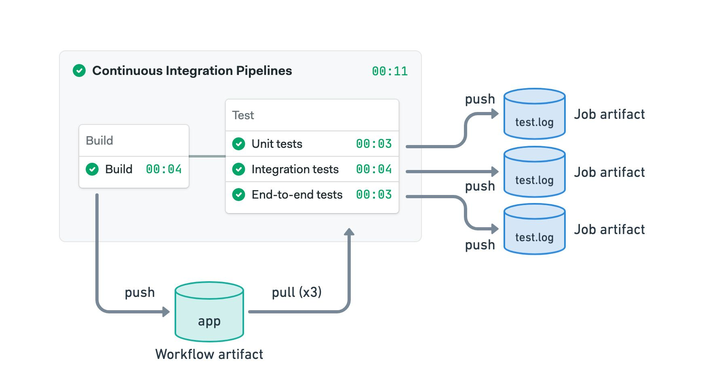
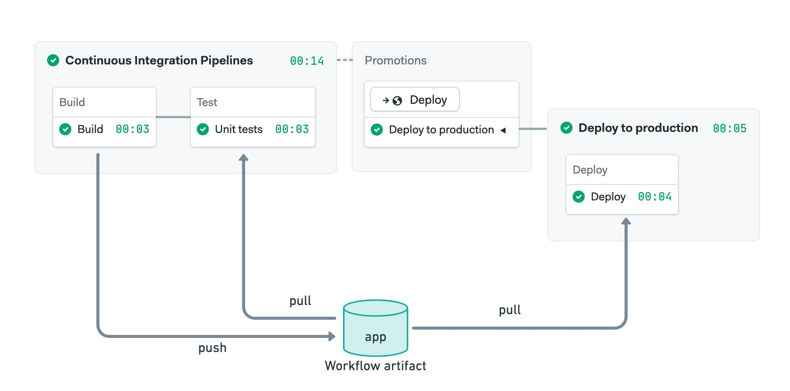
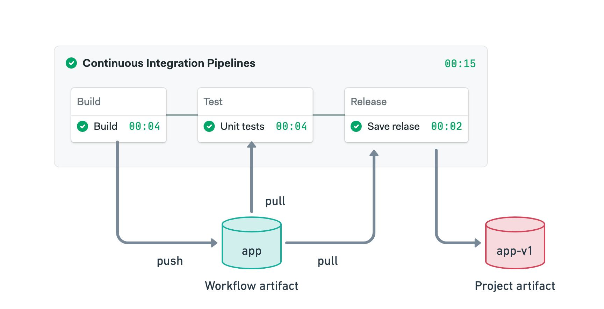
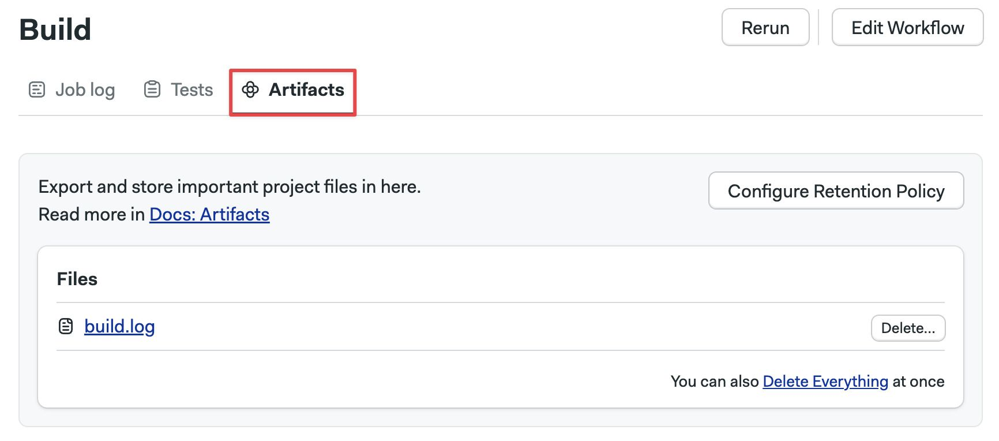
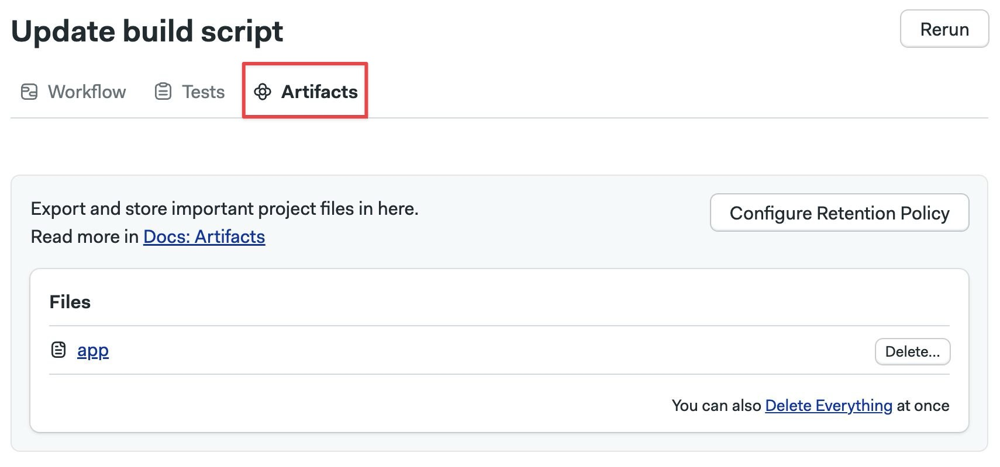
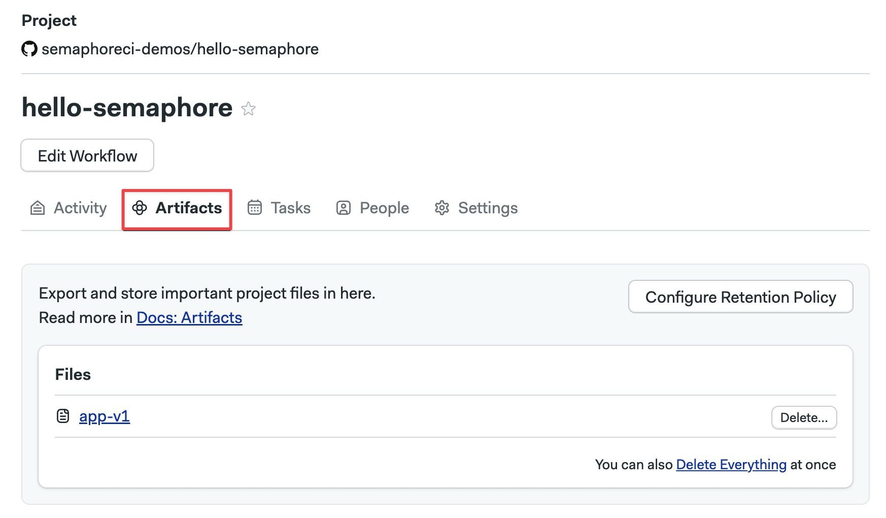
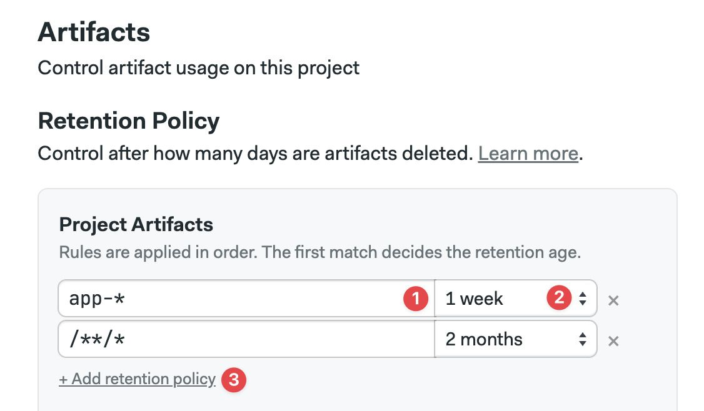
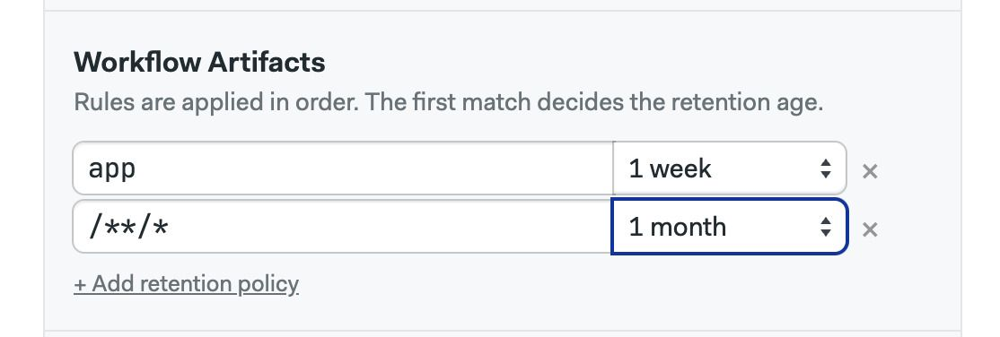
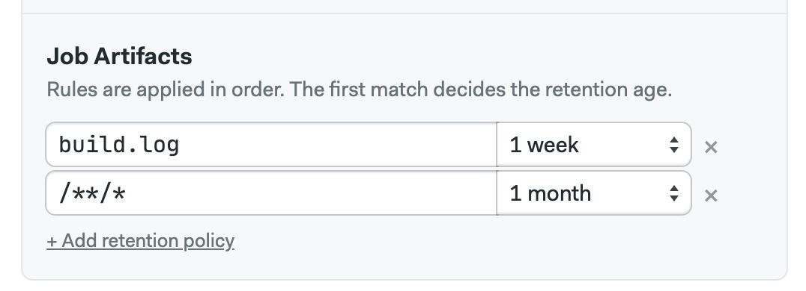

# Artifacts

import Tabs from '@theme/Tabs';
import TabItem from '@theme/TabItem';
import Available from '@site/src/components/Available';
import VideoTutorial from '@site/src/components/VideoTutorial';
import Steps from '@site/src/components/Steps';

<VideoTutorial title="How to use artifacts" src="https://www.youtube.com/embed/yHzZOKwyaAA?si=7qVathl09Cd3d-Gq"/>

Artifacts provide persistent storage for files and folders. This page explains how to store, retrieve, and view artifacts, and how to manage retention policies.

## Overview {#overview}

Artifacts provide a persistent file store for all your [projects](./projects). Artifacts are ideal for:

- passing files between [jobs](./jobs), like build artifacts or compiled executables
- long-term storage of final deliverables
- collecting debug data from your jobs, such as screenshots and build logs
- storing test results for processing [Test Reports](./tests/test-reports) and [Flaky Tests](./tests/flaky-tests)

:::note

Using artifacts on [self-hosted agents](./self-hosted) may require additional setup steps.

:::

## Artifact usage {#usage}

The syntax for storing files or folders in the artifact store is:

```shell
artifact push <namespace> /path/to/file/or/folder
```

To retrieve files or folders from the store, use:

```shell
artifact pull <namespace> <file or folder name>
```

Add the `--force` option to overwrite files or folders during pull or push actions. For more information on syntax, see the [Semaphore toolbox page](../reference/toolbox).


## Artifact namespaces {#namespaces}

The artifact store is partitioned into three namespaces:

- **job**: each job gets a dedicated namespace on every run. Job artifacts are suitable for collecting debug data, logs, or screenshots for end-to-end tests
- **workflow**: accessible to all pipelines in the same [workflow](./workflows). Workflow artifacts are ideal for passing data between jobs
- **project**: a global namespace for the project. Project artifacts are ideal for storing final deliverables

### Job artifacts {#jobs}

The job namespace is not shared between jobs. Instead, each job is assigned a dedicated namespace for every run.

Job artifacts are ideal for storing debugging data, such as build logs, screenshots, and screencasts. In other words, use them when you don't need to share data with other jobs.

The following example shows a common combination of job and workflow artifacts:

1. Use the workflow artifact to pass the compiled application from the build to the test jobs
2. Each test job pushes its test log to the job artifact

<Tabs groupId="editor-yaml">
<TabItem value="editor" label="Editor">



</TabItem>
<TabItem value="yaml" label="YAML">

```yaml title=".semaphore/semaphore.yml"
version: v1.0
name: Continuous Integration Pipelines
agent:
  machine:
    type: f1-standard-2
    os_image: ubuntu2004
blocks:
  - name: Build
    dependencies: []
    task:
      jobs:
        - name: Build
          commands:
            - checkout
            - make build
            - artifact push workflow app
  - name: Test
    dependencies:
      - Build
    task:
      jobs:
        - name: Unit tests
          commands:
            - checkout
            - artifact pull workflow app
            - make unit
            - artifact push job test.log
        - name: Integration tests
          commands:
            - checkout
            - artifact pull workflow app
            - make integration
            - artifact push job test.log
        - name: End-to-end tests
          commands:
            - checkout
            - artifact pull workflow app
            - make e2e
            - artifact push job test.log
```

</TabItem>
</Tabs>

See the YAML tab to view the commands used in the example.

### Workflow artifacts {#workflows}

The [workflow](./workflows) artifact is used to pass data between jobs in the same run. This namespace is accessible to all pipelines, including those connected with [promotions](./promotions).

The following example shows how to use the workflow artifact to pass a compiled binary between the build, test, and deploy jobs. Note that the deploy job can access the workflow artifact even if it is in a different pipeline.

<Tabs groupId="editor-yaml">
<TabItem value="editor" label="Editor">


</TabItem>
<TabItem value="yaml" label="YAML">

```yaml title=".semaphore/semaphore.yml"
version: v1.0
name: Continuous Integration Pipelines
agent:
  machine:
    type: f1-standard-2
    os_image: ubuntu2004
blocks:
  - name: Build
    dependencies: []
    task:
      jobs:
        - name: Build
          commands:
            - checkout
            - make build
            - artifact push workflow app
  - name: Test
    dependencies:
      - Build
    task:
      jobs:
        - name: Unit tests
          commands:
            - checkout
            - artifact pull workflow app
            - make tests
promotions:
  - name: Deploy
    pipeline_file: deploy.yml
```

This is the deployment pipeline:

```yaml title=".semaphore/deploy.yml"
version: v1.0
name: Deploy to production
agent:
  machine:
    type: f1-standard-2
    os_image: ubuntu2004
blocks:
  - name: Deploy
    task:
      jobs:
        - name: Deploy
          commands:
            - checkout
            - artifact pull workflow app
            - make deploy
```
</TabItem>
</Tabs>

See the YAML tab to view the commands used in the example.

### Project artifacts {#projects}

The project namespace is globally shared across all runs in a given [project](./projects). This namespace is used to store final deliverables, such as compiled binaries.

In the following example, we use both workflow and project artifacts:

1. The workflow artifact is used to pass the compiled binary between the build and other jobs
2. Once tests pass, the binary is tagged with the version number and stored in the project artifact

<Tabs groupId="editor-yaml">
<TabItem value="editor" label="Editor">


</TabItem>
<TabItem value="yaml" label="YAML">

```yaml title=".semaphore/semaphore.yml"
version: v1.0
name: Continuous Integration Pipelines
agent:
  machine:
    type: f1-standard-2
    os_image: ubuntu2004
blocks:
  - name: Build
    dependencies: []
    task:
      jobs:
        - name: Build
          commands:
            - checkout
            - make build
            - artifact push workflow app
  - name: Test
    dependencies:
      - Build
    task:
      jobs:
        - name: Unit tests
          commands:
            - checkout
            - artifact pull workflow app
            - make tests
  - name: Release
    dependencies:
      - Test
    task:
      jobs:
        - name: Save release
          commands:
            - artifact pull workflow app
            - mv app app-$SEMAPHORE_GIT_TAG_NAME
            - artifact push project app-$SEMAPHORE_GIT_TAG_NAME
```

</TabItem>
</Tabs>

See the YAML tab to view the commands used in the example.

## How to view artifacts {#view-artifacts}

In addition to accessing artifacts from the job using the `artifact` command, you can view, delete, and download artifacts from the Semaphore project page.

### Job artifacts {#view-job}

Open the job log and go to the **Artifacts** tab. All artifacts for this job are displayed.



Here you can:

- Open folders and view their content
- Click on files to download them
- Press **Delete** to delete the artifact
- Press **Delete Everything** to delete all the files in the current folder
- Press the **Configure retention policy** to configure the [artifact retention](#retention)

### Workflow artifacts {#view-workflow}

To view the workflow artifacts, open the workflow and go to **Artifacts**.



Here you can:

- Open folders and view their content
- Click on files to download them
- Press **Delete** to delete the artifact
- Press **Delete Everything** to delete all the files in the current folder
- Press the **Configure retention policy** to configure the [artifact retention](#retention)

### Project artifacts {#view-project}

To view the project artifacts, open your project in Semaphore and select **Artifacts**.



Here you can:

- Open folders and view their content
- Click on files to download them
- Press **Delete** to delete the artifact
- Press **Delete Everything** to delete all the files in the current folder
- Press the **Configure retention policy** to configure the [artifact retention](#retention)

## Retention policies {#retention}

Semaphore will never delete your artifacts automatically. To control usage and [costs](#usage), it's recommended to set up retention policies to automatically delete old artifacts.

Retention policies are rule-based and scoped to namespaces. You must create one or more rules with file selectors and ages. Semaphore attempts to match each rule to existing files and delete them if they exceed the maximum age.

### How to create retention policies

You can access the retention policy settings in the following ways:

- Pressing **Configure Retention Policy** in the [job artifacts](#view-job), [workflow artifacts](#view-workflow), or [project artifacts](#view-project)
- Selecting the **Artifacts** section in your [project settings](./projects#settings)

The retention policy menu lets you create rules for all the [artifact namespaces](#namespaces).

To create a retention rule:

<Steps>

1. Type the file selector
2. Select the maximum age
3. Click **Add retention policy** to add more rules

</Steps>



Repeat the process for the workflow artifacts:



And finally, set up retention policies for job artifacts:



:::info

Semaphore checks and applies the retention policy rules in your project once every day.

:::

### Retention policies selectors

The file selector accepts star (`*`) and double-star (`**`) glob patterns. For example:

- `/**/*` matches all files and folders in the namespace. We recommend setting this rule at the end of the list
- `/logs/**/*.txt` matches all files with a `.txt` extension in the logs folder or any subfolders
- `/screenshots/**/*.png` matches all files with a `.png` in the screenshots folder and subfolders
- `build.log` matches the file exactly

## See also

- [Semaphore toolbox](../reference/toolbox)
- [Test reports](./tests/test-reports.md)
- [Using artifacts in jobs](./jobs#artifact)

