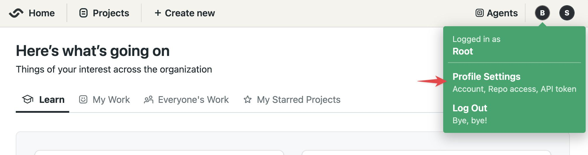

# Connect GitHub with OAuth

import Tabs from '@theme/Tabs';
import TabItem from '@theme/TabItem';
import Available from '@site/src/components/Available';
import VideoTutorial from '@site/src/components/VideoTutorial';
import Steps from '@site/src/components/Steps';

OAuth is the legacy method to access your GitHub repositories. This feature might be deprecated in the following releases. Semaphore recommends using [GitHub App](./connect-github) instead of the method described here.

## Overview {#overview}

Semaphore supports two types of ways to access your GitHub repositories:

- [OAuth App](https://github.com/settings/connections/applications/328c742132e5407abd7d): this connection is provides Single-Sign On (SSO) access to your Semaphore account. It is established during the Semaphore [account creation process](../getting-started/guided-tour).
- [GitHub App](https://github.com/apps/semaphore-ci-cd): an optional type of connection providing additional features such as fine-grained control and per-repository permissions.

You can create and revoke access to both types of connections at any time.

## OAuth vs GitHub app {#oauth-vs-app}

The **OAuth App** authorizes Semaphore to impersonate GitHub using your access credentials. This means you need to have admin-level access to the GitHub repository to connect it with Semaphore.

In addition, with OAuth, you can't control access on a per-repository level. Instead, you can only grant or revoke access to repositories based on their visibility, i.e. if they are public or private. It also means that if you delete your GitHub account, Semaphore loses access to all repositories.

Semaphore recommends using the [GitHub App](./connect-github) whenever possible as it provides two benefits:

- **Granular permissions**: you can grant Semaphore access to individual repositories, giving you control over which data Semaphore has access to.
- **No personal tokens**: since it does not rely on a personal access token, you can offboard people from the GitHub organization without the connection with Semaphore.

## How to authorize OAuth App {#connect-oauth}

To connect Semaphore to GitHub using OAuth, follow these steps:

<Steps>

1. Select **Profile Settings** under your login menu

      

2. Click on **Connect** next to GitHub

      

3. You are redirected to GitHub, log in and authorize Semaphore connection to proceed

      

</Steps>

The possible connection status is:

- **Not Connected**: the account is not connected. Log out and back into Semaphore to grant access to your GitHub account
- **Email only**: Semaphore is connected to your repositories [via the GitHub App](./connect-github) only. The OAuth App has not been authorized
- **Public repositories**: Semaphore can connect to all your public repositories [via OAuth App](#oauth)
- **Connected**: Semaphore can connect to all your public and private repositories [via OAuth App](#oauth)

If your GitHub account is fully disconnected, log out of Semaphore and try to log in again. You will be prompted to give Semaphore access to GitHub.

### Connect repositories via OAuth {#oauth}

To connect a GitHub repository with Semaphore using OAuth, you must have admin access to the GitHub repository.

To create a connection using OAuth, follow these steps:

<Steps>

1. Create a [new project](./projects#create-project)
2. Select the **GitHub Personal Token** tab
    
3. Choose **Public repositories** or **All repositories**
    
4. Select a repository from the list and finish the [project setup](./projects)

</Steps>

You can only use this method on repositories you have admin-level access to (unavailable repositories are greyed out).

:::note

Depending on the GitHub organization settings, its owner may need to [authorize OAuth App](https://docs.github.com/en/apps/oauth-apps/building-oauth-apps/authorizing-oauth-apps) within the organization.

If you have given full access to Semaphore but only see your personal repositories, it might mean that the GitHub organization's owner hasn't granted Semaphore access to the organization yet.

:::

## See also

- [Projects](./projects)
- [Connecting to GitHub using GitHub App](./connect-github)
- [Getting Started Guide](../getting-started/guided-tour)
- [Managing Semaphore servers](./organizations)
- [How to connect with BitBucket](./connect-bitbucket)
